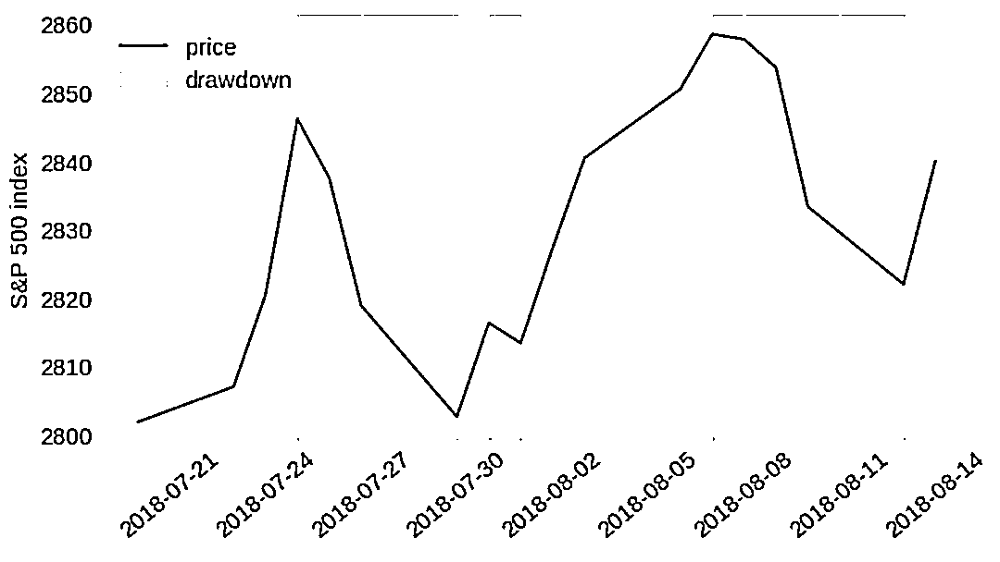
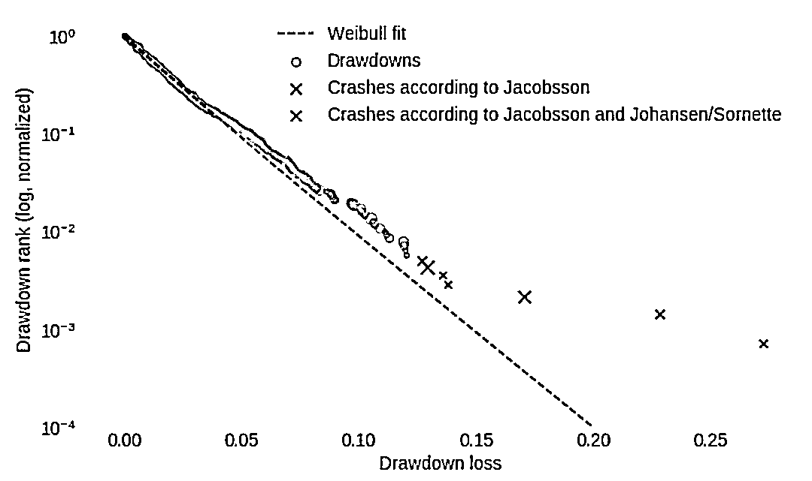
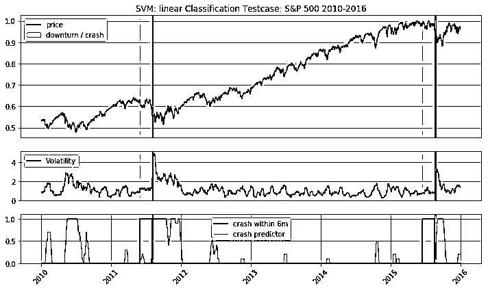

# 预测股市崩盘基于统计机器学习与神经网络（Python+文档）

> 原文：[`mp.weixin.qq.com/s?__biz=MzAxNTc0Mjg0Mg==&mid=2653289533&idx=1&sn=4ef964834e84a9995111bb057b0fc5dd&chksm=802e3e28b759b73e0618eb1262c53aa0601fbf5805525a7c7ff40dc3db62c7704496611bdbf1&scene=27#wechat_redirect`](http://mp.weixin.qq.com/s?__biz=MzAxNTc0Mjg0Mg==&mid=2653289533&idx=1&sn=4ef964834e84a9995111bb057b0fc5dd&chksm=802e3e28b759b73e0618eb1262c53aa0601fbf5805525a7c7ff40dc3db62c7704496611bdbf1&scene=27#wechat_redirect)


本期作者：Roman Moser

本期翻译：高翊程

**未经授权，严禁转载**

**前言**

**代码****在文末获取**

**股**市崩盘是一个市场总价值急剧而快速的下降的结果，其典型特征是股价通常在几天内下降超过 10%。

著名的股票市场崩盘的例子是 1987 的黑色星期一和 2008 的房地产泡沫。崩盘通常是由于价格泡沫的破裂，泡沫破裂的原因是由于当大多数市场参与者试图同时出售他们的资产时所发生的大规模抛售。

价格泡沫的出现意味着市场效率不高。在低效度的市场中，价格并不总是反映基本资产价值，价格是基于交易者的预期而膨胀或收缩的。交易员随后采取的交易行动进一步增强了这些预期，从而进一步提高（或降低）价格。这会导致积极的（或消极的）价格泡沫最终破裂。这种现象被 George Soros 描述为自反性，同时，这种现象也是在技术分析中使用的预测方法的基本假设。

现如今，有关于金融市场泡沫存在与否的争论并不多见，然而，理解这些无效市场并预测泡沫何时破裂却也是一个很棘手的问题。

想像一下你可以识别一个逐渐形成的市场泡沫并且预测何时市场会崩盘。这样你不仅仅可以在股票升值的时候挣一笔利润，同样的，也可以在合适的时间清仓以避免损失。

一些数学家与物理学家试图通过研究价格结构背后的数学原理去解构这个问题。

物理学家 Pro. Didier Sornette 成功预测了多重金融危机。Pro. Didier Sornette 使用了“对数周期幂律”来描述描述价格泡沫是如何形成和破裂的。本质的来讲“对数周期幂律”通过应用“对数周期分量”对这种导致崩溃的价格波动进行拟合，比指数增长函数增长的更快。（通过增长的幅度和频率反映价格波动）

这也可以说明对这个问题（预测股市崩溃），本篇文章的点子是怎么来的。如果研究者发现的复现性价格结构确实存在，那难道它不应当是适合基于机器学习算法、可以进行模式学习并预测市场崩盘的吗？这样的算法不需要知道市场的基本数学规律，而是需要针对具有预先识别的崩溃的数据（注：训练集）进行训练，并自己识别和学习这些模式。

**数据与崩盘**

第一步是收集金融数据并识别市场崩盘。我正在收集低关联性主要股票市场的每日股价信息。低交叉关联性，对于有效的交叉验证和模型检验都是很重要的。下面的矩阵显示了来自 11 个主要股市的日收益的交叉关联性。

```py
import numpy as np
import pandas as pd
import matplotlib.pyplot as plt
from matplotlib import gridspec
import os
import seaborn as sns
from pylab import rcParams
from collections import defaultdict
from scipy.optimize import curve_fit
import sys
import warnings
if not sys.warnoptions:
    warnings.simplefilter("ignore")
```

```py
os.chdir('/home/roman/Documents/Projects/Bubbles/data')
datasets_original_test = ['^GSPC.csv', '^DJI.csv', '^NDX.csv', '^N225.csv', 'SSE.csv',\
'^HSI.csv', '^BSESN.csv', '^GDAXI.csv', '^SSMI.csv', '^MXX.csv', \
                     '^BVSP.csv']
dataset_names_test = ['S&P 500', 'DJ', 'NDX', 'N225', 'SSE', 'HSI', 'BSESN', 'DAX', \
                 'SMI', 'MXX', 'BVSP']
datasets_test = []
for d in datasets_original_test:
    data_original = pd.read_csv(d, index_col = 'Date')
    data_original.index = pd.to_datetime(data_original.index, format='%Y/%m/%d')
    data_ch = data_original['Close'].pct_change()
    datasets_test.append(data_ch)
df_returns = pd.concat(datasets_test, axis=1, join_axes=[datasets_test[0].index])
df_returns.columns = dataset_names_test
corr = df_returns.corr()
print('Correlations of daily returns between datasets:')
rcParams['figure.figsize'] = 10, 6
ax = sns.heatmap(corr, annot=True, cmap='rocket_r')
```


为了避免在我搜集的数据中，出现任意两个数据集的交叉关联系数大于 0.5 的情况。在数据收集和处理的过程中，只使用了标普 500 指数（美）、日经指数（日）、恒生指数（香港）、上证指数（中国）、印度孟买 30 指数（印度）、瑞士市场指数（瑞士）和巴西综合股票指数（巴西）。

为了识别每个数据集中的市场崩盘情况，首先计算了股价“下跌”情况。“下跌”的定义（图示红色部分）是从往期的最后一个价格最大值到下一个最临近的价格最低值的持续下降的连续天数。下面的例子显示了标普 500 指数在 2018 年 7 月底至 8 月中旬的三次下跌。



我们考虑了两种不同的方法来识别崩盘事件。第一个遵循 Emilie Jacobsson 的建议，他定义了每个市场中，当“下跌”事件出现 99.5%个分位数的位置时，既是市场崩盘。

所有数据集的每日回报幅度随着时间的推移给出了不同市场波动的印象：

```py
corr_ds = []
rcParams['figure.figsize'] = 10, 5
for ds, t in zip(datasets, plt_titles):
    corr = [1]
    for i in range(1, 7):
        corr.append(np.corrcoef(ds['ch'][i:], ds['ch'][:-i])[0, 1])
    plt.plot(corr)
plt.title('All data sets - Correlation of daily returns')
plt.legend(dataset_names)
plt.xlabel('Lag (days)')
plt.ylabel('Correlation')
plt.grid()
plt.show()
```


基于上述方法，我发现了将“下降”进行分类的阈值，从标准普尔 500 指数等波动性较小的市场的约 10%到巴西（巴西综合股票指数（巴西））等波动性较大的市场 20%以上。第二种方法遵循 Johansen 和 Sorrn 的建议，Johansen 和 Sorrnette 将崩盘识别为异常值，异常值的定义即为当绘制数据集中下降序列的对数与下降幅度的关系时，远离拟合 Weibul 分布的那些“下降”。



我们用两种崩盘识别方法测试了我的算法，并得出结论，第一种方法（Jacobsson）更优。这有两个原因：首先，Sornette 并未清晰阐明 weibul 分布将某种“下降”定义为崩盘时，其所产生的偏度到底有多少，这就多了一些人的主观因素。其次，Sornette 的方法在识别崩盘事件更少时，会产生严重失衡的数据集。这使得为机器学习算法收集足够数量的训练数据变得更加困难。

以上所收集的 7 个数据集中，一共收集了 59738 行每日股价数据，并且识别了 76 次崩盘。

**Jacobsson**

```py
crash_thresholds = []
for dd in dd_df:
    ct = dd['drawdown'].iloc[round(dd.shape[0] * .005)]
    crash_thresholds.append(ct)

crashes = []
for df, dd, ct in zip(datasets, dd_df, crash_thresholds):
    df_d = dd.reindex(df.index).fillna(0)
    df_d = df_d.sort_values(by='Date')
    df_c = df_d[df_d['drawdown'] < ct]
    df_c.columns = ['drawdown', 'crash_st', 'crash_end', 'duration', 'rank']
    crashes.append(df_c)
df_combined = []  
for i in range(len(datasets)):
    df_combined.append(pd.concat([datasets[i], dd_df[i]], axis=1).fillna(0))

for c, t in zip(crashes, plt_titles):
    c['crash_st'] = c['crash_st'].dt.date
    c['crash_end'] = c['crash_end'].dt.date
    c['duration'] = c['duration'].astype(int)
    c['rank'] = c['rank'].astype(int)
    print(t + ' - all crashes (99.5% drawdown quantile):')
    display(c)
    print('\n')
```

**部分代码**

```py
rcParams['figure.figsize'] = 10, 6
gs = gridspec.GridSpec(2, 1, height_ratios=[2.5, 1]) 
for i in range(len(df_combined)):
    plt.subplot(gs[0])
    plt.plot(df_combined[i]['norm'], color='blue')
    [plt.axvspan(x1, x2, alpha=0.5, color='red') for x1, x2 in zip(crashes[i]['crash_st'], \
         crashes[i]['crash_end'])]
    plt.plot(df_combined[i]['drawdown'], color='red', marker='v',linestyle='')
    plt.title(plt_titles[i] + ' - crashes: 99.5% drawdown quantile')
    plt.grid()
    plt.xticks([])
    plt.legend(['Price', 'Drawdown'])
    plt.subplot(gs[1])
    plt.plot(df_combined[i]['vol'])
    [plt.axvspan(x1, x2, alpha=0.5, color='red') for x1, x2 in zip(crashes[i]['crash_st'], \
         crashes[i]['crash_end'])]
    plt.legend(['Volatility'])
    plt.grid()
    plt.tight_layout()
    plt.show()
```


···

**Johansen 和 Sorrnette**

```py
n_crashes = [3, 6, 3, 5, 8, 4, 11]  # <-- number of crashes manually identified based on outliers in Weibul plots below
rcParams['figure.figsize'] = 10, 4.5
for dd, t, n in zip(dd_df, plt_titles, n_crashes):
    x = dd['drawdown']
    y = dd['rank']/dd['rank'].max()
    init_vals = [0.9, 0.015]  # for [z, chi]
    best_vals, covar = curve_fit(weibull, abs(x), y, p0=init_vals)
    chi = best_vals[0]
    z = best_vals[1]
    plt.scatter(abs(x[n:]), y[n:], s=10*dd['duration'][n:], alpha=0.5, color='red')
    plt.scatter(abs(x[:n]), y[:n], s=10*dd['duration'][:n], alpha=0.5, color='black', marker='x')
    y_fit = [weibull(abs(xi), chi, z) for xi in x]
    plt.plot(abs(x), y_fit, color='black', ls='dashed')
    plt.yscale('log')
    plt.ylim(bottom=10**-4)
    plt.legend(['Drawdowns', 'Weibull fit', 'Outliers'])
    plt.title(t + ' - fit Weibull distribution to drawdowns')
    plt.xlabel('Drawdown loss')
    plt.ylabel('Drawdown rank (log, normalized)')
    plt.grid()
    plt.show()
```


···

**部分代码**

```py
crashes = []
for df, dd, r in zip(datasets, dd_df, n_crashes):
    df_c = dd[dd['rank'] <= r]
    df_c.columns = ['drawdown', 'crash_st', 'crash_end', 'duration', 'rank']
    crashes.append(df_c)

for c, t in zip(crashes, plt_titles):
    c['crash_st'] = c['crash_st'].dt.date
    c['crash_end'] = c['crash_end'].dt.date
    c['duration'] = c['duration'].astype(int)
    c['rank'] = c['rank'].astype(int)
    print(t + ' - all crashes (Weibull outliers):')
    display(c)
    print('\n')
```


**问题陈述与特征选择**

在此，我们阐述一个以预测为目标的分类问题，在每一个时间点上（譬如每一个交易日），崩盘是否会发生在接下来的 1 个月、3 个月、6 个月的时间内。 

如果往期的价格模式是未来的价格变化事件的指示，则在某一天做出预测时，其预测的相关信息，包含在该天之前所有天的每日价格变化中。

故而，在预测第 t 天的股票崩盘事件时，在第 t 天前的每日股价变化都可被当做一种特征加以应用。可是，具有太多特征值的预测模型通常都会运行的较慢而且准确性较低（所谓“维数灾难”是也），因此从任意时间点中提取那一小部分可以显著描述往期价格波动的关键性特征，是有必要的。因而我定义了 8 个时间窗口，这些窗口可以测算上一年（252 个交易日）平均股价的改变。使用将时间窗口大小从 5 天（直到 t 天）调整到 126 天（ t-₁₂₆到 t-₂₅₂）的方法，以期在更短的时间周期里，获得更高解析度的股价变化。由于在多日股价的平均变化中没有捕捉到股价波动，在同一时间窗口中为平均股价波动添加了 8 个特征。对于每个数据集，将平均价格变化和波动做了归一化处理。

为了评估特征选择，进行了 Logistic 回归，并分析其回归系数。Logistic 回归系数反映着相关特征的对数概率的变化，这意味着当所有其他特征保持不变时，让步比(崩盘概率与未崩盘概率的比率)如何随着该特征的变化而变化的对数。对于下面的图，把对数比转化为让步比。让步比大于 1 表明崩盘概率随相应特征的增加而增加。

**指示特征对预测变量的影响的 Logistic 回归系数**


对于回归系数的分析显示，在过去几个交易日中的股价波动对于行将到来的股市崩盘事件来讲，是最佳风向标。

近期若发生股价增长事件，无论如何，似乎都不意味着一个股市崩盘事件。乍一看很令人惊讶，我们都知道，泡沫的典型特征是股价的指数增长。不过，众多已被发现的崩盘事件并非恰好发生在股价峰值之后，相反，是在经历一段时间的股价下跌后才发生的崩盘事件。

在往期的前 6 到 12 个月内的股价飙升增加了股市崩盘的预测可能性，这表明在长期总体股价飙升后，更易出现崩盘事件。且长期股价波动事件包含了能够预测股市崩盘的宝贵信息。

**训练、验证、与测试集**

我们选择了标普 500 数据集进行测试，剩下的 6 个数据集用于训练和验证。我们选择标普 500 指数用来测试，是因为它是最大的数据集（包含自 1950 年以来的每日股价信息），并且其含有的崩盘次数也最多（20 次）。对于训练集，我们进行了 6 次交叉验证（cross-validation）。这意味着对每一个模型进行六次运算，分别使用五个数据集进行训练，剩下的一组用于验证。

**评分**

为了评估每个模型的性能，使用了 F-beta 分数。F-beta 分数是查准率和查全率的加权调和平均值。


Beta 参数的大小，决定了查准率和查全率的权重。beta>1 时，查全率有更大影响，beta<1 时，查准率有更大影响。

给 beta 取值为 2，它更加强调查全率的重要性，因为“已发生却未预测到崩盘事件”比“虽然预测为崩盘但实际并未发生崩盘事件”要遭受更加严重的损失。这在规避风险的方法下是有意义的，假设“发生崩盘却预测不到”（错过潜在的利润）比“预期不会发生的崩盘”（资金损失）具有更严重的后果。

**回归模型、支持向量机与决策树**

从线性回归和逻辑回归模型开始。回归模型通过在所有训练样本上最小化预测变量和实际目标变量之间的方差，找到函数的最优系数。线性回归预测的是连续型模型，而逻辑回归能估算分类的概率，因此逻辑回归通常更适合于分类问题。然而，当我们比较两种模型的预测结果时，logistic 回归仅在某些情况下优于线性回归。

这不得不说令人惊奇，但需要注意的是，尽管 Logistic 回归可能对于预测股市崩盘概率更合适。但如果所选择的分类阈值能有效区别于二元预测，则线性回归的最优拟合未必在实际应用中是个缺点。该阈值需要以使训练集上的 F-β分数最大化为目的进行优化。

接下来，测试支持向量机（SVMs）。支持向量机使用核函数将输入特征投影到多维空间中，并确定一个超平面以分离正样本和负样本。

**部分代码**

```py
model_name = 'SVM: linear Classification'
test_data = 'S&P 500'
month_prediction = 3
kernel = 'linear'
C = 1
class_weight = {0:.06, 1:.94}

index_test = [i for i, name in enumerate(dataset_names) if name == test_data][0]
index_month = [i for i, m in enumerate(months) if m == month_prediction][0]
training_set_names = list(dataset_names)
training_set_names.pop(index_test)
dfs_x_training = list(dfs_x)
dfs_x_training.pop(index_test)
dfs_y_training = list(dfs_y)
dfs_y_training.pop(index_test)
y_train_all, y_val_all = [], []
y_pred_train_all, y_pred_val_all = [], []
for val_data in training_set_names:
    x_train, y_train, x_val, y_val = data.get_train_test(dfs_x_training, dfs_y_training, \
            training_set_names, test_data=val_data)
    y_train, y_val = y_train[:, index_month].astype(int), y_val[:, index_month].astype(int)
    y_train_all.append(y_train)
    y_val_all.append(y_val)
    print('Train ' + str(model_name) + ' - validation data: ' + str(val_data))
    clf = svm.SVC(C=C, kernel=kernel, class_weight=class_weight)
    model = clf.fit(x_train, y_train)
    y_pred_train = model.predict(x_train)
    y_pred_train_all.append(y_pred_train)
    y_pred_val = model.predict(x_val)
    y_pred_val_all.append(y_pred_val)
```

```py
eval_ = EvaluateResults(y_train_all, y_val_all, y_pred_train_all, y_pred_val_all, model_name,\
            test_data)
beta = 2
threshold = None
print(model_name)
print('\n')
print('Predict crash in:               ' + str(month_prediction) + ' months')
print('Threshold for positives:        ' + str(threshold))
print('Number of features:             ' + str(dfs_x[0].shape[1]))
print('Number of rows in training set: ' + str(len(y_pred_train_all[0]) + len(y_pred_val_all[0])))
print('\n')
eval_.training_results(threshold, training_set_names, beta=beta)
```




```py
x_train_final, y_train_final, _, _ = data.get_train_test(dfs_x, dfs_y, dataset_names,\
        test_data=None)
C = [1, 1, 1]
class_weights = [{0:.06, 1:.94}, {0:.06, 1:.94}, {0:.08, 1:.92}]
dataset_original = ['^GSPC_11-05.csv']
dataset_name = ['S&P 500']
crash_threshold = [-0.0936]
data_new = DataLoader(dataset_original, dataset_name)
dataset_revised, crashes = data_new.get_data_revised(crash_threshold)
dfs_x_new, dfs_y_new = data_new.get_dfs_xy_predict(months=months)
x_new, _, _, _ = data_new.get_train_test(dfs_x_new, dfs_y_new, dataset_name, test_data=None)

for index_month in range(len(months)):
    y_train_final_ = y_train_final[:, index_month].astype(int)
    clf = svm.SVC(C=C[index_month], kernel=kernel, class_weight=class_weights[index_month])
    model = clf.fit(x_train_final, y_train_final_)
    y_pred_new_bin = model.predict(x_new).astype(int)
    current_pred = np.dot(np.linspace(0,1,21) / sum(np.linspace(0,1,21)), y_pred_new_bin[-21:])
    print(str(model_name) + ' prediction of a crash within ' + str(months[index_month]) \
          + ' months: ' + str(np.round(current_pred, 2)))
```

```py
SVM: linear Classification prediction of a crash within 1 months: 0.24
SVM: linear Classification prediction of a crash within 3 months: 0.79
SVM: linear Classification prediction of a crash within 6 months: 0.83
```

需要考虑的重要参数是惩罚参数 C（C 的大小决定了过拟合与欠拟合的程度，也就是说我们应该避免多少的误分类）、核函数（多项式或径向基函数）、核系数γ（确定核函数的维数）和类权重（确定如何平衡积极与消极预测）。最佳 SVM 模型的分数与回归模型相似。这使得选区回归模型进行应用更合适一些，因为他们训练得快得多。与任何其他测试模型相比，决策树的性能都不在同一水平上。

**循环神经网络**

下一步是实现循环神经网络（RNNs）。与传统的机器学习算法和传统的人工神经网络不同，循环神经网络能够考虑它接收输入数据序列中每个元素的顺序，从而保障序列信息的持续性。这似乎是处理时间序列数据（如每日股票收益）算法的一个关键特征。这是通过连接单元的回路实现的，以便在时间步骤 t，输入不仅是特征 xt，而且是前一时间步骤 ht-1 的输出。下图说明了这个概念。


然而，正则 RNNs 的一个主要问题是，它们在学习“一个依赖于长期过程”的序列方面存在问题。（译者注：咦嘘唏，由于 RNN 只能对部分序列进行记忆，所以在长序列上表现远不如短序列，造成了一旦序列过长便使得准确率下降的结果。）如果在 xt-1 和 hn 之间有太多的步骤，hn 可能无法从 xt-1 中学到任何东西。为了实现这一点，引入了长短记忆网络（LSTM）。基本上，LSTM 不仅将先前单元 ht-1 的输出传递给下一个单元，而且还能将“单元状态”Ct-1 传递给下一个单元。单元状态，基于（xt 和 ht-1）的输入在每一步运算中获得更新，并更新输出 ht。在每个 LSTM 单元中，四个神经网络层负责输入 xt、ht-1、Ct-1 和输出 ht、Ct 之间的相互作用。


具有 LSTM 的 RNN 具有检测简单回归模型不能找到的关系和模式的能力。因此，如果 RNN LSTM 能够在崩盘之前学习到复杂价格结构，那么这种模型难道不应该胜过先前的测试模型吗？ 

为了回答这个问题，我们用了 Python 库中的 Keras 的 LSTM 实现了两个不同的 RNN 并经过了严格的超参数调优。首先确定的是每个层的输入序列的长度。每个时间步骤 t 的输入序列由之前连续几天到 t 天的每天的价格变化组成。由于较长的输入序列需要更多的内存并会减慢计算速度，因此必须谨慎地选择这个序列的长度。理论上，RNN LSTM 应该能够找到长时间序列（前后两者之间的）依赖关系，然而，在 Keras 中的 LSTM 实现中，如果参数状态被设置为真，则单元状态仅从一个序列传递到下一个序列。在实践中，这种实现是繁琐的。为了避免在训练中，针对不同期的不同数据集，神经网络识别出长项依赖性，我就在训练数据切换数据集时手动重置状态。这个算法没有给出很强的结果，所以我把状态设置为 false，将序列长度从 5 步增加到 10 步，并且从时间窗口向网络中输入平均价格变化和平均波动的额外序列，时间窗口从 10 个交易日直到 252 个交易日。（类似于先前测试模型所选择的特征）。最后，我对超参数进行调参，并尝试了不同的损失函数、层数、每层的神经元数和是否 dropout**（****译者注：dropout 是指在深度学习网络的训练过程中，对于神经网络单元，按照一定的概率将其暂时从网络中丢弃。）**。

性能最好的 RNN LSTM 具有顺序层，后跟两个 LSTM 层，每个层具有 50 个神经元，最后一层使用 adam 优化器**（译者注：Adam 是一种可以替代传统随机梯度下降过程的一阶优化算法，它能基于训练数据迭代地更新神经网络权重。）**、二元交叉熵损失函数和 sigmoid 激活函数。

**部分代码**

```py
model_name = 'RNN LSTM'
neurons = 50
dropout = 0
optimizer = 'adam'
loss = 'binary_crossentropy'
activation = 'sigmoid'
stateful = True
inp_dim = 1   # <-- 1 if price change only, 2 if volatility as well
inp_tsteps = sequence + 4 * additional_feat
def rnn_lstm(inp_tsteps, inp_dim, neurons, dropout):
    model = Sequential()
    model.add(LSTM(neurons, batch_input_shape=(batch_size, inp_tsteps, inp_dim), \
            stateful=stateful, return_sequences=True))
    model.add(LSTM(neurons, stateful=stateful, return_sequences=False))
    model.add(Dense(3, activation=activation))
    return model
model = rnn_lstm(neurons=neurons, inp_tsteps=inp_tsteps, inp_dim=inp_dim, dropout=dropout)
model.compile(loss=loss, optimizer=optimizer)
model.summary()
```


```py
month_prediction = 3
index_month = [i for i, m in enumerate(months) if m == month_prediction][0]
y_train_all_ = [y[:, index_month] for y in y_train_all]
y_val_all_ = [y[:, index_month] for y in y_val_all]
y_pred_train_all_ = [y[:, index_month] for y in y_pred_train_all]
y_pred_val_all_ = [y[:, index_month] for y in y_pred_val_all]
beta = 2
rcParams['figure.figsize'] = 14, 4
eval_ = EvaluateResults(y_train_all_, y_val_all_, y_pred_train_all_, y_pred_val_all_, model_name, test_data)
eval_.find_threshold(beta=beta, threshold_min=0.005, threshold_max=0.15, resolution=40)
```


  

```py
test_data = 'S&P 500'
epoch = 40
threshold = 0.07
month_prediction = 3   # <-- predict crash in 1, 3 or 6 months
index_month = [i for i, m in enumerate(months) if m == month_prediction][0]
_, _, _, np_x1_test, _, np_y_test = \
    data.get_train_test(dfs_x1, dfs_x2, dfs_y, dataset_names, test_data=test_data)
#np_x_test = np.concatenate([np_x1_test, np_x2_test], axis=2)
model.load_weights('stateful_final_{0}_{1}.hdf5'.format(test_data, epoch))
y_pred_test = model.predict(np_x1_test, batch_size=batch_size)[:, index_month]
y_test = np_y_test[:, index_month]
y_pred_test_bin = eval_.test_results(y_test, y_pred_test, threshold, beta=beta)
```


···

**评估**

虽然对超参数的调整、增加序列长度以及增加长时特征可以让模型的训练变得更快(这是验证集在经历 10 个训练周期之后所获得的最佳结果)，但是 RNN LSTM 模型都不能胜过先前的测试模型。

上面的图显示了不同模型的查准率和查全率。不同的颜色表示不同的模型，不同的形状表示不同的预测变量（1、3 或 6 个月内出现的股市崩盘）。下面的条形图可视化了所有模型的 F-β分数，用于 1, 3 个月和 6 个月的股市崩盘预测。random 代表模型的期望表现，其没有如同先前已被测试的模型那般能够预测那么多次股市崩盘的预测能力。


最优结果表明，针对于预测 6, 3 和 1 个月内的股市崩盘，F-β分数分别为 41, 37 和 29。查准率在 12%到 16%之间，查全率在 45%到 71%之间。这意味着，当检测到当大约 50%的股市崩盘事件被预探到时，其中约 85%的股市崩盘预警信号是“假预警”。

**结论**

首先是坏消息。相较于简单的回归模型，RNN LSTM 似乎无法在学习复杂的价格模式中胜出。这表明，在所有（或几乎所有）崩盘事件发生之前，不存在任何复杂的价格模式，但在其他情况下则不然。这并不意味着之前的 Sornette 符合对数周期幂律的某些价格模式的关于崩盘的假设是不成立的。不过，这意味着如果这些模式存在，(1)即使在股市崩盘事件没有伴随着发生的情况下，这些价格模式也会出现。(2)有没有出现这些价格模式的苗头时，股市崩盘事件也会发生。(3)没有足够的数据可以让 RNN 学习这些模式。虽然更多的数据肯定会提供更多的解析度，但部分问题可能是（1）和（2）的组合。Sornette 对被识别为异常值的某些崩盘事件拟合为对数周期幂律，但是对于具有相似幅度的“股价下降事件”的所有股市崩盘事件并不这样做。为了提供 Sornette 所描述的查找到股市崩盘的算法，其训练数据所需要的，是仅用适合这些价格模式的崩盘来具体标记。这可改进对这些股市崩溃事件的识别，但是对于情况(2)没有帮助，因为预计不会检测到不同类型的崩盘事件。不过，如果提供足够的数据和足够大的已识别的股市崩盘数列，重新运行 RNN LSTM 模型则肯定是值得的。

好消息是，通过长周期价格变化和波动性变化定义的简单价格模式似乎在崩溃前，其发生情况存在着规律性。最好的模型能够学习这些价格模式，在预测股市崩盘时，相较于类似的随机模型存在着显著优点。例如，对于 3 个月内的崩盘预测，最佳回归模型在测试集上达到了 0.15 的查准率和 0.59 的查全率，而类似的没有预测能力的随机模型将达到 0.04 的查准率和 0.16 的查全率。结果看起来，类似于 1 个月和 6 个月的股市崩盘预测，F-β分数在预测 6 个月的情况下最好，在预测 1 个月的情况下则最差。所得到的结果是否足以优化投资策略是值得商榷的。然而，如果之前所讨论的股市崩盘回归指示器持续警告即将到来的崩溃，风险厌恶型投资者可能会更保守地分配其投资组合的情况。


查看崩盘时的测试数据、股票价格指数图表和崩盘预测器的指示器显示，虽然一些崩盘事件已经被显著地检测到，但是另一些股市崩盘事件的发生没有或几乎没有来自崩盘预测器的警告。上图显示了一个未预测到的崩盘事件（1962 年）和三个连续相当好的预测到崩盘事件（1974 年）的例子。一些崩盘事件（相较于其他崩盘事件）被更好的预测到了，这符合这样的假设，即某些典型的价格模式确实存在于一些崩盘事件之前，但并非存在于所有的崩盘事件之前。不同的算法大多在同一种崩盘事件中预测不同，这就是为什么我没有尝试结合不同的模型的原因。

通过采用过去 21 个交易日的二元崩盘事件预测的加权平均值（距离越近的崩盘事件预测，其权重更强），logistic 回归模型预测到 2018 年 11 月 5 日标普 500 指数在 6 个月内崩盘的可能性为 98.5%，在 3 个月内崩盘的可能性为 97%，在一个月内崩盘的可能性为 23%。在阅读这篇文章之后，有关于如何处理这些信息的问题，就留待各位自行解决。

**推荐阅读**

[01、经过多年交易之后你应该学到的东西（深度分享）](https://mp.weixin.qq.com/s?__biz=MzAxNTc0Mjg0Mg==&mid=2653289074&idx=1&sn=e859d363eef9249236244466a1af41b6&chksm=802e3867b759b1717f77e07a51ee5671e8115130c66562577280ba1243cba08218add04f1f00&token=449379994&lang=zh_CN&scene=21#wechat_redirect)

[02、监督学习标签在股市中的应用（代码+书籍）](https://mp.weixin.qq.com/s?__biz=MzAxNTc0Mjg0Mg==&mid=2653289050&idx=1&sn=60043a5c95b877dd329a5fd150ddacc4&chksm=802e384fb759b1598e500087374772059aa21b31ae104b3dca04331cf4b63a233c5e04c1945a&token=449379994&lang=zh_CN&scene=21#wechat_redirect)

[03、全球投行顶尖机器学习团队全面分析](https://mp.weixin.qq.com/s?__biz=MzAxNTc0Mjg0Mg==&mid=2653289018&idx=1&sn=8c411f676c2c0d92b0dd218f041bee4b&chksm=802e382fb759b139ffebf633ac14cdd0f21938e4613fe632d5d9231dab3d2aca95a11628378a&token=449379994&lang=zh_CN&scene=21#wechat_redirect)

[05、使用 Tensorflow 预测股票市场变动](https://mp.weixin.qq.com/s?__biz=MzAxNTc0Mjg0Mg==&mid=2653289014&idx=1&sn=3762d405e332c599a21b48a7dc4df587&chksm=802e3823b759b135928d55044c2729aea9690f86752b680eb973d1a376dc53cfa18287d0060b&token=449379994&lang=zh_CN&scene=21#wechat_redirect)

[05、使用 LSTM 预测股票市场基于 Tensorflow](https://mp.weixin.qq.com/s?__biz=MzAxNTc0Mjg0Mg==&mid=2653289238&idx=1&sn=3144f5792f84455dd53c27a78e8a316c&chksm=802e3903b759b015da88acde4fcbc8547ab3e6acbb5a0897404bbefe1d8a414265d5d5766ee4&token=2020206794&lang=zh_CN&scene=21#wechat_redirect)

[06、手把手教你用 Numpy 构建神经网络(附代码)](https://mp.weixin.qq.com/s?__biz=MzAxNTc0Mjg0Mg==&mid=2653289274&idx=1&sn=f40be8372658c2c79fdd47c03d62e037&chksm=802e392fb759b039435fc6700ef5d45142cdfe72234586bd8de9b8dfabcc3264f2ae826def80&token=1003651614&lang=zh_CN&scene=21#wechat_redirect)

[07、美丽的回测——教你定量计算过拟合概率](https://mp.weixin.qq.com/s?__biz=MzAxNTc0Mjg0Mg==&mid=2653289314&idx=1&sn=87c5a12b23a875966db7be50d11f09cd&chksm=802e3977b759b061675d1988168c1fec06c602e8583fbcc9b76f87008e0c10b702acc85467a0&token=1972390229&lang=zh_CN&scene=21#wechat_redirect)

[08、利用动态深度学习预测金融时间序列基于 Python](https://mp.weixin.qq.com/s?__biz=MzAxNTc0Mjg0Mg==&mid=2653289347&idx=1&sn=bf5d7899bc4a854d4ba9046fdc6fe0d6&chksm=802e3996b759b080287213840987bb0a0c02e4e1d4d7aae23f10a225a92ef6dd922d8006123d&token=290397496&lang=zh_CN&scene=21#wechat_redirect)

[09、Facebook 开源神器 Prophet 预测时间序列基于 Python](https://mp.weixin.qq.com/s?__biz=MzAxNTc0Mjg0Mg==&mid=2653289394&idx=1&sn=24a836136d730aa268605628e683d629&chksm=802e39a7b759b0b1dcf7aaa560699130a907716b71fc9c45ff0e5d236c5ae8ef80ebdb09dbb6&token=290397496&lang=zh_CN&scene=21#wechat_redirect)

[10、Facebook 开源神器 Prophet 预测股市行情基于 Python](https://mp.weixin.qq.com/s?__biz=MzAxNTc0Mjg0Mg==&mid=2653289437&idx=1&sn=f0dca7da8e69e7ba736992cb3d034ce7&chksm=802e39c8b759b0de5bce401c580623d0729ecca69d13926479d36e19aff8c9c9e8a20265afff&token=290397496&lang=zh_CN&scene=21#wechat_redirect)

[11、2018 第三季度最受欢迎的券商金工研报前 50（附下载）](https://mp.weixin.qq.com/s?__biz=MzAxNTc0Mjg0Mg==&mid=2653289358&idx=1&sn=db6e8ab85b08f6e67790ec0e401e586e&chksm=802e399bb759b08d6eec855f9901ea856d0da68c7425cba62791b8948da6ad761a3d88543dad&token=290397496&lang=zh_CN&scene=21#wechat_redirect)

[12、实战交易策略的精髓（公众号深度呈现）](https://mp.weixin.qq.com/s?__biz=MzAxNTc0Mjg0Mg==&mid=2653289447&idx=1&sn=f2948715bf82569a6556d518e56c1f9e&chksm=802e39f2b759b0e4502d1aaac562b87789573b55c76b3c85897d8c9d88dbf9a0b7ee34d86a4e&token=290397496&lang=zh_CN&scene=21#wechat_redirect)

[13、Markowitz 有效边界和投资组合优化基于 Python（附代码）](https://mp.weixin.qq.com/s?__biz=MzAxNTc0Mjg0Mg==&mid=2653289478&idx=1&sn=f8e01a641be021993d8ef2d84e94a299&chksm=802e3e13b759b7055cf27a280c672371008a5564c97c658eee89ce8481396a28d254836ff9af&token=290397496&lang=zh_CN&scene=21#wechat_redirect)

[14、使用 LSTM 模型预测股价基于 Keras](https://mp.weixin.qq.com/s?__biz=MzAxNTc0Mjg0Mg==&mid=2653289495&idx=1&sn=c4eeaa2e9f9c10995be9ea0c56d29ba7&chksm=802e3e02b759b7148227675c23c403fb9a543b733e3d27fa237b53840e030bf387a473d83e3c&token=1260956004&lang=zh_CN&scene=21#wechat_redirect)

[15、量化金融导论 1：资产收益的程式化介绍基于 Python](https://mp.weixin.qq.com/s?__biz=MzAxNTc0Mjg0Mg==&mid=2653289507&idx=1&sn=f0ca71aa07531bbbdbd33213f0bab89f&chksm=802e3e36b759b720138b3b17a4dd0e198e054b9de29a038fdd50805f824effa55831111ad026&token=1936245282&lang=zh_CN&scene=21#wechat_redirect)

**公众号官方 QQ 群**

**群里已经分享了****58 篇****干货**

**没有按规则加群者一律忽略**


**没有代码的量化都是耍流氓**

在**后台**输入

**20181119**

**后台获取方式介绍**

