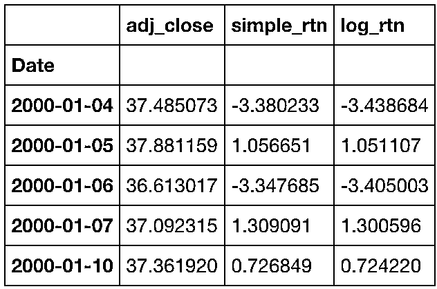
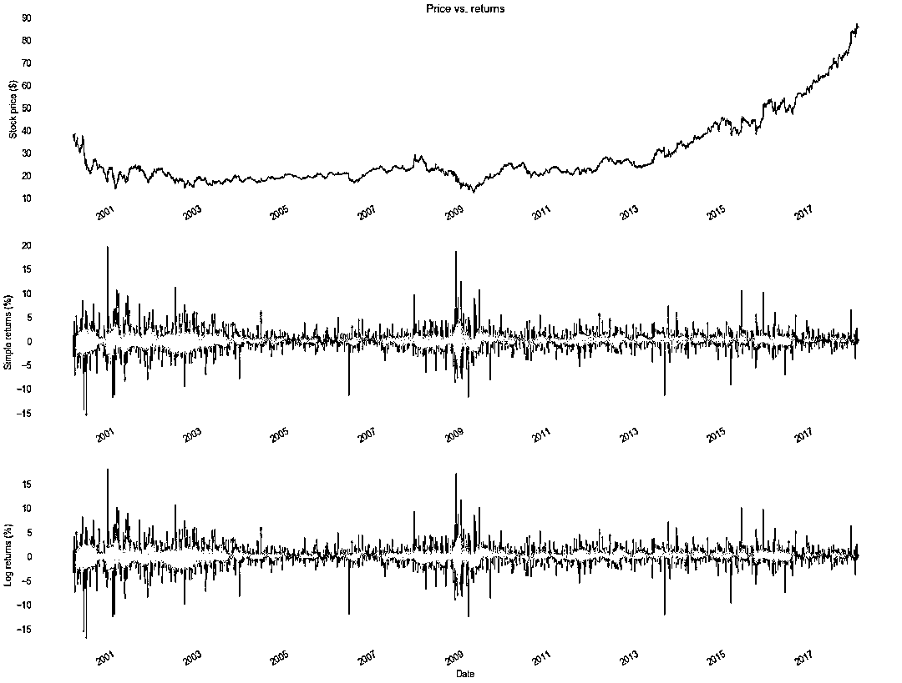
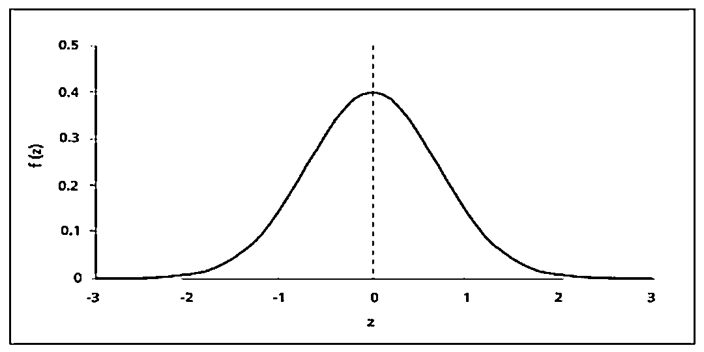
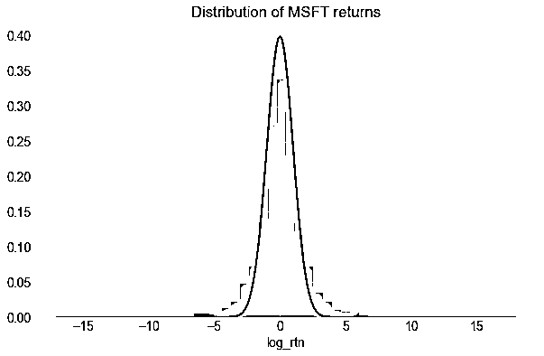
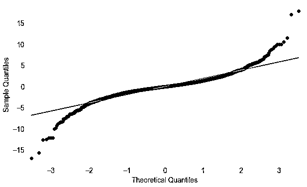
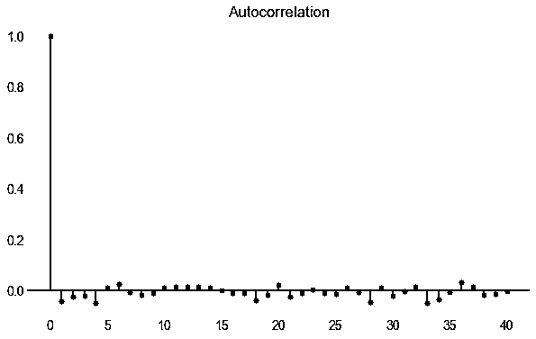
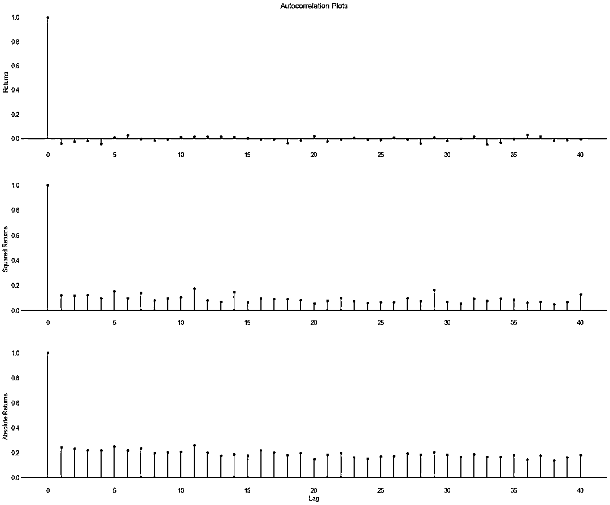

# 量化金融导论 1：资产收益的程式化介绍基于 Python

> 原文：[`mp.weixin.qq.com/s?__biz=MzAxNTc0Mjg0Mg==&mid=2653289507&idx=1&sn=f0ca71aa07531bbbdbd33213f0bab89f&chksm=802e3e36b759b720138b3b17a4dd0e198e054b9de29a038fdd50805f824effa55831111ad026&scene=27#wechat_redirect`](http://mp.weixin.qq.com/s?__biz=MzAxNTc0Mjg0Mg==&mid=2653289507&idx=1&sn=f0ca71aa07531bbbdbd33213f0bab89f&chksm=802e3e36b759b720138b3b17a4dd0e198e054b9de29a038fdd50805f824effa55831111ad026&scene=27#wechat_redirect)


本期作者：Eryk Lewinson

本期翻译：Wally

**未经授权，严禁转载**

我们想展示一个简单的分配策略，希望表明，利用数据科学和定量金融学基本知识，超越基准。当然，没有永远的圣杯。 

有一个理论解释为什么这是不可能的，即有效市场假说（EMH）。它指出，资产价格完全反映了市场所有可获得的信息。这意味着由于市场价格只对新信息做出反应，因此根本不可能一直战胜市场。

**Libraries 准备**

在直接进入机器学习和构建资产分配策略之前，我认为在基础知识上花一些时间并理解它们，在后续建模是至关重要的。在这篇文章中，我们将研究资产回报的程序化过程，并展示如何使用 Python 验证。一些基本的统计知识会对你有帮助，但我们尝试去直观地解释这些问题。

```py
# libraries ----
import pandas as pd 
import numpy as np
import quandl
import seaborn as sns

import matplotlib.pyplot as plt
from matplotlib.pyplot import figure
import datetime as dt 

import statsmodels.formula.api as smf
import statsmodels.tsa.api as smt
import statsmodels.api as sm
import scipy.stats as scs

import warnings
warnings.filterwarnings("ignore", category=UserWarning, module='matplotlib')

# settings ----
%matplotlib inline
sns.set_style('darkgrid')
sns.mpl.rcParams['figure.figsize'] = (10.0, 6.0)
sns.mpl.rcParams['savefig.dpi'] = 90
sns.mpl.rcParams['font.size'] = 14

# authentication ----
quandl_key = 'zs7xyLhXJbVU_Sk2-4aB' # paste your own API key here :)
quandl.ApiConfig.api_key = quandl_key
```

**数据准备**

在这篇文章中，我们使用复权价格，因为它考虑了股票分红等。

我选择 Microsoft（股票代码：MSFT）作为示例，并以 Dataframe 的数据格式形下载该时间序列。然后，将价格转换为对数回报以做进一步分析：

```py
# downloading the data 
df = quandl.get('WIKI/MSFT', start_date="2000-01-01", end_date="2017-12-31")
df = df.loc[:, ['Adj. Close']]
df.columns = ['adj_close']

# create simple and log returns, multiplied by 100 for convenience
df['simple_rtn'] = 100 * df.adj_close.pct_change()
df['log_rtn'] = 100 * (np.log(df.adj_close) - np.log(df.adj_close.shift(1)))

# dropping NA's in the first row
df.dropna(how = 'any', inplace = True)

df.head()
```



```py
# Plotting the time series ----
fig, ax =plt.subplots(3, 1, figsize=(24, 20))
# price ----
df.adj_close.plot(ax=ax[0])
ax[0].set_ylabel('Stock price ($)')
ax[0].set_xlabel('')
ax[0].set_title('Price vs. returns')
# simple returns ----
df.simple_rtn.plot(ax=ax[1])
ax[1].set_ylabel('Simple returns (%)')
ax[1].set_xlabel('')
# log returns ----
df.log_rtn.plot(ax=ax[2])
ax[2].set_ylabel('Log returns (%)')
fig.show()
```



在图中可直接观察到的一个重要特征：回报较大的周期与回报率较小的周期交替，表明波动率不是恒定的。

风格的事实是，一般来说，统计属性出现在许多实证资产回报（在时间和市场）。重要的是要意识到它们的存在，因为在构建模型时应该代表资产价格动态，模型必须能够捕获/复制这些属性。

**1、收益分配模式是不正常的**



*   负偏度（第三个时刻）——较大的负回报比较大的正回报更常发生。 表现：左尾长; 分布的集中在分布图的右侧。

*   超值峰度（第四个时刻）——较大大和较小回报的发生频率高于预期。 表现：肥尾和超值分布。

下面展示了改股票的直方图和概率密度曲线。 我们看到回报没有表现出更高的峰值（当然可以是这种情况），但是尾部的量肯定要比预期正常情况下要多。



红色的线条代表的标准正态分布。在返回值遵循高斯分布的情况下，这两条线是一致的。然而，我们也发现了存在差异，主要是尾部。 这进一步验证了上述发现。



最后，看一下回报的描述性统计数。 Jarque-Bera 正态性检验证实了我们的怀疑，p 值小到足以拒绝零假设，表明数据遵循高斯分布。

```py
# Descriptive statistics ----
print('Range of dates:', min(df.index.date), '-', max(df.index.date))
print('Number of observations:', df.shape[0])
print('Mean: {0:.4f}'.format(df.log_rtn.mean()))
print('Median: {0:.4f}'.format(df.log_rtn.median()))
print('Min: {0:.4f}'.format(df.log_rtn.min()))
print('Max: {0:.4f}'.format(df.log_rtn.max()))
print('Standard Deviation: {0:.4f}'.format(df.log_rtn.std()))
print('Skewness: {0:.4f}'.format(df.log_rtn.skew()))
print('Kurtosis: {0:.4f}'.format(df.log_rtn.kurtosis())) #Kurtosis of std. Normal dist = 0
print('Jarque-Bera statistic: {stat:.2f} with p-value: {p_val:.2f}'.format(stat = scs.jarque_bera(df.log_rtn.values)[0],
                                                                           p_val = scs.jarque_bera(df.log_rtn.values)[1]))
```

```py
Range of dates: 2000-01-04 - 2017-12-29
Number of observations: 4526
Mean: 0.0175
Median: 0.0000
Min: -16.9683
Max: 17.8773
Standard Deviation: 1.9341
Skewness: -0.1239
Kurtosis: 9.9657
Jarque-Bera statistic: 18694.53 with p-value: 0.00
```

**2、没有（或几乎没有）显著的回报自相关**

自相关在连续的时间间隔内测量给定时间序列和相同系列的滞后序列之间的相似度。 它类似于两个时间序列之间的相关性：第一个是原始形式，一个是滞后 n 个周期。

示例：当某个资产的回报呈现历史上正的自相关时，并且在过去几天价格上涨，人们可能会合理地预测会有进一步的正向变动（当然预测股票价格并不像那样简单）。

```py
# Autocorrelation plot of log returns ----
acf_r = smt.graphics.plot_acf(df.log_rtn, lags=40 , alpha=0.5)
acf_r.show()
```



**3、在方差和绝对收益中缓慢地减少自相关**

在建模回报时，考虑到波动性在决策（买/卖）过程中可能是至关重要的。波动率通常被理解为收益的标准差（方差的平方根）。

现在，我们不考虑回报而是考虑错误，即实际值：模型预测/解释值。方差基本上是平方误差的平均值，而绝对偏差是绝对误差的平均值。通过绘制平方/绝对误差随时间的变化，我们可以看出方差（或绝对偏差，也是波动率的度量）是否随时间变化是恒定的。如果资产回报不是这种情况，我们可以观察到高/低波动的时期。这称为“波动率聚类”，可以在返回的时间序列图中观察到。

另一方面，长期（短期）每日平均回报预期为零（EMH）。这就是为什么通过查看平方和绝对回报，我们有效地测量与预期了均值的偏差，而不考虑误差的方向。

下面将介绍 MSTF 返回的自相关图，以及平方和绝对值。蓝色区域表示 95％置信区间，其外部点具有统计学意义。我们看到，只有几个重要点与 2 一致。至于 3，我们看到相关性是显着的，并且它们的下降比绝对回报更容易观察。总而言之，这使我们相信我们可以尝试利用自相关结构来进行波动率建模。

```py
# specify the max amount of lags
lags = 40

fig, ax =plt.subplots(3, 1, figsize=(24, 20))
# price ----
smt.graphics.plot_acf(df.log_rtn, lags=lags , alpha=0.5, ax = ax[0])
ax[0].set_ylabel('Returns')
ax[0].set_title('Autocorrelation Plots')
# simple returns ----
smt.graphics.plot_acf(df.log_rtn ** 2, lags=lags, alpha=0.5, ax = ax[1])
ax[1].set_ylabel('Squared Returns')
ax[1].set_xlabel('')
ax[1].set_title('')
# log returns ----
smt.graphics.plot_acf(np.abs(df.log_rtn), lags=lags, alpha=0.5, ax = ax[2])
ax[2].set_ylabel('Absolute Returns')
ax[2].set_title('')
ax[2].set_xlabel('Lag')
fig.show()
```



**参考文献**

1、https://orfe.princeton.edu/~jqfan/fan/FinEcon/chap1.pdf

2、Empirical properties of asset returns: stylized facts and statistical issues（https://www.lpsm.paris/pageperso/ramacont/papers/empirical.pdf）

**推荐阅读**

[01、经过多年交易之后你应该学到的东西（深度分享）](https://mp.weixin.qq.com/s?__biz=MzAxNTc0Mjg0Mg==&mid=2653289074&idx=1&sn=e859d363eef9249236244466a1af41b6&chksm=802e3867b759b1717f77e07a51ee5671e8115130c66562577280ba1243cba08218add04f1f00&token=449379994&lang=zh_CN&scene=21#wechat_redirect)

[02、监督学习标签在股市中的应用（代码+书籍）](https://mp.weixin.qq.com/s?__biz=MzAxNTc0Mjg0Mg==&mid=2653289050&idx=1&sn=60043a5c95b877dd329a5fd150ddacc4&chksm=802e384fb759b1598e500087374772059aa21b31ae104b3dca04331cf4b63a233c5e04c1945a&token=449379994&lang=zh_CN&scene=21#wechat_redirect)

[03、全球投行顶尖机器学习团队全面分析](https://mp.weixin.qq.com/s?__biz=MzAxNTc0Mjg0Mg==&mid=2653289018&idx=1&sn=8c411f676c2c0d92b0dd218f041bee4b&chksm=802e382fb759b139ffebf633ac14cdd0f21938e4613fe632d5d9231dab3d2aca95a11628378a&token=449379994&lang=zh_CN&scene=21#wechat_redirect)

[05、使用 Tensorflow 预测股票市场变动](https://mp.weixin.qq.com/s?__biz=MzAxNTc0Mjg0Mg==&mid=2653289014&idx=1&sn=3762d405e332c599a21b48a7dc4df587&chksm=802e3823b759b135928d55044c2729aea9690f86752b680eb973d1a376dc53cfa18287d0060b&token=449379994&lang=zh_CN&scene=21#wechat_redirect)

[05、使用 LSTM 预测股票市场基于 Tensorflow](https://mp.weixin.qq.com/s?__biz=MzAxNTc0Mjg0Mg==&mid=2653289238&idx=1&sn=3144f5792f84455dd53c27a78e8a316c&chksm=802e3903b759b015da88acde4fcbc8547ab3e6acbb5a0897404bbefe1d8a414265d5d5766ee4&token=2020206794&lang=zh_CN&scene=21#wechat_redirect)

[06、手把手教你用 Numpy 构建神经网络(附代码)](https://mp.weixin.qq.com/s?__biz=MzAxNTc0Mjg0Mg==&mid=2653289274&idx=1&sn=f40be8372658c2c79fdd47c03d62e037&chksm=802e392fb759b039435fc6700ef5d45142cdfe72234586bd8de9b8dfabcc3264f2ae826def80&token=1003651614&lang=zh_CN&scene=21#wechat_redirect)

[07、美丽的回测——教你定量计算过拟合概率](https://mp.weixin.qq.com/s?__biz=MzAxNTc0Mjg0Mg==&mid=2653289314&idx=1&sn=87c5a12b23a875966db7be50d11f09cd&chksm=802e3977b759b061675d1988168c1fec06c602e8583fbcc9b76f87008e0c10b702acc85467a0&token=1972390229&lang=zh_CN&scene=21#wechat_redirect)

[08、利用动态深度学习预测金融时间序列基于 Python](https://mp.weixin.qq.com/s?__biz=MzAxNTc0Mjg0Mg==&mid=2653289347&idx=1&sn=bf5d7899bc4a854d4ba9046fdc6fe0d6&chksm=802e3996b759b080287213840987bb0a0c02e4e1d4d7aae23f10a225a92ef6dd922d8006123d&token=290397496&lang=zh_CN&scene=21#wechat_redirect)

[09、Facebook 开源神器 Prophet 预测时间序列基于 Python](https://mp.weixin.qq.com/s?__biz=MzAxNTc0Mjg0Mg==&mid=2653289394&idx=1&sn=24a836136d730aa268605628e683d629&chksm=802e39a7b759b0b1dcf7aaa560699130a907716b71fc9c45ff0e5d236c5ae8ef80ebdb09dbb6&token=290397496&lang=zh_CN&scene=21#wechat_redirect)

[10、Facebook 开源神器 Prophet 预测股市行情基于 Python](https://mp.weixin.qq.com/s?__biz=MzAxNTc0Mjg0Mg==&mid=2653289437&idx=1&sn=f0dca7da8e69e7ba736992cb3d034ce7&chksm=802e39c8b759b0de5bce401c580623d0729ecca69d13926479d36e19aff8c9c9e8a20265afff&token=290397496&lang=zh_CN&scene=21#wechat_redirect)

[11、2018 第三季度最受欢迎的券商金工研报前 50（附下载）](https://mp.weixin.qq.com/s?__biz=MzAxNTc0Mjg0Mg==&mid=2653289358&idx=1&sn=db6e8ab85b08f6e67790ec0e401e586e&chksm=802e399bb759b08d6eec855f9901ea856d0da68c7425cba62791b8948da6ad761a3d88543dad&token=290397496&lang=zh_CN&scene=21#wechat_redirect)

[12、实战交易策略的精髓（公众号深度呈现）](https://mp.weixin.qq.com/s?__biz=MzAxNTc0Mjg0Mg==&mid=2653289447&idx=1&sn=f2948715bf82569a6556d518e56c1f9e&chksm=802e39f2b759b0e4502d1aaac562b87789573b55c76b3c85897d8c9d88dbf9a0b7ee34d86a4e&token=290397496&lang=zh_CN&scene=21#wechat_redirect)

[13、Markowitz 有效边界和投资组合优化基于 Python（附代码）](https://mp.weixin.qq.com/s?__biz=MzAxNTc0Mjg0Mg==&mid=2653289478&idx=1&sn=f8e01a641be021993d8ef2d84e94a299&chksm=802e3e13b759b7055cf27a280c672371008a5564c97c658eee89ce8481396a28d254836ff9af&token=290397496&lang=zh_CN&scene=21#wechat_redirect)

[14、使用 LSTM 模型预测股价基于 Keras](https://mp.weixin.qq.com/s?__biz=MzAxNTc0Mjg0Mg==&mid=2653289495&idx=1&sn=c4eeaa2e9f9c10995be9ea0c56d29ba7&chksm=802e3e02b759b7148227675c23c403fb9a543b733e3d27fa237b53840e030bf387a473d83e3c&token=1260956004&lang=zh_CN&scene=21#wechat_redirect)

**公众号官方 QQ 群**

**群里已经分享了****56 篇****干货**

**没有按规则加群者一律忽略**


