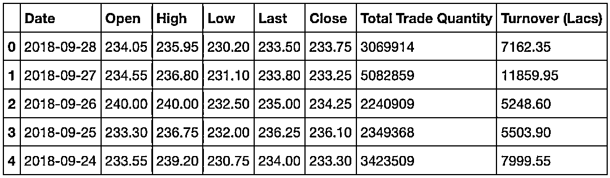
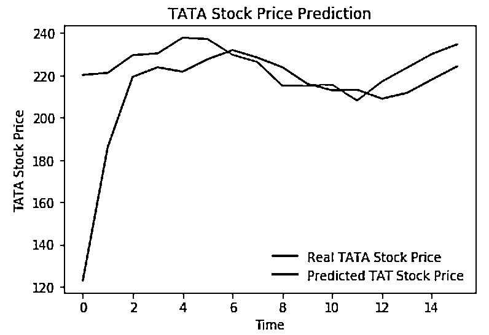

# 使用 LSTM 模型预测股价基于 Keras

> 原文：[`mp.weixin.qq.com/s?__biz=MzAxNTc0Mjg0Mg==&mid=2653289495&idx=1&sn=c4eeaa2e9f9c10995be9ea0c56d29ba7&chksm=802e3e02b759b7148227675c23c403fb9a543b733e3d27fa237b53840e030bf387a473d83e3c&scene=27#wechat_redirect`](http://mp.weixin.qq.com/s?__biz=MzAxNTc0Mjg0Mg==&mid=2653289495&idx=1&sn=c4eeaa2e9f9c10995be9ea0c56d29ba7&chksm=802e3e02b759b7148227675c23c403fb9a543b733e3d27fa237b53840e030bf387a473d83e3c&scene=27#wechat_redirect)


本期作者：Derrick Mwiti

本期翻译：HUDPinkPig

**未经授权，严禁转载**

**编**者按：本文介绍了如何使用 LSTM 模型进行时间序列预测。股票市场的数据由于格式规整和非常容易获得，是作为研究的很好选择。但不要把本文的结论当作理财或交易建议。 

本文将通过构建用 Python 编写的深度学习模型来预测未来股价走势。

虽然预测股票的实际价格非常难，但我们可以建立模型来预测股票价格是上涨还是下跌。本文使用的数据可以在 https://github.com/mwitiderrick/stockprice 下载。另外，本文将不考虑诸如政治氛围和市场环境等因素对股价的影响。。

**介绍**

LSTM 在解决序列预测的问题时非常强大，因为它们能够存储之前的信息。而之前的股价对于预测股价未来走势时很重要。

 本文将通过导入 NumPy 库来进行科学计算、导入 Matplotlib 库来绘制图形、以及导入 Pandas 库来加载和操作数据集。

```py
import numpy as np
import matplotlib.pyplot as plt
import pandas as pd
```

**加载数据集**

模型选择开盘价(Open)和最高价(High)两列。我们查看数据集的表头，可以大致了解数据集的类型。

```py
dataset_train = pd.read_csv('NSE-TATAGLOBAL.csv')
training_set = dataset_train.iloc[:, 1:2].values
```

Open 列是股票交易的开盘价，Close 列是收盘价，High 列是最高价，Low 列是最低价。



**特征归一化**

从以前使用深度学习模型的经验来看，我们需要进行数据归一化以获得最佳的测试表现。本文的例子中，我们将使用 Scikit- Learn 的 MinMaxScaler 函数将数据集归一到 0 到 1 之间。

```py
from sklearn.preprocessing import MinMaxScaler
sc = MinMaxScaler(feature_range = (0, 1))
training_set_scaled = sc.fit_transform(training_set)
```

**按步长创建数据**

LSTM 要求数据有特殊格式，通常是 3D 数组格式。初始按照 60 的步长创建数据，并通过 Numpy 转化到数组中。然后，把 X_train 的数据转化到 3D 维度的数组中，时间步长设置为 60，每一步表示一个特征。

```py
X_train = []
y_train = []
for i in range(60, 2035):
    X_train.append(training_set_scaled[i-60:i, 0])
    y_train.append(training_set_scaled[i, 0])
X_train, y_train = np.array(X_train), np.array(y_train)

X_train = np.reshape(X_train, (X_train.shape[0], X_train.shape[1], 1))
```

**构建 LSTM**

我们需要导入 Keras 的一些模型来构建 LSTM 

1、顺序初始化神经网络

2、添加一个紧密连接的神经网络层

3、添加长短时记忆层（LSTM）

4、添加 dropout 层防止过拟合

```py
from keras.models import Sequential
from keras.layers import Dense
from keras.layers import LSTM
from keras.layers import Dropout
```

为了防止过拟合，我们添加了 LSTM 层和 Dropout 层，其中 LSTM 层的参数如下：

1、50 units 表示输出空间是 50 维度的单位

2、return_sequences=True 表示是返回输出序列中的最后一个输出，还是返回完整序列

3、input_shape 训练集的大小

在定义 Dropout 层时，我们指定参数为 0.2，意味着将删除 20%的层。然后，我们指定 1 个单元的输出作为全连接层（Dense layer）。接着，我们使用目前流行的 adam 优化器编译模型，并用均方误差（mean_squarred_error）来计算误差。最后，模型运行 100epoch，设置 batch 大小为 32。这个参数是根据电脑的配置来设定的，并且将耗费几分钟时间来完成实验。

```py
regressor = Sequential()

regressor.add(LSTM(units = 50, return_sequences = True, input_shape = (X_train.shape[1], 1)))
regressor.add(Dropout(0.2))

regressor.add(LSTM(units = 50, return_sequences = True))
regressor.add(Dropout(0.2))

regressor.add(LSTM(units = 50, return_sequences = True))
regressor.add(Dropout(0.2))

regressor.add(LSTM(units = 50))
regressor.add(Dropout(0.2))

regressor.add(Dense(units = 1))

regressor.compile(optimizer = 'adam', loss = 'mean_squared_error')

regressor.fit(X_train, y_train, epochs = 100, batch_size = 32)
```

**在测试集上预测股价**

先导入我们要做股价预测的测试集：

```py
dataset_test = pd.read_csv('tatatest.csv')
real_stock_price = dataset_test.iloc[:, 1:2].values
```

为了预测未来的股票价格，我们需要在测试集加载后做如下几个工作：

1、在 0 轴上合并训练集和测试集

2、将时间步长设置为 60(如前面所介绍的)

3、使用 MinMaxScaler 函数转换新数据集

4、按照前面所做的那样重新规整数据集

在做出预测之后，我们用 inverse_transform 函数处理，以返回正常可读格式的股票价格。

```py
dataset_total = pd.concat((dataset_train['Open'], dataset_test['Open']), axis = 0)
inputs = dataset_total[len(dataset_total) - len(dataset_test) - 60:].values
inputs = inputs.reshape(-1,1)
inputs = sc.transform(inputs)
X_test = []
for i in range(60, 76):
    X_test.append(inputs[i-60:i, 0])
X_test = np.array(X_test)
X_test = np.reshape(X_test, (X_test.shape[0], X_test.shape[1], 1))
predicted_stock_price = regressor.predict(X_test)
predicted_stock_price = sc.inverse_transform(predicted_stock_price)
```

**展示结果**

最后，我们用 Matplotlib 库可视化显示真实股价和预测股价的对比。

```py
plt.plot(real_stock_price, color = 'black', label = 'TATA Stock Price')
plt.plot(predicted_stock_price, color = 'green', label = 'Predicted TATA Stock Price')
plt.title('TATA Stock Price Prediction')
plt.xlabel('Time')
plt.ylabel('TATA Stock Price')
plt.legend()
plt.show()
```



从图中我们可以看到，股票实际价格出现上涨时，模型也预测股价会上涨，较为吻合。这清晰地显示了 LSTMs 在分析时间序列和序列数据等方面的强大作用。

**结论**

预测股价的方法还有很多，比如移动平均线、线性回归、k 近邻、ARIMA 和 Prophet。读者可以自行测试这些方法的准确率，并与 Keras LSTM 的测试结果进行比较。

**推荐阅读**

[01、经过多年交易之后你应该学到的东西（深度分享）](https://mp.weixin.qq.com/s?__biz=MzAxNTc0Mjg0Mg==&mid=2653289074&idx=1&sn=e859d363eef9249236244466a1af41b6&chksm=802e3867b759b1717f77e07a51ee5671e8115130c66562577280ba1243cba08218add04f1f00&token=449379994&lang=zh_CN&scene=21#wechat_redirect)

[02、监督学习标签在股市中的应用（代码+书籍）](https://mp.weixin.qq.com/s?__biz=MzAxNTc0Mjg0Mg==&mid=2653289050&idx=1&sn=60043a5c95b877dd329a5fd150ddacc4&chksm=802e384fb759b1598e500087374772059aa21b31ae104b3dca04331cf4b63a233c5e04c1945a&token=449379994&lang=zh_CN&scene=21#wechat_redirect)

[03、全球投行顶尖机器学习团队全面分析](https://mp.weixin.qq.com/s?__biz=MzAxNTc0Mjg0Mg==&mid=2653289018&idx=1&sn=8c411f676c2c0d92b0dd218f041bee4b&chksm=802e382fb759b139ffebf633ac14cdd0f21938e4613fe632d5d9231dab3d2aca95a11628378a&token=449379994&lang=zh_CN&scene=21#wechat_redirect)

[04、使用 Tensorflow 预测股票市场变动](https://mp.weixin.qq.com/s?__biz=MzAxNTc0Mjg0Mg==&mid=2653289014&idx=1&sn=3762d405e332c599a21b48a7dc4df587&chksm=802e3823b759b135928d55044c2729aea9690f86752b680eb973d1a376dc53cfa18287d0060b&token=449379994&lang=zh_CN&scene=21#wechat_redirect)

[05、使用 LSTM 预测股票市场基于 Tensorflow](https://mp.weixin.qq.com/s?__biz=MzAxNTc0Mjg0Mg==&mid=2653289238&idx=1&sn=3144f5792f84455dd53c27a78e8a316c&chksm=802e3903b759b015da88acde4fcbc8547ab3e6acbb5a0897404bbefe1d8a414265d5d5766ee4&token=2020206794&lang=zh_CN&scene=21#wechat_redirect)

[06、手把手教你用 Numpy 构建神经网络(附代码)](https://mp.weixin.qq.com/s?__biz=MzAxNTc0Mjg0Mg==&mid=2653289274&idx=1&sn=f40be8372658c2c79fdd47c03d62e037&chksm=802e392fb759b039435fc6700ef5d45142cdfe72234586bd8de9b8dfabcc3264f2ae826def80&token=1003651614&lang=zh_CN&scene=21#wechat_redirect)

[07、美丽的回测——教你定量计算过拟合概率](https://mp.weixin.qq.com/s?__biz=MzAxNTc0Mjg0Mg==&mid=2653289314&idx=1&sn=87c5a12b23a875966db7be50d11f09cd&chksm=802e3977b759b061675d1988168c1fec06c602e8583fbcc9b76f87008e0c10b702acc85467a0&token=1972390229&lang=zh_CN&scene=21#wechat_redirect)

[08、利用动态深度学习预测金融时间序列基于 Python](https://mp.weixin.qq.com/s?__biz=MzAxNTc0Mjg0Mg==&mid=2653289347&idx=1&sn=bf5d7899bc4a854d4ba9046fdc6fe0d6&chksm=802e3996b759b080287213840987bb0a0c02e4e1d4d7aae23f10a225a92ef6dd922d8006123d&token=290397496&lang=zh_CN&scene=21#wechat_redirect)

[09、Facebook 开源神器 Prophet 预测时间序列基于 Python](https://mp.weixin.qq.com/s?__biz=MzAxNTc0Mjg0Mg==&mid=2653289394&idx=1&sn=24a836136d730aa268605628e683d629&chksm=802e39a7b759b0b1dcf7aaa560699130a907716b71fc9c45ff0e5d236c5ae8ef80ebdb09dbb6&token=290397496&lang=zh_CN&scene=21#wechat_redirect)

[10、Facebook 开源神器 Prophet 预测股市行情基于 Python](https://mp.weixin.qq.com/s?__biz=MzAxNTc0Mjg0Mg==&mid=2653289437&idx=1&sn=f0dca7da8e69e7ba736992cb3d034ce7&chksm=802e39c8b759b0de5bce401c580623d0729ecca69d13926479d36e19aff8c9c9e8a20265afff&token=290397496&lang=zh_CN&scene=21#wechat_redirect)

[11、2018 第三季度最受欢迎的券商金工研报前 50（附下载）](https://mp.weixin.qq.com/s?__biz=MzAxNTc0Mjg0Mg==&mid=2653289358&idx=1&sn=db6e8ab85b08f6e67790ec0e401e586e&chksm=802e399bb759b08d6eec855f9901ea856d0da68c7425cba62791b8948da6ad761a3d88543dad&token=290397496&lang=zh_CN&scene=21#wechat_redirect)

[12、实战交易策略的精髓（公众号深度呈现）](https://mp.weixin.qq.com/s?__biz=MzAxNTc0Mjg0Mg==&mid=2653289447&idx=1&sn=f2948715bf82569a6556d518e56c1f9e&chksm=802e39f2b759b0e4502d1aaac562b87789573b55c76b3c85897d8c9d88dbf9a0b7ee34d86a4e&token=290397496&lang=zh_CN&scene=21#wechat_redirect)

[13、Markowitz 有效边界和投资组合优化基于 Python（附代码）](https://mp.weixin.qq.com/s?__biz=MzAxNTc0Mjg0Mg==&mid=2653289478&idx=1&sn=f8e01a641be021993d8ef2d84e94a299&chksm=802e3e13b759b7055cf27a280c672371008a5564c97c658eee89ce8481396a28d254836ff9af&token=290397496&lang=zh_CN&scene=21#wechat_redirect)

**公众号官方 QQ 群**

**每天****很多干货****分享**

**没有按规则加群者一律忽略**


