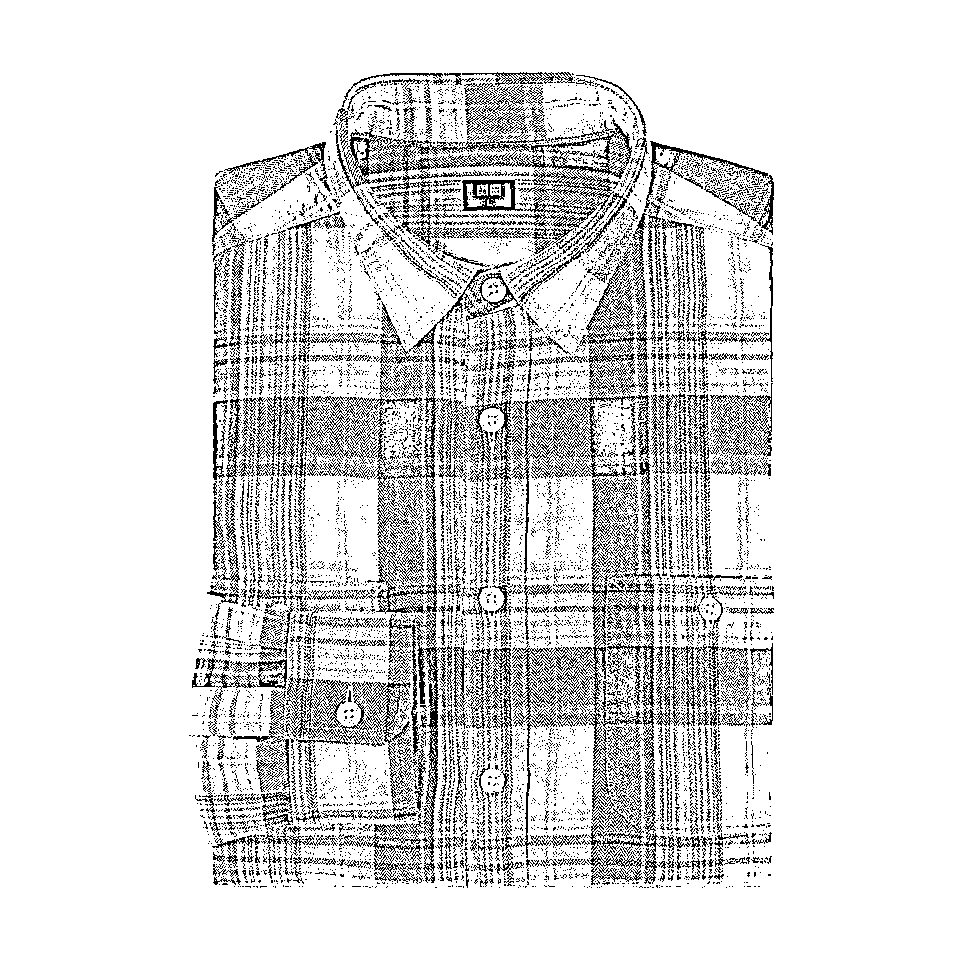
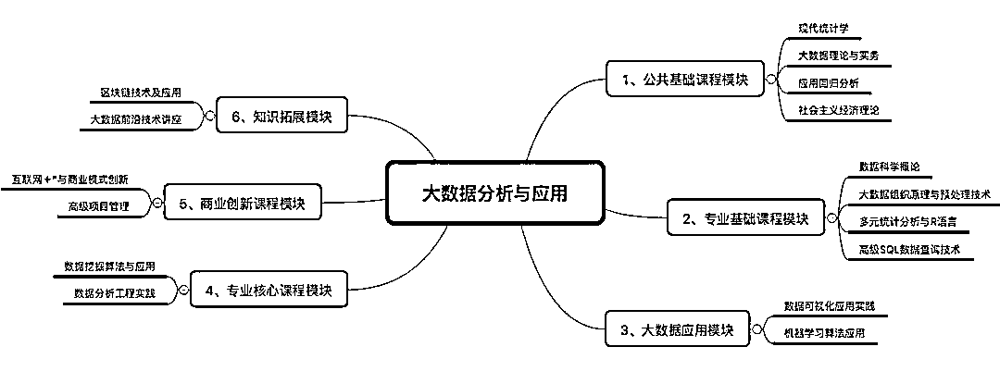
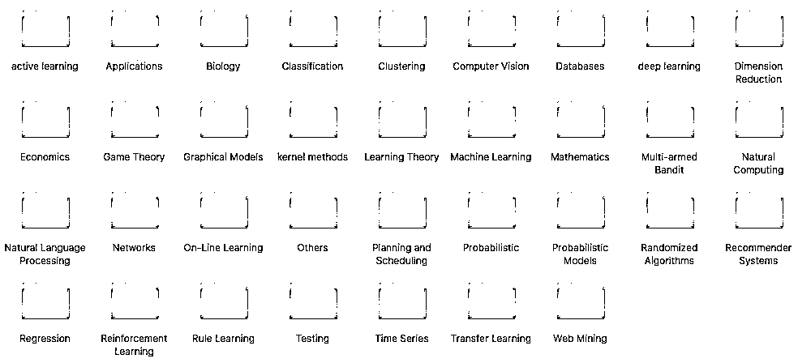
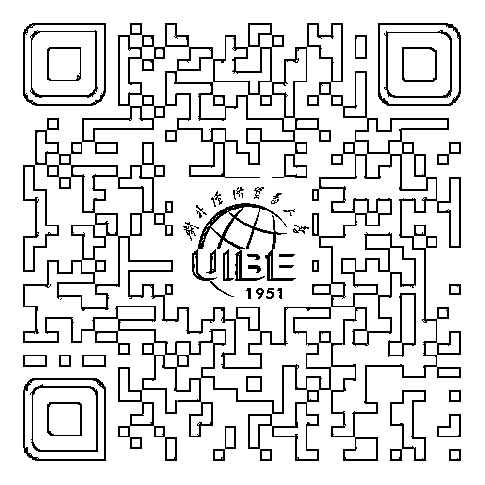

# 每一个 IT 人都应该拥有一个研究生学位丨这样你的职场才会越来越好

> 原文：[`mp.weixin.qq.com/s?__biz=MzAxNTc0Mjg0Mg==&mid=2653289482&idx=1&sn=c83662ba98784f71ec8042fcdfe4958f&chksm=802e3e1fb759b709c16b2c0a430ed36f55e11dfdc72f409336aa620d08addb5e5a09238fbd09&scene=27#wechat_redirect`](http://mp.weixin.qq.com/s?__biz=MzAxNTc0Mjg0Mg==&mid=2653289482&idx=1&sn=c83662ba98784f71ec8042fcdfe4958f&chksm=802e3e1fb759b709c16b2c0a430ed36f55e11dfdc72f409336aa620d08addb5e5a09238fbd09&scene=27#wechat_redirect)

hello，everybody

今天我们来聊一个话题 ~~ **买买买**

**双十一过了**

**摸摸你的手还在嘛？**

让我来带你见识一下程序员的购物 top 榜

拖鞋颈枕小毯子，裤衩 T 恤双肩包

Mac 外配俩 beats，机械键盘和鼠标

不仅让自己的撸码效率更高

更让自己撸码更舒适

（是的，买耳机是为了降噪为了安静的工作氛围）

虽然程序员小哥哥们是时尚绝缘体

但大家把钱花在了刀刃上好吗？

好了，下面谈回正事

双 11 剁手节刚过去，那么

**还有什么最值得程序员买？**

当然是买知识来投资自己

现在起，大家伙参加

**对外经济贸易大学在职研究生**

《大数据分析与应用》专业

**就可以抽取以下超级福利！**

如果你是运气王

分分钟大赚一笔

文末更有免费视频领取

**一等奖**

**iPhone XS **（1 名）

新机发布会你分秒不落的看了

小心脏蠢蠢欲动但一直没舍得下手

别急，报名学习对外经贸《大数据分析与应用》

就有机会成为那个人人称羡的锦鲤

**免费把 iPhone XS 带回家！**

如果中了一等奖，不用谢

**爱学习的你值得拥有它**

**二等奖**

**程序员的心头爱～Cherry 键盘 **（3 名）

这手感，真的是“啪啪啪”

Cherry 在手保你撸起代码来

手疾如飞没 bug

这是承载着“**对外经济贸易大学大数据专业**”心意的奖品

**在帮助大家写出更好代码的路上**

**我们一直在努力**

**三等奖**

我能说是最暖心的吗！

没错，它就是法兰绒格子衬衫（10 名）

来自优衣库的必备经典款

（有几个程序员舍得拒绝它）

**在这个寒冷又虐狗的 “光棍节” **

**它可以温暖你寂寞的心**

（PS：报名课程后，由招生办老师统一抽奖

为了公平公正，采用第三方平台实施抽奖

并接受大家监督，奖品校方直邮）

介绍完了诱人的福利

下面说说大家关心的

**《大数据分析与应用》** 

**真正旨在培养大数据架构师的硕士专业**

为了让大家更加深入的了解大数据技术特别邀请了

**时任对外经济贸易大学校长、大数据与风险管理研究中心主任-施建军教授**。

**阿里云首席科学家-周靖人教授。**

****

**对外经济贸易大学统计学院院长、博士生导师刘立新教授等等一线名师。**

根据数十位教授多年的研究和教学经验，**深度剖析统计学、数据科学、数据挖掘、数据分析、数据可视化、机器学习、区块链、等互联网+商业模式创新课程。**适合有一定大数据研发经验（尤其是 2 年以上经验）的程序员学习。

对外经济贸易大学国家重点“211”工程大学，在这里你可以和全日制研究生学一样接受等同的硕士课程，并获得研究生学位证书，认可度高，考博、出国留学、评职称都是小意思。

班级同学 80%以上是**百度**、**腾讯**、**京东**、**美团**等知名公司高级工程师，**构成广阔的人脉圈**，大学时老师经常苦口婆心的说：“决定你命运的，不是机会而是人脉，因为伯乐并不是随处可见。”所以我们要把自己变成一个有用的人，当我们在需要帮助的时候，总能找到愿意帮助自己或者志同道合的人。

最后重要的一点要来了，我们只招收大学本科毕业满两年并取得学士学位的同学，无需考试，免试入学，周末上课。而且我们为异地或在职繁忙人群量身定做了线上学习平台，工作学习两不误。

▲ 对外经济贸易大学《大数据分析与应用》专业课程大纲

**最最最后！！**

对于所有咨询招生办老师的小伙伴 

都可以**免费获得百余篇经典论文集**一套

内容↓↓

免费获取百余篇经典论文通道

**长按即可添加**

**了解《大数据分析与应用》专业课程详情**

**开班时间等更多详细信息**

如果你是土豪朋友

请把文章转发给 

身边有需要的研究生学历的好基友

他一定会感谢你的