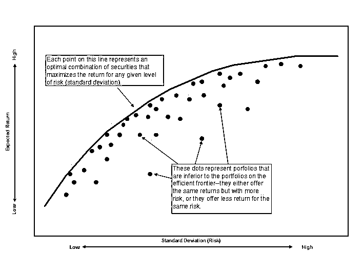
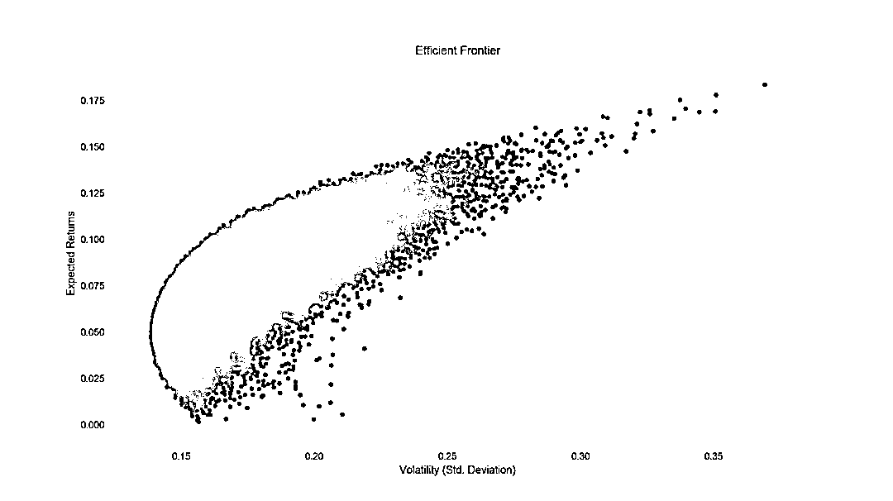
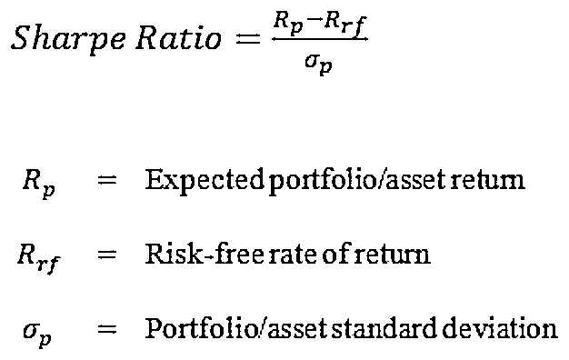
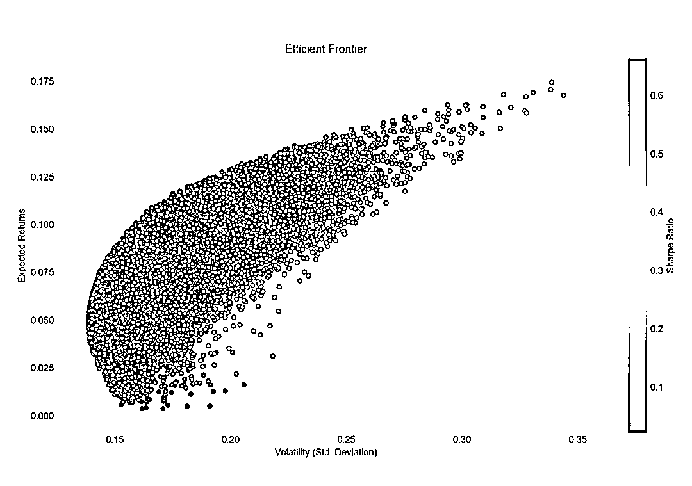
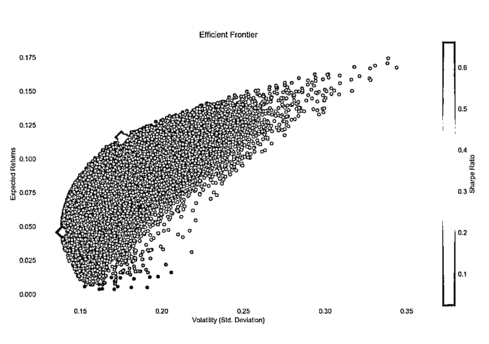

# Markowitz 有效边界和投资组合优化基于 Python（附代码）

> 原文：[`mp.weixin.qq.com/s?__biz=MzAxNTc0Mjg0Mg==&mid=2653289478&idx=1&sn=f8e01a641be021993d8ef2d84e94a299&chksm=802e3e13b759b7055cf27a280c672371008a5564c97c658eee89ce8481396a28d254836ff9af&scene=27#wechat_redirect`](http://mp.weixin.qq.com/s?__biz=MzAxNTc0Mjg0Mg==&mid=2653289478&idx=1&sn=f8e01a641be021993d8ef2d84e94a299&chksm=802e3e13b759b7055cf27a280c672371008a5564c97c658eee89ce8481396a28d254836ff9af&scene=27#wechat_redirect)


本期作者：Bernard Brenyah 

本期翻译：Barry

**未经授权，严禁转载**

哈里马科维茨对金融和经济学的世界的贡献是怎么强调都不过分的。凭借其于 1952 年发表的开创性论文“资产组合选择”，他被广泛的视作现代资产组合理论（MPT）的开拓者。最终在 1990 年，基于对这一领域的巨大贡献，他获得了诺贝尔经济学奖。

如今，几乎全世界的任何一门商科、金融课程都会教授 MPT 理论。**本文将通过真实的股票数据用 python 来介绍这一理论的基础和有效前沿的构建。**

那么什么是 MPT，为什么你要理解它，又怎么用 python 来实现它呢？

与大多数理论一样，MPT 也是建立在对真实世界一些假设之上。对 MPT 的的解释将从阐述它的基本假设开始：

**MPT 的假设：**

*   投资者是理性的并且风险厌恶

*   投资者追求收益最大化

*   所有投资者都想最大化期望收益

*   不考虑佣金和税费

*   所有投资者都可以接触到同样的信息源和与投资决策相关的全部必要信息

*   投资者可以以无风险利率不受限制的借入和贷出资金

现代资产组合理论是关于在特定风险水平下投资者（风险厌恶）如何构建组合来最大化期望收益的理论。MPT 的突破性在于提出不需将众多投资的风险和收益特征孤立分析，而是去研究这些投资如何对组合的表现产生影响。因此，MPT 的假设强调投资者只有在可能得到更高期望收益时会有额外风险出现---也就是高风险，高收益。

这一理论最基本的原则是投资者可以构建投资组合的有效集合，即有效前沿。有效前沿可以在特定风险水平下使期望收益最大化。投资者对风险的容忍度将决定他所选择的有效前沿。低容忍度的投资者会选在最低风险下可以提供最大收益的组合，高容忍度的会选择高风险下的可以提供最大收益的组合。可以从下图大致理解有效前沿的概念：



不同的股票组合将产生不同的期望收益。在马科维茨证明了有效前沿之后人们最重要的一个发现是分散化投资的力量。因为组合中资产的相关性和权重可以极大地影响组合收益，所以投资者可以在他们的风险偏好下通过用不同的证券简单地构建组合来实现期望收益最大化。

那么我们该怎么通过 python 用真实股价数据来建立有效前沿组合呢？

**数据获取**

```py
import quandl
import pandas as pd
import numpy as np
import matplotlib.pyplot as plt

quandl.ApiConfig.api_key = 'PASTE YOUR API KEY HERE'
selected = ['CNP', 'F', 'WMT', 'GE', 'TSLA']
data = quandl.get_table('WIKI/PRICES', ticker = selected,
                        qopts = { 'columns': ['date', 'ticker', 'adj_close'] },
                        date = { 'gte': '2014-1-1', 'lte': '2016-12-31' }, paginate=True)
data.head()
```

```py
date        ticker  adj_close
None      
0  2014-01-02  CNP  19.290792
1  2014-01-03  CNP  19.282339
2  2014-01-06  CNP  19.307699
3  2014-01-07  CNP  19.510582
4  2014-01-08  CNP  19.307699
```

接下来是数据处理步骤，我们根据 tickers 来给调整后的收盘价排序：

```py
clean = data.set_index('date')
table = clean.pivot(columns='ticker')
table.head()
```

```py
adj_close
ticker    CNP    F    GE    TSLA  WMT
date          
2014-01-02  19.290792  12.884511  24.266002  150.10  71.343743
2014-01-03  19.282339  12.942926  24.248354  149.56  71.108673
2014-01-06  19.307699  13.001340  24.054226  147.00  70.710863
2014-01-07  19.510582  12.834442  24.080698  149.36  70.927850
2014-01-08  19.307699  12.967960  24.010106  151.28  70.367299
```

为了得到有效前沿，我们需要模拟很多的投资组合（50000 个）。

```py
port_returns = []
port_volatility = []
stock_weights = []

num_assets = len(selected)
num_portfolios = 50000

for single_portfolio in range(num_portfolios):
    weights = np.random.random(num_assets)
    weights /= np.sum(weights)
    returns = np.dot(weights, returns_annual)
    volatility = np.sqrt(np.dot(weights.T, np.dot(cov_annual, weights)))
    port_returns.append(returns)
    port_volatility.append(volatility)
    stock_weights.append(weights)

portfolio = {'Returns': port_returns,
             'Volatility': port_volatility}

and weight in the portfolio
for counter,symbol in enumerate(selected):
    portfolio[symbol+' weight'] = [weight[counter] for weight in stock_weights]

df = pd.DataFrame(portfolio)

column_order = ['Returns', 'Volatility'] + [stock+' weight' for stock in selected]
df = df[column_order]
df.head()
```

```py
Returns    Volatility  CNP weight  F weight  WMT weight  GE weight  TSLA weight
0  0.051471  0.139810  0.193275  0.144265  0.286315  0.037991  0.338155
1  0.098057  0.205745  0.001220  0.192939  0.271552  0.359363  0.174927
2  0.042783  0.160203  0.281532  0.442986  0.164275  0.022419  0.088788
3  0.090758  0.199514  0.113044  0.344052  0.238166  0.293816  0.010922
4  0.053179  0.159999  0.212643  0.283324  0.015256  0.168772  0.320006
```

棒极了！繁琐的步骤现在都已经完成了！我们来看一下有效前沿长什么样：



希望现在你对 MPT 有了基本的了解！

前面我们了解了资产组合理论（MPT）的基本内容并通过 Monte Carlo 模拟产生了有效前沿组合。下面我们专注于组合优化的概念。

50000 个不同权重的投资组合产生了不同的期望收益和期望波动率。线上的每个点代表了股票的一个最优组合（CenterPoint Energy,Facebook,Walmart,General Electric,Tesla），最优组合在特定的风险水平下最大化了期望收益率。如果有效前沿曲线上的所有点都是最优组合，那么在这些组合中的最优投资组合是什么呢？优中最优组合的选取标准又是什么呢？

另一个诺贝尔奖得主 William F. Sharpe 拓展了 Markowitz 的工作，开发了资本资产定价模型(CAPM)。本文不会设计 CAPM，但是我们会用到他的一个成果（Sharpe Ratio）最为选择最优的准则。



夏普比率可以用来衡量特定风险下投资收益的表现。这个比率调整了投资的收益，使我们可以在一定规模风险的情况下比较不同的投资表现。没有规模风险的限制，我们无法比较不同证券组合的收益与风险表现。注：出于简化，本文无风险收益率设为 0%。

我们将对上面的代码做一些小改变。我们已经有了模拟出的组合的期望收益率和风险。接下来，我们将计算这些组合的风险调整收益率（借助夏普比率），并且以夏普比率为值画出色标图：

```py
import quandl
import pandas as pd
import numpy as np
import matplotlib.pyplot as plt

quandl.ApiConfig.api_key = 'INSERT YOUR API KEY HERE'
selected = ['CNP', 'F', 'WMT', 'GE', 'TSLA']
data = quandl.get_table('WIKI/PRICES', ticker = selected,
                        qopts = { 'columns': ['date', 'ticker', 'adj_close'] },
                        date = { 'gte': '2014-1-1', 'lte': '2016-12-31' }, paginate=True)

clean = data.set_index('date')
table = clean.pivot(columns='ticker')

returns_daily = table.pct_change()
returns_annual = returns_daily.mean() * 250

cov_daily = returns_daily.cov()
cov_annual = cov_daily * 250

port_returns = []
port_volatility = []
sharpe_ratio = []
stock_weights = []

num_assets = len(selected)
num_portfolios = 50000

np.random.seed(101)

for single_portfolio in range(num_portfolios):
    weights = np.random.random(num_assets)
    weights /= np.sum(weights)
    returns = np.dot(weights, returns_annual)
    volatility = np.sqrt(np.dot(weights.T, np.dot(cov_annual, weights)))
    sharpe = returns / volatility
    sharpe_ratio.append(sharpe)
    port_returns.append(returns)
    port_volatility.append(volatility)
    stock_weights.append(weights)

portfolio = {'Returns': port_returns,
             'Volatility': port_volatility,
             'Sharpe Ratio': sharpe_ratio}

for counter,symbol in enumerate(selected):
    portfolio[symbol+' Weight'] = [Weight[counter] for Weight in stock_weights]

df = pd.DataFrame(portfolio)

column_order = ['Returns', 'Volatility', 'Sharpe Ratio'] + [stock+' Weight' for stock in selected]

df = df[column_order]

plt.style.use('seaborn-dark')
df.plot.scatter(x='Volatility', y='Returns', c='Sharpe Ratio',
                cmap='RdYlGn', edgecolors='black', figsize=(10, 8), grid=True)
plt.xlabel('Volatility (Std. Deviation)')
plt.ylabel('Expected Returns')
plt.title('Efficient Frontier')
plt.show()
```

通过上述代码，我们得到了下图：



接着，试着找出最优组合和有着最低波动率的组合（也就是风险厌恶最严重的投资者的偏好组合）：

```py
min_volatility = df['Volatility'].min()
max_sharpe = df['Sharpe Ratio'].max()

sharpe_portfolio = df.loc[df['Sharpe Ratio'] == max_sharpe]
min_variance_port = df.loc[df['Volatility'] == min_volatility]

plt.style.use('seaborn-dark')
df.plot.scatter(x='Volatility', y='Returns', c='Sharpe Ratio',
                cmap='RdYlGn', edgecolors='black', figsize=(10, 8), grid=True)
plt.scatter(x=sharpe_portfolio['Volatility'], y=sharpe_portfolio['Returns'], c='red', marker='D', s=200)
plt.scatter(x=min_variance_port['Volatility'], y=min_variance_port['Returns'], c='blue', marker='D', s=200 )
plt.xlabel('Volatility (Std. Deviation)')
plt.ylabel('Expected Returns')
plt.title('Efficient Frontier')
plt.show()
```



接下来输出这两个特殊组合的具体信息：

```py
print(min_variance_port.T)
print(sharpe_portfolio.T)

  17879
Returns    0.045828
Volatility  0.138552
Sharpe Ratio  0.330761
CNP Weight  0.240327
F Weight  0.104659
WMT Weight  0.257760
GE Weight  0.001487
TSLA Weight  0.395767

31209
Returns      0.116145
Volatility    0.175045
Sharpe Ratio    0.663514
CNP Weight    0.372890
F Weight    0.008482
WMT Weight    0.404987
GE Weight    0.211450
TSLA Weight    0.002190
```

风险厌恶最严重的投资者将会选择最小方差组合，它的期望收益率是 4.58%，期望波动率是 13.86%。追求最大风险调整收益率的投资者将会构建有着最大夏普比率的投资组合，它的期望收益率是 11.61%，期望波动率是 17.50%。

通过一些优化的数学技巧也可以得到相同的结论，但这里，用了 Monte Carlo 模拟来解释有效前沿和最有投资组合的概念。

**公众号官方 QQ 群**

**每天有很多干货资料分享**

**满足不同人群学习、办公的需求**

**不同行业之间的交流互动**

**扫码加入**


**加群请备注**

**学校/公司+姓名+研究方向**

**否则一律忽略！**

