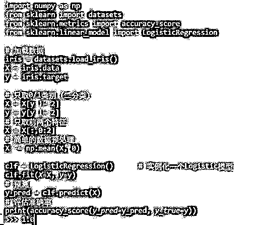
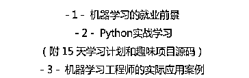
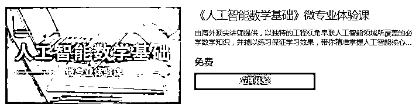
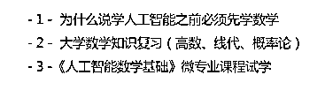

# 机器学习入门一定要避开的 3 个陷阱

> 原文：[`mp.weixin.qq.com/s?__biz=MzAxNTc0Mjg0Mg==&mid=2653289462&idx=1&sn=da98ab3c411ada5acb439cf0f8085fc8&chksm=802e39e3b759b0f5ad4114c2f32b79d80bb90923e54628ed6e1a36fc354236300fbeac3ba158&scene=27#wechat_redirect`](http://mp.weixin.qq.com/s?__biz=MzAxNTc0Mjg0Mg==&mid=2653289462&idx=1&sn=da98ab3c411ada5acb439cf0f8085fc8&chksm=802e39e3b759b0f5ad4114c2f32b79d80bb90923e54628ed6e1a36fc354236300fbeac3ba158&scene=27#wechat_redirect)

最近秋招已经进入尾声，有不少朋友反馈，面试的过程中，面试官提到的许多常见机器学习算法相关问题都没有准确的回答出来，相关简略代码的现场演示也没有成功写出来，经常被问得哑口无言，最终也没有获得好的 Offer。

应用的时候也只是调用一些封装好的框架来简单地调调包，调调参。这种活似乎每个人都会，不能在众多人中脱颖而出。

**总结以上问题出现的原因**

1、理论学习时缺少对算法的推导，对算法只是一个大概了解

2、对常用的机器学习算法，没有尝试去用编程语言去实现，对算法模型的优化细节和参数的选择没有一个很好的理解。

**遇到这些问题该怎么办？**

**简单过一遍算法是远远不够的。**

> 那样我们只能大概了解该算法是一个用于解决分类还是回归等问题。但当涉及到具体的算法流程（模型的拟合函数、目标函数和优化函数），自己却不知道从哪处说起。也不知道为何该算法是有效的。
> 
> 这时候就考验大家的机器学习功底了，类似的分类算法有很多种，类似的回归算法也有很多种。那么什么场景下使用 SVM，什么场景下使用决策树，什么场景下又使用线性回归呢？这个模型的参数又应该根据怎样的思路去优化？等等问题可能会在之后具体的应用场景中烦恼到你。

**学习一个新的算法的正确姿势**

> 阅读相关书籍或学习课程的时候
> 
> **需要跟着书本/老师的思路**一步一步地对算法的由来、算法拟合函数的有效性、算法的目标函数（如最小二乘法，对数似然函数等）与如何使用该算法的优化函数去进行模型参数的优化（如梯度下降）等流程要有个深刻的认识。
> 
> 不要求每次都能具体地详细推导出来（可适当地安排时间来复习一下推导课程），但起码在之前第一次学习，第一次复习的时候，就要有着深刻的认识，这样之后多次的算法应用中就更加得心应手了。

**入门一定要避开的几大陷阱**

**1、收藏过多的资料**

资料不在多，而在于精。比如书籍，推荐李航博士的《统计学习方法》和周志华教授的《机器学习》，这两本对入门初学者就非常的友好了。也可以选择一门较好的课程，系统地跟着老师去学习。

**2、恶补相关的数学知识**

机器学习是需要同学们具有一定的数学基础，如微积分和概率论等基础知识。有些同学认识到这点的时候，就会一开始就先恶补这些数学知识，**不仅消耗大量的时间，而且可能还产生一种对机器学习的消极性**。

数学知识是肯定需要的，我们可以在学习一个新的算法的时候，遇到了哪个不懂的数学知识，再去回忆学习。这样在查漏补缺的同时，还可以有更好的系统认知。

**3\. 对每个算法都要去重新实现**

用编程语言去重新实现一个算法固然可以加深对算法的认识。

那是不是说我们需要对每个算法都要去实现呢？答案是不需要的，因为自己实现的算法往往是不完美的，效率也不高。

**但是我们需要尽量对传统的算法（如逻辑回归，决策树，梯度下降等）重新实现一遍，因为之后很多新的变种算法，都是基于传统的机器学习算法进行改良的。**我们掌握传统机器学习算法的基础，就可以更容易的理解新的算法。

**算法的应用**

在说完上面一些问题的学习建议后，我们可以去用 15 行代码去感受一些封装好的算法框架的高效性。

在仅仅 15 行代码的基础上，我们就可以获得 100%的鸢尾花分类的准确率。

封装框架带来的高效性，也可能使我们产生惰性，觉得不需要再去系统的理解算法。这种认识是错误的，如上面提到的，如果没有对算法深刻的理解，算法的调优和在算法的基础上修改为适用于自己的应用场景是非常困难的。

经过上面详细的介绍，大家应该发现学习机器学习算法也并非异常困难，那么这种能力由应该如何去掌握呢？在与很多同学的交谈中，发现自学非常困难，因为自己的数学功底和 coding 不太好，学习方向不明确，都想找到一条高效的学习途径。

推荐网易云课堂的微专业《机器学习工程师》，既能在一线机器学习专家的辅导下，快速高效理解 30 个机器学习算法，又能开发多达 32 项项目案例实战。同时，在老师的带领下，解读数据科学比赛的 top-K 方案，学习获胜者的方法和经验，提高数据科学比赛技能。

**现在推出限时免费体验福利，这里为大家免费提供名师打磨的一周体验课，更有前辈高人直播指点迷津 。**

**福利一：免费直播**

**直播主题**

**<入行 AI，跨不过线性代数怎么行？>**

11 月 15 日 周四 20:00

**直播大纲**

1\. 机器学习算法一览

2\. PCA 中的特征值和特征向量

3\. 从线性代数看 SVM 中的最关键一环

4\. 《人工智能数学基础》带你走入 AI 大门

**直播讲师**

****

Jason 博士 澳大利亚数据机构研究员

**福利二：一周体验课**

**福利三：免费学习资料**

**获取方式**

群号：562553678

扫码加入 QQ 群即可获取

**点击阅读原文，即可预约！**