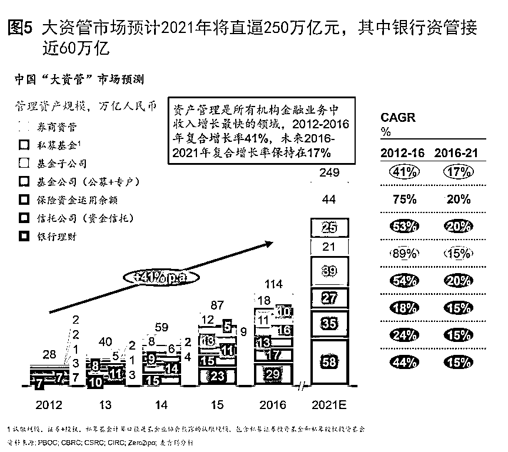
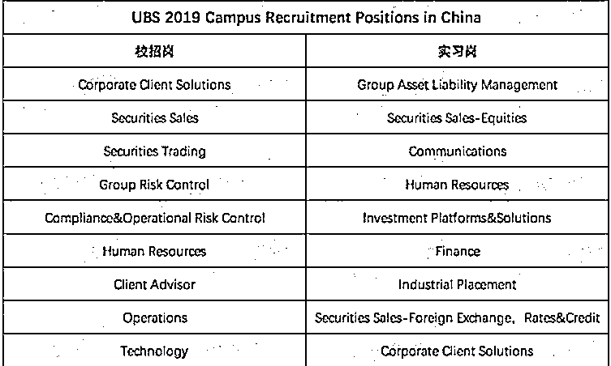
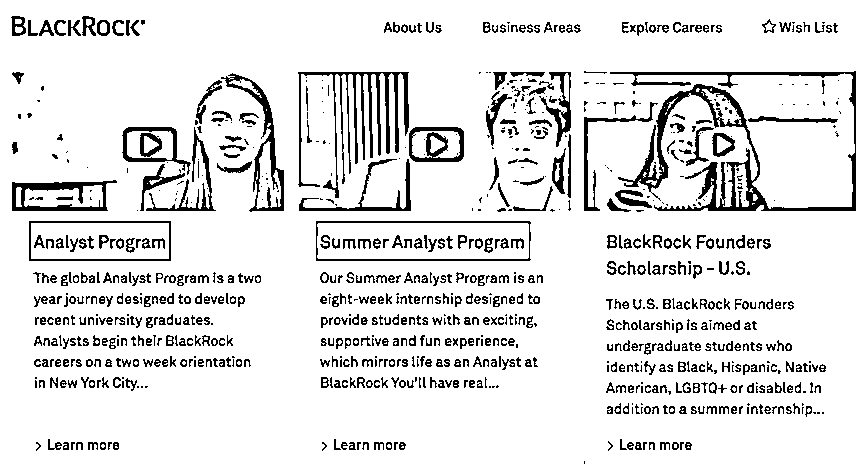
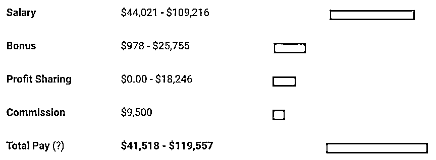
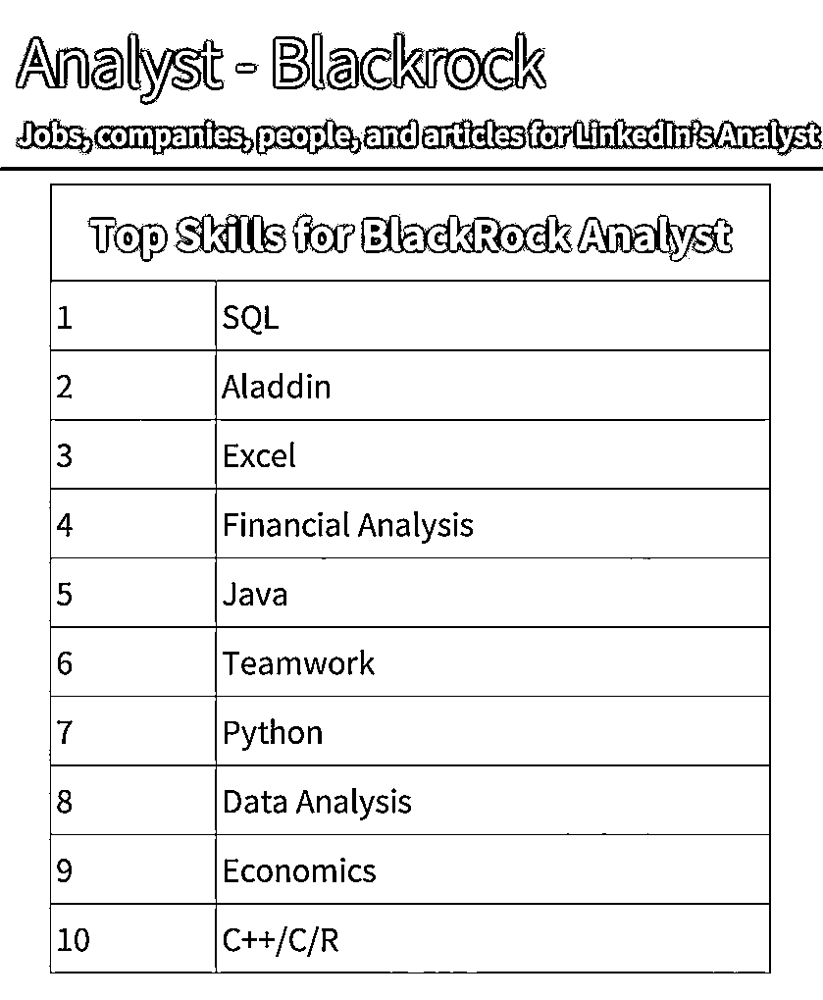
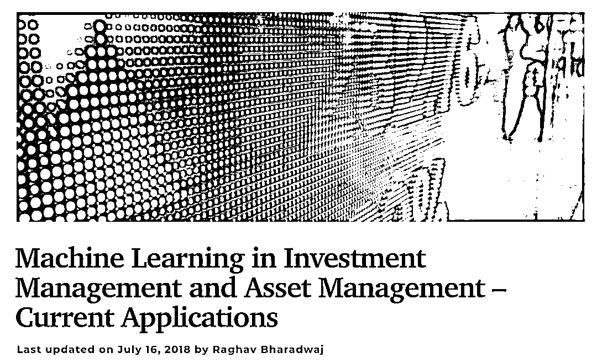
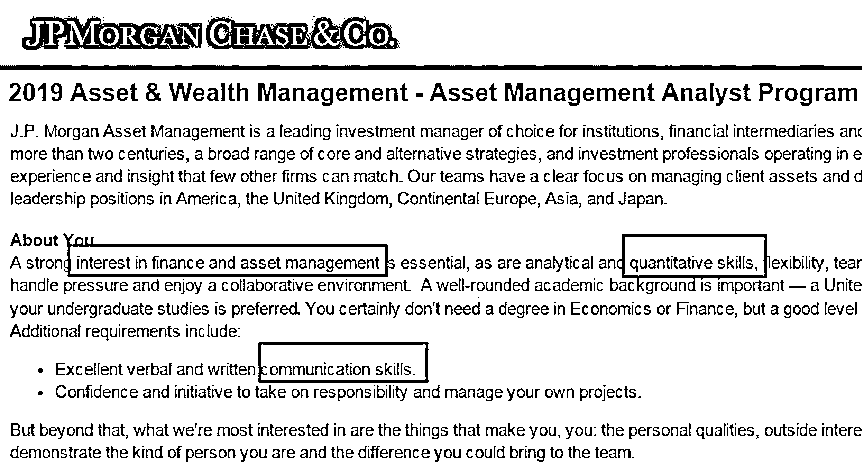

# 应届生进入买方的最佳途径，了解一下？

> 原文：[`mp.weixin.qq.com/s?__biz=MzAxNTc0Mjg0Mg==&mid=2653289456&idx=1&sn=170d0588bb7baa15778d3de9d2a7b8dd&chksm=802e39e5b759b0f3ef4b6e065d3e42d0c5d0c90bda6f112fa6ac8c6536bd150592257c8371f9&scene=27#wechat_redirect`](http://mp.weixin.qq.com/s?__biz=MzAxNTc0Mjg0Mg==&mid=2653289456&idx=1&sn=170d0588bb7baa15778d3de9d2a7b8dd&chksm=802e39e5b759b0f3ef4b6e065d3e42d0c5d0c90bda6f112fa6ac8c6536bd150592257c8371f9&scene=27#wechat_redirect)

文章来源：UniCareer

文章作者：Uni 酱

资产管理做为行业新宠

**活少钱多还体面**

**分分钟玩转上亿美元**

****

这么让人羡慕的专业，

你不了解一下？

01

**Asset Management 是什么？**

Asset Management，资产管理。顾名思义，就是管理客户资产，在控制风险的情况下使资产增值。**投资的资产类型具体涉及固定收益、股票、金融衍生品、期货等。**

1

华尔街大幅裁员, 资产管理行业现状 

德意志银行在 2019 年前计划裁员 1 万人，高盛 600 名交易员现今只剩 2 人。2015 年以来，华尔街一直“坚持不懈”的大规模裁员。**还有更扎心的：据预测到 2025 年，华尔街 23 万人将被 AI 替代。**

**金融市场不景气，投行前台大幅裁员，但资管领域却扩招了 13.2%。**着重发展财富管理和资产管理业务，已经成为了商业银行转型的重要方向。

同时，中国的资产管理行业正处于快速成长期，据普华永道的调查和预测，中国总体资产管理规模增速将会超过发达国家，**大资管市场预计 2021 年将直逼 250 万亿元，从而形成资管行业的新资产池。**

*图片来源：网络

2018 年，业内普遍认为是金融业难熬的一年。但资产管理专业化却正进入一个更加理性成熟、客户需求更加多元、产品更加丰富、服务更有深度的时代。

2

哪些公司可以做 Asset Management? 

*   基金公司

*   保险资产管理公司/部门

*   投行的资产管理子公司/部门

3

资产管理≠财富管理 

资产管理公司向客户提供的是策略，财富管理机构向客户提供的是顾问服务。从业务上来看，资产管理的业务核心在于投资。它的中后台、销售，甚至研究部门。

而财富管理机构的核心则在于客户关系管理。通过平台向客户提供投资方面或非投资方面的服务。

02

**资产管理行业向应届生开放**

1

买方公司招聘应届生

应届生培养难度大周期长的问题，被资管公司拒之门外。一般需要在投行或券商磨砺两到三年才能让资管公司敞开大门。

近年来，用人荒，是不少资管企业用人方的最大感受。**资管行业放宽要求，各大资产管理公司也加入了招聘队列，接受校招和内推，针对应届毕业生的项目已经开放。**

**UBS2019 资管校招岗位**

*图片来源：UniCareer

**BlackRock 招聘项目**

 * 图片来源：BlackRock 官网

2

应届毕业生的求职劣势 

应届毕业生缺乏相关专业知识，难以形成资管思维，求职者得不到资管行业的优质岗位信息。

3

资管公司应届生薪资 

资管行业的薪水可观，一般情况下，Asset Management Analyst 的薪资主要由三部分组成，分别是：base salary, bonus 和 profit sharing。

* 图片来源：Payscale

**据统计，在中金，这个领域的应届毕业生，基本年薪 25w，绩效合计 40w+；在中信，3-5 年的从业者，年薪更是高达 80w-120w。**

03

**资产管理就业方向**

*   **Front office：**

    股票及固定收益研究分析师

    投资组合经理

    销售和营销

    产品开发

*   **Middle office：**

    合规

    风险管理

*   **Back office：**

    基金管理

    资讯科技及运营

    内部审计

04

资管需要的硬技能榜首 SQL

LinkedIn 分析了 7853 位领英上的 BlackRock 入门级分析师的简历和资料，总结出了***买方资管名企 Analyst 的必备技能***：

*数据来源：LinkedIn

1

强量化分析能力

可以看到，除了排名第二是贝莱德自己的 Aladdin 系统之后，最高的就是 SQL 以及 Excel，资产管理也不例外。在资产管理的工作中，你需要熟练运用**SPSS、 Excel**等工具分析数据。除了需要了解**统计建模和预测**之外，**金融建模**也是需要掌握的技能。

2

了解一定编程知识

**Python、R**是基础必备，会**Machine learning**会很大程度地加分。

*图片来源：官网截图

3

资本市场理解很关键

在资管技术面问题很多都会考察下列问题：

> *你怎么看现在的股票市场？*
> 
> *你怎么看现在的债券市场？*
> 
> *你怎么理解 FICC 或者给我解释一下外汇市场的情况*
> 
> *怎么向你的姨妈解释什么是收益率曲线？*

4

强大逻辑以及表达能力

面试官会期待一个反应快、沟通能力强的人。做资产管理会经常参与面向前台或面向客户的活动，因此高情商和人际交流技巧很重要。另外作为应届生，强的学习能力也很重要。最好可以在面试中体现出来。

5

其他必备技能

*图片来源：官网截图

**金融知识：**

摩根大通的招聘描述中提到，希望求职者有金融专业背景，或者至少对金融和资产管理感兴趣。CFA 证书也是一些顶级资管公司的敲门砖。

**Quant 技能：**

和数字打交道是任何金融工作的核心，资产管理也不例外。在资产管理的工作中，你需要熟练运用 SPSS、 Excel 等工具分析数据。除了需要了解统计建模和预测之外，金融建模也是需要掌握的技能。

**管理和沟通技巧：**

会和客户建立长期关系，帮助他们实现资产管理目标。因此高情商和人际交流技巧很重要。

05

**招聘流程**

应届生招聘流程也是非常严格，包括：HR 电话了解、技术岗 Online Test、Hiring Manager 电话面试（了解实习、经历）, Onsite 面试。

企业主要考察应聘者，包括：沟通能力、自我激励、分析能力、团队合作能力、快速学习能力、对金融感兴趣、高压下工作能力、注意细节。

1

面试真题

**JP Morgen 摩根大通****AM****：**

> *1\. Why JPM and AM?*
> 
> *2\. Group experience, what't your role, what's your problem and how to solve it.*
> 
> *3\. What leadership experience or extracurricular activity*
> 
> *4\. Describe whatfactors have influenced financial markets in recent months and how they mightaffect ourclients.*
> 
> *5\. A experience for you to choose ownership or relinguish*

**WM 财富管理岗位：**

> *1\. Why JPM and WM?*
> 
> *2\. Experience to show leadership /innovation*
> 
> *3\. Pitch a sell that you are interest in*
> 
> *4\. A problem you come over recently and how to solve*
> 
> *5.Describe whatfactors have influenced financial markets in recent months and how they mightaffect ourclients.*

**贝莱德 BlackRock：**

**视频面试题目：**

*   *Why did you apply to this position at Blackrock ?*

*   *What makes BlackRock different from other companies ?*

*   *Tell me a challenging project you did.*

**Onsite 面试题目：**

*   *Do you know the Alddin?*

*   *What do you know about Beta, Alpha?*

*   *How to hedge risk in the market with the CAPM model.*

**PIMCO：**

**电话面试题目:**

> *Please tell us 4 headlines you read in the news today and why they are important.*
> 
> *What economic events are on the calendar this week and how do you expect them to impact the markets?*

2

如何应对面试

**告诉面试官你是个勤奋且好相处的人。**摩根士丹利副总裁兼董事总经理 Carla Harris 认为，勤奋是年轻人要在职场脱颖而出必备的素质。因此她在面试时会考察求职者在以下这几个方面的能力：

> *他们能够在本职工作之外做多少事情？*
> 
> *他们是否有主动进取的精神？*
> 
> *他们是否能坚持到底？”*

**提前了解面试的公司。**在面试前做好充足的研究，对应聘岗位职责，公司背景文化等信息，这样才会在面试中表现出足够的自信。

**不要在求职过程中撒谎。**对冲基金公司 Point72 Asset Management 人力资源主管 Mike Butler 发现，很多求职者在简历上撒谎，而这是让他们最快被扫地出局的方法。无论是在简历里，申请流程中，还是面试里，”Butler 说，“简历里有疏漏，学业上有含糊不清的地方，在背景介绍里耍嘴皮子、蒙混或含糊其辞。”

**推荐阅读**

[1、经过多年交易之后你应该学到的东西（深度分享）](https://mp.weixin.qq.com/s?__biz=MzAxNTc0Mjg0Mg==&mid=2653289074&idx=1&sn=e859d363eef9249236244466a1af41b6&chksm=802e3867b759b1717f77e07a51ee5671e8115130c66562577280ba1243cba08218add04f1f00&token=449379994&lang=zh_CN&scene=21#wechat_redirect)

[2、监督学习标签在股市中的应用（代码+书籍）](https://mp.weixin.qq.com/s?__biz=MzAxNTc0Mjg0Mg==&mid=2653289050&idx=1&sn=60043a5c95b877dd329a5fd150ddacc4&chksm=802e384fb759b1598e500087374772059aa21b31ae104b3dca04331cf4b63a233c5e04c1945a&token=449379994&lang=zh_CN&scene=21#wechat_redirect)

[3、2018 年学习 Python 最好的 5 门课程](https://mp.weixin.qq.com/s?__biz=MzAxNTc0Mjg0Mg==&mid=2653289028&idx=1&sn=631cbc728b0f857713fc65841e48e5d1&chksm=802e3851b759b147dc92afded432db568d9d77a1b97ef22a1e1a376fa0bc39b55781c18b5f4f&token=449379994&lang=zh_CN&scene=21#wechat_redirect)

[4、全球投行顶尖机器学习团队全面分析](https://mp.weixin.qq.com/s?__biz=MzAxNTc0Mjg0Mg==&mid=2653289018&idx=1&sn=8c411f676c2c0d92b0dd218f041bee4b&chksm=802e382fb759b139ffebf633ac14cdd0f21938e4613fe632d5d9231dab3d2aca95a11628378a&token=449379994&lang=zh_CN&scene=21#wechat_redirect)

[5、使用 Tensorflow 预测股票市场变动](https://mp.weixin.qq.com/s?__biz=MzAxNTc0Mjg0Mg==&mid=2653289014&idx=1&sn=3762d405e332c599a21b48a7dc4df587&chksm=802e3823b759b135928d55044c2729aea9690f86752b680eb973d1a376dc53cfa18287d0060b&token=449379994&lang=zh_CN&scene=21#wechat_redirect)

[6、被投资圈残害的清北复交学生们](https://mp.weixin.qq.com/s?__biz=MzAxNTc0Mjg0Mg==&mid=2653289110&idx=1&sn=538d00046a15fb2f70a56be79f71e6b9&chksm=802e3883b759b1950252499ea9a7b1fadaa4748ec40b8a1a8d7da0d5c17db153bd86548060fb&token=1336933869&lang=zh_CN&scene=21#wechat_redirect)

[7、使用 LSTM 预测股票市场基于 Tensorflow](https://mp.weixin.qq.com/s?__biz=MzAxNTc0Mjg0Mg==&mid=2653289238&idx=1&sn=3144f5792f84455dd53c27a78e8a316c&chksm=802e3903b759b015da88acde4fcbc8547ab3e6acbb5a0897404bbefe1d8a414265d5d5766ee4&token=2020206794&lang=zh_CN&scene=21#wechat_redirect)

[8、手把手教你用 Numpy 构建神经网络(附代码)](https://mp.weixin.qq.com/s?__biz=MzAxNTc0Mjg0Mg==&mid=2653289274&idx=1&sn=f40be8372658c2c79fdd47c03d62e037&chksm=802e392fb759b039435fc6700ef5d45142cdfe72234586bd8de9b8dfabcc3264f2ae826def80&token=1003651614&lang=zh_CN&scene=21#wechat_redirect)

[9、判断哪些输入特征对神经网络是重要的](https://mp.weixin.qq.com/s?__biz=MzAxNTc0Mjg0Mg==&mid=2653289289&idx=1&sn=7c6cf3ed7f4f2859a0e95bc87914814c&chksm=802e395cb759b04adcee6afc1d44ffa2f3ceac2137796dad4ee9c51cdb165ce3463258647a3c&token=1972390229&lang=zh_CN&scene=21#wechat_redirect)

[10、美丽的回测——教你定量计算过拟合概率](https://mp.weixin.qq.com/s?__biz=MzAxNTc0Mjg0Mg==&mid=2653289314&idx=1&sn=87c5a12b23a875966db7be50d11f09cd&chksm=802e3977b759b061675d1988168c1fec06c602e8583fbcc9b76f87008e0c10b702acc85467a0&token=1972390229&lang=zh_CN&scene=21#wechat_redirect)

—end—

