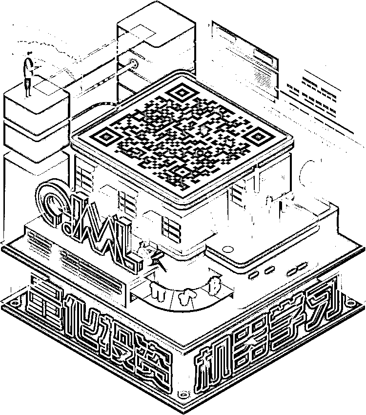

# 【年度系列】实战交易策略的精髓（公众号深度呈现）

> 原文：[`mp.weixin.qq.com/s?__biz=MzAxNTc0Mjg0Mg==&mid=2653289447&idx=1&sn=f2948715bf82569a6556d518e56c1f9e&chksm=802e39f2b759b0e4502d1aaac562b87789573b55c76b3c85897d8c9d88dbf9a0b7ee34d86a4e&scene=27#wechat_redirect`](http://mp.weixin.qq.com/s?__biz=MzAxNTc0Mjg0Mg==&mid=2653289447&idx=1&sn=f2948715bf82569a6556d518e56c1f9e&chksm=802e39f2b759b0e4502d1aaac562b87789573b55c76b3c85897d8c9d88dbf9a0b7ee34d86a4e&scene=27#wechat_redirect)

本期作者：公众号团队 | Song

本期编辑：公众号团队 | 1+1=3

这篇推文的核心词汇是**交易****。**通过自问自答的形式记呈现给大家，没有繁杂的公式，绚丽的图表，都是淳朴的文字，但却是通过多年实战交易所得的经验。希望大家能够认真阅读这篇文章。同时也欢迎大家在文末**留言区**留言，与我们一起讨论交流。

**未经允许，禁止转载**

**【问题一】交易系统的构成？**

广义上来讲交易系统由逻辑构成，这里的逻辑分为两部分，**其中一部分是基于对市场的分析**，比如趋势交易进场的逻辑，**还有一部分是规则性的内容**，这部分内容要和交易者的心智相辅相成，比如止盈的幅度，仓位的大小，加仓的次数。我们可以概括的说，交易系统就是由逻辑和规则组成，逻辑是经市场检验的真理，而规则是交易者在交易前定下的原则，根据这个原则可以更好的使系统与交易者进行配合，提高执行力。**说白了，这些规则你用着舒服，在关键的时候不至于让你乱了阵脚导致丧失执行力。其实也就是你的脾气和你的系统是一个整体！**

**【问题二】怎么理解市场的不确定性与交易系统之间的关系？**

首先，我们必须要承认市场是不确定的，但不确定并不意味着完全随机或者是完全无序。**交易系统对于市场的不确定性，就是一种“以不变应万变”的存在。这里的不变是指“核心盈利逻辑”的不变，但是某些规则或是参数是可以改变的。****这里的核心逻辑必须符合市场在不确定性中表现出来的一些确定性，所以交易系统的研究不能一贯的拟合过去的数据，而要分清哪些是该盈利的部分，哪些是该亏损的部分，该盈利的部分有多少收益，改亏损的部分有多少损失，不要一贯的去追求对错与胜率。**

**【问题三】什么是策略逻辑？**

逻辑应该是市场表现出来的确定性，是策略盈利部分的必要非充分条件。也就是说**有了逻辑不一定盈利，但没有逻辑一定不盈利**。趋势策略的核心逻辑应该是从上至下，也就是从逻辑到数据（参数、周期等），逻辑和数据之间应该相辅相成，不一定谁一定要迁就谁，走得到一起就走，走不到一起就散，强扭的瓜不甜；趋势策略的研究不应从下至上，从数据去倒退逻辑，就有点本末倒置了，核心逻辑讲不通，赚钱也赚的不明确，亏钱更是不明所以。逻辑就是策略的核心盈利点，交易策略是交易逻辑的具体体现。如果说交易逻辑是战略，那么交易策略是战术，具体的交易计划就是具体的操作指引。 

**【问题四】什么是逻辑出场？**

**进场逻辑与出场逻辑应该相呼应，相对独立，但不能完全割裂**。进场后，如果进场逻辑被打破，就应该出场（或者减仓）；如果反向进场逻辑成立，不仅应该出场，还要反手；如果进场信号再一次出现，就应该加仓。

**【问题五】止损止盈出场？怎么样才有意义？**

上面我们说了逻辑出场的部分，出场不应该只有逻辑出场，还有止损止盈出场。逻辑出场属于策略系统，止损止盈属于资管系统（风控系统）。**止损止盈的参数设置要符合一定的原则，也是先有逻辑，后有参数。**

首先，初始止损的逻辑是什么？初始止损也是试错性止损，可以看作这笔交易的风险成本。其至少要过滤掉正常的行情波动，也就是说如果行情反向移动超过了近期绝大部分波动的范围，我们就认为市场没证明我们是正确的，趋势可能没来。怎么确定是正常的行情波动？可以通过一些统计的方法，比如波动幅度的分位数（如标准差，TR）。如果价格打到初始止损，那至少说明市场没证明你是正确的（但市场也没有证明你是错误的），这时候就应该出场观望（源自幽灵的礼物规则一）。

进场盈利后怎么止盈？进场盈利说明至少抓住了趋势，能抓多久，能抓多少，就是资金管理和策略系统共同的作用了。经常有人说做趋势不能看浮盈，掐头去尾可能就不剩多少了。是的“掐头”讲的是入场点的早晚，这个跟指标敏感程度有关，越敏感进的越早，错误的可能性也越大，出场就可能越早；但是“去尾”不仅跟指标有关（逻辑出场），还跟整个策略的风控与资管有关（止损止盈），所以“去尾”提升的余地及方法要比“掐头”来的多，但前提都必须建立在有逻辑有意义的基础上，存粹的数据优化与拟合是没有意义的。**我们知道趋势不常见，一旦遇到就要狠狠的“捞一把”，所以扩大收益最常见的方法就是趋势过程中加仓。**但是无规则的加仓会带来很大的风险，所以在市场中的任何操作都要有据可循包括加仓，加仓一般是行情对之前的进场逻辑进行了进一步的确认。

**【问题六】什么是逻辑闭环？**

单品种单策略中，从进场到出场的所有环节都要符合策略的逻辑及既定的原则，我们称之为逻辑闭环。行情发展的每种可能都在策略的考量范围之内，且都有为之对应的有据可循的处理方法，我们称之为逻辑闭环。比如说进场，要符合进场逻辑。进场后，价格逆向异常波动，那就要止损。进场后，进场逻辑被打破了，那就要出场。进场逻辑被验证了，那就要加仓。进场逻辑被打破，反向进场逻辑被验证，那就要反手。加仓后，盈利达到预期了，就要止盈。这就是一个逻辑闭环，**其中每个环节都在交易前事先计划好，行情的任何不确定性都在交易系统确定性的把握之下**，剩下的无非就是执行。 

**【问题七】怎么选参数？参数和交易逻辑之间有什么关系？**

**先完善逻辑，再优化参数，逻辑为主，参数为辅**。参数是逻辑表达的具体体现。不同的条件，不同的参数，都必须有意义。这里的意义，就是不能违背策略的整体交易逻辑，不能与策略的核心盈利点背道而驰。**在逻辑框架确定的时候，一切参数或条件都要以不违背策略逻辑为前提。**

**【问题八】怎么评价趋势策略？**

**怎么判断策略是否有改进，新增的条件或参数是好还是不好？ **

借用前辈夏宇的话语：**趋势策略的衡量标准主要看能否抓住趋势中合理的部分，并且抵御趋势结束时的变化，且能够在长期横盘的时候不受盘面震荡的冲击。**

**推荐阅读**

[1、经过多年交易之后你应该学到的东西（深度分享）](https://mp.weixin.qq.com/s?__biz=MzAxNTc0Mjg0Mg==&mid=2653289074&idx=1&sn=e859d363eef9249236244466a1af41b6&chksm=802e3867b759b1717f77e07a51ee5671e8115130c66562577280ba1243cba08218add04f1f00&token=449379994&lang=zh_CN&scene=21#wechat_redirect)

[2、监督学习标签在股市中的应用（代码+书籍）](https://mp.weixin.qq.com/s?__biz=MzAxNTc0Mjg0Mg==&mid=2653289050&idx=1&sn=60043a5c95b877dd329a5fd150ddacc4&chksm=802e384fb759b1598e500087374772059aa21b31ae104b3dca04331cf4b63a233c5e04c1945a&token=449379994&lang=zh_CN&scene=21#wechat_redirect)

[3、2018 年学习 Python 最好的 5 门课程](https://mp.weixin.qq.com/s?__biz=MzAxNTc0Mjg0Mg==&mid=2653289028&idx=1&sn=631cbc728b0f857713fc65841e48e5d1&chksm=802e3851b759b147dc92afded432db568d9d77a1b97ef22a1e1a376fa0bc39b55781c18b5f4f&token=449379994&lang=zh_CN&scene=21#wechat_redirect)

[4、全球投行顶尖机器学习团队全面分析](https://mp.weixin.qq.com/s?__biz=MzAxNTc0Mjg0Mg==&mid=2653289018&idx=1&sn=8c411f676c2c0d92b0dd218f041bee4b&chksm=802e382fb759b139ffebf633ac14cdd0f21938e4613fe632d5d9231dab3d2aca95a11628378a&token=449379994&lang=zh_CN&scene=21#wechat_redirect)

[5、使用 Tensorflow 预测股票市场变动](https://mp.weixin.qq.com/s?__biz=MzAxNTc0Mjg0Mg==&mid=2653289014&idx=1&sn=3762d405e332c599a21b48a7dc4df587&chksm=802e3823b759b135928d55044c2729aea9690f86752b680eb973d1a376dc53cfa18287d0060b&token=449379994&lang=zh_CN&scene=21#wechat_redirect)

[6、被投资圈残害的清北复交学生们](https://mp.weixin.qq.com/s?__biz=MzAxNTc0Mjg0Mg==&mid=2653289110&idx=1&sn=538d00046a15fb2f70a56be79f71e6b9&chksm=802e3883b759b1950252499ea9a7b1fadaa4748ec40b8a1a8d7da0d5c17db153bd86548060fb&token=1336933869&lang=zh_CN&scene=21#wechat_redirect)

[7、使用 LSTM 预测股票市场基于 Tensorflow](https://mp.weixin.qq.com/s?__biz=MzAxNTc0Mjg0Mg==&mid=2653289238&idx=1&sn=3144f5792f84455dd53c27a78e8a316c&chksm=802e3903b759b015da88acde4fcbc8547ab3e6acbb5a0897404bbefe1d8a414265d5d5766ee4&token=2020206794&lang=zh_CN&scene=21#wechat_redirect)

[8、手把手教你用 Numpy 构建神经网络(附代码)](https://mp.weixin.qq.com/s?__biz=MzAxNTc0Mjg0Mg==&mid=2653289274&idx=1&sn=f40be8372658c2c79fdd47c03d62e037&chksm=802e392fb759b039435fc6700ef5d45142cdfe72234586bd8de9b8dfabcc3264f2ae826def80&token=1003651614&lang=zh_CN&scene=21#wechat_redirect)

[9、判断哪些输入特征对神经网络是重要的](https://mp.weixin.qq.com/s?__biz=MzAxNTc0Mjg0Mg==&mid=2653289289&idx=1&sn=7c6cf3ed7f4f2859a0e95bc87914814c&chksm=802e395cb759b04adcee6afc1d44ffa2f3ceac2137796dad4ee9c51cdb165ce3463258647a3c&token=1972390229&lang=zh_CN&scene=21#wechat_redirect)

[10、美丽的回测——教你定量计算过拟合概率](https://mp.weixin.qq.com/s?__biz=MzAxNTc0Mjg0Mg==&mid=2653289314&idx=1&sn=87c5a12b23a875966db7be50d11f09cd&chksm=802e3977b759b061675d1988168c1fec06c602e8583fbcc9b76f87008e0c10b702acc85467a0&token=1972390229&lang=zh_CN&scene=21#wechat_redirect)

