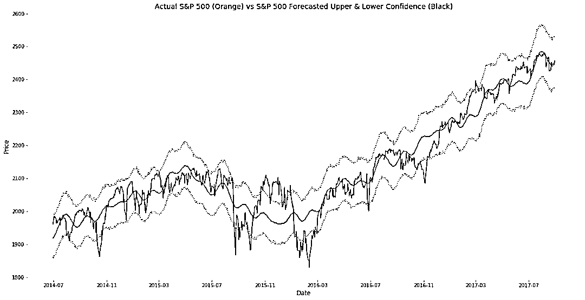

# 我用 Facebook 开源神器 Prophet，预测股市行情基于 Python（系列 2）

> 原文：[`mp.weixin.qq.com/s?__biz=MzAxNTc0Mjg0Mg==&mid=2653289437&idx=1&sn=f0dca7da8e69e7ba736992cb3d034ce7&chksm=802e39c8b759b0de5bce401c580623d0729ecca69d13926479d36e19aff8c9c9e8a20265afff&scene=27#wechat_redirect`](http://mp.weixin.qq.com/s?__biz=MzAxNTc0Mjg0Mg==&mid=2653289437&idx=1&sn=f0dca7da8e69e7ba736992cb3d034ce7&chksm=802e39c8b759b0de5bce401c580623d0729ecca69d13926479d36e19aff8c9c9e8a20265afff&scene=27#wechat_redirect)


本期作者：Eric Brown

本期编辑：Allen | 崙

## **系列 1：**[***我用 Facebook 开源神器 Prophet，预测时间序列基于 Python***](https://mp.weixin.qq.com/s?__biz=MzAxNTc0Mjg0Mg==&mid=2653289394&idx=1&sn=24a836136d730aa268605628e683d629&chksm=802e39a7b759b0b1dcf7aaa560699130a907716b71fc9c45ff0e5d236c5ae8ef80ebdb09dbb6&token=1940764322&lang=zh_CN&scene=21#wechat_redirect)

数据基于标普 500 指数：

```py
import pandas as pd
import numpy as np
from fbprophet import Prophet
import matplotlib.pyplot as plt

%matplotlib inline

plt.rcParams['figure.figsize']=(20,10)
plt.style.use('ggplot')
```

```py
market_df = pd.read_csv('../examples/SP500.csv', index_col='DATE', parse_dates=True)
df = market_df.reset_index().rename(columns={'DATE':'ds', 'SP500':'y'})
df['y'] = np.log(df['y'])

#lets take a look at our data quickly
df.set_index('ds').y.plot()
```


**运行 Prophet**

```py
model = Prophet()
model.fit(df);
future = model.make_future_dataframe(periods=366)
forecast = model.predict(future)
```

Prophet 已经创建了所需的模型并匹配数据。Prophet 在默认情况下为我们创建了变化点并将它们存储在.changepoints 中。默认情况下，Prophet 在初始数据集的 80%中添加了 25 个变化点。在初始化 prophet 时，可以使用 n_changepoints 参数更改点的数量（例如，model= prophet (n_changepoints=30)）

```py
model.changepoints
```

```py
70     2009-03-20
141    2009-07-01
211    2009-10-09
281    2010-01-21
352    2010-05-04
422    2010-08-12
492    2010-11-19
563    2011-03-04
633    2011-06-14
703    2011-09-22
774    2012-01-04
844    2012-04-16
914    2012-07-25
984    2012-11-05
1055   2013-02-19
1125   2013-05-30
1195   2013-09-09
1266   2013-12-18
1336   2014-04-01
1406   2014-07-11
1477   2014-10-21
1547   2015-02-02
1617   2015-05-13
1688   2015-08-24
1758   2015-12-02
Name: ds, dtype: datetime64[ns]
```

除了查看变化点的日期之外，我们还可以查看添加了变化点的图表：

```py
figure = model.plot(forecast)
for changepoint in model.changepoints:
    plt.axvline(changepoint,ls='--', lw=1)
```


看看上面图表中可能的变化点，我们可以看到它们与一些高点和低点非常吻合。你还可以使用以下代码查看这个可视化：

```py
deltas = model.params['delta'].mean(0)
fig = plt.figure(facecolor='w')
ax = fig.add_subplot(111)
ax.bar(range(len(deltas)), deltas)
ax.grid(True, which='major', c='gray', ls='-', lw=1, alpha=0.2)
ax.set_ylabel('Rate change')
ax.set_xlabel('Potential changepoint')
fig.tight_layout()
```


从上面的图表中我们可以看到，有相当多的变化点在 10 到 20 之间，它们的幅度非常小，在预测中最容易被忽视。

现在，如果我们知道过去的趋势发生了什么变化，我们可以将这些已知的变化点添加到 dataframe 中。对于这些数据，注：事实上，低或高并不意味着它是一个真正的变化点或趋势变化，但让我们假设它是。

```py
m = Prophet(changepoints=['2009-03-09', '2010-07-02', '2011-09-26', '2012-03-20', '2010-04-06'])
forecast = m.fit(df).predict(future)
m.plot(forecast)

figure = m.plot(forecast)
for changepoint in m.changepoints:
    plt.axvline(changepoint,ls='--', lw=1)
```


我们可以看到，通过手动设置我们的变化点与使用自动检测变化点相比，我们对模型进行了巨大的更改。除非你非常确定过去的趋势变化点，最好使用 Prophet 提供的默认值。 

Prophet 对趋势变化点的使用是非常棒的，特别是那些信号/数据集在信号的生命周期中有显著的变化。也就是说，除非你能确定你的变化点，否则最好让 Prophet 自动去完成。

**预测市场**

还是使用标普 500 指数：

```py
df = market_df.reset_index().rename(columns={'DATE':'ds', 'SP500':'y'})
df['y'] = np.log(df['y'])

model = Prophet()
model.fit(df);
future = model.make_future_dataframe(periods=365) #forecasting for 1 year from now.
forecast = model.predict(future)

figure=model.plot(forecast)
```


根据现有的数据，很难看出预测（蓝线）和实际数据（黑点）的关系。让我们看一下过去 800 个数据点（大约 2 年）的预测和实际预测，而不看未来的预测：

```py
two_years = forecast.set_index('ds').join(market_df)
two_years = two_years[['SP500', 'yhat', 'yhat_upper', 'yhat_lower' ]].dropna().tail(800)
two_years['yhat']=np.exp(two_years.yhat)
two_years['yhat_upper']=np.exp(two_years.yhat_upper)
two_years['yhat_lower']=np.exp(two_years.yhat_lower)
two_years[['SP500', 'yhat']].plot()
```


你可以从上面的图表中看到，预测很好地遵循了趋势，但似乎不太擅长捕捉市场的“波动”。如果我们对“顺应趋势”，而不是试图完美地把握高峰和低谷，这对我们来说可能是件好事。

让我们来看看一些测量准确度的方法：

```py
two_years_AE = (two_years.yhat - two_years.SP500)
print two_years_AE.describe()

count    800.000000
mean      -0.540173
std       47.568987
min     -141.265774
25%      -29.383549
50%       -1.548716
75%       25.878416
max      168.898459
dtype: float64
```

再来看看一些更精确的测量方法。使用 sklearn 的 r2_score 函数的 R-squared：

```py
r2_score(two_years.SP500, two_years.yhat)
0.90563333683064451
```

R-squared 看起来不错，在任何第一轮建模中，都会取 0.9。

现在我们来看看均值平方误差：

```py
mean_squared_error(two_years.SP500, two_years.yhat)
2260.2718233576029
```

现在，让我们看看平均绝对误差（MAE）。能让我们更好地了解错误率，而不是标准平均值。

```py
mean_absolute_error(two_years.SP500, two_years.yhat)
36.179476001483771
```

MAE 还告诉我们，通过 Prophet 预测交易并不理想。

另一种查看该预测有效性的方法是根据实际值绘制预测的上置信区间和下置信区间。可以通过绘制 yhat_upper 和 yhat_lower 来实现。

```py
fig, ax1 = plt.subplots()
ax1.plot(two_years.SP500)
ax1.plot(two_years.yhat)
ax1.plot(two_years.yhat_upper, color='black',  linestyle=':', alpha=0.5)
ax1.plot(two_years.yhat_lower, color='black',  linestyle=':', alpha=0.5)

ax1.set_title('Actual S&P 500 (Orange) vs S&P 500 Forecasted Upper & Lower Confidence (Black)')
ax1.set_ylabel('Price')
ax1.set_xlabel('Date')
```



你不能从这张图表中看出任何可以量化的东西，但你可以对预测的价值做出判断。如果你想做短线交易（1 天到几周），这个预测几乎是无用的，但是如果你的投资时间是几个月到几年，这个预测可能会提供一些价值，以更好地了解市场的趋势和预测的趋势。

让我们回过头来看看实际的预测，看看它是否能告诉我们一些与预测和实际数据不同的东西。

```py
fig, ax1 = plt.subplots()
ax1.plot(full_df.SP500)
ax1.plot(full_df.yhat, color='black', linestyle=':')
ax1.fill_between(full_df.index, np.exp(full_df['yhat_upper']), np.exp(full_df['yhat_lower']), alpha=0.5, color='darkgray')
ax1.set_title('Actual S&P 500 (Orange) vs S&P 500 Forecasted (Black) with Confidence Bands')
ax1.set_ylabel('Price')
ax1.set_xlabel('Date')

L=ax1.legend() 
L.get_texts()[0].set_text('S&P 500 Actual') 
L.get_texts()[1].set_text('S&P 5600 Forecasted')
```


这个图比默认的 Prophet 表图容易理解。我们可以看到，在实际价值和预测的历史中，Prophet 做了一个不错的预测但是在市场变得非常不稳定的时候，它的表现很一般。

具体看一下未来的预测，Prophe 告诉我们市场将继续上升，在预测期结束时应该在 2750 左右，区间从 2000 到 4000 左右。也许我们可以更准确地使用每周或每月的数据预测。

**推荐阅读**

[1、经过多年交易之后你应该学到的东西（深度分享）](https://mp.weixin.qq.com/s?__biz=MzAxNTc0Mjg0Mg==&mid=2653289074&idx=1&sn=e859d363eef9249236244466a1af41b6&chksm=802e3867b759b1717f77e07a51ee5671e8115130c66562577280ba1243cba08218add04f1f00&token=449379994&lang=zh_CN&scene=21#wechat_redirect)

[2、监督学习标签在股市中的应用（代码+书籍）](https://mp.weixin.qq.com/s?__biz=MzAxNTc0Mjg0Mg==&mid=2653289050&idx=1&sn=60043a5c95b877dd329a5fd150ddacc4&chksm=802e384fb759b1598e500087374772059aa21b31ae104b3dca04331cf4b63a233c5e04c1945a&token=449379994&lang=zh_CN&scene=21#wechat_redirect)

[3、2018 年学习 Python 最好的 5 门课程](https://mp.weixin.qq.com/s?__biz=MzAxNTc0Mjg0Mg==&mid=2653289028&idx=1&sn=631cbc728b0f857713fc65841e48e5d1&chksm=802e3851b759b147dc92afded432db568d9d77a1b97ef22a1e1a376fa0bc39b55781c18b5f4f&token=449379994&lang=zh_CN&scene=21#wechat_redirect)

[4、全球投行顶尖机器学习团队全面分析](https://mp.weixin.qq.com/s?__biz=MzAxNTc0Mjg0Mg==&mid=2653289018&idx=1&sn=8c411f676c2c0d92b0dd218f041bee4b&chksm=802e382fb759b139ffebf633ac14cdd0f21938e4613fe632d5d9231dab3d2aca95a11628378a&token=449379994&lang=zh_CN&scene=21#wechat_redirect)

[5、使用 Tensorflow 预测股票市场变动](https://mp.weixin.qq.com/s?__biz=MzAxNTc0Mjg0Mg==&mid=2653289014&idx=1&sn=3762d405e332c599a21b48a7dc4df587&chksm=802e3823b759b135928d55044c2729aea9690f86752b680eb973d1a376dc53cfa18287d0060b&token=449379994&lang=zh_CN&scene=21#wechat_redirect)

[6、被投资圈残害的清北复交学生们](https://mp.weixin.qq.com/s?__biz=MzAxNTc0Mjg0Mg==&mid=2653289110&idx=1&sn=538d00046a15fb2f70a56be79f71e6b9&chksm=802e3883b759b1950252499ea9a7b1fadaa4748ec40b8a1a8d7da0d5c17db153bd86548060fb&token=1336933869&lang=zh_CN&scene=21#wechat_redirect)

[7、使用 LSTM 预测股票市场基于 Tensorflow](https://mp.weixin.qq.com/s?__biz=MzAxNTc0Mjg0Mg==&mid=2653289238&idx=1&sn=3144f5792f84455dd53c27a78e8a316c&chksm=802e3903b759b015da88acde4fcbc8547ab3e6acbb5a0897404bbefe1d8a414265d5d5766ee4&token=2020206794&lang=zh_CN&scene=21#wechat_redirect)

[8、手把手教你用 Numpy 构建神经网络(附代码)](https://mp.weixin.qq.com/s?__biz=MzAxNTc0Mjg0Mg==&mid=2653289274&idx=1&sn=f40be8372658c2c79fdd47c03d62e037&chksm=802e392fb759b039435fc6700ef5d45142cdfe72234586bd8de9b8dfabcc3264f2ae826def80&token=1003651614&lang=zh_CN&scene=21#wechat_redirect)

[9、判断哪些输入特征对神经网络是重要的](https://mp.weixin.qq.com/s?__biz=MzAxNTc0Mjg0Mg==&mid=2653289289&idx=1&sn=7c6cf3ed7f4f2859a0e95bc87914814c&chksm=802e395cb759b04adcee6afc1d44ffa2f3ceac2137796dad4ee9c51cdb165ce3463258647a3c&token=1972390229&lang=zh_CN&scene=21#wechat_redirect)

[10、美丽的回测——教你定量计算过拟合概率](https://mp.weixin.qq.com/s?__biz=MzAxNTc0Mjg0Mg==&mid=2653289314&idx=1&sn=87c5a12b23a875966db7be50d11f09cd&chksm=802e3977b759b061675d1988168c1fec06c602e8583fbcc9b76f87008e0c10b702acc85467a0&token=1972390229&lang=zh_CN&scene=21#wechat_redirect)

