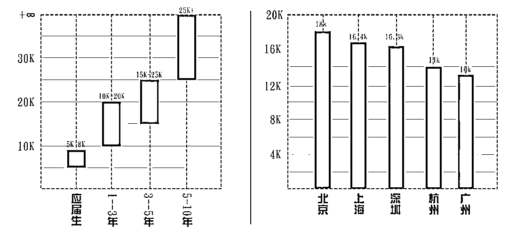
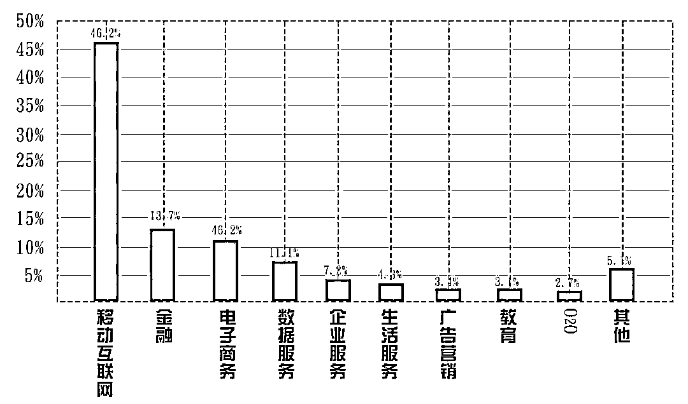
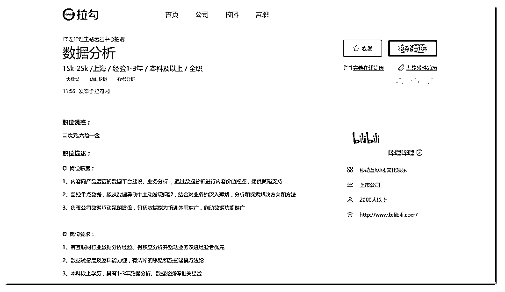
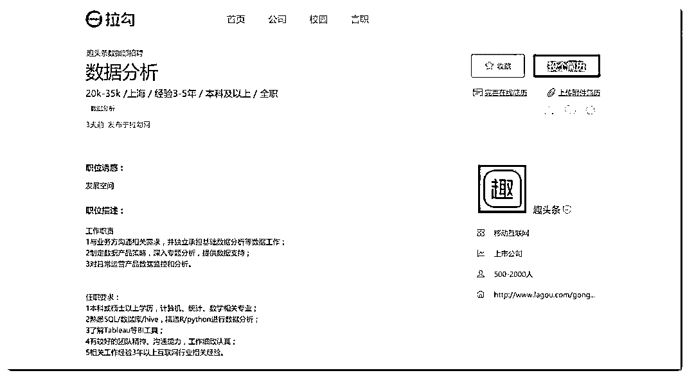
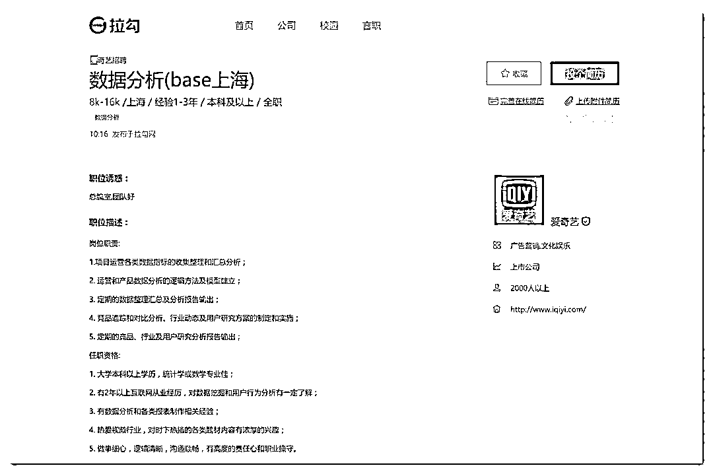
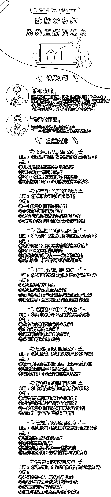
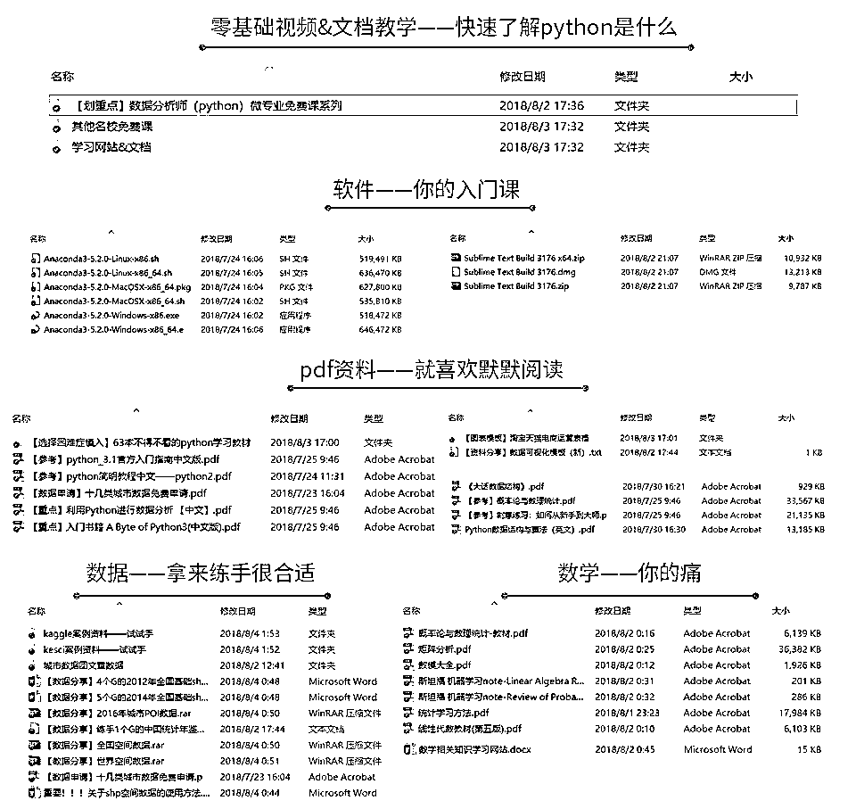

# 如何拿到高薪数据分析师 offer？从精准解读一篇招聘信息开始！

> 原文：[`mp.weixin.qq.com/s?__biz=MzAxNTc0Mjg0Mg==&mid=2653289418&idx=1&sn=e20e4ce633f4b74f59328a72c6c7c5c9&chksm=802e39dfb759b0c99852104e99f62f19e07f69e580cab3fd2f9332de3d09c121ecf852ed7a0c&scene=27#wechat_redirect`](http://mp.weixin.qq.com/s?__biz=MzAxNTc0Mjg0Mg==&mid=2653289418&idx=1&sn=e20e4ce633f4b74f59328a72c6c7c5c9&chksm=802e39dfb759b0c99852104e99f62f19e07f69e580cab3fd2f9332de3d09c121ecf852ed7a0c&scene=27#wechat_redirect)

大家好，我是大鹏，目前是一名数据分析师，从非本专业成功转行，创立“数据团学社”“城市数据研习社”，运营数十万人社群，联合发起“城市数据团”。

最近有很多学弟学妹咨询我入行数据分析师的情况。**总体上说，我是非常建议大家尝****试数据分析工作的。主要原因是数据分析师相比于传统型工作岗位有很大的优势。** 

概括来说，有以下几方面：

**行业前景好**

伴随着**大数据**、**云计算**、**人工智能**、**无人驾驶**等技术的飞速发展，我们已经从 IT 时代步入了 DT 时代，各行各业都需要与数据结合。

国际知名数据公司 IDC 预测：到 2020 年，企业基于大数据分析的支出，将突破 5000 亿美元。**行业的快速发展为数据分析师提供了广阔的舞台。**

**人才需求大**

数据行业的快速发展带来了旺盛的数据人才需求。有报告指出，数据分析师已成当下中国互联网行业需求最旺盛的六类人才岗位之一；但数据人才的供给却严重不足，**至 2025 年，全球数据人才缺口将达到 1400 万，我国数据人才缺口将达到 200 万**。

从 2016 年开始，我国已经陆续有近 300 多所高校公布将开设“数据科学与大数据技术”专业来培养数据人才。

**薪资水平高**

通过整理拉勾、智联等网站上数据分析师岗位的薪资水平可以发现：**数据分析师的月薪在 14K 左右**。

但是不同城市和不同工作年限的薪资差别较大，基本随着工作经验的增加，薪资也会快速增长，这也说明数据分析师岗位有很大的提升空间；从城市来看，北上深等一线城市的薪资相对较高。

不同工作经验数据分析师薪资分析&不同城市薪资分析

**企业选择多**

同样通过分析拉勾、智联等招聘网站上的数据分析师岗位可以了解到：**招聘数据分析师的企业非常多样，无论是新兴互联网企业还是传统企业都需要招聘数据分析师来处理企业数据**，这也说明了数据技能广泛的行业适用性。

从企业的类型来看，移动互联网企业对数据分析师的需求最大，金融、电子商务次之。

**不同类型企业数据分析师招聘占比分析图**

通过上面的相关数据可以看到数据分析师岗位前景好，现在入行恰逢其时。但是相信你肯定有这样的疑问：**企业对数据分析师有什么招聘要求？我需要学习什么技能才能达到招聘要求？**

对于大家的疑问，在当年我入行数据分析师的时候同样遇到过，后来我发现其实**企业的要求就写在招聘信息中，读懂了招聘信息也就读懂了就业这个人生大考的考题**。下面就让我们来看几个拉勾网中关于数据分析师的招聘信息：

◆ 1 ◆

◆ 2 ◆

◆ 3 ◆

看到上面的招聘信息，你可能又一头雾水，招聘信息上写的都是什么鬼，我怎么看不懂！

 “**运营和产品数据分析的逻辑方法及模型建****立**”是什么意思？

“**竞品追踪和对比分析、行业动态及用户研究方案的制定和实施**”具体做什么？

企业要求**“本科以上学历，具有 1-3 年数据分析、数据挖掘相关经验**”，而我是应届毕业生，还能不能投简历？

..........

企业到底招收什么样的数据分析师？

如果你也对招聘信息很困惑，请不用担心，**来参加 11 月 8 日的免费直播，将详细为您解答如何解读一份招聘信息，解读数据分析师岗位****需求。**

** 免 费 直 播 课**

酣畅淋漓的学习计划

**9 场直播带你入门数据分析**

入群更有大量福利等你来拿，包括：

** 答疑助力 **

**加入讨论群提前和老师直接交流**

你在 Python 学习中可能遇到的坑，我们都替你踩过了~行业从业疑问？学习遇到 bug？从零开始学 Python 都有哪些坑？有疑问，有困难，请过来大胆提问！

** 6G 学习资料包 **

** 获取方式 **

扫描海报中二维码即可领取

**QQ 群号：922679433**

**点击阅读原文，领取免费福利！**