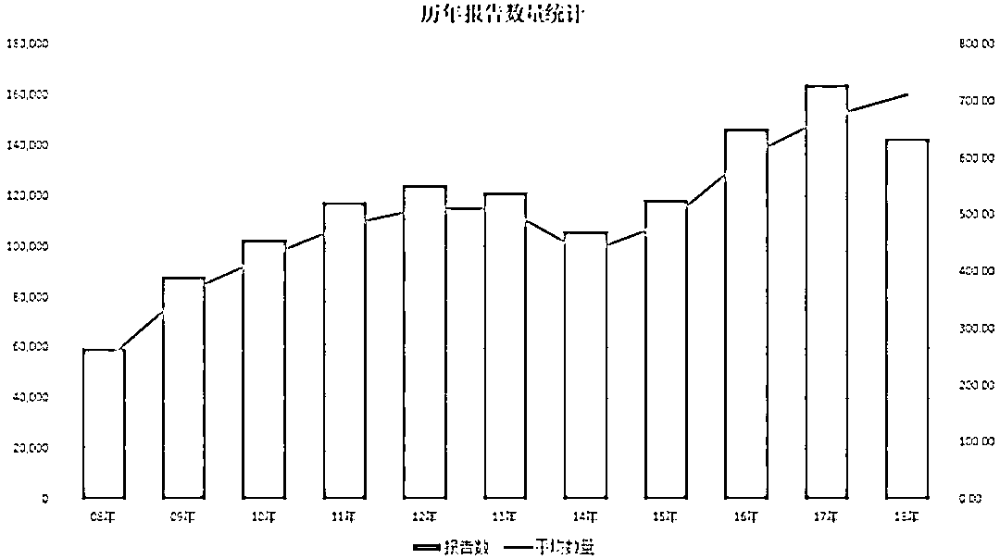
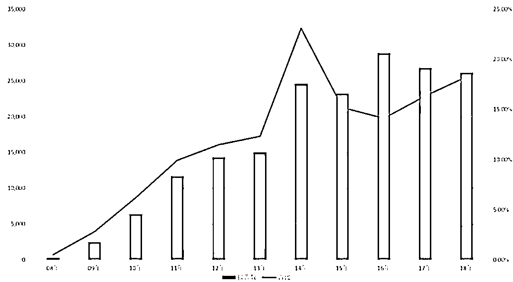
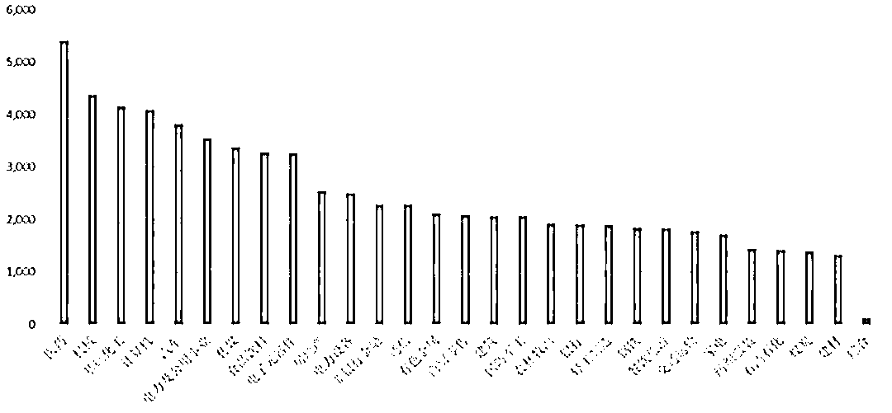
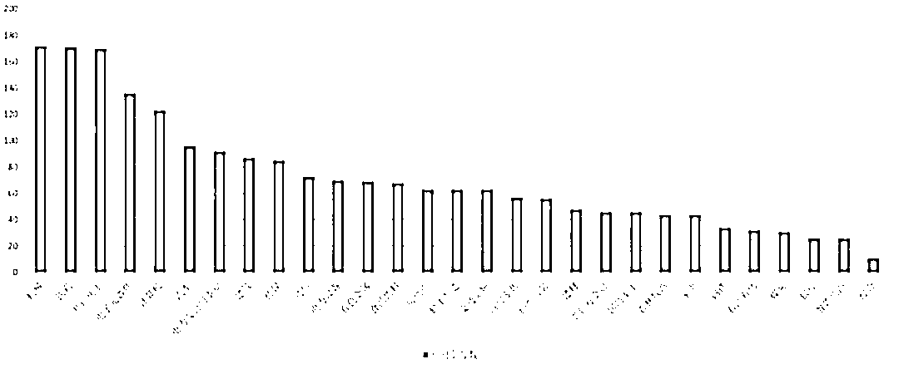
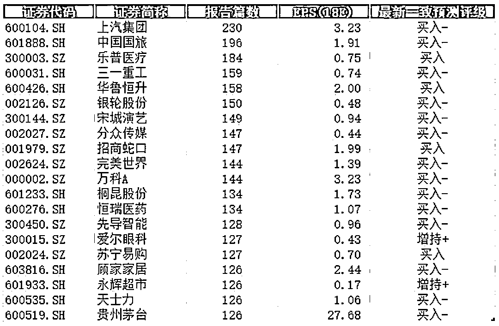
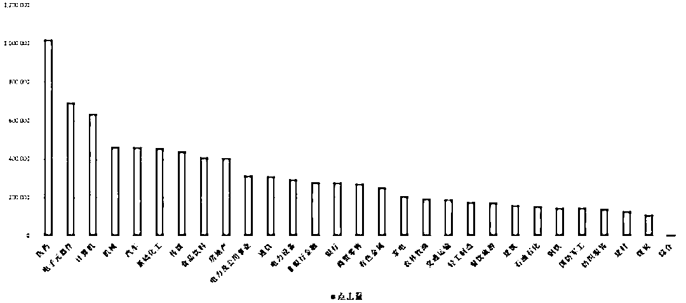
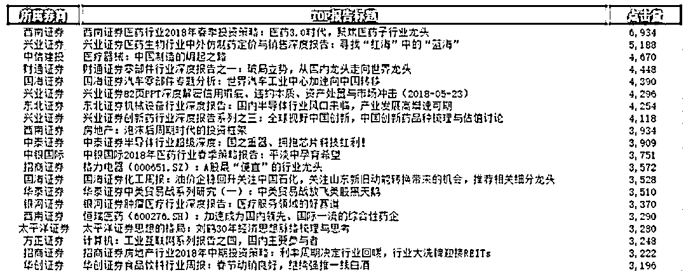
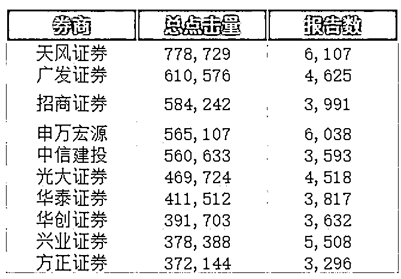

# 【重磅】每天 700+份分析师研报，到底哪些买方在看？

> 原文：[`mp.weixin.qq.com/s?__biz=MzAxNTc0Mjg0Mg==&mid=2653289407&idx=1&sn=2574229b5fc9452f6462c6e0290b3796&chksm=802e39aab759b0bc3cff974919ad66ee5075cbe5973acfe23688c4c117b8b0936acba3594c60&scene=27#wechat_redirect`](http://mp.weixin.qq.com/s?__biz=MzAxNTc0Mjg0Mg==&mid=2653289407&idx=1&sn=2574229b5fc9452f6462c6e0290b3796&chksm=802e39aab759b0bc3cff974919ad66ee5075cbe5973acfe23688c4c117b8b0936acba3594c60&scene=27#wechat_redirect)

文章来源：Wind 资讯授权

[**推荐干货：****2018 第三季度最受欢迎的券商金工研报前 50**](https://mp.weixin.qq.com/s?__biz=MzAxNTc0Mjg0Mg==&mid=2653289358&idx=1&sn=db6e8ab85b08f6e67790ec0e401e586e&chksm=802e399bb759b08d6eec855f9901ea856d0da68c7425cba62791b8948da6ad761a3d88543dad&token=1972390229&lang=zh_CN&scene=21#wechat_redirect)

**正文**

随着三季报的披露结束，一年的 3/4 已经过去了，各大券商研究所人员每日马不停蹄奔跑于不同城市之间，向市场递自己的观点、发布各类投资策略报告。根据 Wind 统计，自 2008 年至 2017 年，年产研报量由 5.9 万份攀升至 16.4 万份，涨幅达 3 倍。进入 2018 年以来，虽然沪深市场的走势疲软，可是卖方分析师仍然笔耕不辍，每天全市场发布的研报产量超 710 份。

但研报数量剧增的同时，研报的研值似乎停滞不前。买方苦于不能通过每天众多报告中找到最有价值的投资标的。卖方苦于不知道买方重点关注的板块。

**研报**

近 10 年来，研报的数量在与年俱增。根据<ai type="2" parm="{&quot;companycode&quot;:&quot;1002502502&quot;}">Wind 数据</ai>显示，其收录的研报包括宏观研究、投资策略、行业研究、公司研究、晨会报告、基金研究等 12 个主题。自 2008 年至 2017 年市场上的研报由 5.9 万份攀升至 16.4 万份，其中 2016 年至 2017 年连续 2 年研报数量均超过 14 万份。 

**自 2018 年以来截至 10 月 30 日已产出研报 14.2 万份。这意味着 2008 年平均每天产出研报由 242 份飙升至 2017 年的 672 份，涨幅达 3 倍。2018 年以来平均每天研报数量为 710 份。**

从发布机构来看，大型券商仍然是贡献研报数量的主力军。以 2018 年为例，<ai type="6" parm="{&quot;otherinfo&quot;:&quot;A&quot;}">**中信证券**</ai>共对外发布研报达**6824**份，其次为<ai type="6" parm="{&quot;otherinfo&quot;:&quot;A&quot;}">**天风证券**</ai>、<ai type="6" parm="{&quot;otherinfo&quot;:&quot;A&quot;}">**申万宏源**</ai>年产研报分别是**6038**、**5926**份。

虽然研报数量逐年上涨带来内容的重复，但与此同时研报的“研值”成为市场关注的焦点。在数量剧增的同时，高质量、深度研报的缺乏日益成为市场关注的焦点。当前研究报告最大的问题是跟踪研究，顺势发声音的研究占比过重，深入的研究、高质量的研报比较少。

根据 Wind 数据统计，**18 年超过 20 页的深度研报，共发布了 26134 篇**，占当年发布总研报数量的 18.27%。具体而言，以 2015 年~2017 年为例，研报页数超过 20 页的达 23189、28897、26781 份，分别占当年总体研报数量的 15%、14%、16%。

从研报类型来分析，个股研报仍然占主导地位，18 年全年共发布 63722 篇，共覆盖了 2101 只沪深股票，其中**医药行业****的个股报告篇数最多**，高达 5405 篇。**预测个股****最多的行业是****机械****，共有 172 只个股被卖方预测分析过**。

被**机构预测次数最多的个股**是<ai type="6" parm="{&quot;otherinfo&quot;:&quot;A&quot;}">**上汽集团**</ai>**(600104.SH)**，共有 230 篇报告预测评级过该个股。

**点击量篇**

截止到 18 年 10 月，通过 Wind 终端，共有 476,101 个买方用户，共查阅 97,617 篇报告，阅读次数有 11,945,334 次。**其中买方用户关注度最高的报告主题是个股报告，尤其是****医****药****行业****的个股报告，是最受买方关注的。**

**点击量 TOP20 的报告**

**总点击量的机构 TOP10**

**推荐阅读**

[1、经过多年交易之后你应该学到的东西（深度分享）](https://mp.weixin.qq.com/s?__biz=MzAxNTc0Mjg0Mg==&mid=2653289074&idx=1&sn=e859d363eef9249236244466a1af41b6&chksm=802e3867b759b1717f77e07a51ee5671e8115130c66562577280ba1243cba08218add04f1f00&token=449379994&lang=zh_CN&scene=21#wechat_redirect)

[2、监督学习标签在股市中的应用（代码+书籍）](https://mp.weixin.qq.com/s?__biz=MzAxNTc0Mjg0Mg==&mid=2653289050&idx=1&sn=60043a5c95b877dd329a5fd150ddacc4&chksm=802e384fb759b1598e500087374772059aa21b31ae104b3dca04331cf4b63a233c5e04c1945a&token=449379994&lang=zh_CN&scene=21#wechat_redirect)

[3、2018 年学习 Python 最好的 5 门课程](https://mp.weixin.qq.com/s?__biz=MzAxNTc0Mjg0Mg==&mid=2653289028&idx=1&sn=631cbc728b0f857713fc65841e48e5d1&chksm=802e3851b759b147dc92afded432db568d9d77a1b97ef22a1e1a376fa0bc39b55781c18b5f4f&token=449379994&lang=zh_CN&scene=21#wechat_redirect)

[4、全球投行顶尖机器学习团队全面分析](https://mp.weixin.qq.com/s?__biz=MzAxNTc0Mjg0Mg==&mid=2653289018&idx=1&sn=8c411f676c2c0d92b0dd218f041bee4b&chksm=802e382fb759b139ffebf633ac14cdd0f21938e4613fe632d5d9231dab3d2aca95a11628378a&token=449379994&lang=zh_CN&scene=21#wechat_redirect)

[5、使用 Tensorflow 预测股票市场变动](https://mp.weixin.qq.com/s?__biz=MzAxNTc0Mjg0Mg==&mid=2653289014&idx=1&sn=3762d405e332c599a21b48a7dc4df587&chksm=802e3823b759b135928d55044c2729aea9690f86752b680eb973d1a376dc53cfa18287d0060b&token=449379994&lang=zh_CN&scene=21#wechat_redirect)

[6、被投资圈残害的清北复交学生们](https://mp.weixin.qq.com/s?__biz=MzAxNTc0Mjg0Mg==&mid=2653289110&idx=1&sn=538d00046a15fb2f70a56be79f71e6b9&chksm=802e3883b759b1950252499ea9a7b1fadaa4748ec40b8a1a8d7da0d5c17db153bd86548060fb&token=1336933869&lang=zh_CN&scene=21#wechat_redirect)

[7、使用 LSTM 预测股票市场基于 Tensorflow](https://mp.weixin.qq.com/s?__biz=MzAxNTc0Mjg0Mg==&mid=2653289238&idx=1&sn=3144f5792f84455dd53c27a78e8a316c&chksm=802e3903b759b015da88acde4fcbc8547ab3e6acbb5a0897404bbefe1d8a414265d5d5766ee4&token=2020206794&lang=zh_CN&scene=21#wechat_redirect)

[8、手把手教你用 Numpy 构建神经网络(附代码)](https://mp.weixin.qq.com/s?__biz=MzAxNTc0Mjg0Mg==&mid=2653289274&idx=1&sn=f40be8372658c2c79fdd47c03d62e037&chksm=802e392fb759b039435fc6700ef5d45142cdfe72234586bd8de9b8dfabcc3264f2ae826def80&token=1003651614&lang=zh_CN&scene=21#wechat_redirect)

[9、判断哪些输入特征对神经网络是重要的](https://mp.weixin.qq.com/s?__biz=MzAxNTc0Mjg0Mg==&mid=2653289289&idx=1&sn=7c6cf3ed7f4f2859a0e95bc87914814c&chksm=802e395cb759b04adcee6afc1d44ffa2f3ceac2137796dad4ee9c51cdb165ce3463258647a3c&token=1972390229&lang=zh_CN&scene=21#wechat_redirect)

[10、美丽的回测——教你定量计算过拟合概率](https://mp.weixin.qq.com/s?__biz=MzAxNTc0Mjg0Mg==&mid=2653289314&idx=1&sn=87c5a12b23a875966db7be50d11f09cd&chksm=802e3977b759b061675d1988168c1fec06c602e8583fbcc9b76f87008e0c10b702acc85467a0&token=1972390229&lang=zh_CN&scene=21#wechat_redirect)

**在量化投资的道路上**

**你不是一个人在战斗！**