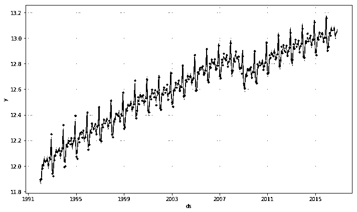
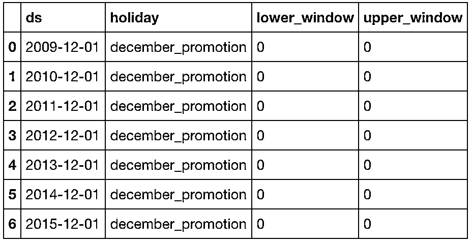

# 我用 Facebook 开源神器 Prophet，预测时间序列基于 Python（代码+论文）

> 原文：[`mp.weixin.qq.com/s?__biz=MzAxNTc0Mjg0Mg==&mid=2653289394&idx=1&sn=24a836136d730aa268605628e683d629&chksm=802e39a7b759b0b1dcf7aaa560699130a907716b71fc9c45ff0e5d236c5ae8ef80ebdb09dbb6&scene=27#wechat_redirect`](http://mp.weixin.qq.com/s?__biz=MzAxNTc0Mjg0Mg==&mid=2653289394&idx=1&sn=24a836136d730aa268605628e683d629&chksm=802e39a7b759b0b1dcf7aaa560699130a907716b71fc9c45ff0e5d236c5ae8ef80ebdb09dbb6&scene=27#wechat_redirect)


本期作者：Eric Brown

本期编辑：Allen | 崙

Prophet 是 Facebook 开源一款基于 Python 和 R 语言的数据预测工具。Facebook 表示，Prophet 相比现有预测工具更加人性化，并且难得地提供 Python 和 R 的支持。它生成的预测结果足以和专业数据分析师媲美。

另外，Prophet 中文翻译过来为：

**先知**

一看就与众不同，你懂的！

[**推荐干货****：2018 第三季度最受欢迎的券商金工研报前 50**](https://mp.weixin.qq.com/s?__biz=MzAxNTc0Mjg0Mg==&mid=2653289358&idx=1&sn=db6e8ab85b08f6e67790ec0e401e586e&chksm=802e399bb759b08d6eec855f9901ea856d0da68c7425cba62791b8948da6ad761a3d88543dad&token=1972390229&lang=zh_CN&scene=21#wechat_redirect)

**第一部分**

安装说明可以在这里找到：

***https://facebook.github.io/prophet/***


使用 Prophet 是非常简单的。导入模块，将一些数据加载到 Dataframe 中，然后将数据设置为正确的格式，就可以开始建模或者预测了。

**1、导入模块：**

```py
from fbprophet import Prophet
import numpy as np
import pandas as pd
```

**2、加载数据：**

```py
sales_df = pd.read_csv('../examples/retail_sales.csv')
```


注意 Dataframe 的格式。需要有一个包含 datetime 字段的'ds'列和一个包含我们想要建模/预测的值的'y'列。

在我们对这些数据进行分析之前，我们需要对 y 变量进行 log 变换，尝试将非平稳数据转换为平稳数据。这也将趋势转换为更线性的趋势。这并不是处理时间序列数据的完美方法，但它可以提高工作频率，在你第一次了解代码时不用担心这个问题。

```py
sales_df['y_orig'] = sales_df['y']
# log-transform y
sales_df['y'] = np.log(sales_df['y'])
```

**3、开始建立模型：**

```py
model = Prophet() 
model.fit(sales_df)
```

如果你使用的是月度数据，那么在运行上述命令之后，很可能会看到以下提示：

```py
Disabling weekly seasonality. Run prophet with weekly_seasonality=True to override this.
```

你可以忽略此提示。

**4、开始预测：**

使用 Prophet，你可以使用以下命令构建一些未来时间数据：

```py
future_data = model.make_future_dataframe(periods=6, freq = 'm')
```

现在我们使用“predict”函数进行预测：

```py
forecast_data = m.predict(future_data)
```

 

让我们看一下这组数据的图表，以便了解我们的模型是如何工作的。

```py
model.plot(forecast_data)
```



让我们再来看看/数据/模型/预测的季节性和趋势。

```py
model.plot_components(forecast_data)
```


因为我们使用的是月度数据，Prophet 会绘制趋势和每年的季节性，但是如果你使用的是日度数据，你会看到一个周的季节性图表。

从趋势和季节性上看，我们可以看到趋势在潜在的时间序列中起了很大的作用，而季节性在年初和年底的时候发挥了更大的作用。

基于以上信息，我们就能够快速地建模和预测一些数据，以便从这些特定的数据集中了解将来可能发生的事情。

我们继续调整这个模型，同时分享一个小技巧让你的预测图显示的原始数据，你可以通过使用 np.exp()来获取原始数据：

```py
forecast_data_orig = forecast_data # make sure we save the original forecast data
forecast_data_orig['yhat'] = np.exp(forecast_data_orig['yhat'])
forecast_data_orig['yhat_lower'] = np.exp(forecast_data_orig['yhat_lower'])
forecast_data_orig['yhat_upper'] = np.exp(forecast_data_orig['yhat_upper'])
```

让我们看看预测值与原始数据：


上面这张图看着怪怪的。我们把原始数据绘制在预测图上，黑点（图表底部）是我们的原始数据。为了让这个整个图表更有参考意义，我们需要把原始的 y 数据点绘制在这个图表上。为此，只需将 sales_df dataframe 中的“y_orig”列重命名为“y”即可绘制正确的数据。

```py
sales_df['y_log']=sales_df['y'] 
sales_df['y']=sales_df['y_orig'] 
```


对未来 6 个月销量将在 450K 到 475K 之间。

**第二部分**

```py
sales_df = pd.read_csv('examples/retail_sales.csv')

sales_df['y_orig']=sales_df.y # We want to save the original data for later use
sales_df['y'] = np.log(sales_df['y']) #take the log of the data to remove trends, etc

model = Prophet()
model.fit(sales_df);

#create 12 months of future data
future_data = model.make_future_dataframe(periods=12, freq = 'm')

#forecast the data for future data
forecast_data = model.predict(future_data)
```


使用 Prophet 内置绘图函数来绘制输出：

```py
model.plot(forecast_data)
```


首先，我们需要将数据进行适当的组合和索引，以便开始绘图。我们只对来预测数据集的“yhat”、“yhat_lower”和“yhat_upper”列作分析。

```py
forecast_data.set_index('ds', inplace=True)
viz_df = sales_df.join(forecast_data[['yhat', 'yhat_lower','yhat_upper']], how = 'outer')
del viz_df['y']
del viz_df['index']
```

 

你会注意到“y_orig”列中充满了“NaN”。这是因为“未来日期”行没有原始数据。

现在，让我们看一下如何比缺省情况下的 Prophet 库更好地可视化这些数据。

首先，我们需要在原始的销售数据中得到最后的日期。这将用于分割绘图的数据。

```py
sales_df.index = pd.to_datetime(sales_df.index)
last_date = sales_df.index[-1]
```

为了绘制预测数据，我们将设置一个函数导入两个额外的库来减去日期（timedelta）：

```py
from datetime import date,timedelta

def plot_data(func_df, end_date):
    end_date = end_date - timedelta(weeks=4) 
    mask = (func_df.index > end_date) 
    predict_df = func_df.loc[mask] 

    fig, ax1 = plt.subplots()
    ax1.plot(sales_df.y_orig)
    ax1.plot((np.exp(predict_df.yhat)), color='black', linestyle=':')
    ax1.fill_between(predict_df.index, np.exp(predict_df['yhat_upper']), np.exp(predict_df['yhat_lower']), alpha=0.5, color='darkgray')
    ax1.set_title('Sales (Orange) vs Sales Forecast (Black)')
    ax1.set_ylabel('Dollar Sales')
    ax1.set_xlabel('Date')

    L=ax1.legend() 
    L.get_texts()[0].set_text('Actual Sales') 
    L.get_texts()[1].set_text('Forecasted Sales')
```

此函数去查找：

**原始****数据倒数第二行***（https://stackoverflow.com/questions/29370057/select-dataframe-rows-between-two-dates）*

然后创建一组新数据（predict_df），只包含“future data”。然后，它根据预测数据创建一个带有置信带的图。


**第三部分**

在前面两个部分，我们预测了未来 24 个月的月度销售数据。在此部分中，我们想看看如何使用 Prophet 库中的‘holiday’结构来更好地预测具体事件。如果我们看到的销售数据，每年的 12 月份都有一个明显的不同。这种模式可能有多种原因，但我们假设这是由于每年 12 月的促销活动造成的。


Prophet 允许构建一个 holiday 的 Dataframe，并在你的模型中使用这些数据。对于本示例，将以以下方式构建我的 Prophet holiday 数据：

```py
promotions = pd.DataFrame({
  'holiday': 'december_promotion',
  'ds': pd.to_datetime(['2009-12-01', '2010-12-01', '2011-12-01', '2012-12-01',
                        '2013-12-01', '2014-12-01','2015-12-01']),
  'lower_window': 0,
  'upper_window': 0,
})
```

 

将 lower_window 和 upper_window 的值设置为零，以表明我们不希望 Prophet 考虑任何其他月份列表。

```py
sales_df = pd.read_csv('../examples/retail_sales.csv', index_col='date', parse_dates=True)
df = sales_df.reset_index()
df=df.rename(columns={'date':'ds', 'sales':'y'})
df['y'] = np.log(df['y'])
model = Prophet(holidays=promotions)
model.fit(df);
future = model.make_future_dataframe(periods=24, freq = 'm')
forecast = model.predict(future)
model.plot(forecast);
```

绘制模型，如下所示：


另外，Prophet 的 component 是十分重要，因为它允许你查看模型的趋势和季节性等等：

```py
model.plot_components(forecast)
```


具体内容请查看详细 Notebook。

**代码下载**

在**后台**输入

**20181104**

**后台获取方式介绍**


**推荐阅读**

[1、经过多年交易之后你应该学到的东西（深度分享）](https://mp.weixin.qq.com/s?__biz=MzAxNTc0Mjg0Mg==&mid=2653289074&idx=1&sn=e859d363eef9249236244466a1af41b6&chksm=802e3867b759b1717f77e07a51ee5671e8115130c66562577280ba1243cba08218add04f1f00&token=449379994&lang=zh_CN&scene=21#wechat_redirect)

[2、监督学习标签在股市中的应用（代码+书籍）](https://mp.weixin.qq.com/s?__biz=MzAxNTc0Mjg0Mg==&mid=2653289050&idx=1&sn=60043a5c95b877dd329a5fd150ddacc4&chksm=802e384fb759b1598e500087374772059aa21b31ae104b3dca04331cf4b63a233c5e04c1945a&token=449379994&lang=zh_CN&scene=21#wechat_redirect)

[3、2018 年学习 Python 最好的 5 门课程](https://mp.weixin.qq.com/s?__biz=MzAxNTc0Mjg0Mg==&mid=2653289028&idx=1&sn=631cbc728b0f857713fc65841e48e5d1&chksm=802e3851b759b147dc92afded432db568d9d77a1b97ef22a1e1a376fa0bc39b55781c18b5f4f&token=449379994&lang=zh_CN&scene=21#wechat_redirect)

[4、全球投行顶尖机器学习团队全面分析](https://mp.weixin.qq.com/s?__biz=MzAxNTc0Mjg0Mg==&mid=2653289018&idx=1&sn=8c411f676c2c0d92b0dd218f041bee4b&chksm=802e382fb759b139ffebf633ac14cdd0f21938e4613fe632d5d9231dab3d2aca95a11628378a&token=449379994&lang=zh_CN&scene=21#wechat_redirect)

[5、使用 Tensorflow 预测股票市场变动](https://mp.weixin.qq.com/s?__biz=MzAxNTc0Mjg0Mg==&mid=2653289014&idx=1&sn=3762d405e332c599a21b48a7dc4df587&chksm=802e3823b759b135928d55044c2729aea9690f86752b680eb973d1a376dc53cfa18287d0060b&token=449379994&lang=zh_CN&scene=21#wechat_redirect)

[6、被投资圈残害的清北复交学生们](https://mp.weixin.qq.com/s?__biz=MzAxNTc0Mjg0Mg==&mid=2653289110&idx=1&sn=538d00046a15fb2f70a56be79f71e6b9&chksm=802e3883b759b1950252499ea9a7b1fadaa4748ec40b8a1a8d7da0d5c17db153bd86548060fb&token=1336933869&lang=zh_CN&scene=21#wechat_redirect)

[7、使用 LSTM 预测股票市场基于 Tensorflow](https://mp.weixin.qq.com/s?__biz=MzAxNTc0Mjg0Mg==&mid=2653289238&idx=1&sn=3144f5792f84455dd53c27a78e8a316c&chksm=802e3903b759b015da88acde4fcbc8547ab3e6acbb5a0897404bbefe1d8a414265d5d5766ee4&token=2020206794&lang=zh_CN&scene=21#wechat_redirect)

[8、手把手教你用 Numpy 构建神经网络(附代码)](https://mp.weixin.qq.com/s?__biz=MzAxNTc0Mjg0Mg==&mid=2653289274&idx=1&sn=f40be8372658c2c79fdd47c03d62e037&chksm=802e392fb759b039435fc6700ef5d45142cdfe72234586bd8de9b8dfabcc3264f2ae826def80&token=1003651614&lang=zh_CN&scene=21#wechat_redirect)

[9、判断哪些输入特征对神经网络是重要的](https://mp.weixin.qq.com/s?__biz=MzAxNTc0Mjg0Mg==&mid=2653289289&idx=1&sn=7c6cf3ed7f4f2859a0e95bc87914814c&chksm=802e395cb759b04adcee6afc1d44ffa2f3ceac2137796dad4ee9c51cdb165ce3463258647a3c&token=1972390229&lang=zh_CN&scene=21#wechat_redirect)

[10、美丽的回测——教你定量计算过拟合概率](https://mp.weixin.qq.com/s?__biz=MzAxNTc0Mjg0Mg==&mid=2653289314&idx=1&sn=87c5a12b23a875966db7be50d11f09cd&chksm=802e3977b759b061675d1988168c1fec06c602e8583fbcc9b76f87008e0c10b702acc85467a0&token=1972390229&lang=zh_CN&scene=21#wechat_redirect)

**在量化投资的道路上**

**你不是一个人在战斗！**