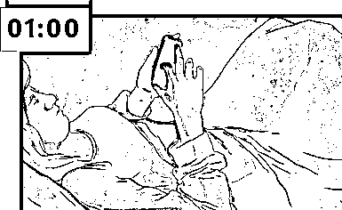

# 到底几点睡觉才算是熬夜？

> 原文：[`mp.weixin.qq.com/s?__biz=MzAxNTc0Mjg0Mg==&mid=2653289365&idx=1&sn=168f9947630a471a544f5ffac5ce9736&chksm=802e3980b759b096b57ae7c689fc455727a28303d8f0aba2f3a104f2ce2ec07945489dd4b377&scene=27#wechat_redirect`](http://mp.weixin.qq.com/s?__biz=MzAxNTc0Mjg0Mg==&mid=2653289365&idx=1&sn=168f9947630a471a544f5ffac5ce9736&chksm=802e3980b759b096b57ae7c689fc455727a28303d8f0aba2f3a104f2ce2ec07945489dd4b377&scene=27#wechat_redirect)

……

第二天

年轻人对自己熬夜是心知肚明的

早上对于熬夜的态度是坚决的

晚上对于熬夜的态度也是坚决的

小编还记得小时候

**九点多**爸妈就催着睡觉了

后来**十点睡**

再大一点儿**十一点**

高中的时候就常年**十二点**了

现在十二点时……

对于**几点**才算是熬夜

感觉每个人看法都不太一样

毕竟有人**十一点睡觉**都觉得**晚了**

有人觉得不管几点睡

**睡够了就行**

不过熬夜还真的没那么简单

今天小编就带你们刷新一下

****

我们平时的睡眠质量

主要靠**规律的生物钟**

和**充足的睡眠时间**来保证

也就是说

就算是你**半夜三四点**睡觉

第二天**十二点**起床

但是**长期**这样睡成了**习惯**

并且**睡眠时间充足**

就不算熬夜

只是算**“晚睡”**

或是**“睡眠时相推迟”**

有个说法是天才的睡眠时间都特别短

这个说法小编的看法就是

虽然说爱迪生和拿破仑

每天睡眠时间确实**不超过 5 小时**

****

但是爱因斯坦和丘吉尔

可是很能睡的

爱因斯坦每天要睡**10 个小时**

丘吉尔甚至表示

他每天还有**午睡 1 小时**和**晚餐后小睡**的习惯

所以没睡够 8 小时

**不一定就代表熬夜**

毕竟每个人的情况都是不一样的

如果**连续每天都少睡**

那就算是熬夜

或者说**连续 48 小时都没有睡觉**

那也算是熬夜

两种熬夜都会导致**大脑认知功能降低**等

简单来说

不过**长期的**慢性睡眠不足

比**急性的**通宵熬夜更加**严重**

**身体恢复速度也更慢**

照上文的说法

好像我们多晚睡都可以

只要**睡够了、有规律**就行

不过**晚睡晚起**还是会对身体有影响的

白天睡觉的时候

因为**光照较强**

**温度相对较高**等原因

会影响**人体褪黑素**等物质分泌

最后让你**睡眠质量降低**

****

所以其实就算是**有规律地晚睡晚起**

**效果也不如正常睡眠好**

****

如果实在是夜猫子

那在白天就尽量给自己塑造一个**舒适的条件**

拉上遮光窗帘

戴眼罩、戴耳塞等

**保证深度睡眠**

如果不是天生的夜猫子

还是建议在**23 点之前入睡**比较好

对于问出这种问题的朋友

小编只能说

****

文章来自：一只学霸（ID：bajie203）

**推荐阅读**

[1、经过多年交易之后你应该学到的东西（深度分享）](https://mp.weixin.qq.com/s?__biz=MzAxNTc0Mjg0Mg==&mid=2653289074&idx=1&sn=e859d363eef9249236244466a1af41b6&chksm=802e3867b759b1717f77e07a51ee5671e8115130c66562577280ba1243cba08218add04f1f00&token=449379994&lang=zh_CN&scene=21#wechat_redirect)

[2、监督学习标签在股市中的应用（代码+书籍）](https://mp.weixin.qq.com/s?__biz=MzAxNTc0Mjg0Mg==&mid=2653289050&idx=1&sn=60043a5c95b877dd329a5fd150ddacc4&chksm=802e384fb759b1598e500087374772059aa21b31ae104b3dca04331cf4b63a233c5e04c1945a&token=449379994&lang=zh_CN&scene=21#wechat_redirect)

[3、2018 年学习 Python 最好的 5 门课程](https://mp.weixin.qq.com/s?__biz=MzAxNTc0Mjg0Mg==&mid=2653289028&idx=1&sn=631cbc728b0f857713fc65841e48e5d1&chksm=802e3851b759b147dc92afded432db568d9d77a1b97ef22a1e1a376fa0bc39b55781c18b5f4f&token=449379994&lang=zh_CN&scene=21#wechat_redirect)

[4、全球投行顶尖机器学习团队全面分析](https://mp.weixin.qq.com/s?__biz=MzAxNTc0Mjg0Mg==&mid=2653289018&idx=1&sn=8c411f676c2c0d92b0dd218f041bee4b&chksm=802e382fb759b139ffebf633ac14cdd0f21938e4613fe632d5d9231dab3d2aca95a11628378a&token=449379994&lang=zh_CN&scene=21#wechat_redirect)

[5、使用 Tensorflow 预测股票市场变动](https://mp.weixin.qq.com/s?__biz=MzAxNTc0Mjg0Mg==&mid=2653289014&idx=1&sn=3762d405e332c599a21b48a7dc4df587&chksm=802e3823b759b135928d55044c2729aea9690f86752b680eb973d1a376dc53cfa18287d0060b&token=449379994&lang=zh_CN&scene=21#wechat_redirect)

[6、被投资圈残害的清北复交学生们](https://mp.weixin.qq.com/s?__biz=MzAxNTc0Mjg0Mg==&mid=2653289110&idx=1&sn=538d00046a15fb2f70a56be79f71e6b9&chksm=802e3883b759b1950252499ea9a7b1fadaa4748ec40b8a1a8d7da0d5c17db153bd86548060fb&token=1336933869&lang=zh_CN&scene=21#wechat_redirect)

[7、使用 LSTM 预测股票市场基于 Tensorflow](https://mp.weixin.qq.com/s?__biz=MzAxNTc0Mjg0Mg==&mid=2653289238&idx=1&sn=3144f5792f84455dd53c27a78e8a316c&chksm=802e3903b759b015da88acde4fcbc8547ab3e6acbb5a0897404bbefe1d8a414265d5d5766ee4&token=2020206794&lang=zh_CN&scene=21#wechat_redirect)

[8、手把手教你用 Numpy 构建神经网络(附代码)](https://mp.weixin.qq.com/s?__biz=MzAxNTc0Mjg0Mg==&mid=2653289274&idx=1&sn=f40be8372658c2c79fdd47c03d62e037&chksm=802e392fb759b039435fc6700ef5d45142cdfe72234586bd8de9b8dfabcc3264f2ae826def80&token=1003651614&lang=zh_CN&scene=21#wechat_redirect)

**在量化投资的道路上**

**你不是一个人在战斗！**