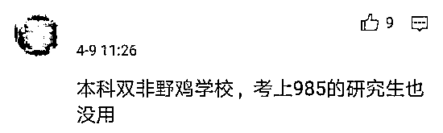
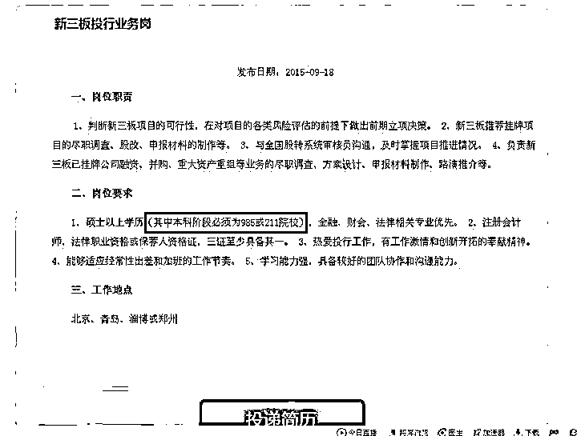
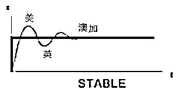

# 不好意思，一年制硕士不考虑，我们只看第一学历！

> 原文：[`mp.weixin.qq.com/s?__biz=MzAxNTc0Mjg0Mg==&mid=2653289332&idx=1&sn=1a902eb52236f7a4d139491a5287f834&chksm=802e3961b759b0774d2d53c631cdca89373728bf307f1d2582f05578ec8d6f6afad59129048b&scene=27#wechat_redirect`](http://mp.weixin.qq.com/s?__biz=MzAxNTc0Mjg0Mg==&mid=2653289332&idx=1&sn=1a902eb52236f7a4d139491a5287f834&chksm=802e3961b759b0774d2d53c631cdca89373728bf307f1d2582f05578ec8d6f6afad59129048b&scene=27#wechat_redirect)

文章来源：UniCareer

文章作者：Uni 酱

今年常州大学的宿舍居然成了网红

宿舍八人互相鼓励，全员考研成功

**却有人冷嘲热讽：“本科不好，考了 985 也没用”**

传说越热门越挣钱的行业

越注重第一学历, 难道真是高考定终身？

**那双非本科考研还有什么用？**

**出国也不能实现阶级逆袭**

**一年制的硕士真的那么不受待见吗？**

01

**名企是否都“只看第一学历”？**

当当网创始人李国庆说只看第一学历,非 211 不要！MBB 也是以第一学历为主要筛选条件。国内券商，国外投行更是明确标注“本科阶段必须为 985/211 学校”，这尼玛那我考研做什么？

*图片来源：网络丨券商招聘要求

同时各个国家的海归，**国内 HR 很自然地形成了一条海归留学鄙视链：北美研究生 > 北美本科 > 英国本科 > 英国研究生 > 澳洲研究生 > 澳洲本科（原因不详，令人唏嘘）**

  *图片来源：网络

**其实在国内 HR 心目中，留学生主要分两类：牛津剑桥哈佛麻省理工和别的学校。**

 *图片来源：办公室吐槽君

其实海归人才市场也分三六九等，除了留学国家、学校、专业、学历的区别之外，海归还分为“大海归”和“小海归”，二者起薪差距不小，“大海归”起薪往往能在 1 万元以上，而“小海归”通常只有 3-6 千元，**之前 Uni 酱发过一张海外硕士的含水量图片，受到各方关注，其实他们之所以被认为很水，仅仅是因为我们对这些学校期待太高，期望越高，失望越大。👇**

 *图片来源：网络

另外美国一些名校商科硕士项目，只要肯掏钱，录取率就会很高。更有人爆料 GPA 低至 3.1，托福没过 100，GRE310 左右，甚至没去面试都能申上。**当然再水的项目，也不能轻易就水过，只是含金量相对较低，和期望有差距而已。**下面以 UIUC（伊利诺伊大学厄巴纳-香槟分校）的 MSA 专业和 JHU（约翰斯·霍普金斯大学）的 MSF 专业为例：

1

UIUC MSA 被黑真相

MSA 是 UIUC 一年制硕士，分为本土班，和国际学生班（被黑对象），作为 UIUC 的主盈利项目，各项指标跌破天际。GPA 低至 3.0，GMAT 最低 650 分，雅思的最低成绩是 6.5。而且国际生并无奖学金申请资格，学费更是高的吓人。

 *图片来源：UIUC 官网

该学校周边盛产玉米，UIUC 还有一个称号：玉米地大学。因为地点实在太偏僻，当地甚至造了个小机场，无论留学生活，还是出门工作，这里都是一个满怀槽点的选择，但是一年制的项目其实不到一年，**MSA 的目标其实为四大，四大海外国内都是提前一年招聘，意味着一落地就要面临全英文面试，国际生大多数都败下阵来。** 

2

JHU MSF 是否值得去读

菊花大学的 MSF 从来没有被黑的这么惨过，**主要还是在招生方面扩大中国人招生占比，当地就业形势不被看好，就业辅导中心的资源全部去了 MBA 项目而被饱受诟病。**JHU 其实在生物、医学方面世界顶尖。但是商学院不过 10 年多一点的历史，而且去年才刚刚通过了 AACSB 的商学院认证，也就是说在此之前连美国官方教育机构都没有认可它。

 *图片来源：JHU 官网

MSF 每年招收 521 个学生（超过 80%是中国人），毕业后 6 个月的就业率是 81%，对比 UW 计算金融 95%的就业率，JHU 的 81%可以说并不高，平均薪水已经低到 JHU 不敢在官网放出。**感觉 Uni 酱今天的原创文会被留学机构追杀...**

02

**一年硕只是混文凭的“缩水”项目？**

**一年制硕士因其花费相对较少、学制短、性价比高等特点，出现了中国学生“扎堆”的现象，部分热门专业甚至 8 成学生都是中国人。**因此，很多人想当然的视之为“缩水课程”。

不可否认部分一年制硕士项目属于“投机”迎合中国留学群体的需求，但这一制度和国内硕士只有教育体制和人才培养思维的不同，课程内容以及教授水平并没有“偷工减料”。以英国一年制硕士为例：

1

就读时间短, 效率更高

英国的一年制项目注重效率和实用性，以 CASS 为例，学生需在两个学期内修满八门必修课，此外第三个学期还需要在 5 门选修课、3 门选修课加一个应用研究项目中三选一，并且所有课程都是一周三个小时，**所以说英国硕士的项目内容其实是非常充实的。**

*图片来源：网络

2

考试严格到哭

**在英国，硕士挂科可以补考，但如果补考也挂科了，就算其他成绩都是满分，最后也没有学位，**换句话等于没毕业。在英国，如果你想顺利毕业，那么没事泡泡图书馆是必须的，因为考试从没有画题、勾重点这类“变向作弊”，基本就是没有范围！

 *图片来源：网络（英国申研与国内考研对比）

3

入学门槛比肩美国

其实英国硕士申请同样是需要综合本科成绩、语言成绩、PS、科研、实习、导师评价，除了不需要 GMAT/GRE 成绩，申请并不比美国大学容易多少。**大多数第二、第三梯队学校的商科项目对于本科成绩的要求是“等同于英国 2:1 学位”，**甚至有项目要求是“等同于英国 first or upper second class degree”。

03

**华人扎堆就意味是水校？**

留学圈有一个怪象，华人扎堆的学校往往被称作“水校”。比如美国 Top4 高校哥伦比亚大学。据哥伦比亚大学官方数据统计，**该校 2013 年注册报到的国际学生中，中国大陆籍学生的占比达 34.5%，基本上每三个留学生里就有一个是中国人。**但也正是因为对中国留学生友好，让它背上了“水校”的锅。

其实哥大并不弱，下设 47 个本科专业，录取学生的高中成绩需排全校 TOP10，**哥大接受转学的国际本科生，但要求与美国本土学生一样需修满 24 个学分，GPA3.5 是基本，每年转学生的录取率低于 10％。**

 *图片来源：网络（哥大商学院项目）

**但近两年，哥大已经开始缩减华人的录取比例。**另外密歇根大学也曾为中国留学生广开大门，但正是因为华人录取率高，所以大家纷纷将密歇根大学的 Offer 当“保底录取”。此举彻底激怒了密歇根大学，后来密歇根大学对中国申请者的要求几乎变态，而且极少给中国留学生发录取。

04

**国外留学谨防真“水校”**

除了名校水专业，国外一些不具备办学资质的野鸡大学也在干扰着很多人的留学选择，每年都会有人因此上当受骗。**这些学校会以提供“奖学金”或“助学金”鼓励学生一次性注册多个学位继而从中获利，但所发文凭并不被国家所承认。**

*图片来源：UniCareer 自制

05

**如何判断研究生项目的“含水量”？**

可以从以下两个方面进行参考：

1

查阅官方披露的 GMAT 和 TOFEL 平均分 

**GMAT 和 TOFEL 平均分高基本说明申请该项目的学生总体质量更好，**而质量好的学生通常对项目要求很高，只有含金量很高的项目从才能招收到这些质量好的学生。 

举个例子：

> *HBS 的 MBA 项目的 Median GMAT 成绩是 730，*
> 
> *NYU 的继续教育学院 MS in Integrated Marketing 项目的 Median GMAT 成绩是 600，*

听起来都是两所常春藤学校的项目，但从 GMAT 成绩来看，同学们就可以感受到这两个项目含金量的高低。

2

了解这个学科历年被录取学生的背景 

需要了解的信息包括但不局限于：

*   被录取学生主要来自国内什么样的院校？

*   申请的时候大概有什么样的实习或者工作经验？

*   主要在什么行业？

*   就读过程中的感受是什么？

*   毕业后对于该项目的反馈是什么？ 

试想一个项目都是一群很水的学生在读，自然这个项目不会好到哪里去。而如果一个项目的学生背景都是北清复交的学生，这样的项目含金量一定高。

06

**所谓的公正裁决**

近日，全球高等教育研究机构 QS 发布 19 全球商学院专业排名，本次排名以毕业生就业率、创业率，毕业生成就、回报率作为主要排名依据，对于商学院申请学生来说，QS 本次发布的这份排名还是很有参考价值的！

1

金融硕士排名 

2019 年金融硕士排名，收录了全球超过 150 个最佳金融硕士课程。**伦敦商学院成功卫冕！紧随其后的是巴黎高等商学院和麻省理工学院斯隆管理学院。**

2

商业分析硕士项目排名

在这次的商业分析硕士项目排名中，**MIT 斯隆商学院继续排名第一，帝国理工学院夺得第二，德克萨斯大学奥斯汀分校夺得了第三位。**

3

管理硕士排名 

管理专业里，TOP3 院校排名不变，HEC Paris 法国巴黎高商继续延续去年的霸主地位，伦敦商学院紧随其后，位居第二，西班牙的 ESADE 商学院排名第三。

4

市场营销排名 

本次 QS 市场营销排名中，哥伦比亚商学院排名第一，排名第二的是帝国理工学院，巴黎 HEC 商学院排名第三。

**所以，看完排名，吃完瓜，我们明白**

**自古真情留不住，唯有套路得人心**

**推荐阅读**

[1、经过多年交易之后你应该学到的东西（深度分享）](https://mp.weixin.qq.com/s?__biz=MzAxNTc0Mjg0Mg==&mid=2653289074&idx=1&sn=e859d363eef9249236244466a1af41b6&chksm=802e3867b759b1717f77e07a51ee5671e8115130c66562577280ba1243cba08218add04f1f00&token=449379994&lang=zh_CN&scene=21#wechat_redirect)

[2、监督学习标签在股市中的应用（代码+书籍）](https://mp.weixin.qq.com/s?__biz=MzAxNTc0Mjg0Mg==&mid=2653289050&idx=1&sn=60043a5c95b877dd329a5fd150ddacc4&chksm=802e384fb759b1598e500087374772059aa21b31ae104b3dca04331cf4b63a233c5e04c1945a&token=449379994&lang=zh_CN&scene=21#wechat_redirect)

[3、2018 年学习 Python 最好的 5 门课程](https://mp.weixin.qq.com/s?__biz=MzAxNTc0Mjg0Mg==&mid=2653289028&idx=1&sn=631cbc728b0f857713fc65841e48e5d1&chksm=802e3851b759b147dc92afded432db568d9d77a1b97ef22a1e1a376fa0bc39b55781c18b5f4f&token=449379994&lang=zh_CN&scene=21#wechat_redirect)

[4、全球投行顶尖机器学习团队全面分析](https://mp.weixin.qq.com/s?__biz=MzAxNTc0Mjg0Mg==&mid=2653289018&idx=1&sn=8c411f676c2c0d92b0dd218f041bee4b&chksm=802e382fb759b139ffebf633ac14cdd0f21938e4613fe632d5d9231dab3d2aca95a11628378a&token=449379994&lang=zh_CN&scene=21#wechat_redirect)

[5、使用 Tensorflow 预测股票市场变动](https://mp.weixin.qq.com/s?__biz=MzAxNTc0Mjg0Mg==&mid=2653289014&idx=1&sn=3762d405e332c599a21b48a7dc4df587&chksm=802e3823b759b135928d55044c2729aea9690f86752b680eb973d1a376dc53cfa18287d0060b&token=449379994&lang=zh_CN&scene=21#wechat_redirect)

[6、被投资圈残害的清北复交学生们](https://mp.weixin.qq.com/s?__biz=MzAxNTc0Mjg0Mg==&mid=2653289110&idx=1&sn=538d00046a15fb2f70a56be79f71e6b9&chksm=802e3883b759b1950252499ea9a7b1fadaa4748ec40b8a1a8d7da0d5c17db153bd86548060fb&token=1336933869&lang=zh_CN&scene=21#wechat_redirect)

[7、使用 LSTM 预测股票市场基于 Tensorflow](https://mp.weixin.qq.com/s?__biz=MzAxNTc0Mjg0Mg==&mid=2653289238&idx=1&sn=3144f5792f84455dd53c27a78e8a316c&chksm=802e3903b759b015da88acde4fcbc8547ab3e6acbb5a0897404bbefe1d8a414265d5d5766ee4&token=2020206794&lang=zh_CN&scene=21#wechat_redirect)

[8、手把手教你用 Numpy 构建神经网络(附代码)](https://mp.weixin.qq.com/s?__biz=MzAxNTc0Mjg0Mg==&mid=2653289274&idx=1&sn=f40be8372658c2c79fdd47c03d62e037&chksm=802e392fb759b039435fc6700ef5d45142cdfe72234586bd8de9b8dfabcc3264f2ae826def80&token=1003651614&lang=zh_CN&scene=21#wechat_redirect)

**在量化投资的道路上**

**你不是一个人在战斗！**