# 机会 | 90 天带学《机器学习》西瓜书+带打天池和达观杯 AI 大赛

> 原文：[`mp.weixin.qq.com/s?__biz=MzAxNTc0Mjg0Mg==&mid=2653289326&idx=1&sn=4b24301642c78321ec1632ecef16cc25&chksm=802e397bb759b06d546a209ec999f9b5d914115e41a88adf5043470e6a6efe224ee274524112&scene=27#wechat_redirect`](http://mp.weixin.qq.com/s?__biz=MzAxNTc0Mjg0Mg==&mid=2653289326&idx=1&sn=4b24301642c78321ec1632ecef16cc25&chksm=802e397bb759b06d546a209ec999f9b5d914115e41a88adf5043470e6a6efe224ee274524112&scene=27#wechat_redirect)

你认为，学人工智能最难的是什么？

没有资料？没有方法？没有答疑？还是无法坚持？

研究表明，80%放弃了的人，是因为在学习的路上碰到太多阻碍。

**看看下面的 6 条，哪一条戳中了你**

1、不知道从何学起，没人能带你入门

2、自学无人答疑解惑

3、仅仅学理论，没有相关实战经验

4、想参加比赛，无人指导，甚至没有团队

5、想参加培训班收费太贵还不知是否靠谱

我曾经问了很多自学的大牛，包括学长，他们从来不信那些所谓的 3 个月速成年薪 50w 培训课，**那么他们的学习方法又是什么？**

但凡入行的人都知道，吴恩达的教学视频，周志华的《机器学习》西瓜书等，都是业内经典。但自学很难，没人讨论，没人解答，很绝望。毕竟不是每个人都能自学成才。

**为此我们专门开设了一场理论与实战结合最紧密的“机器学习”训练营。**

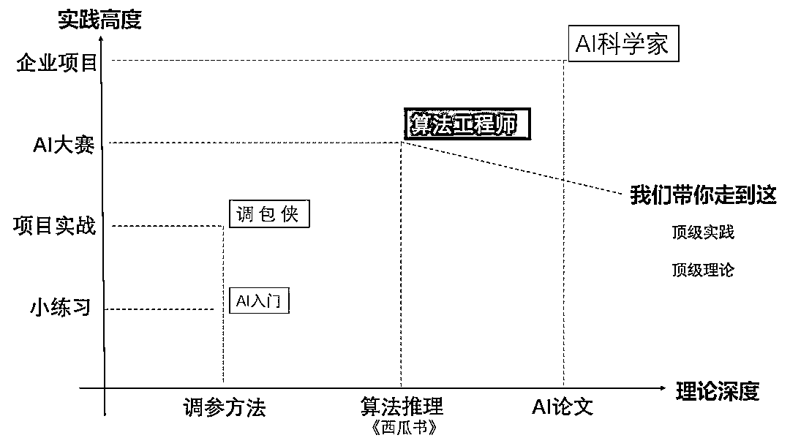

行业首创，不原创任何培训课程。以行内爆款书本为理论大纲，以比赛为重点实战。

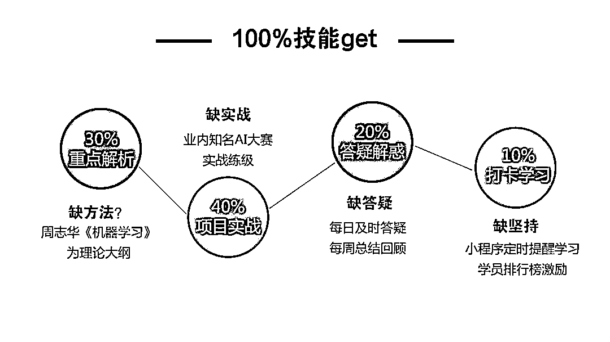

周志华《机器学习》西瓜书训练营**你能获得什么**

1、《机器学习》西瓜书重难点学习任务，12 大核心算法理论知识 

2、天池 AI 大赛大咖手把手带打两种大型比赛，练就超强实战能力

3、讲师+助教学习答疑，大赛项目审阅

4、圈友学习成果互评，同频分享交流

5、3 天一个小任务，10 天一个大作业

6、每周优秀作业精选，导师作业点评

**你还能获得什么**

1、价值 398 元知识星球一年学习名额，嘉宾坐镇答疑任何小白问题（**量化投资与机器学习****粉丝专属**）

2、根据知识星球内发帖质量及学员互动随机打赏 18-98 元

3、高互动精华帖，直接打赏 98 元

4、使用天池 Notebook 分享比赛经验，优质内容可获官方提供精美礼品

5、训练营内部大赛比拼，第一名奖励千元奖金

**我们的不同**

**内容：**由浅入深，重新排列西瓜书学习顺序

**实战：**将抽象的理论知识嵌入比赛代码，学以致用

**打卡：**严格按照 6 阶段划分学习任务，部署关键知识点

**周期：**2 个月持续练习，1 个月项目比赛缓冲期

**社群**：微信群及时交流+知识星球精选内容回顾

**活动：**项目来袭，自由组队瓜分千元奖金

**教学计划**【第一阶段】10.31-11.111.了解机器学习基本概念 

2.线性模型

3.线性逻辑回归应用于天池 o2o 优惠券使用预测赛

4、项目实战：“达观杯”NLP 算法大赛（线性逻辑回归应用）

【第二阶段】11.11-11.211.支持向量机 

2.贝叶斯分类器

3.SVM 和朴素贝叶斯算法应用于天池 o2o 优惠券使用预测赛

【第三阶段】11.21-12.011.决策树 

2.集成学习

3.决策树和集成学习应用于天池 o2o 优惠券使用预测赛

4、项目实战：“达观杯”NLP 算法大赛（其他算法进阶应用）

【第四阶段】12.01-12.111.特征选择 

2.降维

3.特征选择和降维应用于天池 o2o 优惠券使用预测赛

【第五阶段】12.11-12.211.模型的评估与选择 

2.神经网络与深度学习

3.模型评估与选择应用于天池 o2o 优惠券使用预测赛

【第六阶段】12.21-12.311.概率图模型 

2.聚类

3.强化学习

4.强化学习应用于天池 o2o 优惠券使用预测赛

**教学导师**

**导师：Joey**

兰州大学计算机专业博士

牵头与谷歌本部合作深度学习科研项目

科研方向：计算机视觉、强化学习、自然语言处理

中国移动集团 IT 架构师 

**导师：Jian**

天池 AI 医疗大赛 10 强选手

同济大学模式识别方向硕士

参与深度学习国家项目

**答疑平台**

1、知识星球 1 对 1 提问，12 小时之内保证解决问题

2、微信群及时互动，群友互答

3、每阶段统一收集问题直播答疑，系统讲解重难点

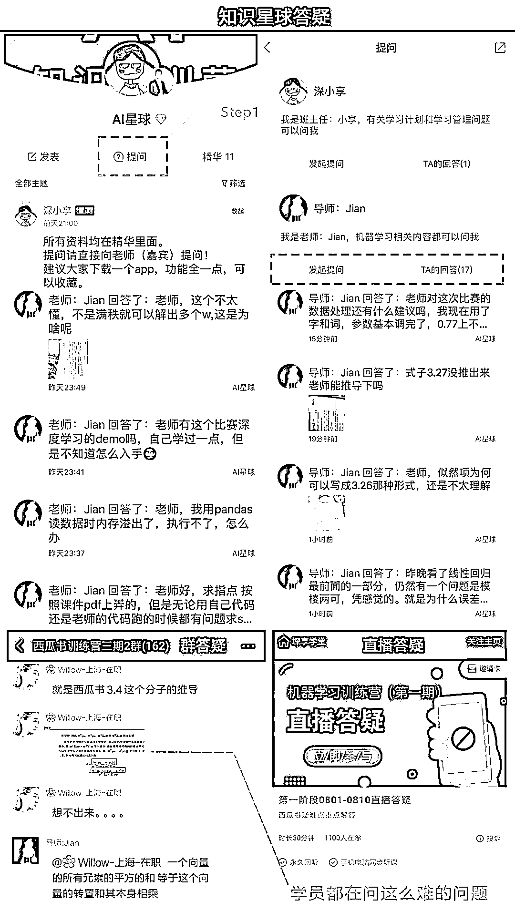

**作业提交**

1、老师对认真提交作业的学员进行点评

2、班主任对质量高的作业进行置顶和打赏

3、阶段结束统一发布参考答案供学生对比

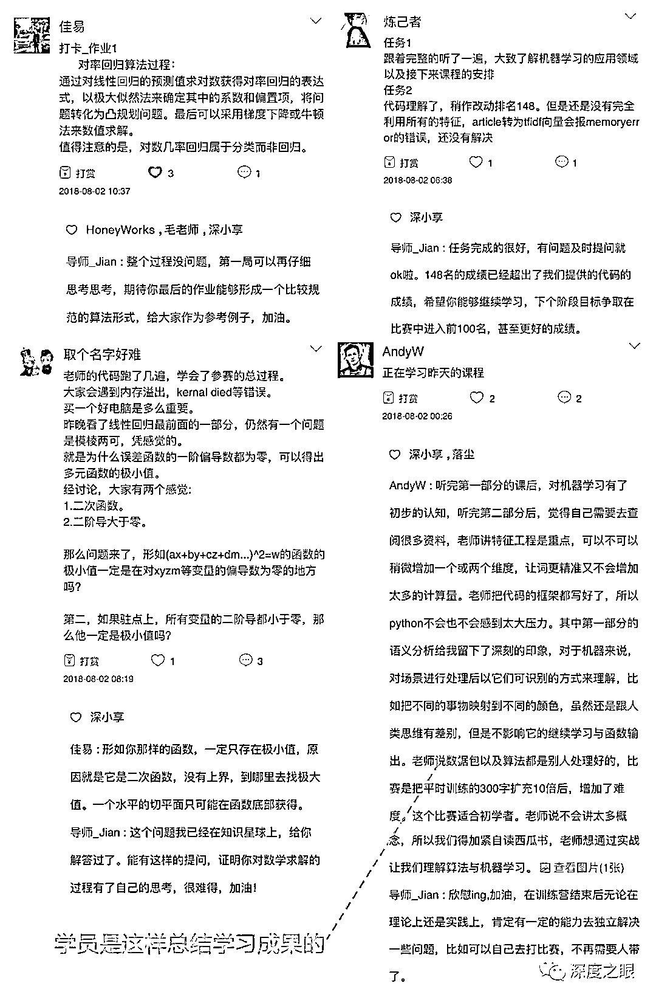

**朋友之间自发传播，宿舍团报**

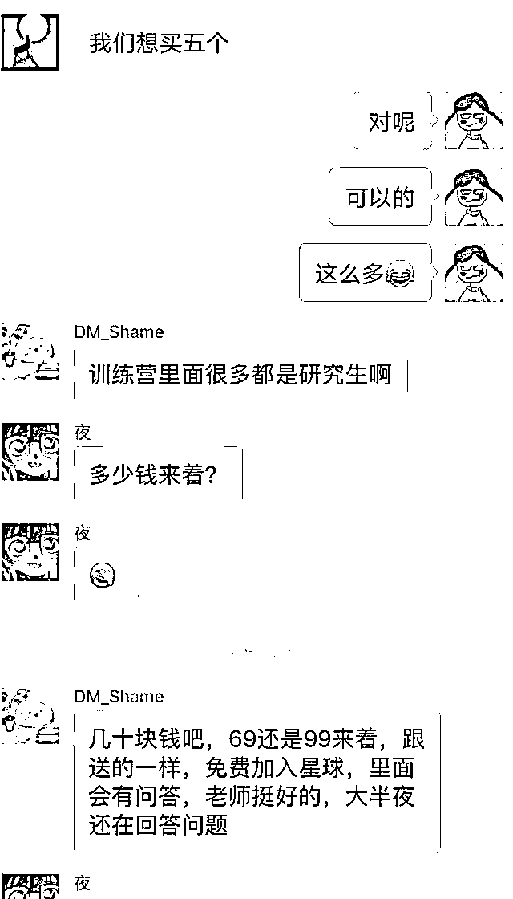

**群内自我介绍，卧虎藏龙，有****北大、清华****的研究生，**

**有****麻省理工芯片方向****的博士，还**有****华为、阿里、滴滴****的工程师****

**不仅可以结识大佬，还能获得名企内推机会**

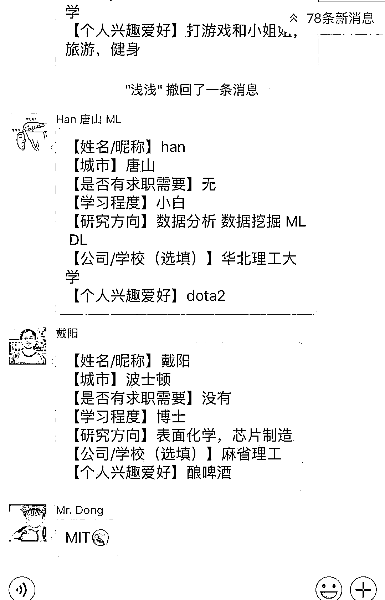

我相信，加入我们，你能获得的远不止这些....

**往期学员**

1、超过 2000+学员报名

2、累积打卡 30000+次

3、总奖金池累积超过 1.5 万元

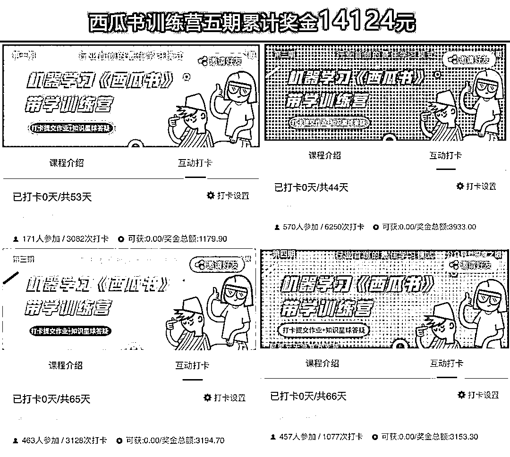

**群内学员学习之后的反馈**

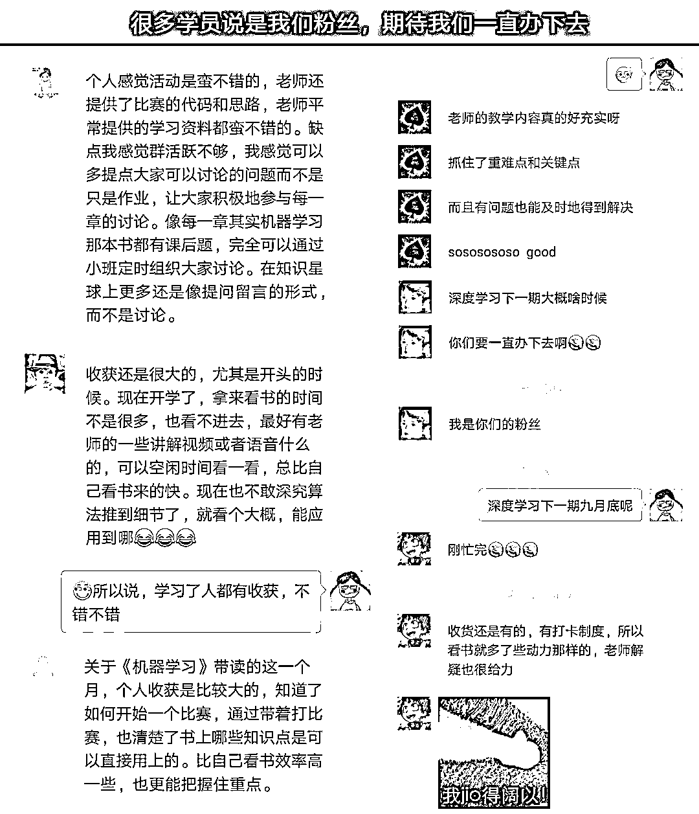

**打卡奖励**

**为了鼓励学生，我们拿出了 10%的报名费作为打卡奖励，完成打卡赢回报名费**

**Q、满足条件是什么？**  

A、训练营打卡全勤，且能够自主参赛，完成教学任务

**Q、若没有时间来得及打卡怎么办？**

A、我们设置了 5 次补卡机会，在训练营结束前可进行补卡

**Q、我最多能拿多少钱奖金？**

A、如果只有一人完成，全部是你的。两人平分，以此类推

**部分学员能拿到的奖金会远****大于****他的报名费**

**现在加入打卡训练营，仅需 69 元**

3 个月，**每天 0.7 元**

**一顿饭钱**

你就能掌握机器学习

**入门技巧+实战能力+参赛经验**

结识一群志同道合的伙伴

**-长按以下二维码速速报名-** 

**每增加 50 人，学费增加 10 元**

**报名时间：2018 年****10 月 19****日—2018 年 10 月 30 日**

**学习周期：2018 年 10 月 31 日—2019 年 1 月 31 日**

添加班主任微信进学员内部群

开启你的升级之旅

备注：报名成功后，请及时添加班主任微信，如有任何问题，也请添加班主任微信咨询。

**订阅须知****Q、课程资料在哪里看？**

A、所有的课程资料均会在训练营上传。

**Q、报名后可以退款吗？**

A、本服务为虚拟内容产品，一经购买，概不退款，敬请谅解。

**Q、可以开具发票吗？**

A、可以开具普通发票，请联系微信班主任填写需要的信息即可。

当然我们也还有另外两门主题训练营，如果你对其他的感兴趣，也可以咨询

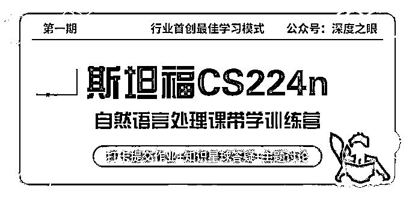

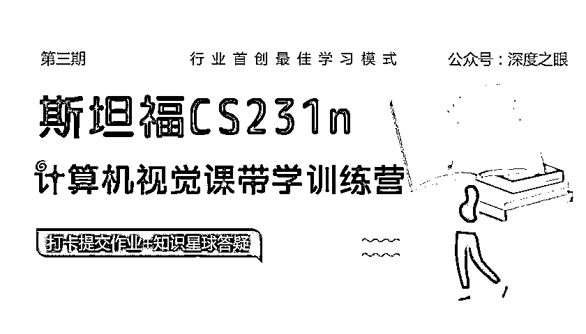

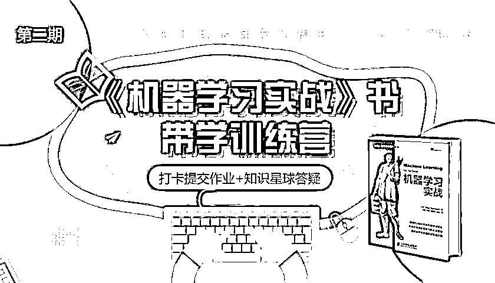

如果你还没决定参与，我们也为你准备了一场

主题讨论会

**行业首创，线上圆桌会议**

主会场

五位**知名****企业实战大咖**激烈交锋

.png")

有诸多剑桥、麻省理工、清华、北大等名校学员，超 60%学员是 211 以上学生，入群已经很值，还要和他们讨论

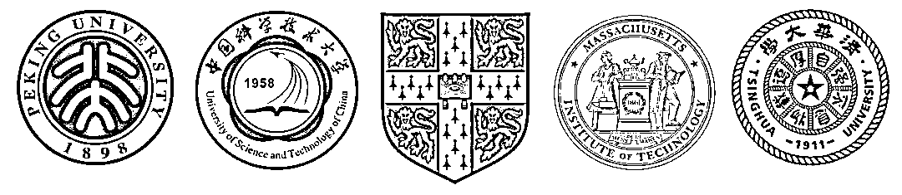

**5000+**AI 学习者集体头脑风暴

**这种机会，你几乎很难遇到第二次**

分会场-讨论主题 **小白场** 

学机器学习有没有必要系统学习 python 和高数？

对深度学习感兴趣，需要先学机器学习吗？

01 **专题场-1** 

特征工程篇：特征选择、缺失值处理、数据预处理的方法和技巧

02 **专题场-2** 

算法篇：算法推导有哪些心得和技巧？

03 **求职场** 

大量调包积累感性经验 VS 推导算法搞懂机理，我该通过哪条路径提升核心竞争力？

04 **互怼场** 

深度学习框架 TensorFlow VS PyTorch 框架，到底用哪个更好？

05 **大咖场** 

阅读+复现 paper，如何能准确理解作者思路并创造性改进？

06

上次参与算法推导主题讨论的学员说：一次持续两小时的交流，感觉像学到了**三年的经验**一样。这句话一点都不夸张。

**5000+学习者走过的坑，摸索出来的经验，这一次和盘托出**

如何参与

添加客服微信

回复关键词【**话题参与**】

添加客服直接扫码入群即可

无需任何转载操作

时间：**10 月 26 日晚 8：00 开始**

能与谷歌本部项目合作的大神，请阅读原文，听听他是怎么学习的！