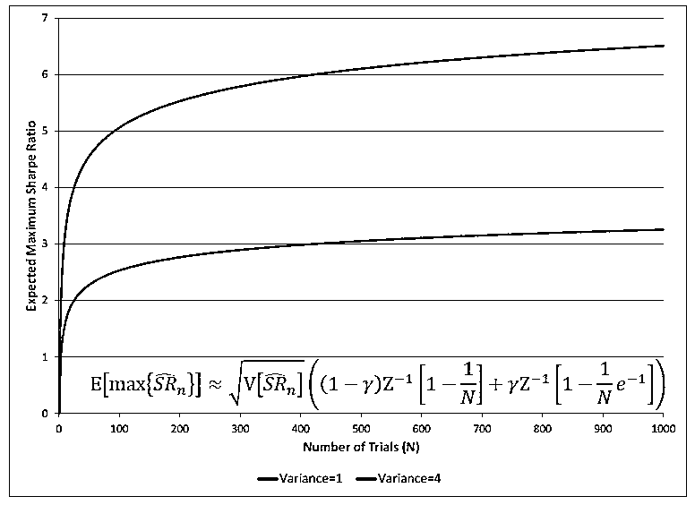

# 【量化核武】美丽的回测——教你定量计算过拟合概率

> 原文：[`mp.weixin.qq.com/s?__biz=MzAxNTc0Mjg0Mg==&mid=2653289314&idx=1&sn=87c5a12b23a875966db7be50d11f09cd&chksm=802e3977b759b061675d1988168c1fec06c602e8583fbcc9b76f87008e0c10b702acc85467a0&scene=27#wechat_redirect`](http://mp.weixin.qq.com/s?__biz=MzAxNTc0Mjg0Mg==&mid=2653289314&idx=1&sn=87c5a12b23a875966db7be50d11f09cd&chksm=802e3977b759b061675d1988168c1fec06c602e8583fbcc9b76f87008e0c10b702acc85467a0&scene=27#wechat_redirect)

**作者：**石川| 公众号专栏作者 | **[量信投资](https://mp.weixin.qq.com/s?__biz=MzIyMDEwNDk1Mg==&mid=2650877825&idx=1&sn=485602b08ac9ccc7c2bafbad5decda91&scene=21#wechat_redirect)** 创始合伙人，清华大学学士、硕士，麻省理工学院博士；精通各种概率模型和统计方法，擅长不确定性随机系统的建模及优化。**知乎专栏**：https://zhuanlan.zhihu.com/mitcshi。

本文首发**量化投资与机器学习**公众号

**未经授权，严禁转载**

**推荐阅读**

[1、经过多年交易之后你应该学到的东西（深度分享）](https://mp.weixin.qq.com/s?__biz=MzAxNTc0Mjg0Mg==&mid=2653289074&idx=1&sn=e859d363eef9249236244466a1af41b6&chksm=802e3867b759b1717f77e07a51ee5671e8115130c66562577280ba1243cba08218add04f1f00&token=449379994&lang=zh_CN&scene=21#wechat_redirect)

[2、监督学习标签在股市中的应用（代码+书籍）](https://mp.weixin.qq.com/s?__biz=MzAxNTc0Mjg0Mg==&mid=2653289050&idx=1&sn=60043a5c95b877dd329a5fd150ddacc4&chksm=802e384fb759b1598e500087374772059aa21b31ae104b3dca04331cf4b63a233c5e04c1945a&token=449379994&lang=zh_CN&scene=21#wechat_redirect)

[3、2018 年学习 Python 最好的 5 门课程](https://mp.weixin.qq.com/s?__biz=MzAxNTc0Mjg0Mg==&mid=2653289028&idx=1&sn=631cbc728b0f857713fc65841e48e5d1&chksm=802e3851b759b147dc92afded432db568d9d77a1b97ef22a1e1a376fa0bc39b55781c18b5f4f&token=449379994&lang=zh_CN&scene=21#wechat_redirect)

[4、全球投行顶尖机器学习团队全面分析](https://mp.weixin.qq.com/s?__biz=MzAxNTc0Mjg0Mg==&mid=2653289018&idx=1&sn=8c411f676c2c0d92b0dd218f041bee4b&chksm=802e382fb759b139ffebf633ac14cdd0f21938e4613fe632d5d9231dab3d2aca95a11628378a&token=449379994&lang=zh_CN&scene=21#wechat_redirect)

[5、使用 Tensorflow 预测股票市场变动](https://mp.weixin.qq.com/s?__biz=MzAxNTc0Mjg0Mg==&mid=2653289014&idx=1&sn=3762d405e332c599a21b48a7dc4df587&chksm=802e3823b759b135928d55044c2729aea9690f86752b680eb973d1a376dc53cfa18287d0060b&token=449379994&lang=zh_CN&scene=21#wechat_redirect)

[6、被投资圈残害的清北复交学生们](https://mp.weixin.qq.com/s?__biz=MzAxNTc0Mjg0Mg==&mid=2653289110&idx=1&sn=538d00046a15fb2f70a56be79f71e6b9&chksm=802e3883b759b1950252499ea9a7b1fadaa4748ec40b8a1a8d7da0d5c17db153bd86548060fb&token=1336933869&lang=zh_CN&scene=21#wechat_redirect)

[7、使用 LSTM 预测股票市场基于 Tensorflow](https://mp.weixin.qq.com/s?__biz=MzAxNTc0Mjg0Mg==&mid=2653289238&idx=1&sn=3144f5792f84455dd53c27a78e8a316c&chksm=802e3903b759b015da88acde4fcbc8547ab3e6acbb5a0897404bbefe1d8a414265d5d5766ee4&token=2020206794&lang=zh_CN&scene=21#wechat_redirect)

[8、手把手教你用 Numpy 构建神经网络(附代码)](https://mp.weixin.qq.com/s?__biz=MzAxNTc0Mjg0Mg==&mid=2653289274&idx=1&sn=f40be8372658c2c79fdd47c03d62e037&chksm=802e392fb759b039435fc6700ef5d45142cdfe72234586bd8de9b8dfabcc3264f2ae826def80&token=1003651614&lang=zh_CN&scene=21#wechat_redirect)

**摘要**

金融数据的信噪比很低，使得过拟合成为回测中的必然。本文介绍一个量化分析框架，它可以计算回测中过拟合的概率，有助于评价量化策略的有效性。

**引言**

武当山上，殷素素在张翠山自刎后也随即自杀，临死前嘱咐儿子张无忌“千万不要相信漂亮的女人。越是漂亮的女人，越会骗人。”

在量化投资中，回测（backtesting）就是这样一个漂亮的女人。

众所周知，金融数据中的信噪比很低。当我们在回测中尝试了大量的参数时、或是在选股时测试了大量的因子后，找出来效果最好的一组参数或者一个因子总能获得非常不错的效果。但这大概率是因为它们仅仅是对回测期内的噪音精准建模了。

*“If the researcher tries a large enough number of strategy configurations, a backtest can always be fit to any desired performance for a fixed sample length.”*

*译：对于给定样本长度，只要尝试足够多的参数配置，总能达到想要的风险收益特性*

来看一个例子。

以中证 500 的成分股为选股池、2010 年 1 月到 2018 年 10 月为回测期，评价不同的选股因子 —— 以该因子选出的前 50 支股票构建纯多头的投资组合的最终净值评价因子的效果。当测试了 20 个不同的因子后，最优秀的因子的净值为 2.29（同期中证 500 指数净值仅为 1.06）。这 20 个因子的净值如下图所示（紫色加粗的是最好的那个）。

如果把测试因子的个数从 20 个上升至 50 个，选股效果进一步提升，最好因子的净值从 2.29 上升至 2.40。下图是 50 个因子（包括最开始的 20 个）的选股效果，紫色加粗曲线依然为前 20 个因子中最好的、红色加粗曲线为这 50 个因子中最好的。

最后，我们把测试的个数上升至 100（这是一个任何量化选股报告中都会轻易突破的因子个数）。这 100 个因子中（包括之前 50 个），最好的因子的净值为 2.43，在前 50 个因子的基础上进一步提高了。下图中黑色加粗曲线代表了全部 100 个因子中最好的那个的选股净值。

考虑到这些因子之间不是完全相关，如果我们把这三个因子结合起来再配合更复杂的交易算法，一定能在回测期内获得更好的选股效果。**但是****，如果仅仅因为最终的策略中只用了三个因子就认为没有过拟合，那就大错特错了，因为在发现这三个因子的背后是 97 次失败的尝试。**

**当进行 multiple testing 时（同时检验很多不同的假设），效果最好的那个即便在统计上非常显著（比如有很低的 p-value 或者很高的 t-statistic），它是 false discovery 的概率仍然很高**（见[《出色不如走运 (II)》](https://mp.weixin.qq.com/s?__biz=MzIyMDEwNDk1Mg==&mid=2650878404&idx=1&sn=0dd382ac3f4952eed221384c0a0d2989&scene=21#wechat_redirect)）。不幸的是，这是金融圈学术界普遍存在的问题。学者们在顶刊上发表一个有效策略或者因子的时候，并不告诉读者这个发现的背后经历了多少失败的尝试。失败的尝试越多，这个发现其实是虚假的概率就越高。

**当我们乐此不疲的测试不同的参数组合或者尝试不同的因子时，其实只是在做一件事 ——** **过拟合****。最终被挑出来的往往是过拟合带来的 false discovery**。回测中过拟合的直接结果就是无法准确评价策略在样本外的效果。如果过拟合非常严重，即策略本身就是针对噪音构建的，那么它可能在实盘中是完全失效的、等待它的只有亏损。

**鉴于过拟合的普遍存在以及过拟合的严重后果，如何量化回测中过拟合的概率（Probability of Backtest Overfitting，简称 PBO）就显得至关重要。**本文就来介绍一种定量计算回测中过拟合概率的方法。

让我们从夏普率（Sharpe Ratio，简称 SR）说起。

**围绕夏普率的讨论**

**为计算回测的过拟合概率，需要比较不同参数下策略的效果；而为了比较不同策略的效果，就必须选定一个适当的指标。**在众多评价投资策略的指标中，夏普率无疑是最重要的，它是下文介绍的这个计算 PBO 框架中使用的策略评价指标。值得一提的是，这个框架本身不依赖于选择的指标，因此使用者也可以尝试其他评价策略的指标。 

关于回测的过拟合如何夸大夏普率（inflated Sharpe Ratio），学术界和业界有一些有意思的讨论。这里不妨做个简单梳理。

一般的经验认为策略在实盘中的夏普率是其在回测期内夏普率的 50%。**Harvey and Liu (2015) 定量计算了不同大小的夏普率在样本外的“打折程度”（他们称为 haircut），发现了 haircut 和 Sharpe Ratio 之间的非线性关系。打折程度 Haircut 的取值在 0 到 1 之间，等于 1 意味着 100% 折扣，即样本外的夏普率为零。**

下图来自 Harvey and Liu (2015)，显示了回测期内不同 number of tests（如测试的因子的个数，或者参数组的个数）时，Haircut 和夏普率的关系。三条不同的曲线代表三种不同的考虑 multiple testing 影响的方法（分别为 Bonferroni、Holm 以及 BHY 调整）。从图中不难看出，当样本内的夏普率很小时，由于过拟合的存在，打折率为 1，即样本外的夏普率为零。这种情况随着 number of tests 的增加而加重。

除此之外，Bailey 和 Lopez de Prado 两位学者也讨论了 inflated Sharpe Ratio 的问题（Bailey and Lopez de Prado 2012, 2014）。在构建量化策略时，人们往往选定一个策略类型，比如趋势追踪或者统计套利，然后在给定的模型下使用历史数据寻找最优的参数。在这个前提下，Bailey 和 Lopez de Prado 假设不同参数的策略的夏普率满足均值为 E[SR]、方差为 V(SR) 的正态分布。在这个假设下，他们计算得出 N 组不同的参数中得到的最大的夏普率的期望满足：

上式中 γ 是欧拉-马斯刻若尼常数（Euler-Mascheroni constant），约为 0.5772；Z 为标准正态分布的累积密度函数。从上式不难看出，**样本内的最大夏普率随 N 增大和 V(SR) 增大。**

下图显示了当 E[SR] = 0 时，仅仅靠增加 N 和 V(SR) 就可以逐渐提升最优夏普率。**增大 N 对应着在回测中增加 number of tests，增大 V(SR) 对应着完全不考虑业务依据而漫无目的的扩大参数的取值范围。这些都是造成过拟合的原因。**

以上的介绍说明，过拟合不可避免的高估了策略的夏普率，这会影响对策略有效性的评判。因此，定量计算回测中过拟合的概率就显得非常有必要。**它要回答的不是一个“是”或者“否”的问题（回测都存在过拟合了），而是定量的评价过拟合的程度。**

**量化过拟合的概率**

本节介绍 Bailey et al. (2017) 提出的计算回测中过拟合概率的框架。首先来定义 Probability of Backtest Overfitting。

**定义：**假设一共有 N 组不同的参数构建的策略，令 n* 代表样本内表现最好的那组参数（最好意味着样本内 SR 最高，或者其他类似的指标）；令 SR_OOS(n) 表示第 n 组参数在样本外的夏普率（下标 OOS 意为 out of sample），令 ME[SR_OOS] 表示所有 N 组参数在样本外夏普率的中位数；Probability of Backtest Overfitting（PBO）的定义如下：

由于样本内存在过拟合，因此样本内的最优参数不一定是样本外最好的。**回测中过拟合的概率 PBO 的定义为样本内最优参数 n* 在样本外的夏普率小于所有 N 组参数在样本外夏普率的中位数的概率。**

有了 PBO 的定义，下面马上来介绍计算 PBO 的框架。**它的名字叫 Combinatorially-Symmetric Cross-Validation（组合对称交叉验证，简称 CSCV）**。假设我们一共测试了 N 组参数，回测期长度为 T。CSCV 由以下步骤构成：

**第一步：**首先在回测期内使用 N 组参数各自跑策略，得到每组参数在 T 期的收益率序列，以此构建一个 T × N 阶矩阵 M，M 的每一列代表为某组参数 n 的 T 期收益率序列。

**第二步：**将 M 矩阵按行划分成 S 个互不相交的 T/S × N 阶子矩阵。例如，假设原始的 T = 1000 期，则可以取 S = 10，并把 M 划分成 10 个子集，每个子集为 100 × N 阶矩阵。

**第三步：**从全部 S 个子矩阵中，取出 S/2 个，令 C_s 代表所有可能的组合。举例来说，如果 S = 10，则从 10 个子集中取出 5 个，一共有 252 种组合方法，C_s 就是这 252 种组合的合集。

**第四步：**对 C_s 中的每一个特定组合 c，进行如下操作：

*   **4a. **将 c 包含的子矩阵拼在一起构成训练集 J，它是一个 S/2 × N 阶矩阵；

*   **4b. **将全部 S 个子矩阵中不被 c 包含的子矩阵（即 c 的补集）拼在一起构成测试集 J_c，它也是一个 S/2 × N 阶矩阵；

*   **4c. **在训练集 J 矩阵中，计算每一列收益率序列的夏普率，它们之中夏普率最大的对应的策略 n* 为样本内的最优策略；

*   **4d. **在对应的测试集 J_c 矩阵中，计算每一列收益率序列的夏普率，并求出 n* 这组参数在样本外的相对排名 w，w 的取值在 0 到 1 之间，1 意味着样本内最优的策略 n* 在样本外同样最优。

*   **4e. **定义 logit 变量如下：

由定义可知，如果 n* 在样本外的表现等于所有参数在样本外夏普率的中位数，则 w = 0.5，而 λ = 0。

**第五步：**上一步后会得到 λ 的经验分布 f(λ)，由此就可以求出 PBO：

通过考察 PBO 的大小，就能够定量的评价一个策略是否靠谱：真正有效的策略的 PBO 应该较小。

在一次题为 What to look for in a backtest 的演讲中，CSCV 的发明者之一 Dr. Marcos Lopez de Prado 指出该方法具有以下优点：

> 1. CSCV 保证了训练集和测试集同样大小，从而使得样本内外的夏普率具有可比性。
> 
> 2. 由于考虑了全部的组合，任何一个被用做训练集的组合都在之后反过来被当作测试集（反之亦然），这保证了训练集和测试集的数据是对称的，因此夏普率在样本外的降低只可能来自过拟合。
> 
> 3. CSCV 将整个 T 期数据划分成长度为 T/S 的 S 个子集，而非随机的从 T 期内选出一定长度的数据，这保证了策略收益率的时序相关性。
> 
> 4. 整个求解 PBO 的过程是 model-free 以及 non-parametric 的；它得到 λ 的经验分布 f(λ)，进而计算出过拟合的概率，不需要对 PBO 的模型或者参数做任何假设。

接下来就通过一个例子来应用 CSCV。

**一个例子**

在[《从 CTA 趋势策略的表现看量化投资面临的挑战》](https://mp.weixin.qq.com/s?__biz=MzIyMDEwNDk1Mg==&mid=2650878341&idx=1&sn=f5835016c7997cc2ed5738d0a6060bb2&scene=21#wechat_redirect)一文中，我们使用 15 种商品期货的指数定性分析了过去 5 年趋势追踪策略的表现。该文的实证采用的是最简单的双均线策略 —— 短周期均线上穿长周期均线策略时做多；短周期均线下穿长周期均线时做空。长、短周期就是策略的两个待优化的参数（由 LW 和 SW 表示）。下面就使用本文介绍的框架来计算优化这两个参数时的过拟合概率。

在回测中，令短周期均线参数 SW 的取值范围为 1 到 20、长周期均线参数 LW 的取值范围是 SW + 1 到 50，步长均为 1，因此一共有 790 组参数（N = 790）。令回测长度为 1000 个交易日。使用这 790 组参数分别进行回测，得到每组参数下策略在这 1000 个交易日内的收益率序列，从而构建原始的 M 矩阵（1000 × 790 阶）。

使用第四节介绍的 CSCV 框架分析 M 矩阵，假设分析中 S = 10，因此一共有 252 种（10 选 5）回测 + 测试集的配对。在计算 PBO 之前我们先来做一个实验。对于每一种配对，求出样本内最优参数的夏普率和该组参数在样本外的夏普率，这两个夏普率便构成一个样本点，因此一共有 252 个样本点。这 252 个点的散点图如下（其中红线为回归得到的线性关系）：

样本内最优参数的夏普率和其在样本外的夏普率之间的相关系数为 -0.36；上述回归直线的斜率为负也说明了这种负相关关系。**这说明，对于这个双均线趋势策略，样本内最好的参数倾向于在样本外有更差的表现。**

在进一步使用 CSCV 计算 PBO 之前，我们观察到**上图中存在一些****不正常****的现象 —— 这些散点的分布区域的上限似乎近似的坐落在一条直线上（下图），意味着这些点对应的训练集和测试集的夏普率之和大致相同。**

**出现这种现象的原因是****趋势策略非常依赖价格序列的路径****。**在整个 1000 个交易日的回测期内，趋势策略挣钱的表现集中在某些特定的时间。当我们采用 CSCV 将这 1000 个交易日划分成 252 个长度各为 500 的训练集、测试集配对时，这其中有相当一部分的训练集都包含了趋势策略最赚钱的那些特定时间，使得这些训练集中的最优参数相同。

对于这些训练集、测试集配对，它们的 n* 相同，因此它们在样本内、外全部 1000 个交易日内收益率的均值都是来自策略 n*，即均值相同。虽然这些配对中的训练集和测试集不尽相同，但由于收益率的波动率在整个回测期内较为稳定，因此训练集和测试集内的夏普率之和近似的等于这两个序列中收益率均值之和。综合以上两点就能够解释为什么这些配对的样本内、外夏普率之和非常接近。由于它们对应的 n* 恰好又是整段回测期内效果最好的参数，因此这些配对的散点构成了上图中散点分布中不正常的线性上限。

**为了减弱路径依赖对评判趋势策略过拟合程度的影响，我们对 CSCV 进行适当的改进，引入一定的随机性。**

在 CSCV 的第三、四步，不是考虑所有可能的组合，而是随机的构建训练集和测试集。具体的，将长度 1000 的回测期分成 50 个长度为 20 个交易日的子集。从这 50 个子集中，随机选出 13 个作为测试集、13 个作为训练集（13 这个数并没有什么特殊的含义），因此训练集和测试集的长度各为 260 个交易日。将上述过程重复 250 次，得到 250 个训练集、测试集配对，然后计算 λ 的经验分布 f(λ) 以及 PBO。

引入随机性后，再次画出样本内最优参数的夏普率和它在样本外的夏普率的散点图（下图），原始结果中不正常的线性上限消失了。**回归方程的斜率是 -0.49，说明样本内、外的夏普率之间存在负相关性。**

此外，λ 的经验分布 f(λ) 如下图所示：

通过 f(λ) 求出 PBO = 0.572 —— 在使用双均线构建趋势追踪策略时，回测中过拟合的概率高达 0.572。**一个靠谱的策略的 PBO 不应该这么高。因此，在使用双均线构建趋势策略时必须格外小心。**

本节的例子说明使用 CSCV 这个框架能够方便的计算出 PBO，从而评价一个策略是不是靠谱。此外，本节花了一定的篇幅指出了趋势策略的路径依赖对 CSCV 结果造成的影响。**通过它想要强调的是，再先进的统计方法也不应该代替我们的独立思考，我们必须为自己的回测结果负责。**

**结语**

2005 年，发表于 PLoS Medicine 上的一篇题为 Why most published research findings are false 的文章（Ioannidis 2005）引起了广泛的关注。该文指出科学界，特别是医学界有相当一部分所谓的显著发现都是错误的。**而原因之一正是经过大量测试后找出的那个最显著的往往是 false discovery**。2015 年医学界最权威的同行评审期刊之一柳叶刀（The Lancet）的主编 Dr. Horton 指出医学界一半的研究成果是错误的（Horton 2015）。

***“The case against science is straightforward: much of the scientific literature, perhaps half, may simply be untrue. ****Afflicted by studies with small sample sizes, tiny effects, invalid exploratory analyses, and flagrant conflicts of interest, together with an obsession for pursuing fashionable trends of dubious importance, science has taken a turn towards darkness.”*

虽然比医学界晚了差不多 10 年，但幸运的是，金融圈也已经意识到了 multiple testing 带来了太多的虚假发现（例如并不能挣钱的策略，或者是不能解释预期收益率截面差异的因子）。以 Dr. Campbell Harvey（学术界 —— 杜克大学商学院教授、前美国金融协会主席）和 Dr. Marcos Lopez de Prado（业界 —— AQR Capital, Head of Machine Learning）为代表的学者们从几年前开始就呼吁这个严峻的问题，并提出了对 multiple testing 造成的过高 false discover rate 的解决方法。我之前的文章[《出色不如走运 (II)》](https://mp.weixin.qq.com/s?__biz=MzIyMDEwNDk1Mg==&mid=2650878404&idx=1&sn=0dd382ac3f4952eed221384c0a0d2989&scene=21#wechat_redirect)对 Dr. Harvey 的一些研究进行了梳理，而本文介绍的回测中过拟合概率的量化手段则是 Dr. Lopez de Prado 和他的 co-authors 提出的。

一个量化策略的提出往往经过回测、模拟盘、实盘三个阶段。回测中有很多门道（见[《科学回测中的大学问》](https://mp.weixin.qq.com/s?__biz=MzIyMDEwNDk1Mg==&mid=2650877613&idx=1&sn=ee932ca4c69460d2f3e7e62e5bab5d3f&scene=21#wechat_redirect)）；回测准确与否对于该策略在实盘外的表现至关重要。由于金融数据的信噪比极低且难以分辨出数据中哪些是噪音、哪些是因果关系，这使得回测中或多或少都会存在过拟合。**如今，仅仅通过考察参数平原或者使用有限训练集、测试集来评价过拟合的危害是远远不够的。**希望学术界和业界提出的这些新方法能带给我们更多的启发。

**越美丽的回测，越会骗人**

****参考文献****

1\. Bailey, D. H. and M. Lopez de Prado (2012). The Sharpe ratio efficient frontier. Journal of Risk, Vol. 15(2), 3 – 44.

2\. Bailey, D. H. and M. Lopez de Prado (2014). The deflated Sharpe ratio: correcting for selection bias, backtest overfitting, and non-Normality. Journal of Portfolio Management, Vol. 40(5), 94 – 107.

3\. Bailey, D. H., J. M. Borwein, M. Lopez de Prado, and Q. J. Zhu (2017). The probability of backtest overfitting. Journal of Computational Finance, Vol. 20(4), 39 – 69.

4\. Harvey, C. R. and Y. Liu (2015). Backtesting. Journal of Portfolio Management, Vol. 42(1), 13 – 28.

5\. Horton, R. (2015). Offline: What is medicine’s 5 sigma? Lancet, Vol. 385(9976), 1380.

6\. Ioannidis, J. P. A. (2005). Why most published research findings are false. PLoS Medicine, Vol. 2(8), 696 – 701.

**近 期 文 章 预 告**

01、【年度系列】预测股市比你理解中的更加容易

[02、【年度系列】基于 Python 分析股票市场周期](https://mp.weixin.qq.com/s?__biz=MzAxNTc0Mjg0Mg==&mid=2653289211&idx=1&sn=d4ce13fa79cb6309f1676ab906136712&chksm=802e38eeb759b1f866b5935a85c010bd2af8c5db7c46a0e577c889b30f3dc9e6c3b268c0336f&token=2022524224&lang=zh_CN&scene=21#wechat_redirect)

03、【年度系列】MICI 因子模型、风险模型解读系列

[04、【年度系列】使用 LSTM 预测股票市场基于 Tensorflow](https://mp.weixin.qq.com/s?__biz=MzAxNTc0Mjg0Mg==&mid=2653289238&idx=1&sn=3144f5792f84455dd53c27a78e8a316c&chksm=802e3903b759b015da88acde4fcbc8547ab3e6acbb5a0897404bbefe1d8a414265d5d5766ee4&token=2020206794&lang=zh_CN&scene=21#wechat_redirect)

05、【年度系列】如何使用 LSTM 预测金融时序是有效的

06、【年度系列】解析预测财务和经济时间序列的神经网络

07、【年度系列】金融领域中白箱 AI

08、【年度系列】如何训练机器学会“低买高卖”

09、【年度系列】深度 Q 空间神经网络交易解析

10、【年度系列】深度解析均值回归交系列易 1—4

[11、【ML 系列】Seq2seq 与 Attention 模型一](https://mp.weixin.qq.com/s?__biz=MzAxNTc0Mjg0Mg==&mid=2653289147&idx=1&sn=09f954d3e4d74c102ef47a930b0f565b&chksm=802e38aeb759b1b89dd53aa556ca5ea7844c717376ac794f05489aae3d69c5997155775c49c3&token=1662274452&lang=zh_CN&scene=21#wechat_redirect)

[12、【ML 系列】Seq2seq 与 Attention 模型二](https://mp.weixin.qq.com/s?__biz=MzAxNTc0Mjg0Mg==&mid=2653289171&idx=1&sn=55b24be74249d2b5343af679b574d53f&chksm=802e38c6b759b1d068200093d01e181737fe10e32ec506cc137ddec92020e3552cfbb71e3cca&token=1662274452&lang=zh_CN&scene=21#wechat_redirect)

13、【ML 系列】使用递归神经网络（RNN）预测时序 Values

14、【华尔街量化金融面试 Q&A 系列】第四——十期

**在量化投资的道路上**

**你不是一个人在战斗！**