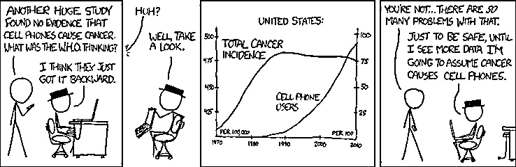
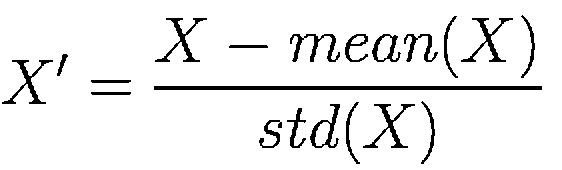
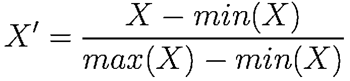
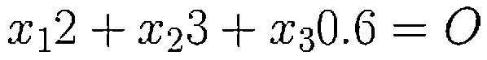
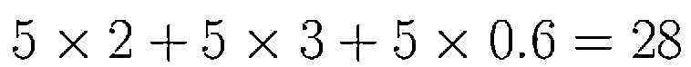
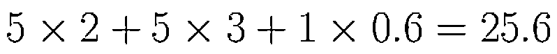
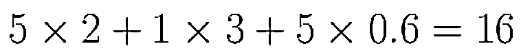
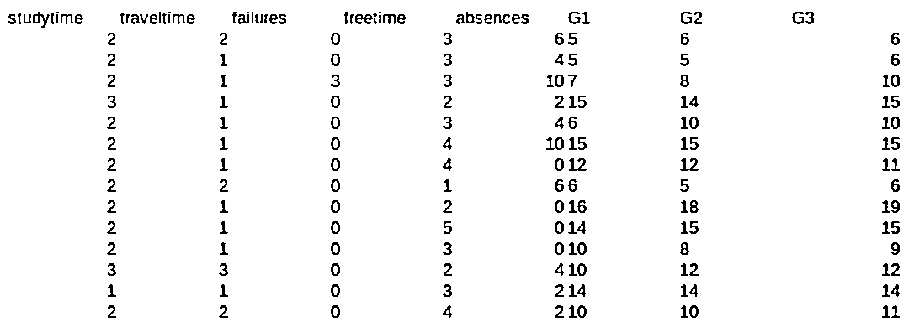
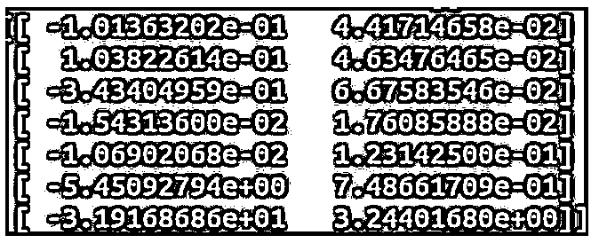

# 【ML 系列】一招鲜，判断哪些输入特征对神经网络是重要的！

> 原文：[`mp.weixin.qq.com/s?__biz=MzAxNTc0Mjg0Mg==&mid=2653289289&idx=1&sn=7c6cf3ed7f4f2859a0e95bc87914814c&chksm=802e395cb759b04adcee6afc1d44ffa2f3ceac2137796dad4ee9c51cdb165ce3463258647a3c&scene=27#wechat_redirect`](http://mp.weixin.qq.com/s?__biz=MzAxNTc0Mjg0Mg==&mid=2653289289&idx=1&sn=7c6cf3ed7f4f2859a0e95bc87914814c&chksm=802e395cb759b04adcee6afc1d44ffa2f3ceac2137796dad4ee9c51cdb165ce3463258647a3c&scene=27#wechat_redirect)


本期作者：Muhammad Ryan

本期编译：Peter

**推荐阅读**

[1、经过多年交易之后你应该学到的东西（深度分享）](https://mp.weixin.qq.com/s?__biz=MzAxNTc0Mjg0Mg==&mid=2653289074&idx=1&sn=e859d363eef9249236244466a1af41b6&chksm=802e3867b759b1717f77e07a51ee5671e8115130c66562577280ba1243cba08218add04f1f00&token=449379994&lang=zh_CN&scene=21#wechat_redirect)

[2、监督学习标签在股市中的应用（代码+书籍）](https://mp.weixin.qq.com/s?__biz=MzAxNTc0Mjg0Mg==&mid=2653289050&idx=1&sn=60043a5c95b877dd329a5fd150ddacc4&chksm=802e384fb759b1598e500087374772059aa21b31ae104b3dca04331cf4b63a233c5e04c1945a&token=449379994&lang=zh_CN&scene=21#wechat_redirect)

[3、2018 年学习 Python 最好的 5 门课程](https://mp.weixin.qq.com/s?__biz=MzAxNTc0Mjg0Mg==&mid=2653289028&idx=1&sn=631cbc728b0f857713fc65841e48e5d1&chksm=802e3851b759b147dc92afded432db568d9d77a1b97ef22a1e1a376fa0bc39b55781c18b5f4f&token=449379994&lang=zh_CN&scene=21#wechat_redirect)

[4、全球投行顶尖机器学习团队全面分析](https://mp.weixin.qq.com/s?__biz=MzAxNTc0Mjg0Mg==&mid=2653289018&idx=1&sn=8c411f676c2c0d92b0dd218f041bee4b&chksm=802e382fb759b139ffebf633ac14cdd0f21938e4613fe632d5d9231dab3d2aca95a11628378a&token=449379994&lang=zh_CN&scene=21#wechat_redirect)

[5、使用 Tensorflow 预测股票市场变动](https://mp.weixin.qq.com/s?__biz=MzAxNTc0Mjg0Mg==&mid=2653289014&idx=1&sn=3762d405e332c599a21b48a7dc4df587&chksm=802e3823b759b135928d55044c2729aea9690f86752b680eb973d1a376dc53cfa18287d0060b&token=449379994&lang=zh_CN&scene=21#wechat_redirect)

[6、被投资圈残害的清北复交学生们](https://mp.weixin.qq.com/s?__biz=MzAxNTc0Mjg0Mg==&mid=2653289110&idx=1&sn=538d00046a15fb2f70a56be79f71e6b9&chksm=802e3883b759b1950252499ea9a7b1fadaa4748ec40b8a1a8d7da0d5c17db153bd86548060fb&token=1336933869&lang=zh_CN&scene=21#wechat_redirect)

[7、使用 LSTM 预测股票市场基于 Tensorflow](https://mp.weixin.qq.com/s?__biz=MzAxNTc0Mjg0Mg==&mid=2653289238&idx=1&sn=3144f5792f84455dd53c27a78e8a316c&chksm=802e3903b759b015da88acde4fcbc8547ab3e6acbb5a0897404bbefe1d8a414265d5d5766ee4&token=2020206794&lang=zh_CN&scene=21#wechat_redirect)

[8、手把手教你用 Numpy 构建神经网络(附代码)](https://mp.weixin.qq.com/s?__biz=MzAxNTc0Mjg0Mg==&mid=2653289274&idx=1&sn=f40be8372658c2c79fdd47c03d62e037&chksm=802e392fb759b039435fc6700ef5d45142cdfe72234586bd8de9b8dfabcc3264f2ae826def80&token=1003651614&lang=zh_CN&scene=21#wechat_redirect)

**正文**

如果你看到这个题目，可能会马上回答 

主成分分析（PCA），因为冗余的输入是无用的。

没错，但这不是今天的重点。我们想知道的是输入特征对神经网络的预测计算有多重要。例如，通过学习时间、年龄、身高和缺席人数等几个预测因素来预测谁会通过考试。直觉上，决定学生是否通过考试的最重要的因素是学习时间。



在一个简单的线性回归中，我们可以通过看它的线性方程的权重来测量它。当然，假设预测器(X)已经标准化(X ')所以数据的量纲是相同的。





你可以在这两个函数中选择一个来归一化你的预测器。为了理解为什么只有使用权重我们才能衡量一个预测器相对于其他预测器的重要性，这里有一个例子。假设我们有一个线性方程。 



我们把所有的 x 用 5 代替： 



这是它贡献的部分，直观上来说，如果这个部分很大，当输入出错时，输出就会出错。例如，当我把 x3 从 5 换成 1，我们得到： 



如果把 x2 换成 1，得到的是： 



这里我们可以看到，由于权重的不同，x2 值的变化比 x3 值的变化影响更大。这很明显，但我想强调的是，除了权重之外，我们可以从输出值与参考值的偏差来看我们的输入有多重要。 

在神经网络中，输入的权重不是直接连接到输出层，而是连接到隐藏层。此外，与线性回归不同，神经网络是非线性的。为了看到输入的显著水平，我们寻找我们之前找到的第二个参数，如果我们随机改变输入值，它与神经网络输出值的偏差有多大。这里我们使用的参考值是原始错误值。为什么我称之为“original”。

让我们来看看真实的数据和真实的神经网络。预测学生在考试中的表现。

数据下载地址：*https://archive.ics.uci.edu/ml/datasets/student+performance*



下面是逐步来实现到在神经网络中输入显著水平：

1、使用下面的代码**构建**、**训练**和**保存神经网络**。在训练神经网络之后，我们不会直接使用它来预测，而是将训练过的模型保存到一个文件中。我们为什么要这么做？因为我们需要一个稳定的模型（记住，每次对模型进行训练，每次得到的权重和偏差都会不同）来计算每个输入的显著水平。

```py
import numpy as np
from keras.models import Sequential
from keras.layers import Activation, Dropout, Flatten, Dense, LSTM, RepeatVector, TimeDistributed
from sklearn.metrics import mean_squared_error, r2_score
from sklearn.svm import SVR
import csv
#setting
datafile = 'studentperform.csv'
studentmodel = 'studentmodel.h5'
batch_size = 10
hidden_neuron = 10
trainsize = 900
iterasi = 200
def generatemodel(totvar):
 # create and fit the LSTM network
 model = Sequential()
 model.add(Dense(3, batch_input_shape=(batch_size, totvar), activation='sigmoid'))
 model.add(Dense(hidden_neuron, activation='sigmoid'))
 model.add(Dense(1))
 model.compile(loss='mean_squared_error', optimizer='adam')
 return model
#read data
alldata = np.genfromtxt(datafile,delimiter=',')[1:]
#separate between training and test
trainparam = alldata[:900, :-1]
trainlabel = alldata[:900, -1]
testparam = alldata[900:, :-1]
testlabel = alldata[900:, -1]
trainparam = trainparam[len(trainparam)%10:]
trainlabel = trainlabel[len(trainlabel)%10:]
testparam = testparam[len(testparam)%10:]
testlabel = testlabel[len(testlabel)%10:]
###############
#normalization#
###############
trainparamnorm = np.zeros(np.shape(trainparam))
trainlabelnorm = np.zeros(np.shape(trainlabel))
testparamnorm = np.zeros(np.shape(testparam))
testlabelnorm = np.zeros(np.shape(testlabel))
print 'shape label adalah', np.shape(testlabelnorm)
#for param
for i in xrange(len(trainparam[0])-2):
 trainparamnorm[:,i] = (trainparam[:,i] - np.min(trainparam[:,i])) / (np.max(trainparam[:,i]) - np.min(trainparam[:,i]))
 testparamnorm[:,i] = (testparam[:,i] - np.min(trainparam[:,i])) / (np.max(trainparam[:,i]) - np.min(trainparam[:,i]))
for i in xrange(2):
 trainparamnorm[:,-2+i] = (trainparam[:,-2+i] - 0.0) / (20.0 - 0.0)
 testparamnorm[:,-2+i] = (testparam[:,-2+i] - 0.0) / (20.0 - 0.0)
#for label
trainlabelnorm = (trainlabel - np.min(trainlabel)) / (np.max(trainlabel) - np.min(trainlabel))
testlabelnorm = (testlabel - np.min(trainlabel)) / (np.max(trainlabel) - np.min(trainlabel))
######################
#build and save model#
######################
mod = generatemodel(len(trainparamnorm[0]))
mod.fit(trainparamnorm, trainlabelnorm, epochs=iterasi, batch_size=batch_size, verbose=2, shuffle=True)
#save trained model
mod.save(studentmodel)
```

2、加载模型并计算其误差：

```py
import numpy as np
from keras.models import Sequential
from keras.layers import Activation, Dropout, Flatten, Dense, LSTM, RepeatVector, TimeDistributed
from sklearn.metrics import mean_squared_error, r2_score
from sklearn.svm import SVR
import csv
import random
#setting
datafile = 'studentperform.csv'
studentmodel = 'studentmodel.h5'
batch_size = 10
hidden_neuron = 10
trainsize = 900
iterasi = 200
#read data
alldata = np.genfromtxt(datafile,delimiter=',')[1:]
#separate between training and test
trainparam = alldata[:900, :-1]
trainlabel = alldata[:900, -1]
testparam = alldata[900:, :-1]
testlabel = alldata[900:, -1]
trainparam = trainparam[len(trainparam)%10:]
trainlabel = trainlabel[len(trainlabel)%10:]
testparam = testparam[len(testparam)%10:]
testlabel = testlabel[len(testlabel)%10:]
###############
#normalization#
###############
trainparamnorm = np.zeros(np.shape(trainparam)).astype('float32')
trainlabelnorm = np.zeros(np.shape(trainlabel)).astype('float32')
testparamnorm = np.zeros(np.shape(testparam)).astype('float32')
testlabelnorm = np.zeros(np.shape(testlabel)).astype('float32')
#for param
for i in xrange(len(trainparam[0])-2):
 trainparamnorm[:,i] = (trainparam[:,i] - np.min(trainparam[:,i])) / (np.max(trainparam[:,i]) - np.min(trainparam[:,i]))
 testparamnorm[:,i] = (testparam[:,i] - np.min(trainparam[:,i])) / (np.max(trainparam[:,i]) - np.min(trainparam[:,i]))
for i in xrange(2):
 trainparamnorm[:,-2+i] = (trainparam[:,-2+i] - 0.0) / (20.0 - 0.0)
 testparamnorm[:,-2+i] = (testparam[:,-2+i] - 0.0) / (20.0 - 0.0)
#for label
trainlabelnorm = (trainlabel - np.min(trainlabel)) / (np.max(trainlabel) - np.min(trainlabel))
testlabelnorm = (testlabel - np.min(trainlabel)) / (np.max(trainlabel) - np.min(trainlabel))
#load trained model
mod = load_model(studentmodel)
G3pred = mod.predict(testparamnorm, batch_size=batch_size)
G3real = G3pred*20.0
err = mean_squared_error(testlabel, G3real)
print 'our error value is', err
```

在自己的电脑上，错误是 3.44525143751。这是初始误差。

3、**为随机改变每个输入值**。我们将随机生成 0 到 1 之间的数字，替换测试数据测中的归一化输入参数，并立即将修改后的输入数据应用到刚刚加载的神经网络中。为什么在 0 和 1 之间随机生成值呢？因为我们在上面一段使用了第二个归一化函数（使用最大值和最小值）来归一化我们的输入。对每个归一化输入进行迭代，随机改变其值，反复进行，得到大量的样本，从而得到误差的平均值和标准差。这样可以消除偶然因素（记住，我们随机产生值）。

```py
import numpy as np
from keras.models import Sequential
from keras.layers import Activation, Dropout, Flatten, Dense, LSTM, RepeatVector, TimeDistributed
from keras.models import load_model
from sklearn.metrics import mean_squared_error, r2_score
from sklearn.svm import SVR
import random
import os
import csv

#setting
datafile = 'studentperform.csv'
studentmodel = 'studentmodel.h5'
batch_size = 10
hidden_neuron = 10
trainsize = 900
iterasi = 200
randsample = 100

#read data
alldata = np.genfromtxt(datafile,delimiter=',')[1:]

#separate between training and test
trainparam = alldata[:900, :-1]
trainlabel = alldata[:900, -1]

testparam = alldata[900:, :-1]
testlabel = alldata[900:, -1]

trainparam = trainparam[len(trainparam)%10:]
trainlabel = trainlabel[len(trainlabel)%10:]

testparam = testparam[len(testparam)%10:]
testlabel = testlabel[len(testlabel)%10:]

###############
#normalization#
###############

trainparamnorm = np.zeros(np.shape(trainparam)).astype('float32')
trainlabelnorm = np.zeros(np.shape(trainlabel)).astype('float32')

testparamnorm = np.zeros(np.shape(testparam)).astype('float32')
testlabelnorm = np.zeros(np.shape(testlabel)).astype('float32')

#for param
for i in xrange(len(trainparam[0])-2):
  trainparamnorm[:,i] = (trainparam[:,i] - np.min(trainparam[:,i])) / (np.max(trainparam[:,i]) - np.min(trainparam[:,i]))
  testparamnorm[:,i] = (testparam[:,i] - np.min(trainparam[:,i])) / (np.max(trainparam[:,i]) - np.min(trainparam[:,i]))

for i in xrange(2):
  trainparamnorm[:,-2+i] = (trainparam[:,-2+i] - 0.0) / (20.0 - 0.0)
  testparamnorm[:,-2+i] = (testparam[:,-2+i] - 0.0) / (20.0 - 0.0)

#for label
trainlabelnorm = (trainlabel - np.min(trainlabel)) / (np.max(trainlabel) - np.min(trainlabel))
testlabelnorm = (testlabel - np.min(trainlabel)) / (np.max(trainlabel) - np.min(trainlabel))

#load trained model
mod = load_model(studentmodel)

G3pred = mod.predict(testparamnorm, batch_size=batch_size)
G3real = G3pred*20.0

errreal = mean_squared_error(testlabel, G3real)
print 'our error value is', errreal

################################
#permutation importance session#
################################

permutsample = np.zeros((randsample, len(testparamnorm[0])))
for trying in xrange(randsample):
  randval = np.zeros((len(testlabelnorm)))
  for i in xrange(len(testlabelnorm)):
    randval[i] = random.uniform(0,1)

  for i in xrange(len(testparamnorm[0])):
    permutinput = np.zeros(np.shape(testparamnorm))
    permutinput[:] = testparamnorm
    permutinput[:,i] = randval
    G3pred = mod.predict(permutinput, batch_size=batch_size)
    G3real = G3pred*20.0
    err = mean_squared_error(testlabel, G3real)
    permutsample[trying, i] = err

print permutsample
#print testparamnorm

#print mean and standard deviation of error
errperformance = np.zeros((len(testparamnorm[0]), 2))
for i in xrange(len(testparamnorm[0])):
  errperformance[i,0] = np.mean(permutsample[:,i])
  errperformance[i,1] = np.std(permutsample[:,i])
errperformance[:,0] = errreal - errperformance[:,0]

print errperformance
```

代码输出示例：



4、解释结果。我们得到了一些有趣的结果。首先是第二行，从随机输入值结果中得到的误差变化较小。这表明，参数“出行时间”对学生期末考试的成绩根本没有影响。在最后一行（G2）中，我们得到了一个非常高的误差。这说明第二阶段考试的成绩与期末考试成绩高度相关。从这个结果中，我们得到了输入的显著水平，即 G2、G1、考试不及格、空闲时间、缺勤、学习时间和上学时间。另一个有趣的结果是学习时间对期末考试的价值没有明显的影响。这个结果非常违反直觉。在现实生活研究中，必须进一步研究。

这就是一种简单的方法来测量神经网络输入的显著水平。该技术可应用于神经网络、支持向量机和随机森林等其他机器学习算法。

来源：https://medium.com/datadriveninvestor/a-simple-way-to-know-how-important-your-input-is-in-neural-network-86cbae0d3689

**近 期 文 章 预 告**

01、【年度系列】预测股市比你理解中的更加容易

[02、【年度系列】基于 Python 分析股票市场周期](https://mp.weixin.qq.com/s?__biz=MzAxNTc0Mjg0Mg==&mid=2653289211&idx=1&sn=d4ce13fa79cb6309f1676ab906136712&chksm=802e38eeb759b1f866b5935a85c010bd2af8c5db7c46a0e577c889b30f3dc9e6c3b268c0336f&token=2022524224&lang=zh_CN&scene=21#wechat_redirect)

03、【年度系列】MICI 因子模型、风险模型解读系列

[04、【年度系列】使用 LSTM 预测股票市场基于 Tensorflow](https://mp.weixin.qq.com/s?__biz=MzAxNTc0Mjg0Mg==&mid=2653289238&idx=1&sn=3144f5792f84455dd53c27a78e8a316c&chksm=802e3903b759b015da88acde4fcbc8547ab3e6acbb5a0897404bbefe1d8a414265d5d5766ee4&token=2020206794&lang=zh_CN&scene=21#wechat_redirect)

05、【年度系列】如何使用 LSTM 预测金融时序是有效的

06、【年度系列】解析预测财务和经济时间序列的神经网络

07、【年度系列】金融领域中白箱 AI

08、【年度系列】如何训练机器学会“低买高卖”

09、【年度系列】深度 Q 空间神经网络交易解析

10、【年度系列】深度解析均值回归交系列易 1—4

[11、【ML 系列】Seq2seq 与 Attention 模型一](https://mp.weixin.qq.com/s?__biz=MzAxNTc0Mjg0Mg==&mid=2653289147&idx=1&sn=09f954d3e4d74c102ef47a930b0f565b&chksm=802e38aeb759b1b89dd53aa556ca5ea7844c717376ac794f05489aae3d69c5997155775c49c3&token=1662274452&lang=zh_CN&scene=21#wechat_redirect)

[12、【ML 系列】Seq2seq 与 Attention 模型二](https://mp.weixin.qq.com/s?__biz=MzAxNTc0Mjg0Mg==&mid=2653289171&idx=1&sn=55b24be74249d2b5343af679b574d53f&chksm=802e38c6b759b1d068200093d01e181737fe10e32ec506cc137ddec92020e3552cfbb71e3cca&token=1662274452&lang=zh_CN&scene=21#wechat_redirect)

13、【ML 系列】使用递归神经网络（RNN）预测时序 Values

14、【华尔街量化金融面试 Q&A 系列】第四——十期

**在量化投资的道路上**

**你不是一个人在战斗！**