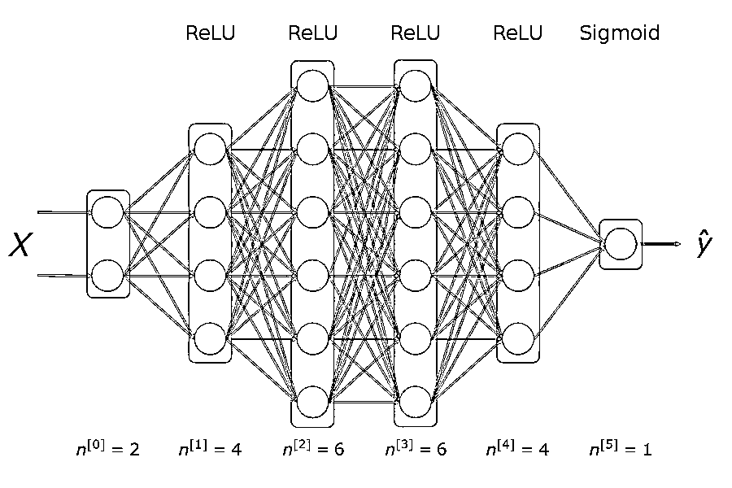
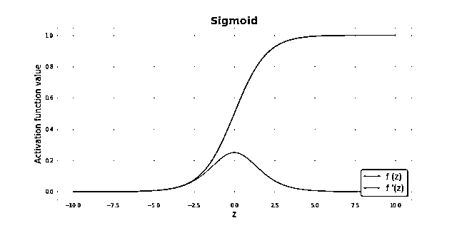
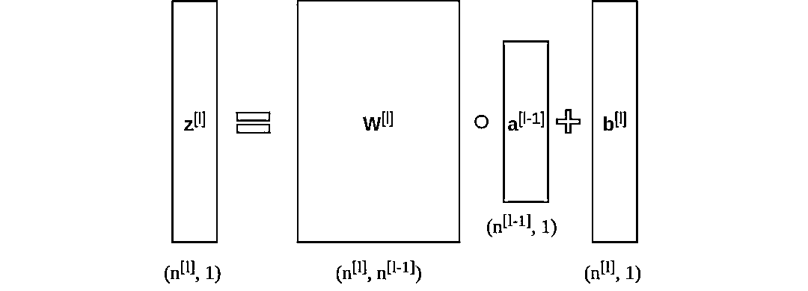
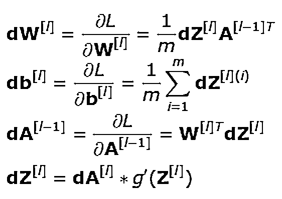
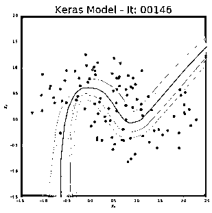

# 【ML 系列】手把手教你用 Numpy 构建神经网络！（附代码）

> 原文：[`mp.weixin.qq.com/s?__biz=MzAxNTc0Mjg0Mg==&mid=2653289274&idx=1&sn=f40be8372658c2c79fdd47c03d62e037&chksm=802e392fb759b039435fc6700ef5d45142cdfe72234586bd8de9b8dfabcc3264f2ae826def80&scene=27#wechat_redirect`](http://mp.weixin.qq.com/s?__biz=MzAxNTc0Mjg0Mg==&mid=2653289274&idx=1&sn=f40be8372658c2c79fdd47c03d62e037&chksm=802e392fb759b039435fc6700ef5d45142cdfe72234586bd8de9b8dfabcc3264f2ae826def80&scene=27#wechat_redirect)


**公众号全新 Logo 预览上线**

本期作者：Piotr Skalski

本期编译：1+1=3

**推荐阅读**

[1、经过多年交易之后你应该学到的东西（深度分享）](https://mp.weixin.qq.com/s?__biz=MzAxNTc0Mjg0Mg==&mid=2653289074&idx=1&sn=e859d363eef9249236244466a1af41b6&chksm=802e3867b759b1717f77e07a51ee5671e8115130c66562577280ba1243cba08218add04f1f00&token=449379994&lang=zh_CN&scene=21#wechat_redirect)

[2、监督学习标签在股市中的应用（代码+书籍）](https://mp.weixin.qq.com/s?__biz=MzAxNTc0Mjg0Mg==&mid=2653289050&idx=1&sn=60043a5c95b877dd329a5fd150ddacc4&chksm=802e384fb759b1598e500087374772059aa21b31ae104b3dca04331cf4b63a233c5e04c1945a&token=449379994&lang=zh_CN&scene=21#wechat_redirect)

[3、2018 年学习 Python 最好的 5 门课程](https://mp.weixin.qq.com/s?__biz=MzAxNTc0Mjg0Mg==&mid=2653289028&idx=1&sn=631cbc728b0f857713fc65841e48e5d1&chksm=802e3851b759b147dc92afded432db568d9d77a1b97ef22a1e1a376fa0bc39b55781c18b5f4f&token=449379994&lang=zh_CN&scene=21#wechat_redirect)

[4、全球投行顶尖机器学习团队全面分析](https://mp.weixin.qq.com/s?__biz=MzAxNTc0Mjg0Mg==&mid=2653289018&idx=1&sn=8c411f676c2c0d92b0dd218f041bee4b&chksm=802e382fb759b139ffebf633ac14cdd0f21938e4613fe632d5d9231dab3d2aca95a11628378a&token=449379994&lang=zh_CN&scene=21#wechat_redirect)

[5、使用 Tensorflow 预测股票市场变动](https://mp.weixin.qq.com/s?__biz=MzAxNTc0Mjg0Mg==&mid=2653289014&idx=1&sn=3762d405e332c599a21b48a7dc4df587&chksm=802e3823b759b135928d55044c2729aea9690f86752b680eb973d1a376dc53cfa18287d0060b&token=449379994&lang=zh_CN&scene=21#wechat_redirect)

[6、被投资圈残害的清北复交学生们](https://mp.weixin.qq.com/s?__biz=MzAxNTc0Mjg0Mg==&mid=2653289110&idx=1&sn=538d00046a15fb2f70a56be79f71e6b9&chksm=802e3883b759b1950252499ea9a7b1fadaa4748ec40b8a1a8d7da0d5c17db153bd86548060fb&token=1336933869&lang=zh_CN&scene=21#wechat_redirect)

[7、使用 LSTM 预测股票市场基于 Tensorflow](https://mp.weixin.qq.com/s?__biz=MzAxNTc0Mjg0Mg==&mid=2653289238&idx=1&sn=3144f5792f84455dd53c27a78e8a316c&chksm=802e3903b759b015da88acde4fcbc8547ab3e6acbb5a0897404bbefe1d8a414265d5d5766ee4&token=2020206794&lang=zh_CN&scene=21#wechat_redirect)

**前言**

比如使用 Keras，TensorFlow 或 PyTorch 这样的高级框架，我们可以快速构建非常复杂的模型。但是，需要花时间去了解其内部结构并理解基本原理。今天，将尝试利用现有知识，并仅使用 Numpy 去构建一个完全可操作的神经网络。最后，我们还将测试我们的模型，并将其性能与 Keras 构建的 NN 进行比较。



**准备操作**

在我们开始编程之前，先准备一个基本的路线图。 我们的目标是创建一个程序，该程序能够创建具有指定体系结构（层的数量和大小以及适当的激活函数）的密集连接的神经网络。 下图给出了这种网络的例子。最重要的是，我们必须能够训练该网络并使用它进行预测。


上图展示了在训练 NN 期间必须执行的操作。 它还显示了在不同阶段单次迭代，我们需要更新和读取的参数数量。 构建正确的数据结构并巧妙地管理其状态是我们任务中最困难的部分之一。 


**创建神经网络层**

从每一层启动权重矩阵 W 和偏置向量 b 开始。上标[l]表示当前层的索引（从 1 开始计数），值 n 表示给定层中的单元数。 假设描述 NN 架构的信息将以类似于 Snippet 1 中所示的列表的形式传递给我们的程序。列表中的每个项目都是描述单个网络层的基本参数的字典：input_dim——作为输入层提供信号矢量的大小，output_dim - 作为输出层获得激活矢量的大小。activation - 在层内使用的激活函数。

```py
import numpy as np

NN_ARCHITECTURE = [
    {"input_dim": 2, "output_dim": 25, "activation": "relu"},
    {"input_dim": 25, "output_dim": 50, "activation": "relu"},
    {"input_dim": 50, "output_dim": 50, "activation": "relu"},
    {"input_dim": 50, "output_dim": 25, "activation": "relu"},
    {"input_dim": 25, "output_dim": 1, "activation": "sigmoid"},
]
```

最后，让我们关注在这一部分中必须完成的主要任务——层参数的初始化。那些已经看过上面代码并对 Numpy 有一定经验的人注意到，矩阵 W 和向量 b 已经被小的随机数填充了。这种做法并非偶然。权重值不能用相同的数字初始化，因为这会导致破坏对称问题。基本上，如果所有的权值都是一样的，不管输入 X 是多少，隐藏层中的所有单位也是一样的。在某种程度上，我们陷入了最初的状态，没有任何逃脱的希望，无论训练我们的模型多长时间，我们的网络有多深。线性代数是不会原谅你的。

在第一次迭代中，使用小值可以提高算法的效率。下图中的 sigmoid 函数，我们可以看到，对于较大的值，它几乎是平的，这对 NN 的学习速度有显著的影响。总之，使用小随机数进行参数初始化是一种简单的方法，但它保证了我们的算法有足够好的起点。准备好的参数值存储在 python 字典中，带有唯一标识其父层的键。字典在函数末尾返回，因此我们将在算法的下一个阶段访问它的内容。

```py
def init_layers(nn_architecture, seed = 99):
    # random seed initiation
    np.random.seed(seed)
    # number of layers in our neural network
    number_of_layers = len(nn_architecture)
    # parameters storage initiation
    params_values = {}

    # iteration over network layers
    for idx, layer in enumerate(nn_architecture):
        # we number network layers from 1
        layer_idx = idx + 1

        # extracting the number of units in layers
        layer_input_size = layer["input_dim"]
        layer_output_size = layer["output_dim"]

        # initiating the values of the W matrix
        # and vector b for subsequent layers
        params_values['W' + str(layer_idx)] = np.random.randn(
            layer_output_size, layer_input_size) * 0.1
        params_values['b' + str(layer_idx)] = np.random.randn(
            layer_output_size, 1) * 0.1

    return params_values
```

**激活函数**

在我们将要使用的所有函数中，有一些非常简单但功能强大的函数。激活函数可以写在一行代码中，但是它们提供了他们所需要的神经网络非线性和表现力。**“没有它们，我们的神经网络就会变成线性函数的组合，所以它本身就是一个线性函数”**。它有很多激活功能，但在这个项目中，使用其中两种功能——sigmoid 和 ReLU。为了能够运行一个完整的循环并同时向前和向后传播，我们还需要准备它们的导数。



```py
def sigmoid(Z):
    return 1/(1+np.exp(-Z))

def relu(Z):
    return np.maximum(0,Z)

def sigmoid_backward(dA, Z):
    sig = sigmoid(Z)
    return dA * sig * (1 - sig)

def relu_backward(dA, Z):
    dZ = np.array(dA, copy = True)
    dZ[Z <= 0] = 0;
    return dZ;
```

**向前传播**

这部分代码可能是最直观、最容易理解的。给定上一层输入信号，计算仿射变换 Z，然后应用选定的激活函数。通过使用 Numpy，我们可以利用向量化执行矩阵操作。这样做消除了迭代，大大加快了计算速度。除了计算出的矩阵 A，我们的函数还返回中间值 Z。


```py
def single_layer_forward_propagation(A_prev, W_curr, b_curr, activation="relu"):
    Z_curr = np.dot(W_curr, A_prev) + b_curr

    if activation is "relu":
        activation_func = relu
    elif activation is "sigmoid":
        activation_func = sigmoid
    else:
        raise Exception('Non-supported activation function')

    return activation_func(Z_curr), Z_curr
```



随着 single_layer_forward_propagation 函数的完成，我们可以轻松地向前构建整个步骤。这是一个稍微复杂一点的函数，它的作用不仅是执行预测，还包含中间值的集合。

```py
def full_forward_propagation(X, params_values, nn_architecture):
    memory = {}
    A_curr = X

    for idx, layer in enumerate(nn_architecture):
        layer_idx = idx + 1
        A_prev = A_curr

        activ_function_curr = layer["activation"]
        W_curr = params_values["W" + str(layer_idx)]
        b_curr = params_values["b" + str(layer_idx)]
        A_curr, Z_curr = single_layer_forward_propagation(A_prev, W_curr, b_curr, activ_function_curr)

        memory["A" + str(idx)] = A_prev
        memory["Z" + str(layer_idx)] = Z_curr

    return A_curr, memory
```

**损失函数**

为了监控项目进展并确保我们正在朝着期望的方向前进，我们也应该计算损失函数的值。“一般来说，损失函数是用来表示我们离‘理想的’解决方案还有多远”。它是根据我们计划解决的问题进行选择的，像 Keras 这样的框架有很多选择。因为我打算测试我们的 NN 在两个类之间的点的分类，我们决定使用二进制交叉熵，它是由下面的公式定义的。还有，我们还决定实现一个函数来计算我们的准确性。


```py
def get_cost_value(Y_hat, Y):
    m = Y_hat.shape[1]
    cost = -1 / m * (np.dot(Y, np.log(Y_hat).T) + np.dot(1 - Y, np.log(1 - Y_hat).T))
    return np.squeeze(cost)

def convert_prob_into_class(probs):
    probs_ = np.copy(probs)
    probs_[probs_ > 0.5] = 1
    probs_[probs_ <= 0.5] = 0
    return probs_

def get_accuracy_value(Y_hat, Y):
    Y_hat_ = convert_prob_into_class(Y_hat)
    return (Y_hat_ == Y).all(axis=0).mean()
```

**单层反向传播步骤**

遗憾的是，许多缺乏经验的深度学习爱好者认为反向传播是一种令人生畏且难以理解的算法。微积分和线性代数的结合常常使那些没有受过扎实的数学训练的人望而却步。

```py
def single_layer_backward_propagation(dA_curr, W_curr, b_curr, Z_curr, A_prev, activation="relu"):
    m = A_prev.shape[1]

    if activation is "relu":
        backward_activation_func = relu_backward
    elif activation is "sigmoid":
        backward_activation_func = sigmoid_backward
    else:
        raise Exception('Non-supported activation function')

    dZ_curr = backward_activation_func(dA_curr, Z_curr)
    dW_curr = np.dot(dZ_curr, A_prev.T) / m
    db_curr = np.sum(dZ_curr, axis=1, keepdims=True) / m
    dA_prev = np.dot(W_curr.T, dZ_curr)

    return dA_prev, dW_curr, db_curr
```

人们常常把反向宣传播与梯度下降混淆，但实际上这是两个独立的问题。第一种方法的目的是有效地计算梯度，而第二种方法是利用计算得到的梯度进行优化。在 NN 中，我们计算代价函数关于参数的梯度，但是反向传播可以用来计算任何函数的导数。该算法的本质是递归使用微分学中已知的链式法则——计算集合其他函数而得到的函数的导数，我们已经知道这些函数的导数。这个过程对于一个网络层可以用下面的公式来描述。




就像前向传播一样，将计算分为两个独立的函数。第一个侧重于一个单独的层，可以归结为用 Numpy 重写上面的公式。第二个表示完全反向传播，主要处理在三个字典中读取和更新值的关键值。我们从计算成本函数对正向传播的预测向量结果的导数开始。这很简单，因为它只包括重写下面的公式。然后遍历网络的各个层，从最后开始，根据上图所示的图计算关于所有参数的导数。最后，函数返回一个 Python 字典，其中包含我们要查找的梯度。


```py
def full_backward_propagation(Y_hat, Y, memory, params_values, nn_architecture):
    grads_values = {}
    m = Y.shape[1]
    Y = Y.reshape(Y_hat.shape)

    dA_prev = - (np.divide(Y, Y_hat) - np.divide(1 - Y, 1 - Y_hat));

    for layer_idx_prev, layer in reversed(list(enumerate(nn_architecture))):
        layer_idx_curr = layer_idx_prev + 1
        activ_function_curr = layer["activation"]

        dA_curr = dA_prev

        A_prev = memory["A" + str(layer_idx_prev)]
        Z_curr = memory["Z" + str(layer_idx_curr)]
        W_curr = params_values["W" + str(layer_idx_curr)]
        b_curr = params_values["b" + str(layer_idx_curr)]

        dA_prev, dW_curr, db_curr = single_layer_backward_propagation(
            dA_curr, W_curr, b_curr, Z_curr, A_prev, activ_function_curr)

        grads_values["dW" + str(layer_idx_curr)] = dW_curr
        grads_values["db" + str(layer_idx_curr)] = db_curr

    return grads_values
```

**更新参数值**

该方法的目标是使用梯度优化更新网络参数。通过这种方式，我们试图使我们的目标函数更接近最小值。为了完成这项任务，我们将使用两个字典作为函数参数：params_values（存储参数的当前值）和 grads_values（存储相对于这些参数计算的成本函数导数）。现在你只需要对每一层应用下面的方程。这是一个非常简单的优化算法，我们决定使用它，因为它是更高级优化器的一个很好的起点。


```py
def update(params_values, grads_values, nn_architecture, learning_rate):
    for idx, layer in enumerate(nn_architecture):
        layer_idx = idx + 1
        params_values["W" + str(layer_idx)] -= learning_rate * grads_values["dW" + str(layer_idx)]        
        params_values["b" + str(layer_idx)] -= learning_rate * grads_values["db" + str(layer_idx)]

    return params_values;
```

**综合讨论**

最难的部分已经在前面全部概述完毕。我们已经准备好了所有必要的功能，现在我们只需要把它们按正确的顺序放在一起。为了进行预测，我们只需要使用接收到的权重矩阵和一组测试数据运行完整的正向传播。

```py
def train(X, Y, nn_architecture, epochs, learning_rate):
    params_values = init_layers(nn_architecture, 2)
    cost_history = []
    accuracy_history = []

    for i in range(epochs):
        Y_hat, cashe = full_forward_propagation(X, params_values, nn_architecture)
        cost = get_cost_value(Y_hat, Y)
        cost_history.append(cost)
        accuracy = get_accuracy_value(Y_hat, Y)
        accuracy_history.append(accuracy)

        grads_values = full_backward_propagation(Y_hat, Y, cashe, params_values, nn_architecture)
        params_values = update(params_values, grads_values, nn_architecture, learning_rate)

    return params_values, cost_history, accuracy_history
```

**与 Keras 比较**

现在是时候看看我们的模型能否解决一个简单的分类问题了。我们生成了一个由两个类的组成的数据集，如下图所示。让我们试着训练我们的模型去分类这个数据集。为了便于比较，还使用 Keras 编写了一个框架进行比较。两种模型具有相同的体系结构和学习速率。最终，Numpy 模型和 Keras 模型在测试集上的准确率都达到了 95%，但是我们的模型需要几十倍的时间才能达到这样的准确率。在我看来，这种状态主要是由于缺乏适当的优化。

```py
N_SAMPLES = 1000
TEST_SIZE = 0.1

X, y = make_moons(n_samples = N_SAMPLES, noise=0.2, random_state=100)
X_train, X_test, y_train, y_test = train_test_split(X, y, test_size=TEST_SIZE, random_state=42)

def make_plot(X, y, plot_name, file_name=None, XX=None, YY=None, preds=None, dark=False):
    if (dark):
        plt.style.use('dark_background')
    else:
        sns.set_style("whitegrid")
    plt.figure(figsize=(16,12))
    axes = plt.gca()
    axes.set(xlabel="$X_1$", ylabel="$X_2$")
    plt.title(plot_name, fontsize=30)
    plt.subplots_adjust(left=0.20)
    plt.subplots_adjust(right=0.80)
    if(XX is not None and YY is not None and preds is not None):
        plt.contourf(XX, YY, preds.reshape(XX.shape), 25, alpha = 1, cmap=cm.Spectral)
        plt.contour(XX, YY, preds.reshape(XX.shape), levels=[.5], cmap="Greys", vmin=0, vmax=.6)
    plt.scatter(X[:, 0], X[:, 1], c=y.ravel(), s=40, cmap=plt.cm.Spectral, edgecolors='black')
    if(file_name):
        plt.savefig(file_name)
        plt.close()
make_plot(X, y, "Dataset")
```


**NN 模型测试**

```py
# 训练
params_values = train(np.transpose(X_train), np.transpose(y_train.reshape((y_train.shape[0], 1))), NN_ARCHITECTURE, 10000, 0.01)
# 预测
Y_test_hat, _ = full_forward_propagation(np.transpose(X_test), params_values, NN_ARCHITECTURE)

acc_test = get_accuracy_value(Y_test_hat, np.transpose(y_test.reshape((y_test.shape[0], 1))))
print("Test set accuracy: {:.2f}".format(acc_test))
```

```py
Test set accuracy: 0.98 
```


**Keras 模型测试**

```py
model = Sequential()
model.add(Dense(25, input_dim=2,activation='relu'))
model.add(Dense(50, activation='relu'))
model.add(Dense(50, activation='relu'))
model.add(Dense(25, activation='relu'))
model.add(Dense(1, activation='sigmoid'))

model.compile(loss='binary_crossentropy', optimizer="sgd", metrics=['accuracy'])

# 训练
history = model.fit(X_train, y_train, epochs=200, verbose=0)

Y_test_hat = model.predict_classes(X_test)
acc_test = accuracy_score(y_test, Y_test_hat)
print("Test set accuracy: {:.2f} - Goliath".format(acc_test))
```

```py
Test set accuracy: 0.98 
```



**近 期 文 章 预 告**

01、【年度系列】预测股市比你理解中的更加容易

[02、【年度系列】基于 Python 分析股票市场周期](https://mp.weixin.qq.com/s?__biz=MzAxNTc0Mjg0Mg==&mid=2653289211&idx=1&sn=d4ce13fa79cb6309f1676ab906136712&chksm=802e38eeb759b1f866b5935a85c010bd2af8c5db7c46a0e577c889b30f3dc9e6c3b268c0336f&token=2022524224&lang=zh_CN&scene=21#wechat_redirect)

03、【年度系列】MICI 因子模型、风险模型解读系列

[04、【年度系列】使用 LSTM 预测股票市场基于 Tensorflow](https://mp.weixin.qq.com/s?__biz=MzAxNTc0Mjg0Mg==&mid=2653289238&idx=1&sn=3144f5792f84455dd53c27a78e8a316c&chksm=802e3903b759b015da88acde4fcbc8547ab3e6acbb5a0897404bbefe1d8a414265d5d5766ee4&token=2020206794&lang=zh_CN&scene=21#wechat_redirect)

05、【年度系列】如何使用 LSTM 预测金融时序是有效的

06、【年度系列】解析预测财务和经济时间序列的神经网络

07、【年度系列】金融领域中白箱 AI

08、【年度系列】如何训练机器学会“低买高卖”

09、【年度系列】深度 Q 空间神经网络交易解析

10、【年度系列】深度解析均值回归交系列易 1—4

[11、【ML 系列】Seq2seq 与 Attention 模型一](https://mp.weixin.qq.com/s?__biz=MzAxNTc0Mjg0Mg==&mid=2653289147&idx=1&sn=09f954d3e4d74c102ef47a930b0f565b&chksm=802e38aeb759b1b89dd53aa556ca5ea7844c717376ac794f05489aae3d69c5997155775c49c3&token=1662274452&lang=zh_CN&scene=21#wechat_redirect)

[12、【ML 系列】Seq2seq 与 Attention 模型二](https://mp.weixin.qq.com/s?__biz=MzAxNTc0Mjg0Mg==&mid=2653289171&idx=1&sn=55b24be74249d2b5343af679b574d53f&chksm=802e38c6b759b1d068200093d01e181737fe10e32ec506cc137ddec92020e3552cfbb71e3cca&token=1662274452&lang=zh_CN&scene=21#wechat_redirect)

13、【ML 系列】使用递归神经网络（RNN）预测时序 Values

14、【华尔街量化金融面试 Q&A 系列】第四——十期

**在量化投资的道路上**

**你不是一个人在战斗！**