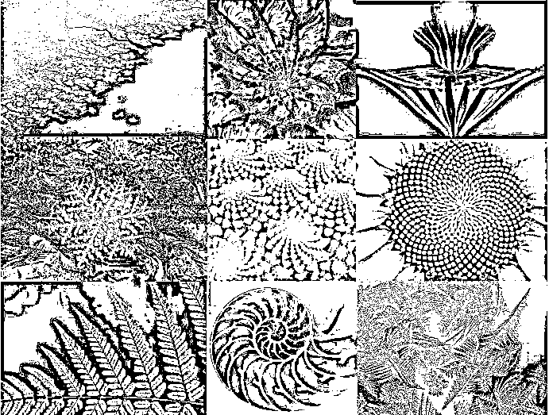
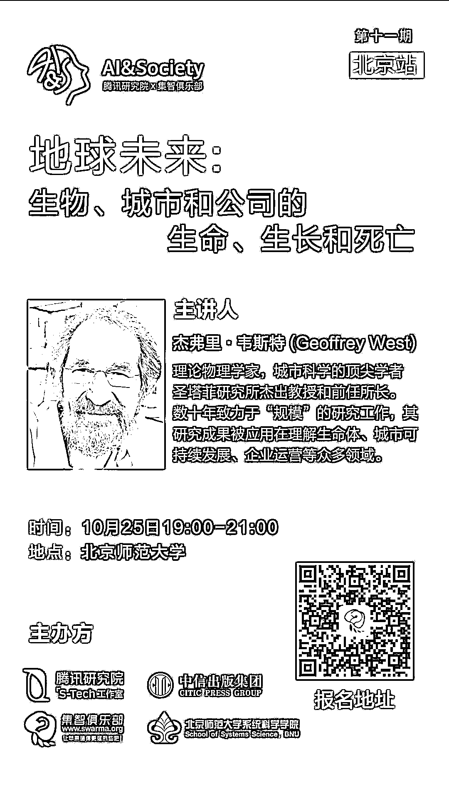
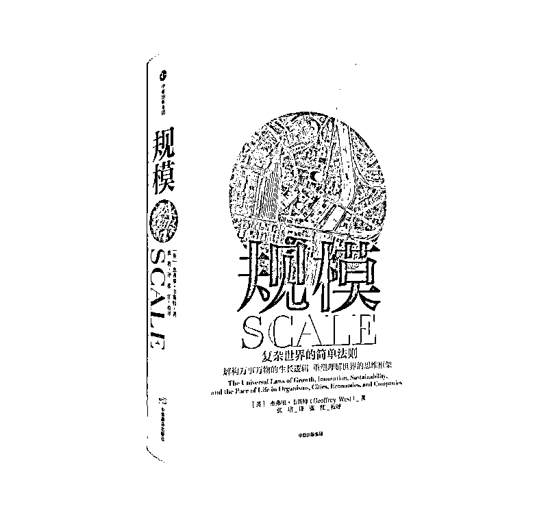

# 《规模》作者 Geoffrey West 受邀来华，快来报名参加吧！

> 原文：[`mp.weixin.qq.com/s?__biz=MzAxNTc0Mjg0Mg==&mid=2653289251&idx=1&sn=1a84578080ef0374a5914bc08e3c5196&chksm=802e3936b759b020c8002497e0c2041321f5e1a8b1e98ece8bc64f9d569702dcfb671adc33e8&scene=27#wechat_redirect`](http://mp.weixin.qq.com/s?__biz=MzAxNTc0Mjg0Mg==&mid=2653289251&idx=1&sn=1a84578080ef0374a5914bc08e3c5196&chksm=802e3936b759b020c8002497e0c2041321f5e1a8b1e98ece8bc64f9d569702dcfb671adc33e8&scene=27#wechat_redirect)

为了挖掘在**AI 与社会研究**交叉领域有想法的研究者，促进思维碰撞，**腾讯研究院 S-Tech 工作室与集智俱乐部**共同打造了“**AI&Society**”的系列学术沙龙活动。

 ******本期重磅主讲！****** 

****《规模》作者 Geoffrey West****

Geoffrey West，理论物理学家，城市科学的顶尖学者，圣塔菲研究所杰出教授和前任所长，曾入选《时代周刊》全球最具影响力 100 人。数十年致力于“规模”的研究工作，其研究成果被应用在理解生命体、城市可持续发展、企业运营等众多领域，被业内奉为“跨学科诺贝奖”的不二人选。

#  ****AI&Society 第十一期**** 

集智俱乐部联合腾讯研究院、中信出版集团、北京师范大学系统科学学院，邀请圣塔菲研究所杰出教授和前任所长、畅销科普书《规模》作者 Geoffrey West 先生，作为 AI&Society 系列沙龙第十一期的主讲嘉宾，带来一场精彩的主题演讲，并与学界业界多位大咖进行对谈。

# 

**主持人**

*   **张 江  | **北京师范大学系统科学学院教授，集智俱乐部创始人，腾讯研究院特聘顾问

#  ****演讲主题**** 

## 

地球未来：生物体、城市和公司的生命、生长与死亡

**The future of the planet: life, growth and death in organisms, cities and companies**

为什么我们到一定年龄就会停止成长？

为什么我们可以活到 100 岁？

为什么我们每天需要睡 8 个小时？

为什么所有的公司和人都会死去，而城市却不断增长，生活节奏越来越快？

城市和公司是否"仅仅"是非常大型的生命体？

以上这些与创新、财富创造和地球可持续发展有什么关系呢？ West 会在这次讲座中做出回答。

尽管生命可能是宇宙中最复杂的、最多样的现象，但随着尺度缩放，许多生命特征指标会以极其简单的方式缩小或增加：例如尺度从细胞到鲸鱼，代谢率会以一定的规律增大，而生物寿命、基因组长度、树木高度的增长率等，也会以同样的规律系统性地增大。

值得注意的是，城市和公司也表现出系统性的规模缩放特性：工资、利润、专利数量、犯罪数量、疾病和道路，都遵从类似的普适规律。

规模法则超越了历史、地理和文化，对全球可持续发展和地球的未来具有潜在的重大影响。本次 AI&Society 活动将聚焦此话题，做深入的探讨。

#  ****活动基本信息**** 

**时间：**2018 年 10 月 25 日 19:00-21:00

**地点：**北京师范大学（审核通过后告知具体地点）

**主办方：**集智俱乐部、腾讯研究院、中信出版集团、北京师范大学系统科学学院

 ****报名方式**** 

扫描二维码，添加小助手

审核通过之后即可报名参加

***填写备注信息的时候**

**标注【量化投资与机器学习】可以增加通过几率**

**限定 100 人**

赶快扫码报名吧！

 ****现场福利**** 

现场将有 5 本

 **Geoffrey West 签名版新书《规模》**

赠书给参与提问互动的听众！

**还将有 1 位幸运观众，**

**获得与 West 共进午餐的机会！**

**赶快报名吧！**