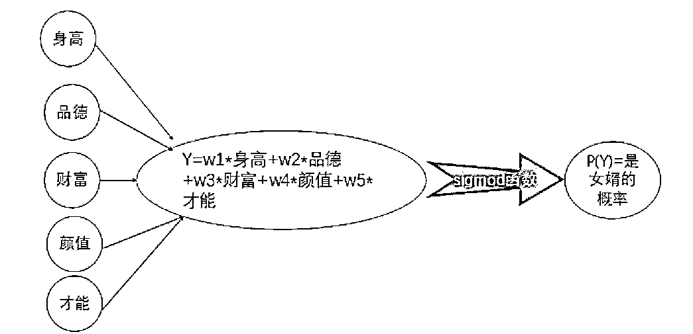
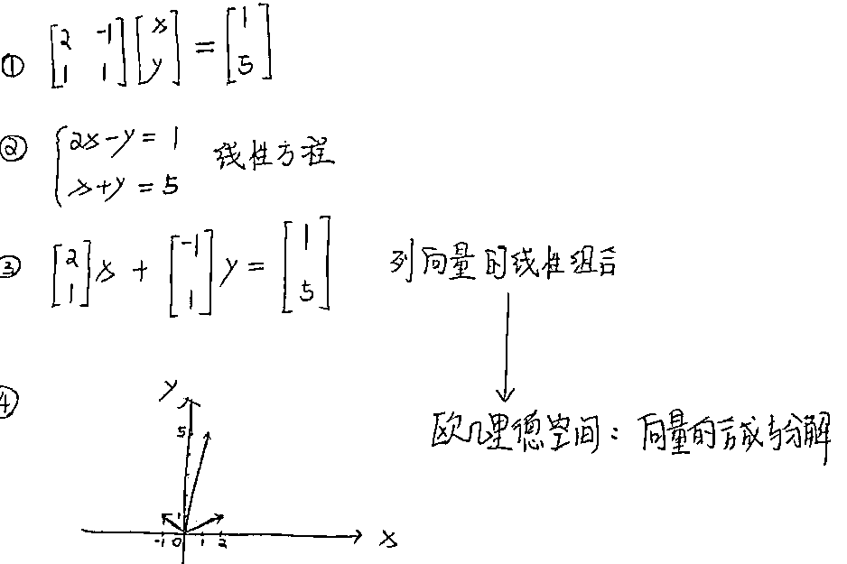
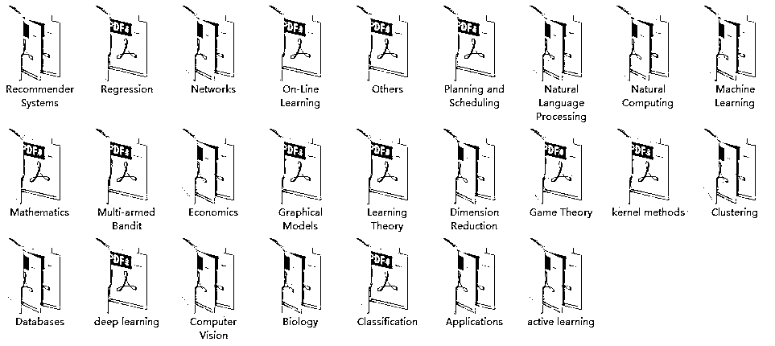

# 三、招打破机器学习工程师的边界

> 原文：[`mp.weixin.qq.com/s?__biz=MzAxNTc0Mjg0Mg==&mid=2653289246&idx=1&sn=d691772a81a658de00d1e3612fd73a9a&chksm=802e390bb759b01d928ceb86081c147968c588e3a9766dccf24a6e350f207138cdfaf178e5c0&scene=27#wechat_redirect`](http://mp.weixin.qq.com/s?__biz=MzAxNTc0Mjg0Mg==&mid=2653289246&idx=1&sn=d691772a81a658de00d1e3612fd73a9a&chksm=802e390bb759b01d928ceb86081c147968c588e3a9766dccf24a6e350f207138cdfaf178e5c0&scene=27#wechat_redirect)

> 本文约 1300 余字，阅读需要约 3.2 分钟；
> 
> 系统资料领取见文末；
> 
> 关键词：人工智能，机器学习，深度学习，数学，学习建议，微专业

#### **01.机器学习工程师的边界是什么？**

大多数的事物都是有边界的。那机器学习的边界又是什么呢？

对，就是数学。掌握了数学这个机器学习的底层基础，不仅可以加深对算法的理解，还能在模型优化阶段更加游刃有余。

#### **02.如何打破边界？**

#### 希望以下的内容能给你参考思路。

**•**  ** 机器学习中的数学基础**

#### **方法建议：将实际意义与兴趣赋予看似枯燥的学习之后，尽量死磕最少必要知识。**

上图是个使用逻辑回归判断一个男生是否是一位合适的女婿的例子。

> 其中，Y=w1*身高+w2*品德+w3*财富+w4*颜值+w5*就可以表达为多项式 Y=w1*x1+w2*x2+w3*x3+w4*x4+w5*5，通过 Sigmoid 函数后，转化为该男生可能成为优秀女婿的概率问题。

这里会涉及**sigmoid 函数、求导算法、梯度下降、正则项控制过拟合**等数学知识。遇到问题解决问题，死磕关键点，才不会钻入牛角尖，陷入数学知识的汪洋大海中孤立无援。

**•   机器学习中的线性代数**

#### **方法建议：尽量将线性代数与现实意义结合起来**

对于线性代数，理解它与机器学习的关键在于：理解线性代数与现实世界的巧妙的耦合。

> 上图中的 x，y 可以分别代表观察事物的 2 个维度。
> 
> x，y 各自有大量的线性组合，意味着事物的 2 个维度有大量不同的看法，
> 
> 将这些看法用机器来进行计算、归纳、演绎，并组合大量个别的看法，抽离出符合大多数的平衡点，从而得出普遍适用的结论。这不就是一件奇妙的巧妙而耦合的事件嘛~

**•   机器学习中的概率统计**

#### **方法建议：尽量将看似无味的概率统计知识与感兴趣的话题结合起来理解**

隐马尔科夫（HMM）算法是机器学习中的一个概率图模型，也是很多算法岗位面试中的考察难点。来自知乎的王蒟蒻，就用一个游戏的场景清楚的解释了隐马尔科夫（HMM）算法的原理。

https://www.zhihu.com/question/20962240/answer/33614574(链接)

> 我是一战士，修炼出了三种战斗形态，分别为暴怒态，正常状态和防御态。同时我也会三个被动技能，分别是普通平 A，爆击(攻击伤害翻倍)，吸血(生命汲取)。
> 
>  我在暴怒状态下打出暴击的概率是 80%,打出吸血概率为 5%；
> 在平衡形态下，打出暴击的比率为 30%，打出吸血的概率是 20%；
> 在防御形态下，暴击成功概率为 5%，吸血概率为 60%。
> 
>  总结一下，战士在不同状态下能打出技能的概率不一样。
> 
> 本来，战士这个职业在暴怒态时，身边会有一圈红光环；防御态时，会有一圈蓝光环。但是，现在我正在玩游戏，游戏突然出了个 bug：有个傻 x 程序员改了游戏的代码，他给写崩了，从此战士身边光环都看不见了。那我没法通过看脚下的光环知道战士在爆什么状态了。
> 
> 话说，现在问题来了：由于看不到脚下光环，我只能估计“战士”在爆什么状态；但我现在打一 boss，砍 10 次，发现 8 次都是暴击，血哗哗地翻倍在掉，你觉得我这战士最可能是爆了什么状态？

所以，通过自己感兴趣的话题来理解深奥的概率问题，就轻松很多了。

#### **03.打破边界的误区**

也许你早已意识到高等数学、线性代数、概率统计对做机器学习的重要性，也在积极补课中，于是一头扎进大学的教材中。但埋头死磕了好多次，每次都半途而费，学了很多，学到的很少。

因为教材始终更偏向理论。优点是每一步都可靠，逻辑严谨；但缺点就是很难理解。

古语有云：“独学而无友则孤陋而寡闻”，多人学习，协作学习能较快认识到打破机器学习边界的误区，尽可能的使用合适的学习方法。

推荐网易云课堂联合稀牛学院共同推出的人工智能系列微专业课程，由知名企业一线人工智能专家打造，结合工业界应用经验设计学习路径，并且有讲师助教为你答疑解惑，真正带你从入门到精通。

**以下福利限时免费：**

**PART 1  免费直播**

**直播主题：**

**金牌助教亲自帮你测量：从小白到 AI 工程师的距离**

< **10 月 18 日 周四 20:00**>

**直****播大纲：**

*   从 0 到 1，小白都会遇到哪些坑？

*   自我驱动，手把手教你如何持之以恒

*   自我剖析，找到适合自己的学习路线

*   知己知彼，不可错过的 AI 岗位解读

**直播讲师：**

**郑林峰 人工智能数学基础微专业金牌助教** 

**PART 2  免费体验课**

**《人工智能数学基础体验课》**

**课程大纲： **

为什么说学人工智能之前必须先学数学

大学数学知识复习（高数、线代、概率论）

《人工智能数学基础》微专业课程试学

**PART 3  免费学习资料**

**获取方式**

************************************

**群号：866057600**