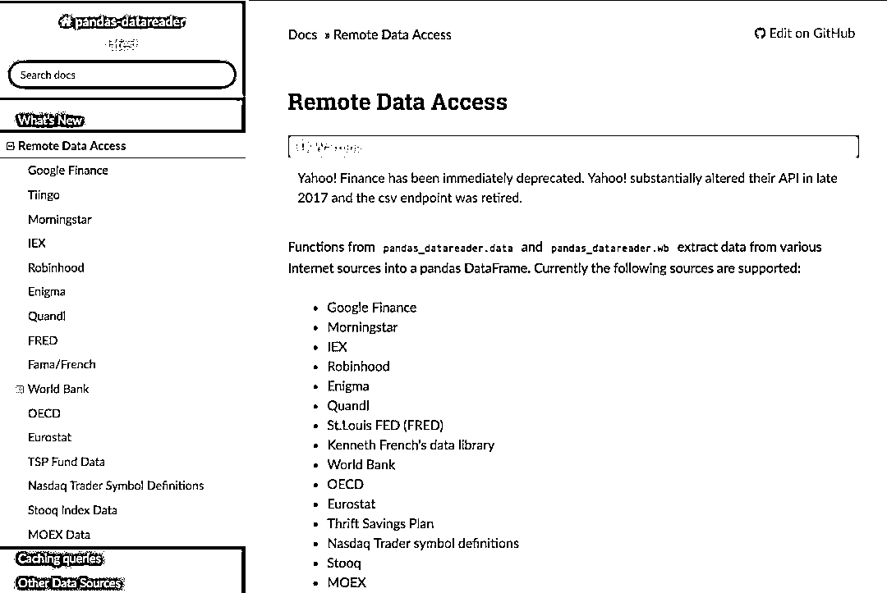
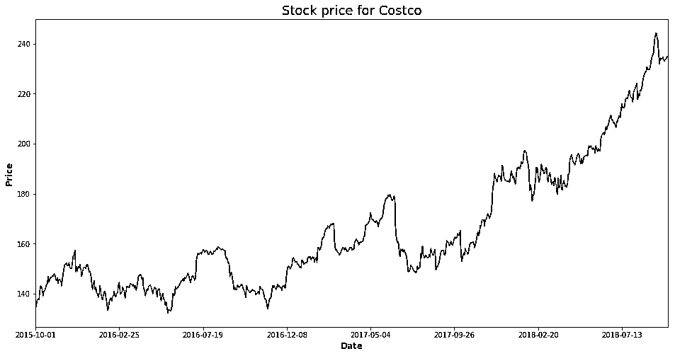
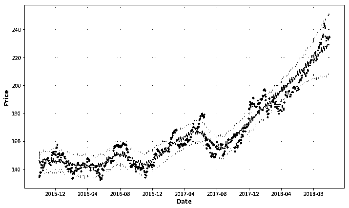
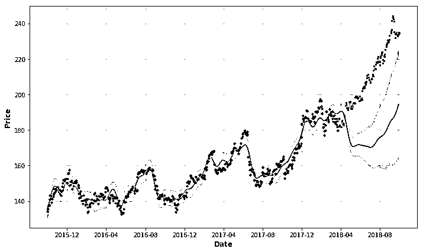
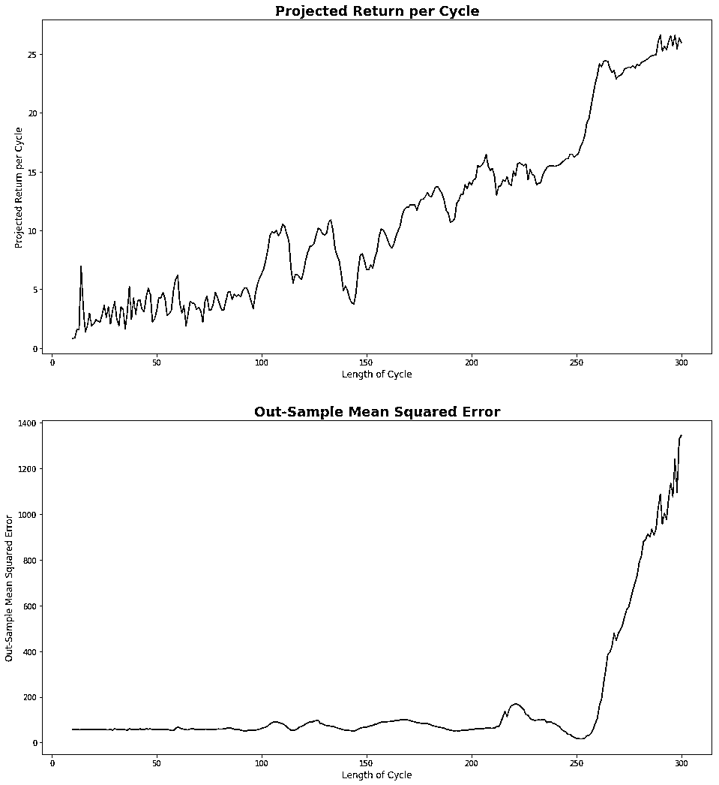
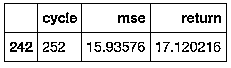
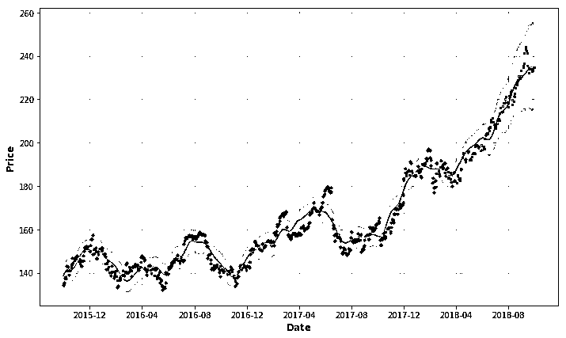
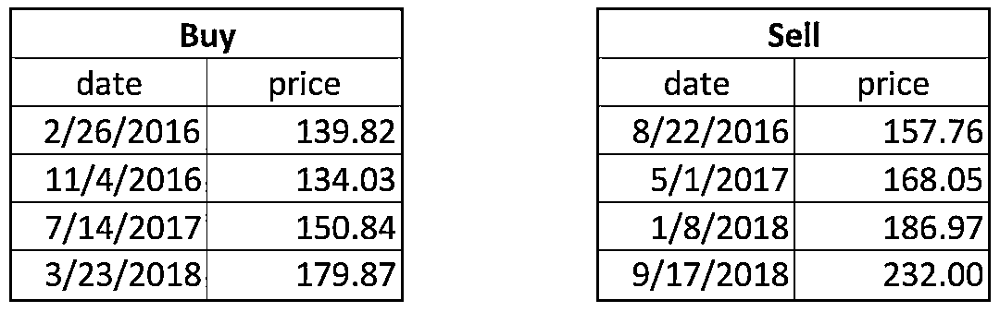
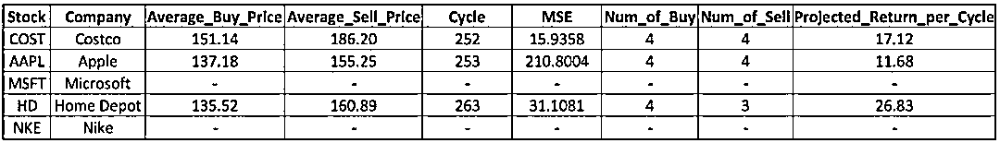

# 【年度系列】股市风起云涌，我用 Python 分析周期之道

> 原文：[`mp.weixin.qq.com/s?__biz=MzAxNTc0Mjg0Mg==&mid=2653289211&idx=1&sn=d4ce13fa79cb6309f1676ab906136712&chksm=802e38eeb759b1f866b5935a85c010bd2af8c5db7c46a0e577c889b30f3dc9e6c3b268c0336f&scene=27#wechat_redirect`](http://mp.weixin.qq.com/s?__biz=MzAxNTc0Mjg0Mg==&mid=2653289211&idx=1&sn=d4ce13fa79cb6309f1676ab906136712&chksm=802e38eeb759b1f866b5935a85c010bd2af8c5db7c46a0e577c889b30f3dc9e6c3b268c0336f&scene=27#wechat_redirect)


本期作者：Yin-Ta Pan

本期编辑：Wally

**文 章 预 告**

01、【年度系列】预测股市比你理解中的更加容易

**02、【年度系列】基于 Python 分析股票市场周期**

03、【年度系列】MICI 因子模型、风险模型解读系列

04、【年度系列】使用 LSTM 预测股市基于 Tensorflow

05、【年度系列】如何使用 LSTM 预测金融时序是有效的

06、【年度系列】解析预测财务和经济时间序列的神经网络

07、【年度系列】金融领域中白箱 AI

08、【年度系列】如何训练机器学会“低买高卖”

09、【年度系列】深度 Q 空间神经网络交易解析

10、【年度系列】深度解析均值回归交易（一）

12、【年度系列】深度解析均值回归交易（二）

13、【年度系列】深度解析均值回归交易（三）

14、【年度系列】深度解析均值回归交易（四）

[15、【机器学习】Seq2seq 与 Attention 模型一](https://mp.weixin.qq.com/s?__biz=MzAxNTc0Mjg0Mg==&mid=2653289147&idx=1&sn=09f954d3e4d74c102ef47a930b0f565b&chksm=802e38aeb759b1b89dd53aa556ca5ea7844c717376ac794f05489aae3d69c5997155775c49c3&token=1662274452&lang=zh_CN&scene=21#wechat_redirect)

[16、【机器学习】Seq2seq 与 Attention 模型二](https://mp.weixin.qq.com/s?__biz=MzAxNTc0Mjg0Mg==&mid=2653289171&idx=1&sn=55b24be74249d2b5343af679b574d53f&chksm=802e38c6b759b1d068200093d01e181737fe10e32ec506cc137ddec92020e3552cfbb71e3cca&token=1662274452&lang=zh_CN&scene=21#wechat_redirect)

17、【机器学习】使用递归神经网络（RNN）预测时序 Values

18、【华尔街量化金融面试 Q&A 系列】第四——十期

**正文**

股票市场周期是股票市场长期的价格模式，通常与商业周期有关。 它是技术分析的关键，其中投资方法基于周期或重复的价格模式。 如果我们对股市周期有了更好的理解，我们总能以相对低的价格买入并在每个周期以相对较高的价格卖出，将始终获得正的回报。当然，股票市场没有什么策略可以永远赚钱，但我们基于 Python，可以帮助我们更深入、快速地了解隐藏在股市中的周期。 

**fbprophet 简介**

Fbprophet 是 Facebook 发布的一个开源软件，旨在为大规模预测提供一些有用的指导。 默认情况下，它会将时间序列划分为趋势和季节性，可能包含年度，周度和每日。 但是，分析师可以定义自己的季节性。 为了更好地理解该库，先导文件是非常有用的。

该库的一个特点是简单性、灵活性。 由于我们想要计算的股票市场周期不限于每年，每周或每日，我们应该定义自己的周期，找出哪些更适合数据。 此外，由于周末没有交易，我们不应该使用每周季节性。 我们还可以通过 add_seasonality 函数定义'self_define_cycle'。 所有设置只需两行代码即可完成。

```py
m = Prophet(weekly_seasonality=False,yearly_seasonality=False)
m.add_seasonality('self_define_cycle',period=8,fourier_order=8,mode='additive')
```

**以 Costco 为例**

我们可以使用 Costco 标的从 2015/10/1 到 2018/10/1， 使用 pandas_datareader，我们可以快速读取股票价格。如下图：



地址：*https://pandas-datareader.readthedocs.io/en/latest/remote_data.html*

在下图中，我们可以看到从 2015 年开始有一个强劲的价格增长趋势。然而，在中途仍然存在很多上下周期波动，这些周期都是我们的赚钱点。 

```py
ticker = "COST"
start_date = '2015-10-01'
end_date = '2018-10-01'
stock_data = data.DataReader(ticker, 'iex', start_date, end_date)
stock_data['close'].plot(figsize=(16,8),color='#002699',alpha=0.8)
plt.xlabel("Date",fontsize=12,fontweight='bold',color='gray')
plt.ylabel('Price',fontsize=12,fontweight='bold',color='gray')
plt.title("Stock price for Costco",fontsize=18)
plt.show()
```



对于预测模型，评估它们的一种方法是样本均方误差。 我们可以使用 2015/10/1 至 2018/3/31 进行训练，并保留最后 6 个月的数据进行测试和计算样本均方误差。 在每个周期内，我们可以通过以最低价格买入并以最高价格卖出的方式来优化我们的回报。 为了简化过程，我们使用自定义函数 cycle_analysis。 输出是一个列表，其中包含每个周期的预计回报和样本均方误差。

*   **data：**带有时间索引的 Pandas 数据

*   **split_date：**分割训练和测试数据的日期

*   **cycle：**每个周期的间隔（天）

*   **mode：**季节性的加法或乘法（可选）

*   **forecast_plot：**是否打印预测图（可选，默认为 False）

*   **print_ind：**是否打印每个周期的预计回报和是否采样均方误差（可选，默认为 False）

**代码**

```py
def cycle_analysis(data,split_date,cycle,mode='additive',forecast_plot = False,print_ind=False):
    training = data[:split_date].iloc[:-1,]
    testing = data[split_date:]
    predict_period = len(pd.date_range(split_date,max(data.index)))
    df = training.reset_index()
    df.columns = ['ds','y']
    m = Prophet(weekly_seasonality=False,yearly_seasonality=False,daily_seasonality=False)
    m.add_seasonality('self_define_cycle',period=cycle,fourier_order=8,mode=mode)
    m.fit(df)
    future = m.make_future_dataframe(periods=predict_period)
    forecast = m.predict(future)
    if forecast_plot:
        m.plot(forecast)
        plt.plot(testing.index,testing.values,'.',color='#ff3333',alpha=0.6)
        plt.xlabel('Date',fontsize=12,fontweight='bold',color='gray')
        plt.ylabel('Price',fontsize=12,fontweight='bold',color='gray')
        plt.show()
    ret = max(forecast.self_define_cycle)-min(forecast.self_define_cycle)
    model_tb = forecast['yhat']
    model_tb.index = forecast['ds'].map(lambda x:x.strftime("%Y-%m-%d"))
    out_tb = pd.concat([testing,model_tb],axis=1)
    out_tb = out_tb[~out_tb.iloc[:,0].isnull()]
    out_tb = out_tb[~out_tb.iloc[:,1].isnull()]
    mse = mean_squared_error(out_tb.iloc[:,0],out_tb.iloc[:,1])
    rep = [ret,mse]
    if print_ind:
        print "Projected return per cycle: {}".format(round(rep[0],2))
        print "MSE: {}".format(round(rep[1],4))
    return rep
```

在下面两个图中，我们将两种不同 cycle（30 和 300）分别应用于 Costco 股票价格，并将 2018/4/1 作为训练和测试的分割日期。 正如我们所看到的，如果我们选择一个较短的长度（例如 30 天），则一个周期内的回报是很小的，我们需要经常进行交易，如果我们选择较长的长度，它会延长我们的预测（例如 300 天）。





我们可以在 cycle_analysis 函数上应用一个循环来计算不同循环长度的预计回报和样本均方误差，并且我们在下图中显示了结果。正如我们所看到的，长度越长，每个周期的预计回报和样本均方误差会增加。 考虑到交易成本，每个周期内的预计回报应该大于 10 元。 在这种约束下，我们可以选择最小样本均方误差的周期，并且它是 252 天。 每个周期的预计回报为 17.12 元，样本均方误差为 15.936。 两者都很不错！

```py
testing_box = range(10,301)
return_box = []
mse_box = []
for c in testing_box:
    f = cycle_analysis(stock_data['close'],'2018-04-01',c)
    return_box.append(f[0])
    mse_box.append(f[1])
```



```py
report = pd.DataFrame({'cycle':testing_box,'return':return_box,'mse':mse_box})
possible_choice = report[report['return'] >10]
possible_choice[possible_choice['mse']==min(possible_choice['mse'])]
```



```py
c = possible_choice[possible_choice['mse']==min(possible_choice['mse'])]['cycle'].values[0]
ycle_analysis(stock_data['close'],'2018-04-01',c,forecast_plot=True,print_ind=True)
```



```py
Projected return per cycle: 17.12
MSE: 15.9358
```

```py
[17.120216439034987, 15.93576020351612]
```

为了进一步说明投资策略，我们可以看到 2015/10/1 和 2018/10/1 之间的买入和卖出日期。 Return_Dates 函数可以将所有买入和卖出日期作为输出返回，输入：

*   **forecast：**fbprophet 预测对象

*   **stock_data：**带有时间索引的 Pandas 数据

*   **cycle：**周期长度

*   **cycle_name：**预测对象中循环列的名称

*   **time_name：**预测对象中时间列的名称

```py
def Return_Dates(forecast,stock_data,cycle,cycle_name = 'self_define_cycle',time_name = 'ds'):
    # find out the highest and lowest dates in the first cycle 
    # We cannot simply search for all highest and lowest point since there is slightly difference for high and low values in different cycles
    high = forecast.iloc[:cycle,]
    high = high[high[cycle_name]==max(high[cycle_name])][time_name]
    high = datetime.strptime(str(high.values[0])[:10],"%Y-%m-%d")
    low = forecast.iloc[:cycle,]
    low = low[low[cycle_name]==min(low[cycle_name])][time_name]
    low = datetime.strptime(str(low.values[0])[:10],"%Y-%m-%d")
    end_dt = datetime.strptime(stock_data.index[-1],"%Y-%m-%d")
    find_list = stock_data.index.map(lambda x:datetime.strptime(x,"%Y-%m-%d"))
    # Finding selling and buying dates with loop
    sell_dt = []
    sell_dt.append(high)
    # Looking for new cycle until it goes beyond the last date in stock_data
    while high<end_dt:
        high = high+timedelta(days=cycle)
        dif = (find_list-high).days
        high = find_list[abs(dif)==min(abs(dif))][0] # In order to avoid the non-trading dates
        sell_dt.append(high)
    buy_dt = []
    buy_dt.append(low)
    # Looking for new cycle until it goes beyond the last date in stock_data
    while low<end_dt:
        low = low+timedelta(days=cycle)
        dif = (find_list-low).days
        low = find_list[abs(dif)==min(abs(dif))][0] # In order to avoid the non-trading dates
        buy_dt.append(low)
    if buy_dt[0] > sell_dt[0]:
        sell_dt = sell_dt[1:]
    buy_dt = buy_dt[:-1]
    sell_dt = sell_dt[:-1]
    return [buy_dt,sell_dt]
```

在 2015/10/1 和 2018/10/1 期间，我们买卖 Costco 四次。3 年内的回报率为 23.2％。 可能不是很吸引人，但至少它是比较乐观的回报。



**更多股票的应用**

当然，这种方法可以应用于尽可能多的股票。 我们列出了 Costco，Apple，Microsoft，Home Depot 和 Nike 的平均购买价格，平均销售价格，周期长度，样本均方误差，购买数量，销售数量和每个周期内的预计回报。

**代码**

```py
Analysis_ticks = ['COST','AAPL','MSFT','HD','NKE']
start_date = '2015-10-01'
end_date = '2018-10-01'
opt_cycle = []
prot_return = []
MSE = []
buy_times = []
sell_times = []
avg_buy_price = []
avg_sell_price = []
# Loop over each stock
for ticker in Analysis_ticks:
    stock_data = data.DataReader(ticker, 'iex', start_date, end_date)
    testing_box = range(50,301)
    return_box = []
    mse_box = []
    for cc in testing_box:
        f = cycle_analysis(stock_data['close'],'2018-04-01',cc)
        return_box.append(f[0])
        mse_box.append(f[1])
    report = pd.DataFrame({'cycle':testing_box,'return':return_box,'mse':mse_box})
    possible_choice = report[report['return'] >10]
    # If we cannot find a cycle with return greater than 10, give 0
    if possible_choice.shape[0]>0:
        c = possible_choice[possible_choice['mse']==min(possible_choice['mse'])]['cycle'].values[0]
        rp = possible_choice[possible_choice['mse']==min(possible_choice['mse'])]['return'].values[0]
        mse = possible_choice[possible_choice['mse']==min(possible_choice['mse'])]['mse'].values[0]
        df = stock_data[:'2018-04-01'].iloc[:-1,]['close'].reset_index()
        df.columns = ['ds','y']
        predict_period = len(pd.date_range('2018-04-01','2018-10-01'))
        m = Prophet(weekly_seasonality=False,yearly_seasonality=False,daily_seasonality=False)
        m.add_seasonality('self_define_cycle',period=c,fourier_order=8,mode='additive')
        m.fit(df)
        future = m.make_future_dataframe(periods=predict_period)
        forecast = m.predict(future)
        dt_list = Return_Dates(forecast,stock_data,c)
        buy_price = stock_data.loc[map(lambda x: x.strftime("%Y-%m-%d"),dt_list[0])]['close']
        sell_price = stock_data.loc[map(lambda x: x.strftime("%Y-%m-%d"),dt_list[1])]['close']
        bt = buy_price.shape[0]
        st = sell_price.shape[0]
        bp = np.mean(buy_price)
        sp = np.mean(sell_price)
    else:
        c = 0
        rp = 0
        mse = 0
        bt = 0
        st = 0
        bp = 0
        sp = 0
    opt_cycle.append(c)
    prot_return.append(rp)
    MSE.append(mse)
    buy_times.append(bt)
    sell_times.append(st)
    avg_buy_price.append(bp)
    avg_sell_price.append(sp)
    print "{} Finished".format(ticker)
```

对于微软和耐克，我们找不到符合我们要求每个周期超过 10 元回报的周期。 对于 Costco，Apple 和 Home Depot，我们可以找到大约 250 天的周期，并做出良好的预测和良好的回报。

```py
stock_report = pd.DataFrame({'Stock':Analysis_ticks,'Cycle':opt_cycle,'Projected_Return_per_Cycle':prot_return,
                            'MSE':MSE,'Num_of_Buy':buy_times,'Num_of_Sell':sell_times,
                            'Average_Buy_Price':avg_buy_price,'Average_Sell_Price':avg_sell_price})
stock_report
```



**总结**

借助 Python 和 fbprophet 包，我们可以更好地了解股市。 根据我们发现的周期，我们可以在 3 年内获得大约 23％的回报。 也许这种投资策略无法满足所有人的需求，但你始终可以根据自己的知识和经验设定自己的方法。 强大的 fbprophet 软件包可以让你对股票市场的分析更加深入和轻松。

**代码下载**

在**后台**输入

**年度系列六**

**后台获取方式介绍**


**推荐阅读**

[1、经过多年交易之后你应该学到的东西（深度分享）](https://mp.weixin.qq.com/s?__biz=MzAxNTc0Mjg0Mg==&mid=2653289074&idx=1&sn=e859d363eef9249236244466a1af41b6&chksm=802e3867b759b1717f77e07a51ee5671e8115130c66562577280ba1243cba08218add04f1f00&token=449379994&lang=zh_CN&scene=21#wechat_redirect)

[2、监督学习标签在股市中的应用（代码+书籍）](https://mp.weixin.qq.com/s?__biz=MzAxNTc0Mjg0Mg==&mid=2653289050&idx=1&sn=60043a5c95b877dd329a5fd150ddacc4&chksm=802e384fb759b1598e500087374772059aa21b31ae104b3dca04331cf4b63a233c5e04c1945a&token=449379994&lang=zh_CN&scene=21#wechat_redirect)

[3、2018 年学习 Python 最好的 5 门课程](https://mp.weixin.qq.com/s?__biz=MzAxNTc0Mjg0Mg==&mid=2653289028&idx=1&sn=631cbc728b0f857713fc65841e48e5d1&chksm=802e3851b759b147dc92afded432db568d9d77a1b97ef22a1e1a376fa0bc39b55781c18b5f4f&token=449379994&lang=zh_CN&scene=21#wechat_redirect)

[4、全球投行顶尖机器学习团队全面分析](https://mp.weixin.qq.com/s?__biz=MzAxNTc0Mjg0Mg==&mid=2653289018&idx=1&sn=8c411f676c2c0d92b0dd218f041bee4b&chksm=802e382fb759b139ffebf633ac14cdd0f21938e4613fe632d5d9231dab3d2aca95a11628378a&token=449379994&lang=zh_CN&scene=21#wechat_redirect)

[5、使用 Tensorflow 预测股票市场变动](https://mp.weixin.qq.com/s?__biz=MzAxNTc0Mjg0Mg==&mid=2653289014&idx=1&sn=3762d405e332c599a21b48a7dc4df587&chksm=802e3823b759b135928d55044c2729aea9690f86752b680eb973d1a376dc53cfa18287d0060b&token=449379994&lang=zh_CN&scene=21#wechat_redirect)

[6、被投资圈残害的清北复交学生们](https://mp.weixin.qq.com/s?__biz=MzAxNTc0Mjg0Mg==&mid=2653289110&idx=1&sn=538d00046a15fb2f70a56be79f71e6b9&chksm=802e3883b759b1950252499ea9a7b1fadaa4748ec40b8a1a8d7da0d5c17db153bd86548060fb&token=1336933869&lang=zh_CN&scene=21#wechat_redirect)

**知识在于分享**

**在量化投资的道路上**

**你不是一个人在战斗**