# 【精选】卡尔曼滤波及其在配对交易中的应用

> 原文：[`mp.weixin.qq.com/s?__biz=MzAxNTc0Mjg0Mg==&mid=2653289194&idx=1&sn=bab6eb5cb22272e8b11335548b9b813f&chksm=802e38ffb759b1e9b447b7a8fd83617b77a2eab21f88d7fc7fed7eb3f67d51f0824f99e3ace0&scene=27#wechat_redirect`](http://mp.weixin.qq.com/s?__biz=MzAxNTc0Mjg0Mg==&mid=2653289194&idx=1&sn=bab6eb5cb22272e8b11335548b9b813f&chksm=802e38ffb759b1e9b447b7a8fd83617b77a2eab21f88d7fc7fed7eb3f67d51f0824f99e3ace0&scene=27#wechat_redirect)


——人工智能与量化交易公众号——

**前沿**

听过卡尔曼滤波的差不多有两年的时间了，虽然大致上明白其原理，但是也是直到现在才能够彻底掌握下来。主要是卡尔曼滤波算法涉及到比较复杂的数学公式推导。在很多博客上都有写卡尔曼滤波的相关文章，但都是花非常大的篇幅来通过一些例子来通俗地讲解卡尔曼滤波，对于不知道其数学原理的读者来说，看完之后依然是一知半解。

本文会先讲解最简单的单变量卡尔曼滤波，让大家知道卡尔曼滤波大致是什么样的，然后再详细地给出公式的推导过程，最后展示卡尔曼滤波在配对交易中的应用。

**卡尔曼滤波**

卡尔曼滤波(Kalman filtering)一种利用线性系统状态方程，通过系统输入输出观测数据，对系统状态进行最优估计的算法。由于观测数据中包括系统中的噪声和干扰的影响，所以最优估计也可看作是滤波过程。

最简单的单变量卡尔曼滤波，可以认为，我们观测的时间序列是存在噪声的，而我们可以通过卡尔曼滤波，过滤掉噪声，而得到了去除噪声之后的状态序列。

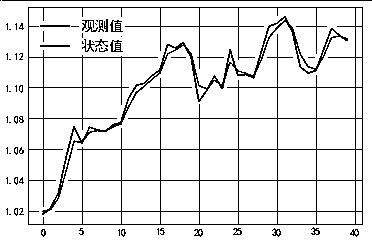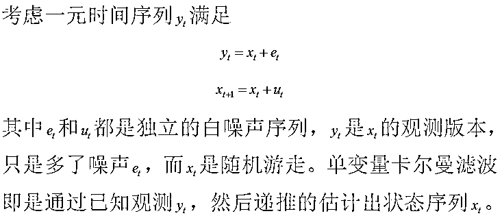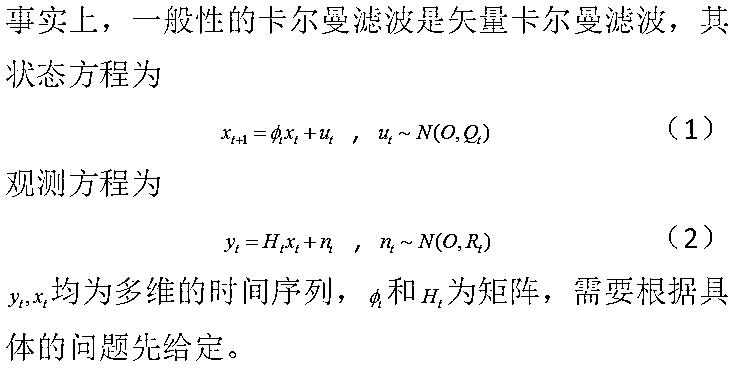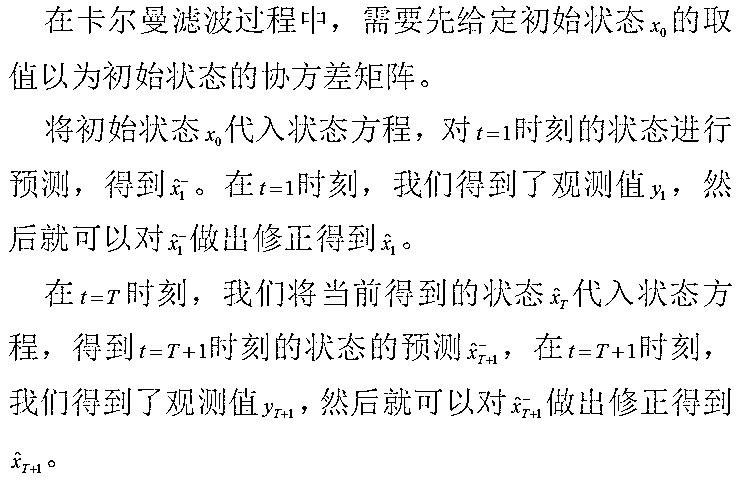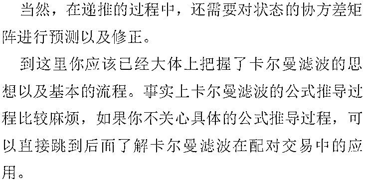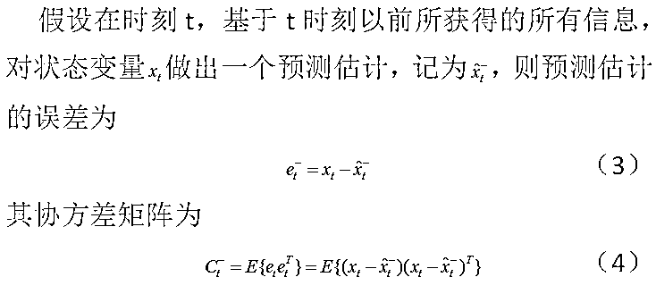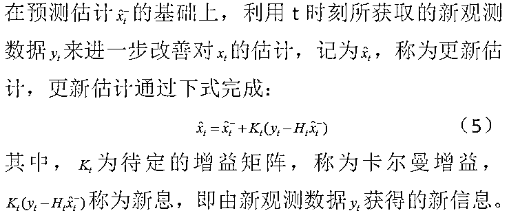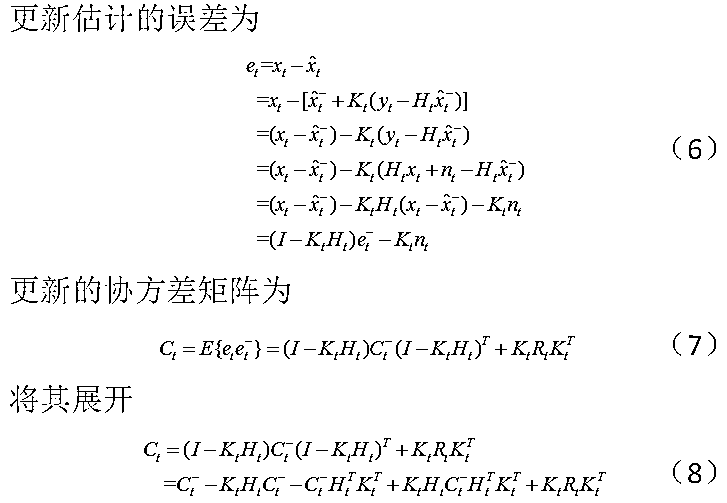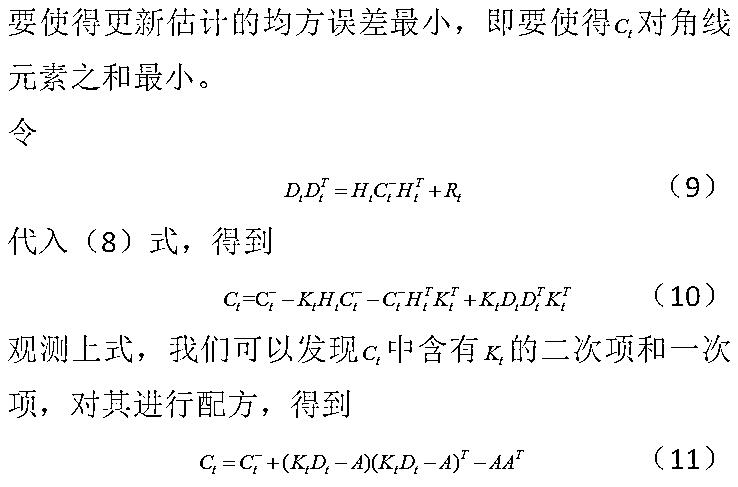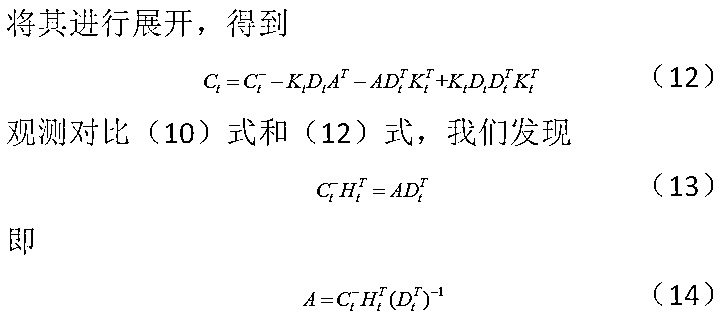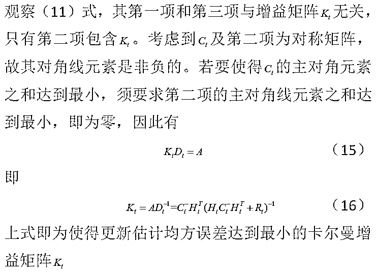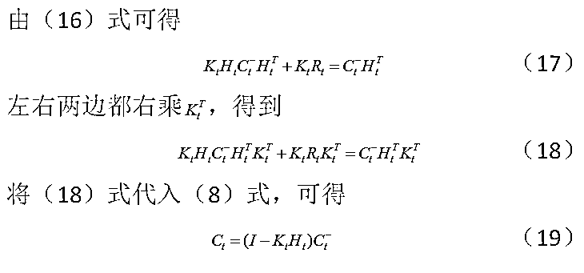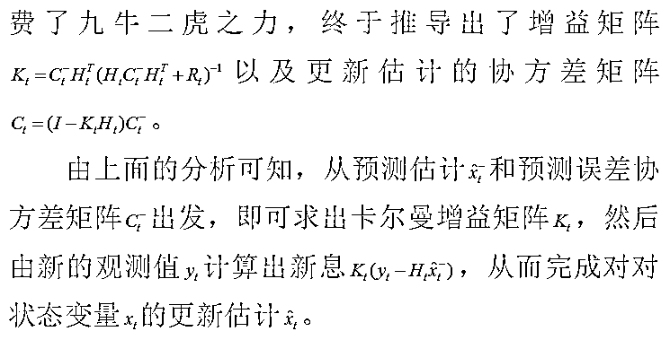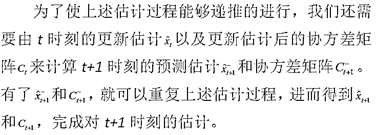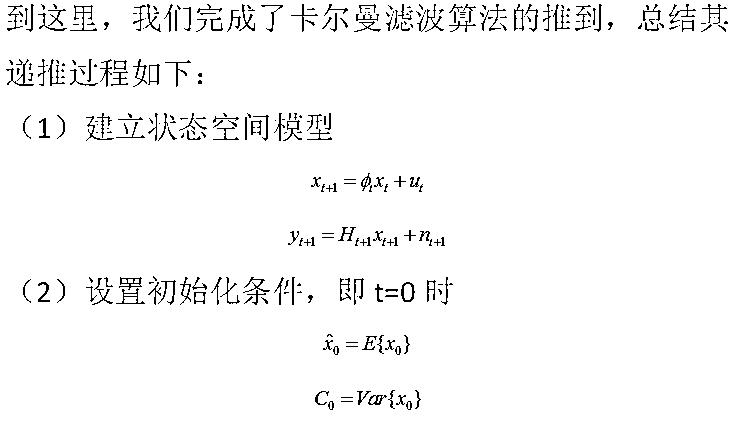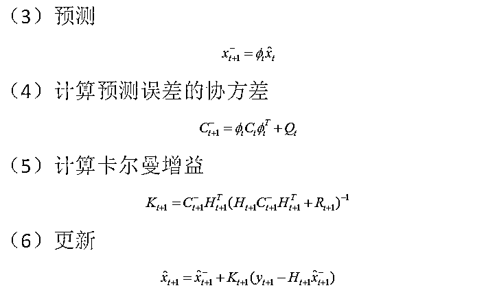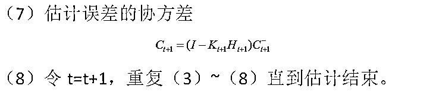

**卡尔曼滤波在配对交易的应用**

关于什么配对交易，什么是统计套利中的协整，知乎上有非常好的回答，在这里我们只讨论卡尔曼滤波在配对交易中的应用。在配对交易中，我们构造了如下回归方程

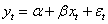

然后利用该方程在样本外进行套利。那么，假如我们这里的 a 和 B 是会改变的，那么我们如何动态地去调整回归方程的系数？我们可以使用如下滤波的方式。建立观测方程

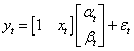

建立状态方程

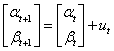

我们需要估计的状态为

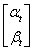

下面以焦炭和螺纹为例，采用焦炭和螺纹主力连续合约的收盘价数据：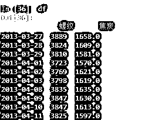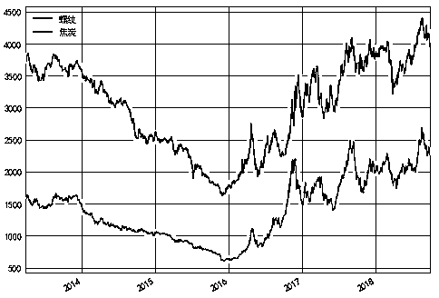

```py

```
# 以焦炭的收盘价数据作为 x，螺纹的收盘价数据作为 y
# 螺纹价格 = alpha + beta * 焦炭价格 + 随机误差 
from pykalman import KalmanFilter

#建立观测矩阵
observation_matrices = np.vstack(( np.ones(len(df[:'2013'])),
                                  df.loc[:'2013','焦炭'].values )).T
Shape = observation_matrices.shape
observation_matrices = observation_matrices.reshape(Shape[0],1,Shape[1])

#定义卡尔曼滤波的方程
kf = KalmanFilter(transition_matrices=np.array([[1,0],[0,1]]), #转移矩阵为单位阵
                  observation_matrices=observation_matrices)
np.random.seed(0)

# 使用 2013 年以前的数据，采用 EM 算法，估计出初始状态，
# 初始状态的协方差，观测方程和状态方程误差的协方差
kf.em(df.loc[:'2013','螺纹'])

#对 2013 年的数据做滤波
filter_mean,filter_cov = kf.filter(df.loc[:'2013','螺纹'])#观测值为螺纹

#从 2014 年开始滚动
start_index = np.where(df.index.year==2014)[0][0]

for i in range(start_index,len(df)):
    observation_matrix = np.array([[1,df['焦炭'].values[i]]])
    observation = df['螺纹'].values[i]

    #以上一个时刻的状态，状态的协方差以及当前的观测值，得到当前状态的估计
    next_filter_mean,next_filter_cov = kf.filter_update(
            filtered_state_mean = filter_mean[-1],
            filtered_state_covariance = filter_cov[-1],
            observation = observation,
            observation_matrix = observation_matrix)

    filter_mean = np.vstack((filter_mean,next_filter_mean))
    filter_cov = np.vstack((filter_cov,next_filter_cov.reshape(1,2,2)))

#得到 alpha 和 beta
alpha = pd.Series(filter_mean[start_index:,0], index = df.index[start_index:])
beta = pd.Series(filter_mean[start_index:,1], index = df.index[start_index:])
```py

```

得到 alpha 和 beta 的值如下：

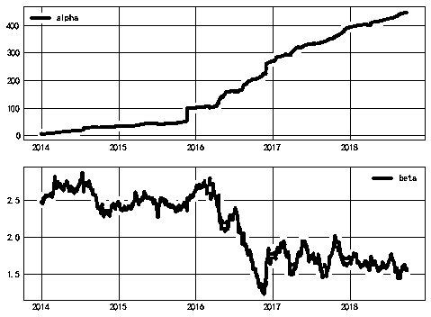

本文来自：人工智能与量化交易

**推荐阅读**

[1、经过多年交易之后你应该学到的东西（深度分享）](https://mp.weixin.qq.com/s?__biz=MzAxNTc0Mjg0Mg==&mid=2653289074&idx=1&sn=e859d363eef9249236244466a1af41b6&chksm=802e3867b759b1717f77e07a51ee5671e8115130c66562577280ba1243cba08218add04f1f00&token=449379994&lang=zh_CN&scene=21#wechat_redirect)

[2、监督学习标签在股市中的应用（代码+书籍）](https://mp.weixin.qq.com/s?__biz=MzAxNTc0Mjg0Mg==&mid=2653289050&idx=1&sn=60043a5c95b877dd329a5fd150ddacc4&chksm=802e384fb759b1598e500087374772059aa21b31ae104b3dca04331cf4b63a233c5e04c1945a&token=449379994&lang=zh_CN&scene=21#wechat_redirect)

[3、2018 年学习 Python 最好的 5 门课程](https://mp.weixin.qq.com/s?__biz=MzAxNTc0Mjg0Mg==&mid=2653289028&idx=1&sn=631cbc728b0f857713fc65841e48e5d1&chksm=802e3851b759b147dc92afded432db568d9d77a1b97ef22a1e1a376fa0bc39b55781c18b5f4f&token=449379994&lang=zh_CN&scene=21#wechat_redirect)

[4、全球投行顶尖机器学习团队全面分析](https://mp.weixin.qq.com/s?__biz=MzAxNTc0Mjg0Mg==&mid=2653289018&idx=1&sn=8c411f676c2c0d92b0dd218f041bee4b&chksm=802e382fb759b139ffebf633ac14cdd0f21938e4613fe632d5d9231dab3d2aca95a11628378a&token=449379994&lang=zh_CN&scene=21#wechat_redirect)

[5、使用 Tensorflow 预测股票市场变动](https://mp.weixin.qq.com/s?__biz=MzAxNTc0Mjg0Mg==&mid=2653289014&idx=1&sn=3762d405e332c599a21b48a7dc4df587&chksm=802e3823b759b135928d55044c2729aea9690f86752b680eb973d1a376dc53cfa18287d0060b&token=449379994&lang=zh_CN&scene=21#wechat_redirect)

[6、被投资圈残害的清北复交学生们](https://mp.weixin.qq.com/s?__biz=MzAxNTc0Mjg0Mg==&mid=2653289110&idx=1&sn=538d00046a15fb2f70a56be79f71e6b9&chksm=802e3883b759b1950252499ea9a7b1fadaa4748ec40b8a1a8d7da0d5c17db153bd86548060fb&token=1336933869&lang=zh_CN&scene=21#wechat_redirect)

**知识在于分享**

**在量化投资的道路上**

**你不是一个人在战斗**