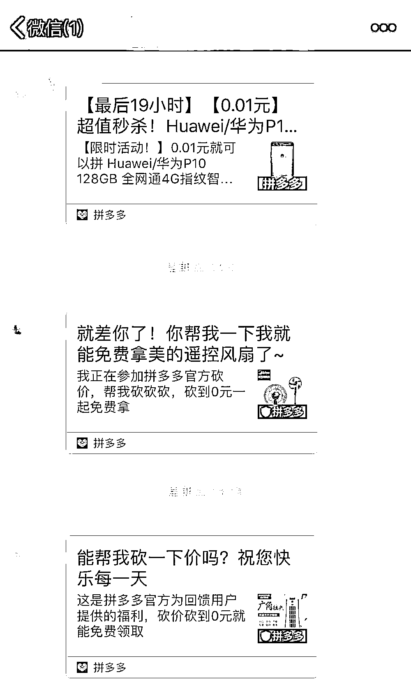
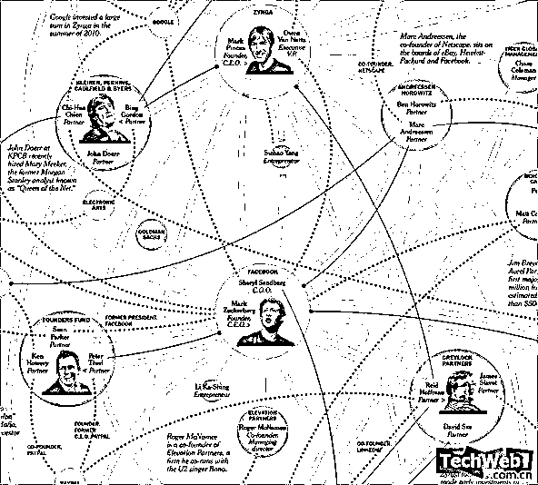
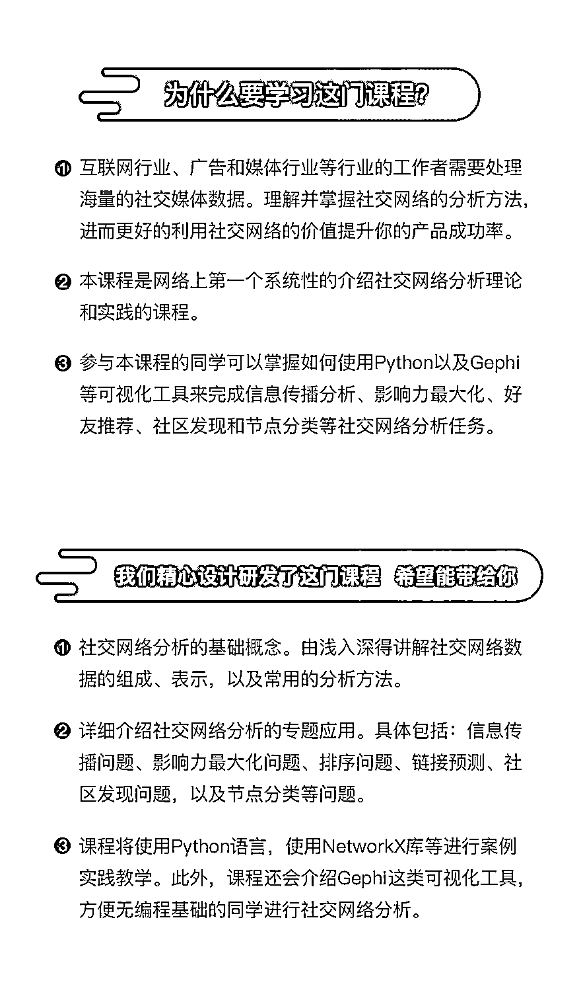
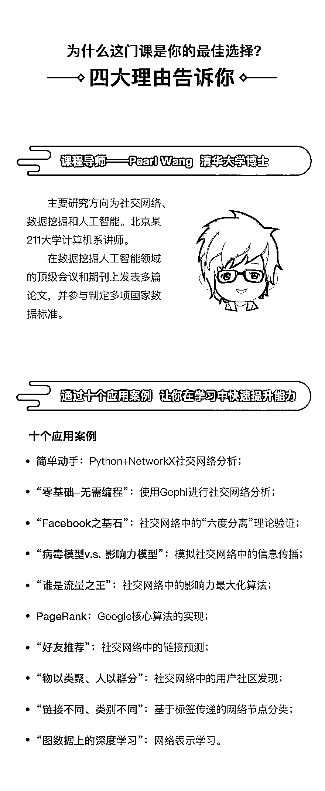

# 疯狂吸金 1600 个亿的拼多多，社交网络分析到底隐藏多少财富

> 原文：[`mp.weixin.qq.com/s?__biz=MzAxNTc0Mjg0Mg==&mid=2653289188&idx=1&sn=cf3f07ae4c355205c8a0b6991af247da&chksm=802e38f1b759b1e762bccaca7a8451cc789e6e65259fd04ad5f68565fe7745b2f128cf5a4468&scene=27#wechat_redirect`](http://mp.weixin.qq.com/s?__biz=MzAxNTc0Mjg0Mg==&mid=2653289188&idx=1&sn=cf3f07ae4c355205c8a0b6991af247da&chksm=802e38f1b759b1e762bccaca7a8451cc789e6e65259fd04ad5f68565fe7745b2f128cf5a4468&scene=27#wechat_redirect)

2018 年 7 月 26 日，拼多多在美国上市了，市值 1600 亿人民币。

拼多多创始人黄峥

原本众多人都不喜爱的拼多多，也不愿使用的拼多多，就这样成功上市，成为了市值千亿的互联网企业。创始人黄峥也创造了一个奇迹：**用 28 个月时间创造了身家 800 亿。**

似乎每个人对于拼多多的成功都有不同看法，但不可否认的一点：**拼多多的成功极大部分原因在于其社交网络价值。**

相信大家都被拼多多的小程序链接所骚扰过。

可想而知，如果没有如此丰厚的社交网络资源，说不定拼多多还只是一家国内的普通互联网公司而已。

**那社交网络是个什么呢？它真的有那么重要吗？**

> 1954 年，J.A.Barnes 首次提出社交网络；
> 
> 直到 1971 年，ARPA（Advanced Research Projects Agency）项目科学家发出了世界第一封电子邮件，才正式拉开了社交网络发展的帷幕；
> 
> 2004 年，Facebook 的诞生，2005~2007 年间，YouTube、Twitter 和 Tumblr 的出现都是抓住了社交网络发展的契机，同时它们也促使了社交网络的高速发展；
> 
> 如今社交网络已经越来越成熟，并且还在高速的发展中。不难想象，**社交网络的发展前景一片光明。**

我们再来看一组数据据，感受一下现阶段社交网络的发展程度：

⊙每分钟有**395833 人**登录微信，**19444 人**在进行视频或语音聊天；

⊙新浪微博每分钟发出（或转发）**64814****条**微博；

⊙Facebook 用户每天共享量超**40 亿**;

⊙Twitter 每天处理的数据量超**3.4 亿**；

⊙Tumblebr 博客作者每分钟发布**2.7 万**条新帖；

⊙Instagram 用户每天共享**3600 张**新照片。

由此可以看出，**社交网络生成的用户数据的价值已远远大于平台本身。相对于搜索、电商等大数据，****社交用户行为数据传导路径更短，具有更高的价值。** 

**社交网络大数据能带来哪些价值呢？**

随着移动互联网的发展，各种同质化差异化的社交网络平台的不断涌现，QQ、微信、新浪微博等等，产生了大量的社会学、传播学、行为学、心理学等众多领域的**社交数据**，而社交网络数据的重要性也越来越被重视。

**社交网络分析**是基于社交网站的海量数据衍生出来的数据营销工具，随着社交网络的发展，企业在社交网络营销上的需求越来越大，很多**企业开始往社交网络数据分析上都注入了大量的心血**，从而能比较精准地把握事态的动向，找准营销对象。

特别是听到互联网行业、广告行业和媒体行业小伙伴们的吐槽后，才发现网络社交数据与分析，原来对于产品调研、广告投放竟如此重要。也许这就是社交网络分析的魅力。

**手握社交网络数据，再持有数据分析能力**，你还怕工资不蹭蹭地往上涨吗？还怕 35 岁后，程序员生涯到头，无工作可干吗？

当下正值社交网络发展盛行时期，社交网络数据爆棚的时代，人才的空缺对社交网络发展有很大的影响，企业对相关专业人才的需求量也愈来愈大。

道理我们都懂，**怎样才能成为专业人才或提高自身专业素养呢？**

那当然是选择最具性价比的学习课程，做一次自我投资。

**小象出品--《社交网络分析与挖掘》**

这里有最全面的课程，最专业的团队，让你体验到知识、技能带来的成就感。

咨询，参团，查看大纲，请点击**【阅读原文】**

**↓↓↓**