# 从 Seq2seq 到 Attention 模型到 Self Attention（二）

> 原文：[`mp.weixin.qq.com/s?__biz=MzAxNTc0Mjg0Mg==&mid=2653289171&idx=1&sn=55b24be74249d2b5343af679b574d53f&chksm=802e38c6b759b1d068200093d01e181737fe10e32ec506cc137ddec92020e3552cfbb71e3cca&scene=27#wechat_redirect`](http://mp.weixin.qq.com/s?__biz=MzAxNTc0Mjg0Mg==&mid=2653289171&idx=1&sn=55b24be74249d2b5343af679b574d53f&chksm=802e38c6b759b1d068200093d01e181737fe10e32ec506cc137ddec92020e3552cfbb71e3cca&scene=27#wechat_redirect)

**传送门：**

[**从 Seq2seq 到 Attention 模型到 Self Attention（一）**](https://mp.weixin.qq.com/s?__biz=MzAxNTc0Mjg0Mg==&mid=2653289147&idx=1&sn=09f954d3e4d74c102ef47a930b0f565b&chksm=802e38aeb759b1b89dd53aa556ca5ea7844c717376ac794f05489aae3d69c5997155775c49c3&token=1768501699&lang=zh_CN&scene=21#wechat_redirect)

——作者：Bgg——

系列一介绍了 Seq2seq 和 Attention model。这篇文章将重点摆在 Google 於 2017 年发表论文“Attention is all you need”中提出的 “”The transformer 模型。”The transformer”模型中主要的概念有 2 项：1\. Self attention 2\. Multi-head，此外，模型更解决了传统 attention model 中无法平行化的缺点，并带来优异的成效。

前言

系列一中，我们学到 attention model 是如何运作的，缺点就是不能平行化，且忽略了输入句中文字间和目标句中文字间的关係。

为了解决此问题，2017 年，Self attention 诞生了。

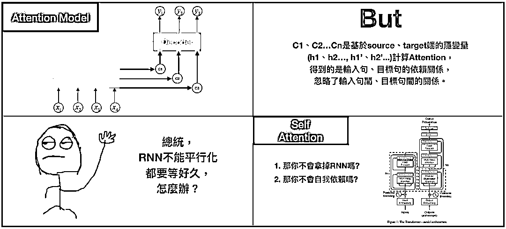

**Self Attention**

Self attention 是 Google 在 “Attention is all you need”论文中提出的”The transformer”模型中主要的概念之一，我们可以把”The transformer”想成是个黑盒子，将输入句输入这个黑盒子，就会產生目标句。 

最特别的地方是，”The transformer”完全捨弃了 RNN、CNN 的架构。

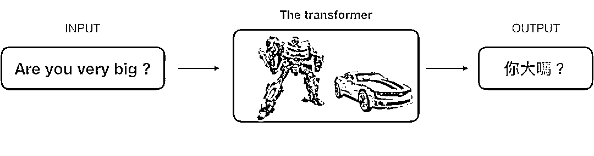

**The transformer**

“The transformer”和 Seq2seq 模型皆包含两部分：Encoder 和 Decoder。比较特别的是，”The transformer”中的 Encoder 是由 6 个 Encoder 堆积而成(paper 当中 N=6)，Deocder 亦然，这和过去的 attention model 只使用一个 encoder/decoder 是不同的。

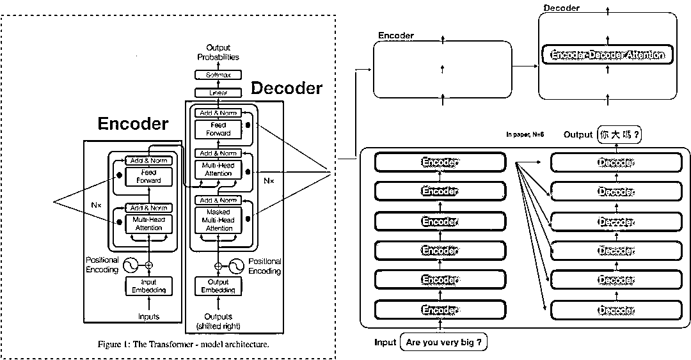

**Query, Key, Value**

进入”The transformer”前，我们重新复习 attention model，attention model 是从输入句<X1,X2,X3…Xm>產生 h1,h2,h….hm 的 hidden state，透过 attention score α 乘上 input 的序列加权求和得到 Context vector c_{i}，有了 context vector 和 hidden state vector，便可计算目标句<y1…yn>。换言之，就是将输入句作为 input 而目标句作为 output。 

如果用另一种说法重新詮释：

输入句中的每个文字是由一系列成对的 <地址 Key, 元素 Value>所构成，而目标中的每个文字是 Query，那麼就可以用 Key, Value, Query 去重新解释如何计算 context vector，透过计算 Query 和各个 Key 的相似性，得到每个 Key 对应 Value 的权重係数，权重係数代表讯息的重要性，亦即 attention score；Value 则是对应的讯息，再对 Value 进行加权求和，得到最终的 Attention/context vector。

笔者认为这概念非常创新，特别是从 attention model 到”The transformer”间，鲜少有论文解释这种想法是如何连结的，间接导致”attention is all you need”这篇论文难以入门，有兴趣可以参考 key、value 的起源论文 Key-Value Memory Networks for Directly Reading Documents。

在 NLP 的领域中，Key, Value 通常就是指向同一个文字隐向量(word embedding vector)。

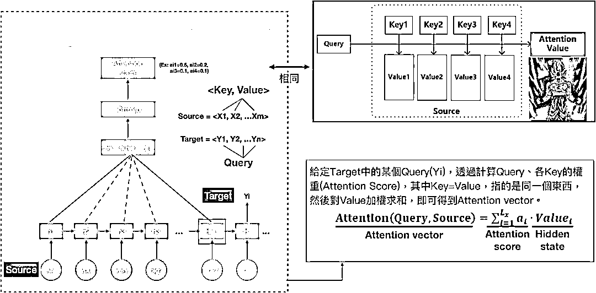

有了 Key, Value, Query 的概念，我们可以将 attention model 中的 Decoder 公式重新改写。1\. score e_{ij}= Similarity(Query, Key_{i})，上一篇有提到 3 种计算权重的方式，而我们选择用内积。2\. 有了 Similarity(Query, Key_{i})，便可以透过 softmax 算出 Softmax(sim_{i})=a_{i}，接著就可以透过 attention score a_{i}乘上 Value_{i}的序列和加总所得 = Attention(Query, Source)，也就是 context/attention vector。

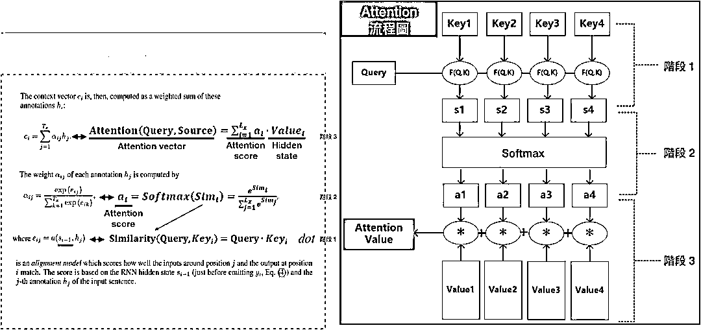

在了解 Key, Value, Query 的概念后，我们可以进入”the transformer”的世界了。

**Scaled Dot-Product Attention**

如果仔细观察，其实“The transformer”计算 attention score 的方法和 attention model 如出一辙，但”The transformer”还要除上分母=根号 d_{k}，目的是避免内积过大时，softmax 產出的结果非 0 即 1。

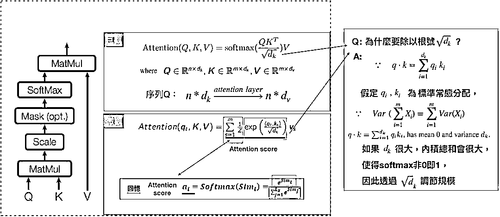

**Three kinds of Attention**

“The transformer”在计算 attention 的方式有三种，1\. encoder self attention，存在於 encoder 间. 2\. decoder self attention，存在於 decoder 间，3\. encoder-decoder attention, 这种 attention 算法和过去的 attention model 相似。 

接下来我们透过 encoder 和 decoder 两部份，来分别介绍 encoder/decoder self attention。

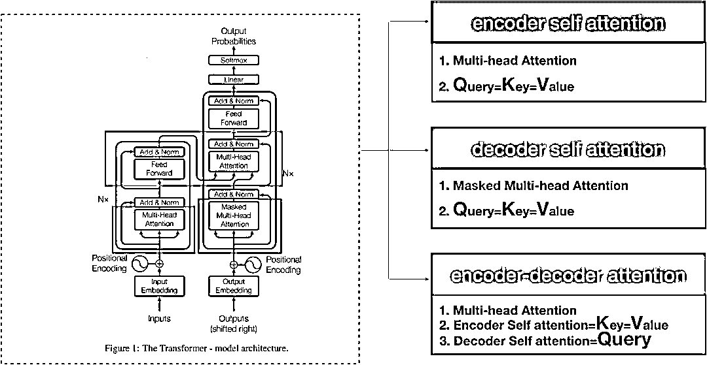

**Encoder**

我们将”The transformer”模型分为左右两部分，左边是 Encoder，如前述，”Attention is all you need”当中 N=6，代表 Encoder 部分是由 6 个 encoder 堆积而成的。其中在计算 encoder self attention 时，更透过 multi-head 的方式去学习不同空间的特徵，在后续内容会探讨 multi-head 的部分。

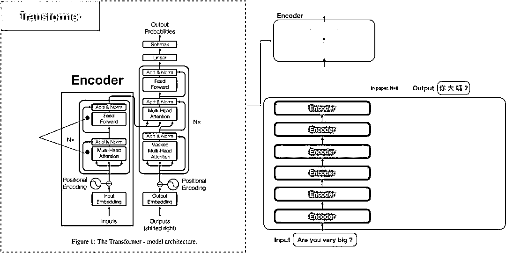

**如何计算 encoder self attention?**

我们先用微观的角度来观察 Attention(q_{t}, K, V)，也就是输入句中的某个文字，再将所有输入句中的文字一次用矩阵 Attention(Q,K,V)来解决。 

第一步是创造三个 encoder 的输入向量 Q,K,V，举例来说，“Are you very big?”中的每一个字的隐向量都有各自的 Q,K,V，接著我们会乘上一个初始化矩阵，论文中输出维度 d_{model}=512。

第二步是透过内积来计算 score <q_{t}, k_{s}>，类似 attention model 中的 score e_{ij}。假设我们在计算第一个字”Are”的 self-attention，我们可能会将输入句中的每个文字”Are”, ”you”, ‘very’, ‘big’分别和”Are”去做比较，这个分数决定了我们在 encode 某个特定位置的文字时，应该给予多少注意力(attention)。所以当我们在计算#位置 1 的 self-attention，第一个分数是 q1、k1 的内积 (“Are vs Are”)，第二个分数则是 q1、k2 (“Are vs you”)，以此类推。

第三步是将算出的分数除以根号 d_{k}，论文当中假定 d_{k}=64，接著传递至 exponential 函数中并乘上 1/Z，其实这结果就是 attention/softmax score，我们可以把 1/Z 看成是 softmax 时，所除上的 exponential 总和，最终的总分数就是 attention score，代表我们应该放多少注意力在这个位置上，也就是 attention model 的概念，有趣的是，怎麼算一定都会发现自己位置上的分数永远最高，但有时候可以发现和其他位置的文字是有关联的。

最后一步就是把 attention score 再乘上 value，然后加总得到 attention vector(z_{I})，这就是#位置 1 的 attention vector z1，概念都和以往的 attention model 类似。

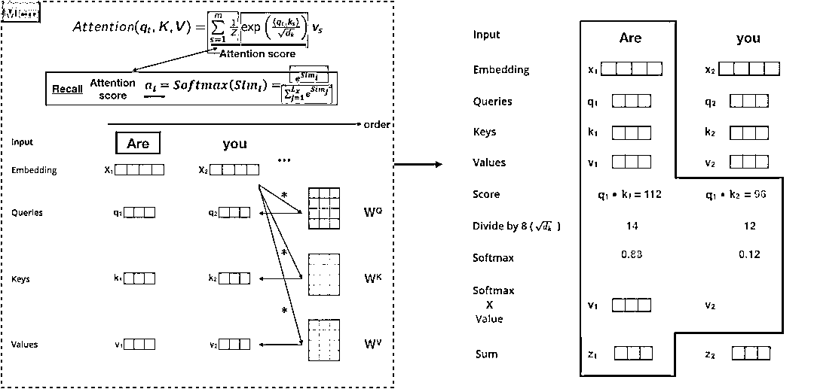

以上就是 self-attention 的计算，算出来的向量我们可以往前传递至 feed-forward neural network，实际的运作上，是直接将每个文字同时处理，因此会变成一个矩阵，而非单一词向量，计算后的结果 attention vector 也会变成 attention matrix Z。

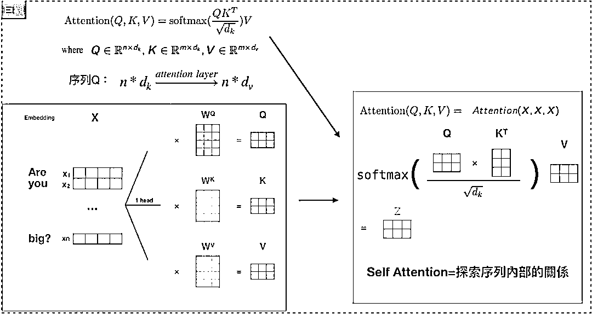

**Multi-head attention**

有趣的是，如果我们只计算一个 attention，很难捕捉输入句中所有空间的讯息，为了优化模型，论文当中提出了一个新颖的做法：Multi-head attention，概念是不要只用 d_{model}维度的 key, value, query 们做单一个 attention，而是把 key, value, query 们线性投射到不同空间 h 次，分别变成维度 d_{q}, d_{k} and d_{v}，再各自做 attention，其中，d_{k}=d_{v}=d_{model}/h=64，概念就是投射到 h 个 head 上。

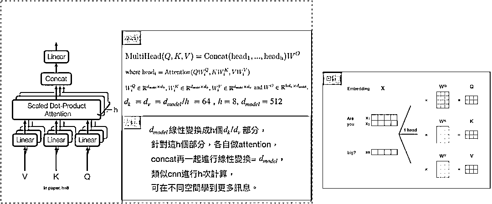

此外，”The transformer”用了 8 个 attention head，所以我们会產生 8 组 encoder/decoder，每一组都代表将输入文字的隐向量投射到不同空间，如果我们重复计算刚刚所讲的 self-attention，我们就会得到 8 个不同的矩阵 Z，可是呢，feed-forward layer 期望的是一个矩阵而非 8 个，所以我们要把这 8 个矩阵併在一起，透过乘上一个权重矩阵，还原成一个矩阵 Z。

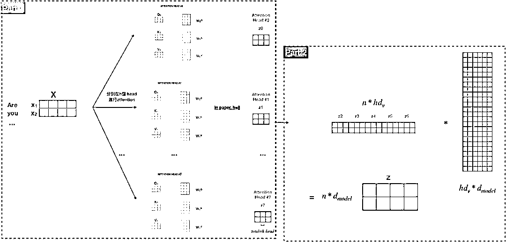

**Residual Connections**

Encoder 还有一个特别的架构，Multihead-attention 完再接到 feed-forward layer 中间，还有一个 sub-layer，会需要经过 residual connection 和 layer normalization。 

Residual connection 就是构建一种新的残差结构，将输出改写成和输入的残差，使得模型在训练时，微小的变化可以被注意到，这种架构很常用在电脑视觉(computer vision)，有兴趣可以参考神人 Kaiming He 的 Deep Residual Learning for Image Recognition。

Layer normalization 则是在深度学习领域中，其中一种正规化方法，最常和 batch normalization 进行比较，layer normalization 的优点在於它是独立计算的，也就是针对单一样本进行正规化，batch normalization 则是针对各维度，因此和 batch size 有所关联，可以参考 layer normalization。

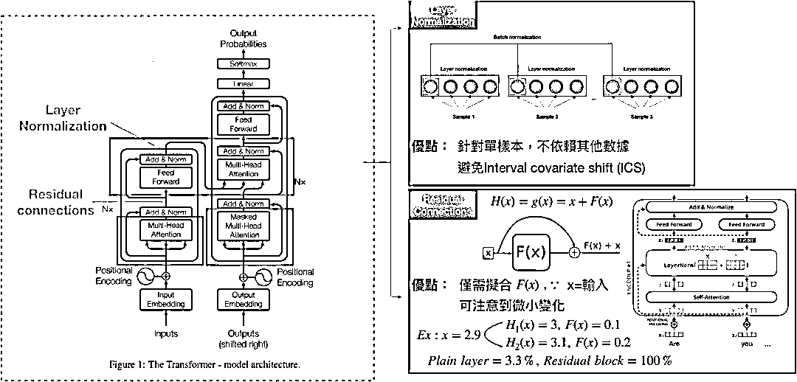

**Position-wise Feed-Forward Networks**

Encoder/Decoder 中的 attention sublayers 都会接到一层 feed-forward networks(FFN)：两层线性转换和一个 RELU，论文中是根据各个位置(输入句中的每个文字)分别做 FFN，举例来说，如果输入文字是<x1,x2…xm>，代表文字共有 m 个。 

其中，每个位置进行相同的线性转换，这边使用的是 convolution1D，也就是 kernel size=1，原因是 convolution1D 才能保持位置的完整性，可参考 CNN，模型的输入/输出维度 d_{model}=512，但中间层的维度是 2048，目的是为了减少计算量，这部分一样参考神人 Kaiming He 的 Deep Residual Learning for Image Recognition。

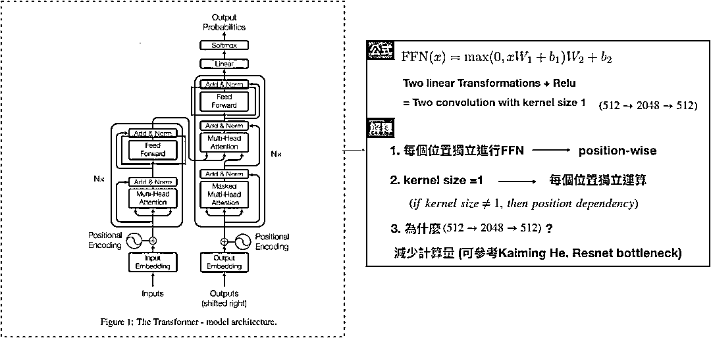

**Positional Encoding**

和 RNN 不同的是，multi-head attention 不能学到输入句中每个文字的位置，举例来说，“Are you very big?” and “Are big very you?”，对 multi-head 而言，是一样的语句，因此，”The transformer”透过 positional encoding，来学习每个文字的相对/绝对位置，最后再和输入句中文字的隐向量相加。 

论文使用了方程式 PE(pos, 2i)=sin(pos/10000^{2i/d_{model}})、PE(pos, 2i+1)=cos(pos/10000^{2i/d_{model}})来计算 positional encoding，pos 代表的是位置，i 代表的是维度，偶数位置的文字会透过 sin 函数进行转换，奇数位置的文字则透过 cos 函数进行转换，藉由三角函数，可以发现 positional encoding 是个有週期性的波长；举例来说，[pos+k]可以写成 PE[pos]的线性转换，使得模型可以学到不同位置文字间的相对位置。

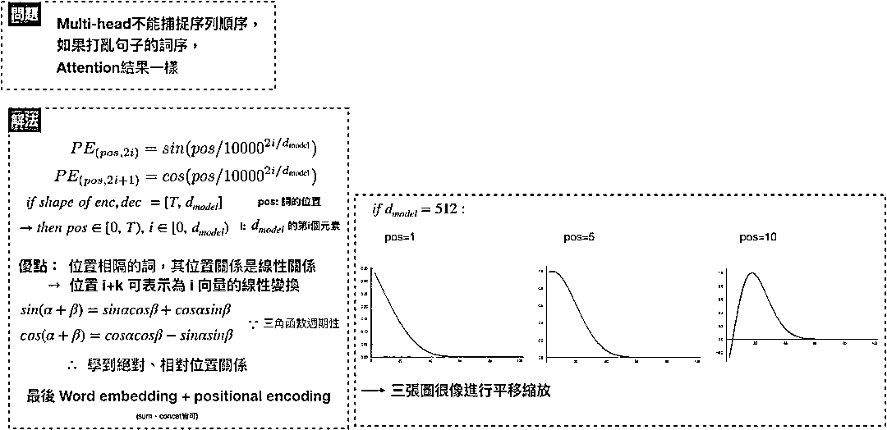

如下图，假设 embedding 的维度为 4：

每列对应的是经过 positional encoding 后的向量，以第一列而言，就是输入句中第一个文字隐向量和 positioncal encoding 后的向量和，所以每列维度都是 d_{model}，总共有 pos 列，也就是代表输入句中有几个文字。

下图为含有 20 字的输入句，文字向量维度为 512，可以发现图层随著位置產生变化。

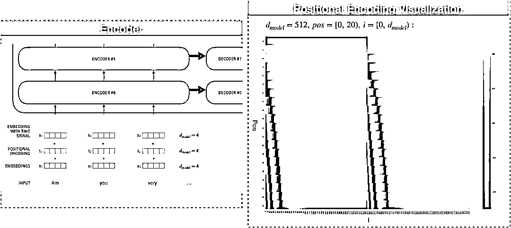

Encoder 内容告一段落，接下来让我们看 Decoder 的运作模式。

**Decoder**

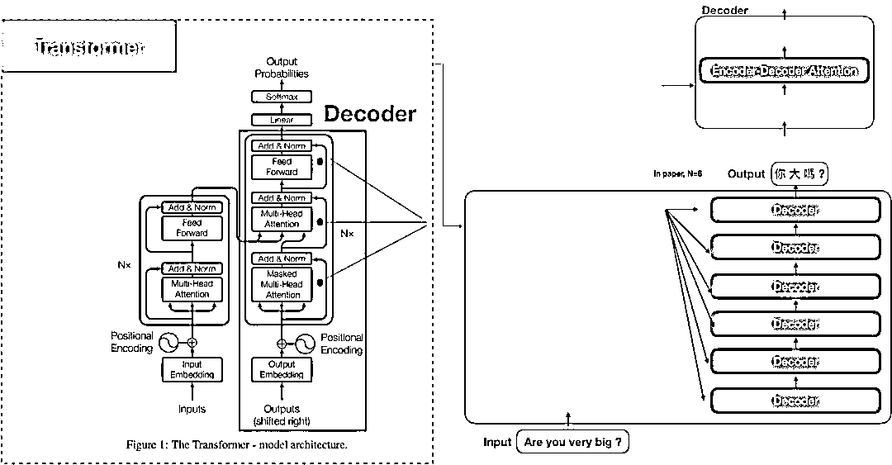

**Masked multi-head attention**

Decoder 的运作模式和 Encoder 大同小异，也都是经过 residual connections 再到 layer normalization。Encoder 中的 self attention 在计算时，key, value, query 都是来自 encoder 前一层的输出，Decoder 亦然。 

不同的地方是，为了避免在解码的时后，还在翻译前半段时，就突然翻译到后半段的句子，会在计算 self-attention 时的 softmax 前先 mask 掉未来的位置(设定成-∞)。这个步骤确保在预测位置 i 的时候只能根据 i 之前位置的输出，其实这个是因应 Encoder-Decoder attention 的特性而做的配套措施，因为 Encoder-Decoder attention 可以看到 encoder 的整个句子，

Encoder-Decoder Attention

“Encoder-Decoder Attention”和 Encoder/Decoder self attention 不一样，它的 Query 来自於 decoder self-attention，而 Key、Value 则是 encoder 的 output。

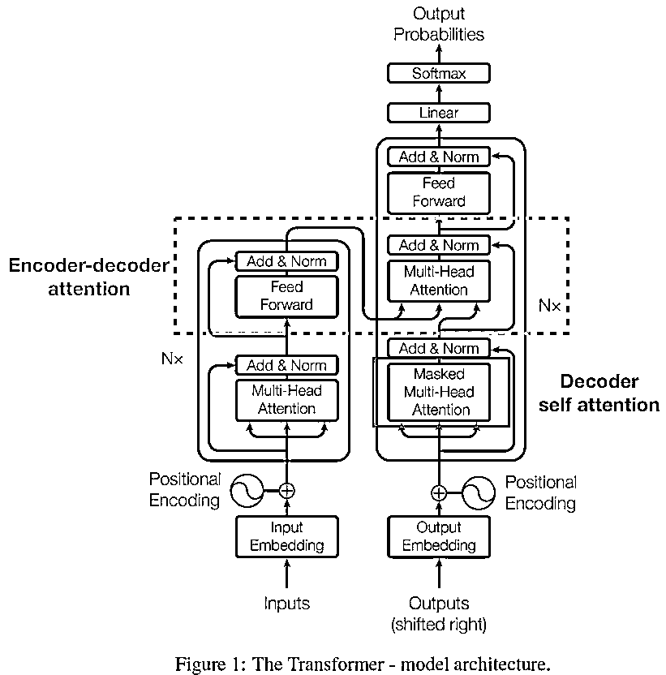

至此，我们讲完了三种 attention，接著看整体运作模式。

从输入文字的序列给 Encoder 开始，Encoder 的 output 会变成 attention vectors 的 Key、Value，接著传送至 encoder-decoder attention layer，帮助 Decoder 该将注意力摆在输入文字序列的哪个位置进行解码。

**The Final Linear and Softmax Layer**

Decoder 最后会產出一个向量，传到最后一层 linear layer 后做 softmax。Linear layer 只是单纯的全连接层网络，并產生每个文字对应的分数，softmax layer 会将分数转成机率值，最高机率的值就是在这个时间顺序时所要產生的文字。

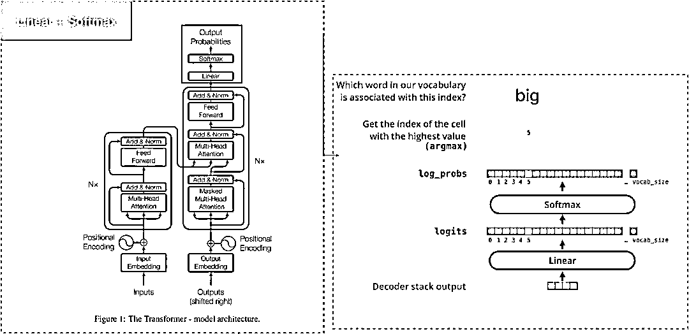

**Why self attention?**

过去，Encoder 和 Decoder 的核心架构都是 RNN，RNN 把输入句的文字序列 (x1…, xn)一个个有序地转成 hidden encodings (h1…hn)，接著在產出目标句的文字序列(y1…yn)。然而，RNN 的序列性导致模型不可能平行计算，此外，也导致计算复杂度很高，而且，很难捕捉长序列中词语的依赖关係(long-range dependencies)。

透过 “the transformer”，我们可以用 multi-head attention 来解决平行化和计算复杂度过高的问题，依赖关係也能透过 self-attention 中词语与词语比较时，长度只有 1 的方式来克服。

**Future**

在金融业，企业可以透过客户歷程，深入了解客户行为企业，进而提供更好的商品与服务、提升客户满意度，藉此创造价值。然而，和以往的基本特徵不同，从序列化的客户歷程资料去萃取资讯是非常困难的，在有了 self-attention 的知识后，我们可以将这种处理序列资料的概念应用在复杂的客户歷程上，探索客户潜在行为背后无限的商机。

笔者也推荐有兴趣钻研 self-attention 概念的读者，可以参考阿里巴巴所提出的论文 ATrank，此篇论文将 self-attention 应用在產品推荐上，并带来更好的成效。

****参考****

[1] Learning Phrase Representations using RNN Encoder–Decoder for Statistical Machine Translationr. arXiv:1406.1078v3 (2014).

[2] Sequence to Sequence Learning with Neural Networks. arXiv:1409.3215v3 (2014).

[3] Neural machine translation by joint learning to align and translate. arXiv:1409.0473v7 (2016).

[4] Effective Approaches to Attention-based Neural Machine Translation. arXiv:1508.0402v5 (2015).

[5] Convolutional Sequence to Sequence learning. arXiv:1705.03122v3(2017).

[6] Attention Is All You Need. arXiv:1706.03762v5 (2017).

[7] ATRank: An Attention-Based User Behavior Modeling Framework for Recommendation. arXiv:1711.06632v2 (2017).

[8] Key-Value Memory Networks for Directly Reading Documents. arXiv:1606.03126v2 (2016).

[9] Show, Attend and Tell: Neural Image Caption Generation with Visual Attention. arXiv:1502.03044v3 (2016).

[10] Deep Residual Learning for Image Recognition. arXiv:1512.03385v1 (2015).

[11] Layer Normalization. arXiv:1607.06450v1 (2016).

来源：

https://medium.com/@bgg/seq2seq-pay-attention-to-self-attention-part-1-d332e85e9aad

**推荐阅读**

[1、经过多年交易之后你应该学到的东西（深度分享）](https://mp.weixin.qq.com/s?__biz=MzAxNTc0Mjg0Mg==&mid=2653289074&idx=1&sn=e859d363eef9249236244466a1af41b6&chksm=802e3867b759b1717f77e07a51ee5671e8115130c66562577280ba1243cba08218add04f1f00&token=449379994&lang=zh_CN&scene=21#wechat_redirect)

[2、监督学习标签在股市中的应用（代码+书籍）](https://mp.weixin.qq.com/s?__biz=MzAxNTc0Mjg0Mg==&mid=2653289050&idx=1&sn=60043a5c95b877dd329a5fd150ddacc4&chksm=802e384fb759b1598e500087374772059aa21b31ae104b3dca04331cf4b63a233c5e04c1945a&token=449379994&lang=zh_CN&scene=21#wechat_redirect)

[3、2018 年学习 Python 最好的 5 门课程](https://mp.weixin.qq.com/s?__biz=MzAxNTc0Mjg0Mg==&mid=2653289028&idx=1&sn=631cbc728b0f857713fc65841e48e5d1&chksm=802e3851b759b147dc92afded432db568d9d77a1b97ef22a1e1a376fa0bc39b55781c18b5f4f&token=449379994&lang=zh_CN&scene=21#wechat_redirect)

[4、全球投行顶尖机器学习团队全面分析](https://mp.weixin.qq.com/s?__biz=MzAxNTc0Mjg0Mg==&mid=2653289018&idx=1&sn=8c411f676c2c0d92b0dd218f041bee4b&chksm=802e382fb759b139ffebf633ac14cdd0f21938e4613fe632d5d9231dab3d2aca95a11628378a&token=449379994&lang=zh_CN&scene=21#wechat_redirect)

[5、使用 Tensorflow 预测股票市场变动](https://mp.weixin.qq.com/s?__biz=MzAxNTc0Mjg0Mg==&mid=2653289014&idx=1&sn=3762d405e332c599a21b48a7dc4df587&chksm=802e3823b759b135928d55044c2729aea9690f86752b680eb973d1a376dc53cfa18287d0060b&token=449379994&lang=zh_CN&scene=21#wechat_redirect)

[6、被投资圈残害的清北复交学生们](https://mp.weixin.qq.com/s?__biz=MzAxNTc0Mjg0Mg==&mid=2653289110&idx=1&sn=538d00046a15fb2f70a56be79f71e6b9&chksm=802e3883b759b1950252499ea9a7b1fadaa4748ec40b8a1a8d7da0d5c17db153bd86548060fb&token=1336933869&lang=zh_CN&scene=21#wechat_redirect)

**知识在于分享**

**在量化投资的道路上**

**你不是一个人在战斗**