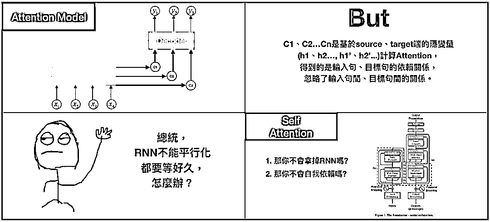

# 从 Seq2seq 到 Attention 模型到 Self Attention（一）

> 原文：[`mp.weixin.qq.com/s?__biz=MzAxNTc0Mjg0Mg==&mid=2653289147&idx=1&sn=09f954d3e4d74c102ef47a930b0f565b&chksm=802e38aeb759b1b89dd53aa556ca5ea7844c717376ac794f05489aae3d69c5997155775c49c3&scene=27#wechat_redirect`](http://mp.weixin.qq.com/s?__biz=MzAxNTc0Mjg0Mg==&mid=2653289147&idx=1&sn=09f954d3e4d74c102ef47a930b0f565b&chksm=802e38aeb759b1b89dd53aa556ca5ea7844c717376ac794f05489aae3d69c5997155775c49c3&scene=27#wechat_redirect)

——作者：Bgg——

近一两年，注意力模型（Attention Model）是深度学习领域最受瞩目的新星，用来处理与序列相关的数据，特别是 2017 年 Google 提出后，模型成效、复杂度又取得了更大的进展。以金融业为例，客户的行为代表一连串的序列，但要从串行化的客户历程数据去萃取信息是非常困难的，如果能够将 self-attention 的概念应用在客户历程并拆解分析，就能探索客户潜在行为背后无限的商机。然而，笔者从 Attention model 读到 self attention 时，遇到不少障碍，其中很大部分是后者在论文提出的概念，鲜少有文章解释如何和前者做关联，笔者希望藉由这系列文，解释在机器翻译的领域中，是如何从 Seq2seq 演进至 Attention model 再至 self attention，使读者在理解 Attention 机制不再这么困难。

为此，系列文分为两篇，第一篇着重在解释 Seq2seq、Attention 模型，第二篇重点摆在 self attention，希望大家看完后能有所收获。

**前言**

你可能很常听到 Seq2seq 这词，却不明白是什么意思。Seq2seq 全名是 Sequence-to-sequence，也就是从序列到序列的过程，是近年当红的模型之一。Seq2seq 被广泛应用在机器翻译、聊天机器人甚至是图像生成文字等情境。如下图：

其中，Seq2seq 常见情境为机器翻译，因此接下来的内容都会以情境进行说明。

图（3）是个典型的 Seq2seq 模型，包含了编码器（Encoder）和解码器（Decoder）.只要输入句子至 Encoder，即可从 Decoder 获得目标句。

举例来说，如果我们将“Are you very big”作为输入句（source sentence），即可得到目标句（target sentence）“你很大？”。机器翻译就是这么简单，然而，如果想了解它如何组成，会发现其中充斥着各种难以咀嚼的 RNN/LSTM 等概念。

接下来，让我们快速回味一下 RNN/LSTM，方便后续模型理解。

**RNN/LSTM**

RNN 是 DNN 模型的变种，不同之处在于它可以储存过去的行为记忆，进行更准确的预测，然而，就像人脑一样，一旦所需记忆量太大，就会比较健忘。我们可以把隐藏状态（hidden state）h_{t}认为是记忆单元，h_{t}可通过前一步的 hidden state 和当前时刻的输入（input）得到，因为是记忆单元，h_{t}可以捕捉到之前所有时刻产生的信息，而输出（output）o_{t}仅依赖于 t 时刻的记忆，也就是 h_{t}。 

RNN 在反向训练误差时，都会乘上参数，参数乘上误差的结果，大则出现梯度爆炸；小则梯度消失，导致模型成效不佳，如图 4。

为了解决健忘、训练误差的问题，LSTM 有了像是遗忘/输入/输出门（forget/input/output gate），隐藏状态（hidden state），记忆单元（cell memory）等概念，带来了更好的结果。在 2014 年，论文 Learning Phrase Representations 除了提出 Seq2seq 的概念，更提出了 LSTM 的简化版 GRU，此后，LSTM 和 GRU 便取代 RNN 成为深度学习当中的主流。

下图是 LSTM 的各种应用，在此不深入描述。

**Seq2seq**

回到正题，所以 Seq2seq 是怎么组成的？我们可以看到 Seq2seq 包含两部分：Encoder 和 Decoder。一旦将句子输入至 Encoder，即可从 Decoder 获得目标句。本篇文章着墨在 Decoder 生成过程，Encoder 就是个单纯的 RNN/ LSTM，读者若有兴趣可再自行研究，此外 RNN/LSTM 可以互相代替，以下仅以 RNN 作为解释。

现在我们具备 RNN/LSTM 的知识，可以发现 Seq2seq 中，Decoder 的公式和 RNN 根本就是同一个模子出来的，差别在于 Decoder 多了一个 C — 图（6），这个 C 是指 context vector/thought vector。context vector 可以想成是一个含有所有输入句信息的向量，也就是 Encoder 当中，最后一个 hidden state。简单来说，Encoder 将输入句压缩成固定长度的 context vector，context vector 即可完整表达输入句，再透过 Decoder 将 context vector 内的信息产生输出句，如图 7。

但是，在 Seq2seq 模型中，Encoder 将输入句压缩成固定长度的 context vector 真的好吗？如果句子今天很长，固定长度的 context vector 效果就会不好。怎么办呢？

在 2015 年，有个救星诞生了，叫作注意力模型（attention model）。

**Attention model**

为什么要用 attention model？ 

The attention model 用来帮助解决机器翻译在句子过长时效果不佳的问题。

这种新的构架替输入句的每个文字都创造一个 context vector，而非仅仅替输入句创造一个从最终的 hidden state 得来的 context vector，举例来说，如果一个输入句有 N 个文字，就会产生 N 个 context vector，好处是，每个 context vector 能够被更有效的译码。

在 Attention model 中，Encoder 和 Seq2seq 概念一样，一样是从输入句<X1，X2，X3…Xm>产生<h1，h2，h….hm>的 hidden state，再计算目标句<y1…yn>。换言之，就是将输入句作为 input 而目标句作为 output，所以差别就在于 context vector c_{i}是怎么计算？

Context vector c_{i}是透过 attention scoreα乘上 input 的序列加权求和.Attention/Alignment score 是 attention model 中提出一个很重要的概念，可以用来衡量输入句中的每个文字对目标句中的每个文字所带来重要性的程度。由公式可知，attention score 藉由 score e_{ij}所计算得到，所以先来看看 score e_{ij}是什么。

在计算 score 中，a 代表 Alignment model 会根据输入字位置 j 和输出字位置 i 这两者的关联程度，计算出一个 score e_{ij}。换言之，e_{i，j}是衡量 RNN decoder 中的 hidden state s_{i-1}和输入句中的第 j 个文字 hidden state h_{j}的关系所计算出的权重 — 如方程式 3，那权重怎么算呢？

Neural Machine Translation 发表之后，接续的论文 Effective approaches of the NMT、Show，Attend and Tell 提出了 global/local attention 和 soft/hard attention 的概念，而 score e_{ij}的计算方式类似 global 和 soft attention。细节在此不多说，图 11 可以看到 3 种计算权重的方式，我们把刚才的公式做些改变，将 score e_{ij}改写成 score（h_{t}，\bar {h_{s}}），h_{t}代表 s_{i-1}而\bar {h_{s}}代表 h_{j}，为了计算方便，我们采用内积（dot）计算权重。

有了 score e_{ij}，即可透过 softmax 算出 attention score，context vector 也可得到，在 attention model 中，context vector 又称为 attention vector。我们可以将 attention score 列为矩阵，透过此矩阵可看到输入端文字和输出端文字间的对应关系，也就是论文当中提出 align 的概念。

我们知道如何计算 context vector 后，回头看 encoder。

attention model 中的 encoder 用的是改良版 RNN：双向 RNN（Bi-directional RNN），以往单向 RNN 的问题在于 t 时刻时，只能透过之前的信息进行预测，但事实上，模型有时候可能也需要利用未来时刻的信息进行预测，其运作模式为，一个 hidden layer 用来由左到右，另一个由右到左，透过双向 RNN，我们可以对词语进行更好的预测。

举例来说，”我喜欢苹果，因为它很好吃”？和”我喜欢苹果，因为他比安卓稳定”这两个句子当中，如果只看”我喜欢苹果”，你可能不知道苹果指的是水果还是手机，但如果可以根据后面那句得到信息，答案就很显而易见，这就是双向 RNN 运作的方式。

Attention model 虽然解决了输入句仅有一个 context vector 的缺点，但依旧存在不少问题。1.context vector 计算的是输入句、目标句间的关联，却忽略了输入句中文字间的关联，和目标句中文字间的关联性，2.不管是 Seq2seq 或是 Attention model，其中使用的都是 RNN，RNN 的缺点就是无法平行化处理，导致模型训练的时间很长，有些论文尝试用 CNN 去解决这样的问题，像是 Facebook 提出的 Convolutional Seq2seq learning，但 CNN 实际上是透过大量的 layer 去解决局部信息的问题，在 2017 年，Google 提出了一种叫做”The transformer”的模型，透过 self attention、multi-head 的概念去解决上述缺点，完全舍弃了 RNN、CNN 的构架。

让我们复习一下 Seq2seq、Attention model，差别在于计算 context vector 的方式。

**总结**

透过上述内容，我们快速的了解 Seq2seq、Attention model 运作、计算方式，我强烈建议有兴趣的读者可以参考图 1 中的论文，会有很多收获。 

系列二将着重在 Google 于论文“Attention is all you need“所提出的 self attention、multi-head 等概念。

****参考****

[1] Learning Phrase Representations using RNN Encoder–Decoder for Statistical Machine Translationr. arXiv:1406.1078v3 (2014).

[2] Sequence to Sequence Learning with Neural Networks. arXiv:1409.3215v3 (2014).

[3] Neural machine translation by joint learning to align and translate. arXiv:1409.0473v7 (2016).

[4] Effective Approaches to Attention-based Neural Machine Translation. arXiv:1508.0402v5 (2015).

[5] Convolutional Sequence to Sequence learning. arXiv:1705.03122v3(2017).

[6] Attention Is All You Need. arXiv:1706.03762v5 (2017).

[7] ATRank: An Attention-Based User Behavior Modeling Framework for Recommendation. arXiv:1711.06632v2 (2017).

[8] Key-Value Memory Networks for Directly Reading Documents. arXiv:1606.03126v2 (2016).

[9] Show, Attend and Tell: Neural Image Caption Generation with Visual Attention. arXiv:1502.03044v3 (2016).

[10] Deep Residual Learning for Image Recognition. arXiv:1512.03385v1 (2015).

[11] Layer Normalization. arXiv:1607.06450v1 (2016).

来源：

https://medium.com/@bgg/seq2seq-pay-attention-to-self-attention-part-1-d332e85e9aad

**推荐阅读**

[1、经过多年交易之后你应该学到的东西（深度分享）](https://mp.weixin.qq.com/s?__biz=MzAxNTc0Mjg0Mg==&mid=2653289074&idx=1&sn=e859d363eef9249236244466a1af41b6&chksm=802e3867b759b1717f77e07a51ee5671e8115130c66562577280ba1243cba08218add04f1f00&token=449379994&lang=zh_CN&scene=21#wechat_redirect)

[2、监督学习标签在股市中的应用（代码+书籍）](https://mp.weixin.qq.com/s?__biz=MzAxNTc0Mjg0Mg==&mid=2653289050&idx=1&sn=60043a5c95b877dd329a5fd150ddacc4&chksm=802e384fb759b1598e500087374772059aa21b31ae104b3dca04331cf4b63a233c5e04c1945a&token=449379994&lang=zh_CN&scene=21#wechat_redirect)

[3、2018 年学习 Python 最好的 5 门课程](https://mp.weixin.qq.com/s?__biz=MzAxNTc0Mjg0Mg==&mid=2653289028&idx=1&sn=631cbc728b0f857713fc65841e48e5d1&chksm=802e3851b759b147dc92afded432db568d9d77a1b97ef22a1e1a376fa0bc39b55781c18b5f4f&token=449379994&lang=zh_CN&scene=21#wechat_redirect)

[4、全球投行顶尖机器学习团队全面分析](https://mp.weixin.qq.com/s?__biz=MzAxNTc0Mjg0Mg==&mid=2653289018&idx=1&sn=8c411f676c2c0d92b0dd218f041bee4b&chksm=802e382fb759b139ffebf633ac14cdd0f21938e4613fe632d5d9231dab3d2aca95a11628378a&token=449379994&lang=zh_CN&scene=21#wechat_redirect)

[5、使用 Tensorflow 预测股票市场变动](https://mp.weixin.qq.com/s?__biz=MzAxNTc0Mjg0Mg==&mid=2653289014&idx=1&sn=3762d405e332c599a21b48a7dc4df587&chksm=802e3823b759b135928d55044c2729aea9690f86752b680eb973d1a376dc53cfa18287d0060b&token=449379994&lang=zh_CN&scene=21#wechat_redirect)

[6、被投资圈残害的清北复交学生们](https://mp.weixin.qq.com/s?__biz=MzAxNTc0Mjg0Mg==&mid=2653289110&idx=1&sn=538d00046a15fb2f70a56be79f71e6b9&chksm=802e3883b759b1950252499ea9a7b1fadaa4748ec40b8a1a8d7da0d5c17db153bd86548060fb&token=1336933869&lang=zh_CN&scene=21#wechat_redirect)

**知识在于分享**

**在量化投资的道路上**

**你不是一个人在战斗**