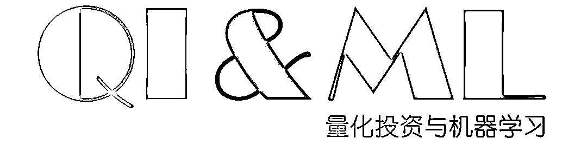
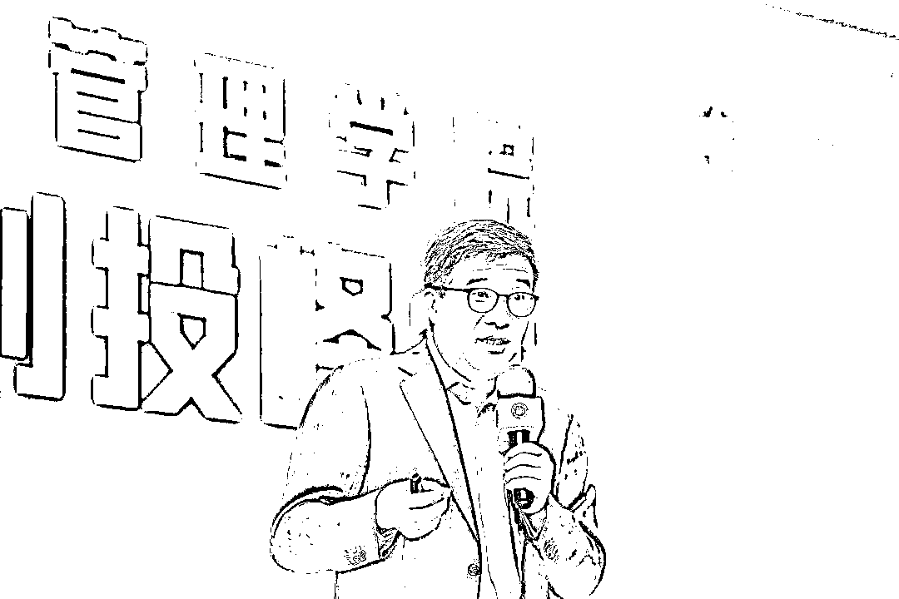

# 被投资圈残害的清北复交学生们

> 原文：[`mp.weixin.qq.com/s?__biz=MzAxNTc0Mjg0Mg==&mid=2653289110&idx=1&sn=538d00046a15fb2f70a56be79f71e6b9&chksm=802e3883b759b1950252499ea9a7b1fadaa4748ec40b8a1a8d7da0d5c17db153bd86548060fb&scene=27#wechat_redirect`](http://mp.weixin.qq.com/s?__biz=MzAxNTc0Mjg0Mg==&mid=2653289110&idx=1&sn=538d00046a15fb2f70a56be79f71e6b9&chksm=802e3883b759b1950252499ea9a7b1fadaa4748ec40b8a1a8d7da0d5c17db153bd86548060fb&scene=27#wechat_redirect)

载自：UniCareer

作者：月野兔

**清华北大复旦交大，不知道从何时起，成了中国四大金刚的新生代代名词**，若是家里有个清华毕业生，都是光宗耀祖的事情，在海归被五百强 HR 批判的各种“不接地气”的情况下，这四所学校的毕业生在寒风瑟瑟的百万大军中，显得异常夺目。

小陈是我在一个创业论坛认识的孩子，**北大本硕，光华管理**，金字招牌，正因为是北大，本科横扫麦肯锡、中信的实习，而这次毕业的选择，他把苗头对准了 VCPE(风险投资&私募股权投资)，**在他眼里，那是金融金字塔尖的地方，不仅是金钱的光辉，更是所谓真正的价值缔造者。**

*图片来源：网络

于是我小声问他：“投资有什么好？为什么不考虑其他行业呢？”他骄傲的回答我：**“投资多有意思，能接触创业者，和高管沟通，投资创造的价值还能推动社会进步！”**我继续追问：“往年北清复交的孩子都去咨询金融了吧？你不是之前在麦肯锡实习吗，不考虑进入咨询行业吗？”**他接着说道：“呵呵，他们本质不解决问题，我想活得有色彩”。**

**些色彩”**

** 被投资圈洗脑的清北复交学生们**

**我想活得有些色彩**，94 年学生站在我面前告诉我这句话的时候，我突然有一些开心交织着难过和失落的复杂心情。开心是现在的大学生终于为自己而活，**或者大部分人可以顶着两套房父母的光环，肆无忌惮挥霍属于自己的时间**，失落与难过是因为他把 VCPE 想的太简单，或者说把中国的创投圈：这个才诞生 20 多年的商业环境想得太简单。或者在这些孩子天真的想法里，创业者就是《从 0 到 1》，创业者的心态就是《创业维艰》+《创业的 36 条军规》，**然而他们所不知道的，是这些创业者与投资人在光鲜外表下的错愕与利益嘴脸。**

*图片来源：网络

**一级市场的投资不比二级市场，信息不对称，认知变现，你甚至分不清楚敌我，找不到方向**，这些种种对于一个初出茅庐刚毕业满怀希冀的孩子而言，直面如此惨淡的社会，显得有些讽刺，**如何告诉他们：“瞎说什么大实话，他们都是骗子”。**

** 病的究竟是毕业生还是行业？**

在 6 年前我从复旦毕业的时候，VCPE 顶着科技创新的名号，在一级市场打得水深火热，13-15 年资本募资容易，也不讲究服务体系，上市也不算难，税收也不算重，出现了一系列互联网+企业，比较有名的大家都还记得就是共享单车的彩虹车大战。

*图片来源：网络

共享单车这个 20 年前就有人做过失败的案例，**因为一级市场的风口，也挂上了“解决出行最后一公里问题”估值一度上百亿**，真格的出现，把天使投资带入了大众视野，金沙江一战成名，可能之前投资圈大部分人也都不认识朱啸虎，在这些错综复杂的人民币和美元基金背后，躺着的是更加复杂的 LP 以及利益纠葛。

而也就在这个飞速发展的时期，**顶级 VCPE 的准入标准第一条就是：北清复交或者藤校毕业。****如果你不是，那么不好意思，我连和你说话的功夫都没有。**这些伪优质资产的出现，让人人都在做投资的景象开始盛行，小的基金人数就是一个剪刀手，一年也要投出十几个项目，然而劣币驱逐良币，无论盘子大小，**招人的标准都没有改变：我们只要北清复交。**

就前不久，东方富海董事长陈玮在复旦创投峰会上发表了“入行 19 年，现在投资圈的十大怪象”。

> “我是中国做人民币创投比较早的人，1999 年进入这个行业，原来我是没有白头发，现在太多了。讲一下中国创业投资环境，我自己觉得现在是我从业 19 年以来是最难的环境，真的是非常难。”

*图片来源：复旦大学管理学院官方微信

他提到**募资难**（应届生也不懂）；**上市难**（应届生还是不懂）、**行业乱**（估计应届生还没有感触到）、**监管严**（这点估计也不理解原委）。其实总结来表达就是在资金流动性减少的当下，在 GP 遍地开花的现在，钱到底给哪个 VCPE 能有高收益率？

**投资不是一件光鲜亮丽的活儿，也不是出入五星级酒店**（好吧，合伙人是这样）**以及每天和 CEO 侃大山的活儿**，这些守正出奇见招拆招才是现在投资圈的真实情况。**所以作为一个北清复交的应届生，一毕业对任何行业任何细分岗位都没有认知的情况下，急速压缩成长周期，倒逼逻辑体系的急速搭建，看似简单的投资报告撰写，其实是对他们能力和未来发展的扼杀。**

** 投资是认知变现**

前段时间很火的文章《投资是认知变现》里面说到：

> “投资即决策，而决策差异背后的根本是认知水平（“认知是大脑的决策算法”）：投资就是对未来的不确定性下注，投资的过程就是不断地在胜率和赔率之间做平衡。”

马云所说的，任何一次机会的到来，都必将经历四个阶段：**看不见、看不起、看不懂、来不及**，也是同样的逻辑。所以来自景林的前任投资总结感叹：**“不要说小朋友认知没有办法变现，现在互联网日新月异，我都觉得我没有办法变现了。”**

 小陈去顶尖 PE 做的第一个项目就是教育领域，顶着 VP 的巨大压力每天嘴里念叨的都是“**市场规模，完课率，转化周期，规模经济**”等特别假大空的词汇，再见到他的时候，他很恭敬的给我递了一张名片：

> “余总，有机会我们再聊一下对行业的理解”
> 
> 我苦笑的回答：“可以，就是不知道你想聊什么？”
> 
> “行业，赛道，你们注册用户 ARPU（每用户平均收入-Average Revenue Per User）多少？今年能赚多少钱？续费率如何？”

*图片来源：网络

其实他可能不知道，这样和企业沟通，不仅拿不到想要了解的细节数据，也发现不了企业真正的问题，悲催的是忙着招呼 LP 的合伙人，没有办法也来不及帮这些天资看起来高人一等的孩子形成他们的逻辑思考体系。**如此，他们的认知就是片面的。****也因此，那么多投资人的孩子第一份工作都不是做投资的，他们本就深谙此道。**

当然，我知道这篇文章改变不了任何 VCPE 招聘北清复交以及海归名校的要求，毕竟对于 VCPE 的招聘而言，**清北复交踩到雷的概率很低**，但是大学生们，我说的不仅仅是北清复交的孩子们，应届大学生不要一头扎进 VCPE。

** 优秀的公司向上引领候选人，而不是向下迎合**

我衷心的希望投资圈重新审视现在的招聘现状：**Value strength rather than weakness，**当选择清北复交候选人的时候，你就会发现其实那些 985/211 的学生会有很多类似的优点，每个人都有这些那些的缺点，**没有缺点的均衡发展带来的是整体上的平庸**，但是 VCPE 在应届毕业生集体没有办法靠认知变现的时候，更多的应该让这些有潜力的苗子去到实体企业，**让他们在现实环境与问题里面找答案，形成自己对于事物的价值体系判断标准**，了解一线的处事节奏，明白亲手打样的关键性。

*图片来源：网络

在我看来：**优秀的行业以及公司一定是向上引领候选人，而不是向下迎合**，所以以这个标准，VCPE 纵有光环无限，也不一定是狭义定义上的优秀。北清复交的毕业生如果能更多的先接触实体企业，了解商业运作价值与规律，不要被拔苗助长，这样中国的创投圈也许才能健康可持续的长久活下去，并且获得好，**毕竟，我也希望 VCPE 行业未来更好，因为他们才是真正带动科技创新的中坚力量，以及我们公司的融资，还靠你们呢。**

*作者月野兔，常年混迹艾欧尼亚钻石段位，得过一些世界冠军，拿过一些顶级投行，咨询的 offer，喜欢篮球，喜欢钢琴，喜欢爵士，兴致来了还会做做满汉全席，现在在创业的路上越走越远。*

## 

**推荐阅读**

**年度系列**

[1、经过多年交易之后你应该学到的东西（深度分享）](https://mp.weixin.qq.com/s?__biz=MzAxNTc0Mjg0Mg==&mid=2653289074&idx=1&sn=e859d363eef9249236244466a1af41b6&chksm=802e3867b759b1717f77e07a51ee5671e8115130c66562577280ba1243cba08218add04f1f00&token=449379994&lang=zh_CN&scene=21#wechat_redirect)

[2、监督学习标签在股市中的应用（代码+书籍）](https://mp.weixin.qq.com/s?__biz=MzAxNTc0Mjg0Mg==&mid=2653289050&idx=1&sn=60043a5c95b877dd329a5fd150ddacc4&chksm=802e384fb759b1598e500087374772059aa21b31ae104b3dca04331cf4b63a233c5e04c1945a&token=449379994&lang=zh_CN&scene=21#wechat_redirect)

[3、2018 年学习 Python 最好的 5 门课程](https://mp.weixin.qq.com/s?__biz=MzAxNTc0Mjg0Mg==&mid=2653289028&idx=1&sn=631cbc728b0f857713fc65841e48e5d1&chksm=802e3851b759b147dc92afded432db568d9d77a1b97ef22a1e1a376fa0bc39b55781c18b5f4f&token=449379994&lang=zh_CN&scene=21#wechat_redirect)

[4、全球投行顶尖机器学习团队全面分析](https://mp.weixin.qq.com/s?__biz=MzAxNTc0Mjg0Mg==&mid=2653289018&idx=1&sn=8c411f676c2c0d92b0dd218f041bee4b&chksm=802e382fb759b139ffebf633ac14cdd0f21938e4613fe632d5d9231dab3d2aca95a11628378a&token=449379994&lang=zh_CN&scene=21#wechat_redirect)

[5、使用 Tensorflow 预测股票市场变动](https://mp.weixin.qq.com/s?__biz=MzAxNTc0Mjg0Mg==&mid=2653289014&idx=1&sn=3762d405e332c599a21b48a7dc4df587&chksm=802e3823b759b135928d55044c2729aea9690f86752b680eb973d1a376dc53cfa18287d0060b&token=449379994&lang=zh_CN&scene=21#wechat_redirect)

**知识在于分享**

**在量化投资的道路上**

**你不是一个人在战斗**