# 深度学习必备数学知识之线性代数篇（附代码实现）

> 原文：[`mp.weixin.qq.com/s?__biz=MzAxNTc0Mjg0Mg==&mid=2653289099&idx=1&sn=f28950f82d30a176b35705fbc161583e&chksm=802e389eb759b1883c0626bba915841b144eeec2baa31d0bf884a5ec31bf6e744d8ec3844992&scene=27#wechat_redirect`](http://mp.weixin.qq.com/s?__biz=MzAxNTc0Mjg0Mg==&mid=2653289099&idx=1&sn=f28950f82d30a176b35705fbc161583e&chksm=802e389eb759b1883c0626bba915841b144eeec2baa31d0bf884a5ec31bf6e744d8ec3844992&scene=27#wechat_redirect)

作者 | Vihar Kurama

来自 | AI 科技大本营

【导读】线性代数是一种连续的、非离散的数学形式，许多计算机科学家对此缺乏应用经验，掌握线性代数对理解深度学习算法至关重要。今天 AI 科技大本营就为大家整理了学习过程中需要必备的线性代数知识，并附上代码实现，帮助大家加深理解。

## 

**为什么数学是必要的？**

线性代数、概率论和微积分都是机器学习的“语言”。学习这些科目将有助于深入了解底层的算法机制和开发新的算法。从较低的层级来看，深度学习背后的一切都是以数学为基础的。因此，理解基础的线性代数对于探索深度学习和上手与深度学习相关的编程来说是必要的。

深度学习中的核心数据结构由标量、向量、矩阵和张量组成。从编程的角度来说，我们只需运用这些知识就能解决所有基本的线性代数问题。

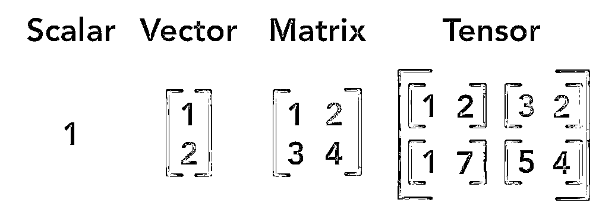

> 参考阅读：
> 
> https://hadrienj.github.io/posts/Deep-Learning-Book-Series-2.1-Scalars-Vectors-Matrices-and-Tensors/

## 

**标量**

标量仅用于表达值的大小，也是零阶张量的一个例子。符号 x ∈ ℝ 表示标量 x 属于实数值数组“ ℝ ”。

在深度学习中我们比较关注以下几个数集，ℕ、ℤ 和ℚ。ℕ 表示正整数集（1,2,3，...）。 ℤ 表示整数集，它包含了正值、负值和零值。 ℚ 表示可以由两个整数所构成的分数进行表达的有理数数集。

Python 中内置了少数几种标量类型，如 int，float，complex，bytes，Unicode。而在 Python 库 NumPy 中，有 24 种新的基本数据类型来描述不同类型的标量。

> 参考阅读：
> 
> https://docs.scipy.org/doc/numpy-1.14.0/reference/arrays.scalars.html

**如何在 Python 中定义和运算标量？**

以下代码片段解释了基础的标量（Scalars）运算。

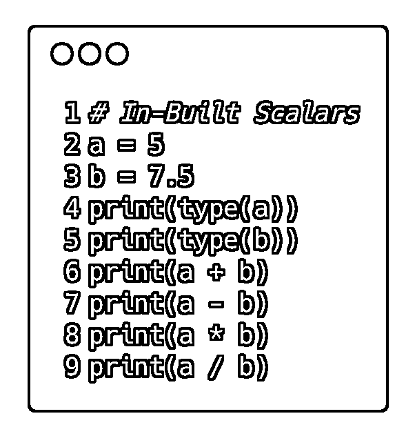

> 参考阅读：
> 
> https://gist.github.com/vihar/fbd3406bd9ba2402465fb1c8f3d8b3a6#file-scalars-py

返回如下：

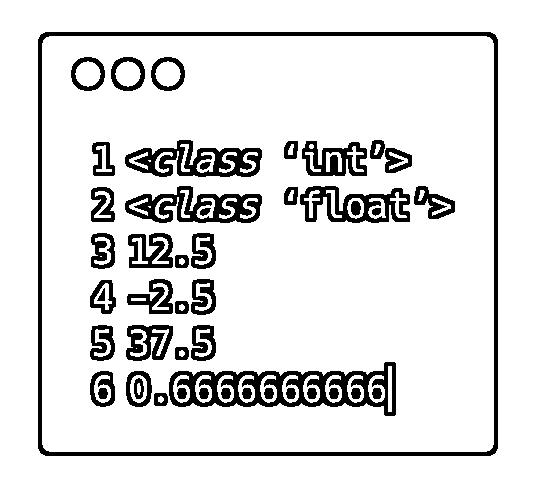

以下代码片段用于检验所给的变量类型是否为标量。

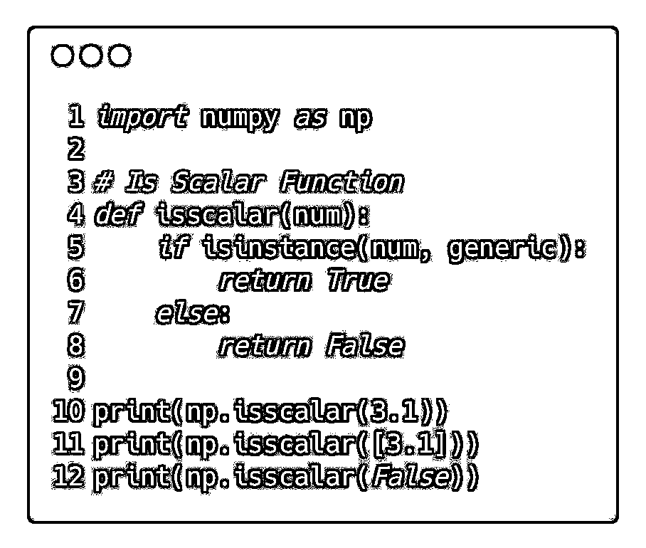

> 参考阅读：
> 
> https://gist.github.com/vihar/b9ef648d47c1cb3db977f13fd3071dc6#file-is_scalar-py

返回如下：

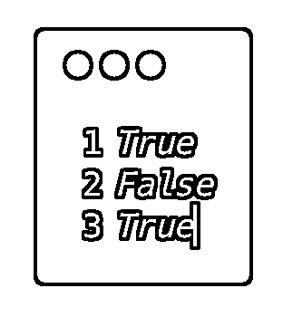

## 

**向量**

向量是由多个单个数字组成的有序数组，也是一阶张量的一个例子。向量是向量空间中的片段。向量空间则可以被认为是在特定长度（或维度）中所有可能存在的向量集合。我们通常说的现实世界中的三维空间，在数学里可以用向量空间表达为 ℝ ^ 3。 

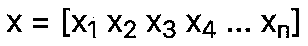

为了清晰明确地标示向量中的必要成分，向量中的第 i 个标量元素被记做 x[i] 。

在深度学习中，向量通常表示特征向量，它的原始成分则表示特定特征的相关程度。这些元素可以包括如二维图像中一组像素的强度的相关重要性，或是金融工具的横截面的历史价格值。

**如何在 Python 中定义和运算向量？**

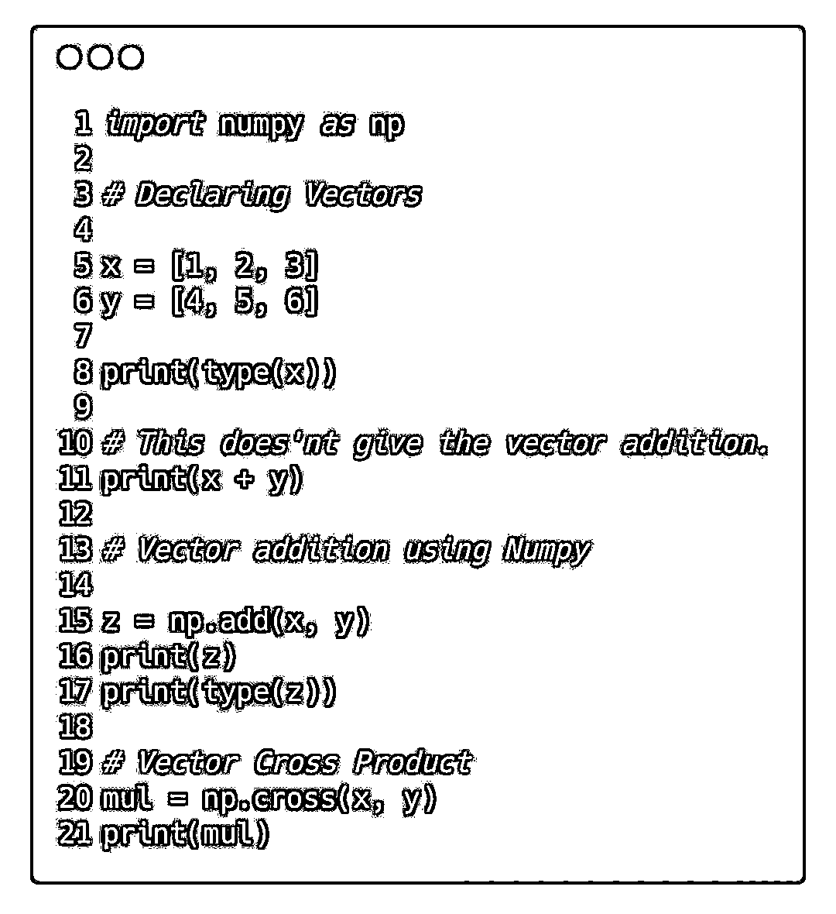

> 参考阅读：
> 
> https://gist.github.com/vihar/7ede36aa2f5ba5e7f70960225a2d351e#file-vectors-py

返回如下：

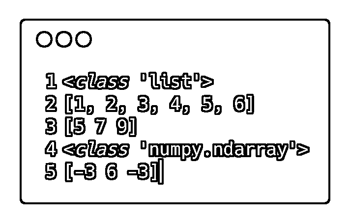

## 

**矩阵**

矩阵是由数字构成的矩形阵列，是二阶张量的一个例子。若 m 和 n 为正整数（ m，n ∈ N ），则 m × n 的矩阵中包含 m * n 个元素，由 m 行和 n 列构成。

完整的 m × n 矩阵可写做：

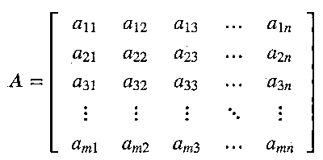

我们通常会将上面的矩阵缩写为以下的表达式：

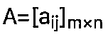

在 Python 里，我们会使用 numpy 库来帮助我们创建 n 维的数组，这基本上可以被认作为矩阵。我们将列表传入名为 matrix 方法来定义一个矩阵。

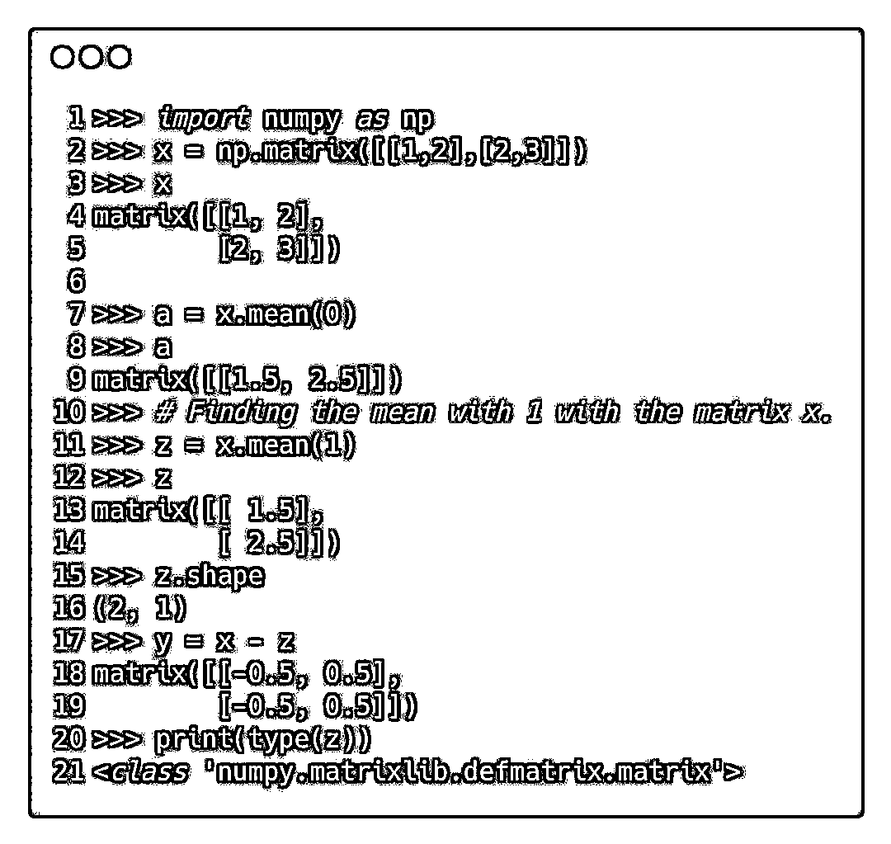

**如何在 Python 中定义和运算矩阵？**

### 

******▌********矩阵加法**

矩阵可以与标量、向量或其他的矩阵进行相加。每一种加法都有一个精确的定义。这些技巧在机习和深度学习有着非常广泛而频繁的使用，所以它们值得你去熟悉。

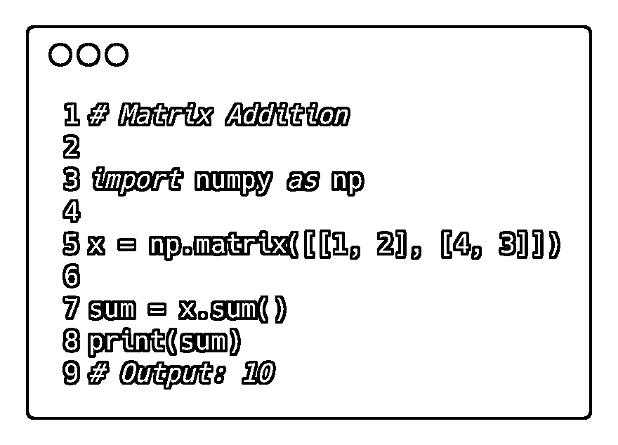

> 参考阅读：
> 
> https://gist.github.com/vihar/1bdc39d126b4772f5a8e9d0b5185625f#file-matrix_addition-py

### 

******▌********矩阵与矩阵的加法**

C = A + B（ A 和 B 的形状应当一致）

方法 shape 能够返回矩阵的形状，方法 add 会将传入的两个作为参数的矩阵相加，并返回相加的总和。若两个作为参数的矩阵的形状不一致，该方法则会提示存在“不能相加”的错误。

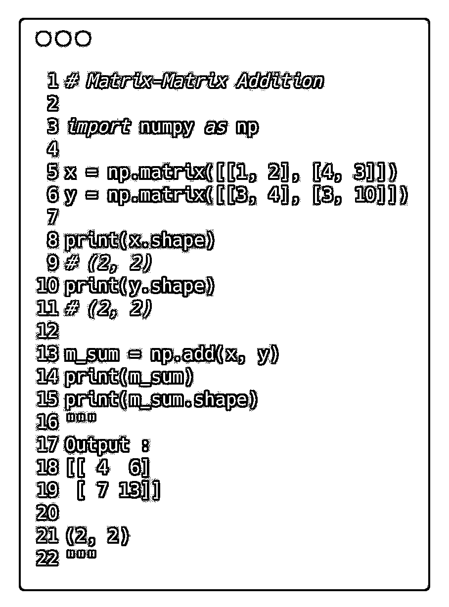

> 参考阅读：
> 
> https://gist.github.com/vihar/b25716665d72d5e6b50c9149718df076#file-m_m_addition-py

### 

******▌********矩阵与标量的加法**

将给定矩阵中的各个元素都与给定的标量进行相加

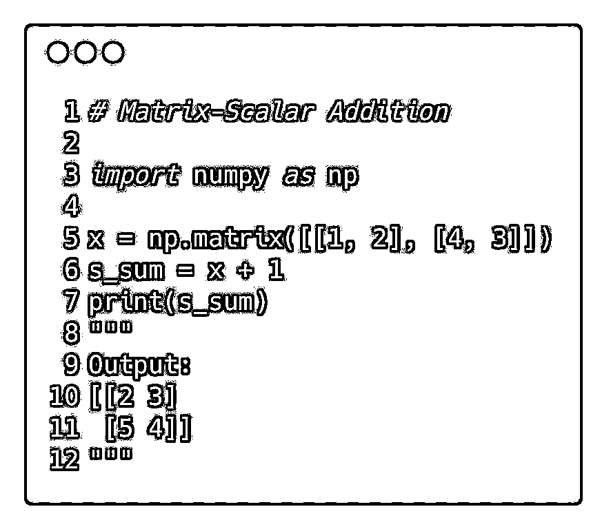

> 参考阅读：
> 
> https://gist.github.com/vihar/ba689ec9a07b1c50f69269454373359a#file-matrix_s_addition-py

### 

******▌********矩阵与标量的乘法**

将给定矩阵中的各个元素都与给定的标量进行相乘

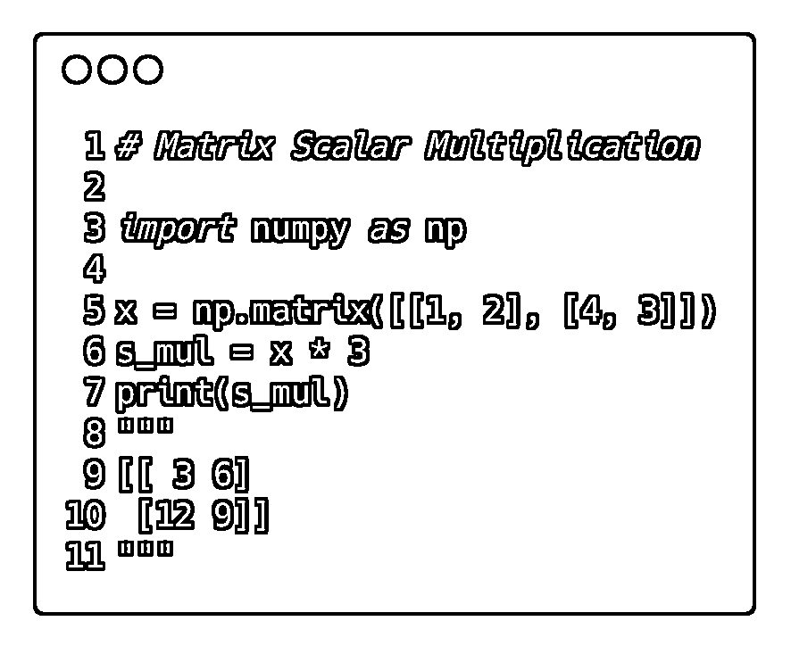

> 参考阅读：
> 
> https://gist.github.com/vihar/5dcc0beeb7e48f0f271a75108401d34c#file-m_s_multiplication-py

### 

******▌********矩阵之间的乘法**

形状为 m x n 的矩阵 A 与形状为 n x p 的矩阵 B 相乘则会得到 形状为 m x p 的矩阵 C

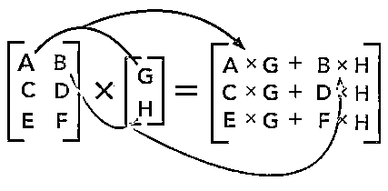

> 参考阅读：
> 
> https://hadrienj.github.io/posts/Deep-Learning-Book-Series-2.2-Multiplying-Matrices-and-Vectors/

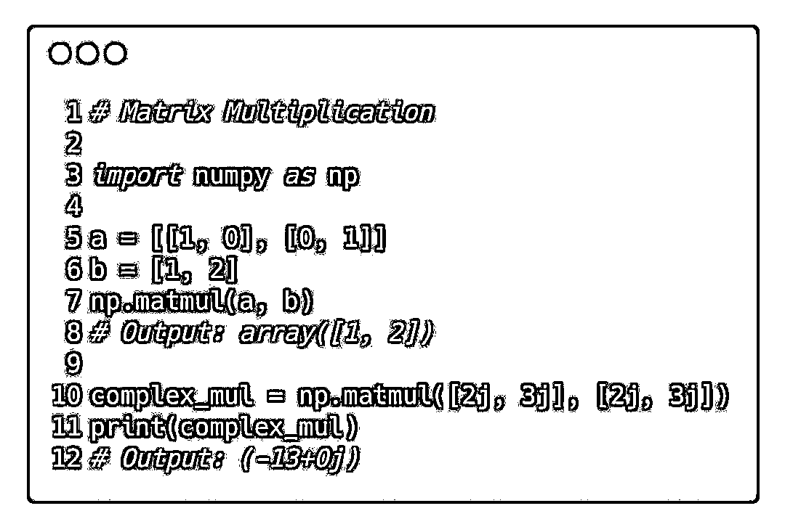

> 参考阅读：
> 
> https://gist.github.com/vihar/1510e248a117f0af6a3843a4307de7b2#file-matrix_mul-py

### 

******▌********矩阵的转置**

矩阵的转置可以使一个行向量变成一个列向量，或反方向操作亦成立作亦成立：

A = [aij]m x n

AT = [aji]n × m

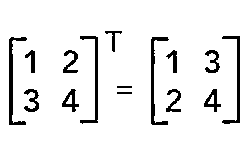

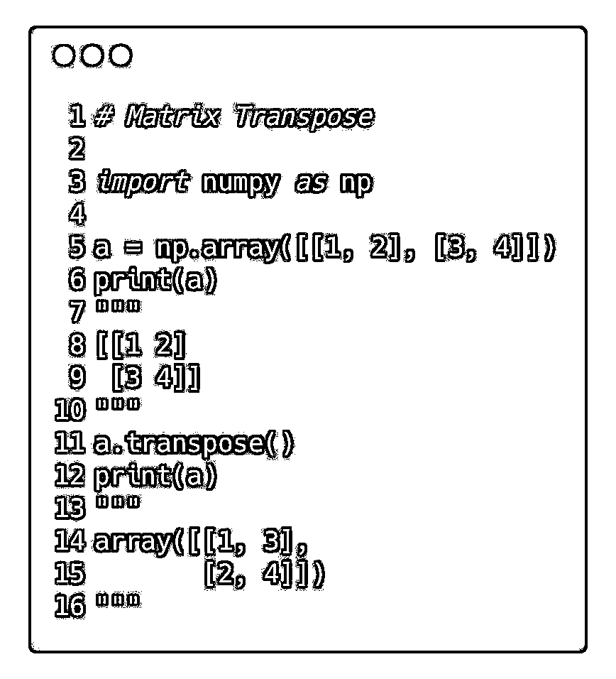

> 参考阅读：
> 
> https://gist.github.com/vihar/3f2091377b3a1f36c402a203f25ffe33#file-martix_transpose-py

## 

**张量**

笼统的来讲，张量包含了标量，向量，矩阵。有些时候，例如在物理及机器学习中，使用超过二阶的张量是非常必要的。

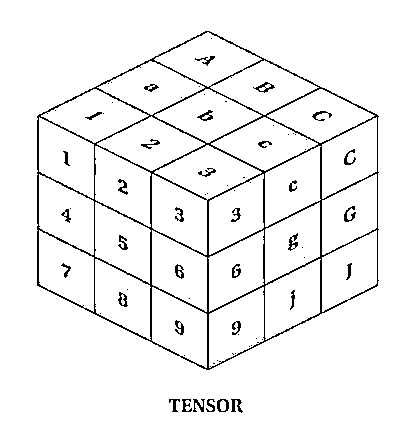

> 参考阅读：
> 
> https://refactored.ai/track/python-for-machine-learning/courses/linear-algebra.ipynb

我们通常不会将矩阵进行嵌套来表示张量，而是会使用像 tensoTflow 或者 PyTorch 这样的 Python 库来对张量进行表示张量 PyTorche 中定义一个简单的张量

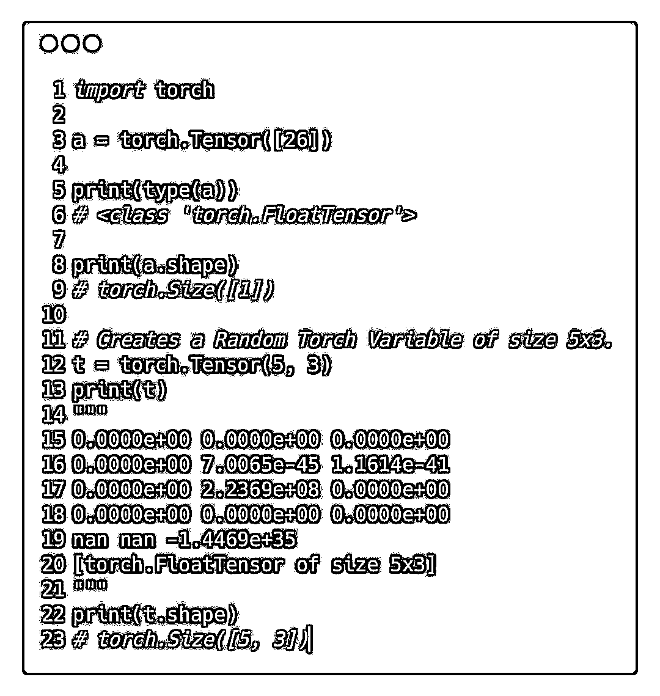

> 参考阅读：
> 
> https://gist.github.com/vihar/eb78a6171de9740b128cbff21fc0b6ea#file-tensors-py

一些在 Python 中其他的张量的运算操作

> src：
> 
> https://gist.github.com/vihar/7b03ca54e4fe811e1053e09bdc1278b5#file-tensor_operations-py

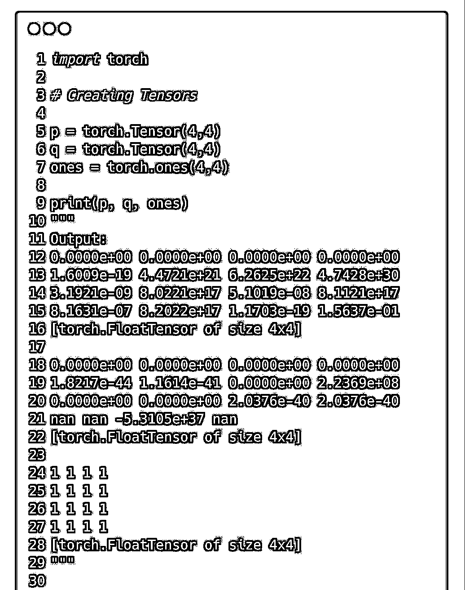

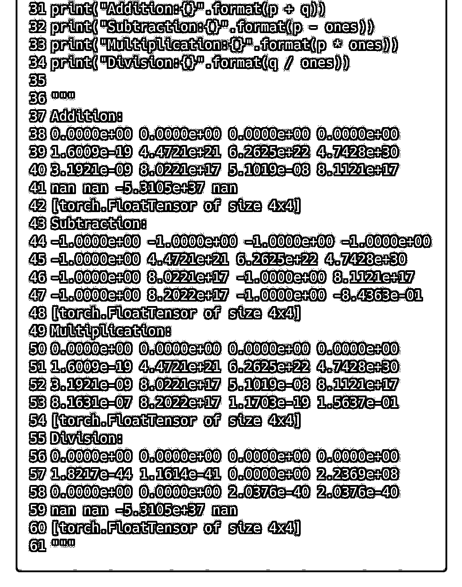

> 更多关于张量和 PyTorch 的文档，请参阅
> 
> https://pytorch.org/tutorials/beginner/deep_learning_60min_blitz.html
> 
> 原文链接：
> 
> https://towardsdatascience.com/linear-algebra-for-deep-learning-506c19c0d6fa

## 

**推荐阅读**

**年度系列**

[1、经过多年交易之后你应该学到的东西（深度分享）](https://mp.weixin.qq.com/s?__biz=MzAxNTc0Mjg0Mg==&mid=2653289074&idx=1&sn=e859d363eef9249236244466a1af41b6&chksm=802e3867b759b1717f77e07a51ee5671e8115130c66562577280ba1243cba08218add04f1f00&token=449379994&lang=zh_CN&scene=21#wechat_redirect)

[2、监督学习标签在股市中的应用（代码+书籍）](https://mp.weixin.qq.com/s?__biz=MzAxNTc0Mjg0Mg==&mid=2653289050&idx=1&sn=60043a5c95b877dd329a5fd150ddacc4&chksm=802e384fb759b1598e500087374772059aa21b31ae104b3dca04331cf4b63a233c5e04c1945a&token=449379994&lang=zh_CN&scene=21#wechat_redirect)

[3、2018 年学习 Python 最好的 5 门课程](https://mp.weixin.qq.com/s?__biz=MzAxNTc0Mjg0Mg==&mid=2653289028&idx=1&sn=631cbc728b0f857713fc65841e48e5d1&chksm=802e3851b759b147dc92afded432db568d9d77a1b97ef22a1e1a376fa0bc39b55781c18b5f4f&token=449379994&lang=zh_CN&scene=21#wechat_redirect)

[4、全球投行顶尖机器学习团队全面分析](https://mp.weixin.qq.com/s?__biz=MzAxNTc0Mjg0Mg==&mid=2653289018&idx=1&sn=8c411f676c2c0d92b0dd218f041bee4b&chksm=802e382fb759b139ffebf633ac14cdd0f21938e4613fe632d5d9231dab3d2aca95a11628378a&token=449379994&lang=zh_CN&scene=21#wechat_redirect)

[5、使用 Tensorflow 预测股票市场变动](https://mp.weixin.qq.com/s?__biz=MzAxNTc0Mjg0Mg==&mid=2653289014&idx=1&sn=3762d405e332c599a21b48a7dc4df587&chksm=802e3823b759b135928d55044c2729aea9690f86752b680eb973d1a376dc53cfa18287d0060b&token=449379994&lang=zh_CN&scene=21#wechat_redirect)

**知识在于分享**

**在量化投资的道路上**

**你不是一个人在战斗**