# 【独家重磅】来自华尔街的量化金融面试 Q&A（第三期）

> 原文：[`mp.weixin.qq.com/s?__biz=MzAxNTc0Mjg0Mg==&mid=2653289092&idx=1&sn=c2e888bccf3d1ff1dbd4cd6e4ef1c4ca&chksm=802e3891b759b187b71a96d2d0da902137b8547399a99d915577e0cb08528218534a94b71511&scene=27#wechat_redirect`](http://mp.weixin.qq.com/s?__biz=MzAxNTc0Mjg0Mg==&mid=2653289092&idx=1&sn=c2e888bccf3d1ff1dbd4cd6e4ef1c4ca&chksm=802e3891b759b187b71a96d2d0da902137b8547399a99d915577e0cb08528218534a94b71511&scene=27#wechat_redirect)

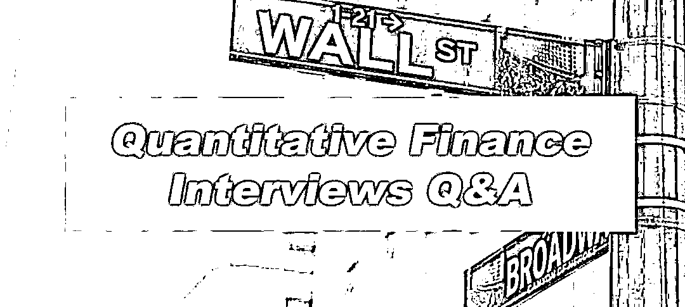

量化投资与机器学习微信公众号将定期推送至少**200 期以上**的**华尔街量化金融面试 Q&A**。所有题目均来自国外高质量的面试宝典，**我们做了精心的翻译和解读**。这些面试题目涉及 Quantitative Finance 的所有方面，**超级全面！**。

**此内容对那些想从事量化方面的求职者和相关行业人员都有一定的借鉴意义。我们希望大家通过阅读此系列的文章对其在职业发展上有一定的帮助，我们会感到十分很欣慰。*

往期传送门

[**第一期**](https://mp.weixin.qq.com/s?__biz=MzAxNTc0Mjg0Mg==&mid=2653288520&idx=1&sn=8e5040f41d3ef632d901f163c3a0d4c9&chksm=802e3a5db759b34bddd7635267baec0a485f1a8f108bc47e60a4b9c1829bc2e9422babb53ead&scene=21#wechat_redirect)

[**第二期**](https://mp.weixin.qq.com/s?__biz=MzAxNTc0Mjg0Mg==&mid=2653288556&idx=1&sn=38c68fea3a8be7edc68af9a70e5a9416&chksm=802e3a79b759b36fdb830f5e94ed0cf0258cc96e635d7e782334a0b65eb65de227d027afcd0e&token=449379994&lang=zh_CN&scene=21#wechat_redirect)

**Questions13**

一只蚂蚁想从体积为 1 立方米的立方体的一个角移动到另一个角。如果蚂蚁走的是最短路径，那么它走了多远？

**Answer13**

该题的关键是展开立方体，那么问题就变得很简单。显而易见：

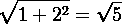


**Questions14**

假如你在房间里被蒙着双眼，有人告诉你地板上有 1000 枚硬币。980 枚硬币反面朝上，另外 20 枚正面朝上。你能不能把硬币分成两堆，以保证两堆硬币正面的数量相等？假设你不能通过触摸硬币来进行正反面的判断，但是你可以翻转任意数量的硬币。

**Answer14**

假如我们把 1000 枚硬币分成两堆，一堆是 n 枚硬币，另一堆是 1000-n 枚硬币。如果第一堆有 m 个正面朝上，那么第二堆一定有 20-m 枚硬币正面朝上。我们也知道在第一堆中有 n-m 枚硬币反面朝上，我们显然不能简单的通过调整 n 来保证 m=10。

那么，我们应该怎么做呢？如果你愿意的话，可以把硬币翻转过来，因为我们无法知道硬币的另一面是什么。所以，如果我们有选择的翻转硬币我们不能保证什么，但是如果我们把第一堆所有的硬币都翻转过去，所有的正面的变成了反面，所有的反面变成的正面。因此，它将有 n-m 枚正面和 m 枚反面（对称）。

因此，首先我们需要使原来第一堆的反面等于第二堆的正面，换句话说，使 n-m=20-m,n=20 使方程成立。如果我们随机抽取 20 枚硬币，把它们翻转过来，那么在这些被翻转过来的 20 枚硬币里，正面的数量应该与其他 980 枚硬币中的正面数量相等。


**Questions15**

给定任意一个正整数，提出一个规则来检验该数字是否能够被 9 整除并证明它。

**Answer15**

我们把原整数表示成：

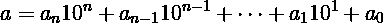

和我们常规的：

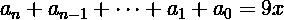

即 a 能被 9 整除，那么证明如下：  

**证明：**对任意一个 


让

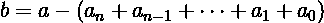

我们有

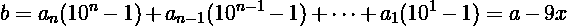

能被 9 整除，因为所有的

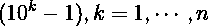

能被 9 整数。因此 b 和 9x 都能被 9 整除，同样 a=b+9x 一定也能被 9 整除。


**Questions16**

公司在为至少有一个儿子的职场妈妈们举办一场晚宴，一位有两个孩子的母亲 A，如果有两个男孩的概率是多少？ 

**Answer16**

有两个孩子的集合为：

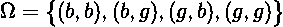

(g,b)表示大一点的孩子是女孩，小一点的孩子是男孩。每个结果有相同的概率，设 B 为至少有一个孩子是男孩，A 为两个孩子都是男孩。那么：

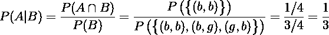


**Questions17**

你刚买了一只股票 A 想通过做空股票 B 来对冲。你应该做空多少 B 股来进行最小化的对冲？假设股票 A 收益的方差是σ2A ，股票 B 收益的方差是σ2B ，它们之间的相关系数是ρ 。

**Answer17**

假设我们做空 B 的 h 股，投资组合回报的方差是：

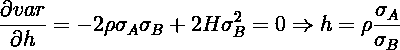

最佳的对冲比率应使 var(rA-hrB)最小。对 h 求一阶偏导，让它等于 0：


为了确认它是最小值，我们还可以对其求二阶偏导：

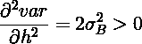

当

 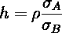

时，对冲投资组合的方差最小。


**Questions18**

Python 中 pass 语句的作用是什么？ 

**Answer18**

pass 语句不会执行任何操作，一般作为占位符或者创建占位程序。


**Questions19**

用 Python 中的 sort 对 a=[1,2,4,2,4,5,7,10,5,5,7,8,9,0,3]进行排序，然后从最后一个元素开始判断。 

**Answer19**

**代码如下：**

```py
a = [1,2,4,2,4,5,7,10,5,5,7,8,9,0,3]
a.sort()
last = a[-1]

for i in range(len(a)-2,-1,-1):
if last==a[i]:
    del a[i]
else:
   last=a[i]
print(a)
```

**推荐阅读**

**年度系列**

[1、经过多年交易之后你应该学到的东西（深度分享）](https://mp.weixin.qq.com/s?__biz=MzAxNTc0Mjg0Mg==&mid=2653289074&idx=1&sn=e859d363eef9249236244466a1af41b6&chksm=802e3867b759b1717f77e07a51ee5671e8115130c66562577280ba1243cba08218add04f1f00&token=449379994&lang=zh_CN&scene=21#wechat_redirect)

[2、监督学习标签在股市中的应用（代码+书籍）](https://mp.weixin.qq.com/s?__biz=MzAxNTc0Mjg0Mg==&mid=2653289050&idx=1&sn=60043a5c95b877dd329a5fd150ddacc4&chksm=802e384fb759b1598e500087374772059aa21b31ae104b3dca04331cf4b63a233c5e04c1945a&token=449379994&lang=zh_CN&scene=21#wechat_redirect)

[3、2018 年学习 Python 最好的 5 门课程](https://mp.weixin.qq.com/s?__biz=MzAxNTc0Mjg0Mg==&mid=2653289028&idx=1&sn=631cbc728b0f857713fc65841e48e5d1&chksm=802e3851b759b147dc92afded432db568d9d77a1b97ef22a1e1a376fa0bc39b55781c18b5f4f&token=449379994&lang=zh_CN&scene=21#wechat_redirect)

[4、全球投行顶尖机器学习团队全面分析](https://mp.weixin.qq.com/s?__biz=MzAxNTc0Mjg0Mg==&mid=2653289018&idx=1&sn=8c411f676c2c0d92b0dd218f041bee4b&chksm=802e382fb759b139ffebf633ac14cdd0f21938e4613fe632d5d9231dab3d2aca95a11628378a&token=449379994&lang=zh_CN&scene=21#wechat_redirect)

[5、使用 Tensorflow 预测股票市场变动](https://mp.weixin.qq.com/s?__biz=MzAxNTc0Mjg0Mg==&mid=2653289014&idx=1&sn=3762d405e332c599a21b48a7dc4df587&chksm=802e3823b759b135928d55044c2729aea9690f86752b680eb973d1a376dc53cfa18287d0060b&token=449379994&lang=zh_CN&scene=21#wechat_redirect)

**知识在于分享**

**在量化投资的道路上**

**你不是一个人在战斗**