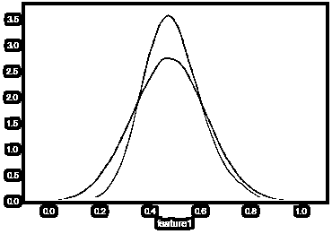
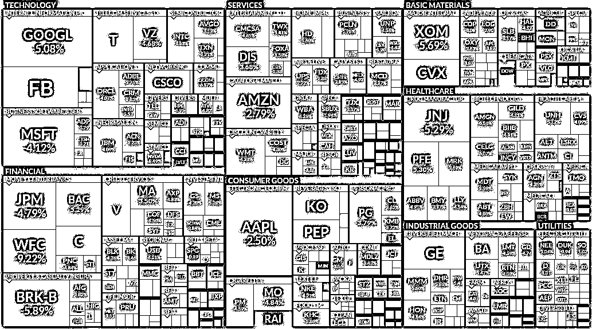
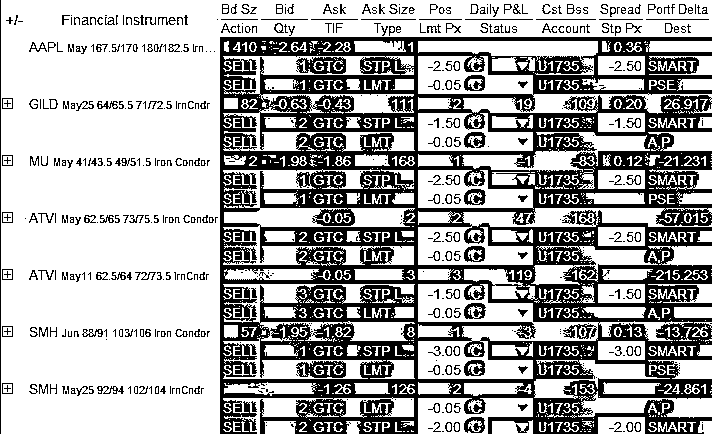
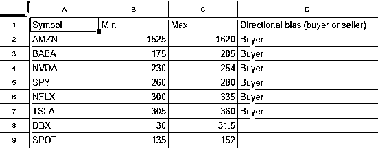
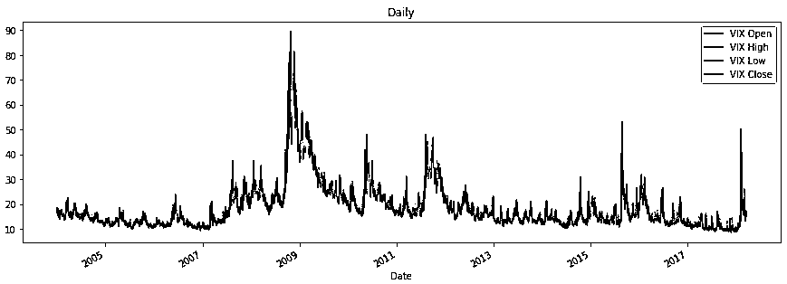

# 【年度系列】经过多年交易之后你应该学到的东西（深度分享）

> 原文：[`mp.weixin.qq.com/s?__biz=MzAxNTc0Mjg0Mg==&mid=2653289074&idx=1&sn=e859d363eef9249236244466a1af41b6&chksm=802e3867b759b1717f77e07a51ee5671e8115130c66562577280ba1243cba08218add04f1f00&scene=27#wechat_redirect`](http://mp.weixin.qq.com/s?__biz=MzAxNTc0Mjg0Mg==&mid=2653289074&idx=1&sn=e859d363eef9249236244466a1af41b6&chksm=802e3867b759b1717f77e07a51ee5671e8115130c66562577280ba1243cba08218add04f1f00&scene=27#wechat_redirect)

公众号推送了很多技术类的文章，今天为大家带来一篇软文，直指交易实战。所有策略、算法等，可能都需要经过实践的检验和不断的改进才有可能为你带来一定的财富，但也不是永远的。

**真的很好哦，希望你们能读完**

我在 6 个月内获得了 20％的投资回报率，并又在一个月内全部亏损。 然后在接下来的一个月中，我在 10 笔交易中又损失了 30％。 几乎差点强平了我的帐户，追加了十几次保证金。我尝试了多种机器学习算法，交易了多个市场等等。 我犯了任何可能的错误，但不知怎的，我活了下来并且学到了很多东西。

在软件工程行业工作了 4 年后，我意识到我的职业道路很顺畅。 我很擅长处理与数据科学相关的项目。 我对算法交易的热情永远不会褪去，所以我决定放弃我的数据科学职业生涯并以交易为生。 以下是我所犯的错误以及如何避免这些错误：

**机器学习的炒作**

现如今，机器学习算法几乎在我们的生活中无处不在。 媒体喜欢它，投资者称之为“buzz words”，因为他们永远不会用到它。 DeepMind 的 AlphaGo 进展令人兴奋，但是只是一个开始。 

机器学习的问题在于，在交易中使用十分困难。 它更像是一种过滤方法，而不是一种决策制定工具。 大多数回测都很棒，在实际交易中则是失败的，因为它们容易过拟合。 你将通过交叉验证来对修正它，并挑选出最佳样本中的最佳模型，你认为你是对的，以某种方式增加自己的想法和 leaking 数据。 这样的方法是不对的。

市场有不同的训练/测试分布

通过仔细拉平价格和评估不同的资产、时间范围或期间来避免过度拟合。 使用非传统的训练/测试并添加随机噪声来评估模型的泛化能力。 一定要非常小心，因为你连自己都不知道会发生什么，但蒙特卡罗模拟是你最好的朋友，因为你至少可以模拟很多场景。

**总结：****机器学习在量化投资的应用需要根据自己的实力和能力适可而止。复杂的不一定是最好的，模型一定要可解释，错在哪里要一清二楚。**

**风险**

我在交易期间多次感到十分安全，以为我已经搞定了。我觉得没有什么能让我惊讶，但我一次又一次被市场打脸。1 笔交易出现了问题，消除了之前的 10 笔盈利，波动率飙升和你违反了常规的操作，市场流动性变成了你投资中的恶魔，继而引发了一场追加保证金和你的经纪人。伙计们，这是现实，没有免费的午餐。一切都涉及风险，关键是你对自己的赔率和赔率多少有深刻的了解。

作为一名期权交易员，我的优势在于卖出定价过高的期权，并在价格下跌时买回来。目前有几种定价模型，如布莱克-斯科尔斯-默顿模型、二叉树模型和蒙特卡洛模型。它们都提供了资产在预定义的时间范围内的定价估计。通常 IV(隐含波动率)夸大了市场的恐惧。但有时恐惧是真实的。

2018-02-06 TripAdvisor 上线

正如我们在 2018 年 2 月看到的那样，市场担忧有时是真实存在的。指数开始抛售，人们纷纷逃离 ETF 和股票，转向较安全的现金和黄金，因为现金才是真正的王者。加密货币之所以被抛弃，是因为人们意识到，与数字货币相比，劫掠者显然更喜欢现金和黄金。

**Alpha**

Kaggle 的所有比赛都是通过疯狂的分类器组合和平均法赢得的。在很长一段时间里，我试图通过运用尖端技术、算法和工具，试图成为一个聪明的人。这些方法和工具有时工作，有时不工作。通常情况下，你要花上几周或几个月的时间才能弄清楚哪里出了问题。正如前面提到的，这是一个非确定性的过程，只会增加噪音和 leaking 数据。

**事实是，你只需会简单的统计、蒙特卡洛模拟和会一些 Python 就足够了。通过简单的假设和较好的模拟验证，就可以发现定价过高和过低的出价和要价，仅此而已。这些花哨的模型对你的自我意识和理解都是有好处的。但在市场中，本科和研究生所学的的概率和统计知识足以支撑你实现一个盈利策略。**

**KISS (Keep It Simple Stupid)**

如果没有交易经验的人问你如何赚钱，你必须能用几句话来解释清楚，否则，你就不会赚钱。在此之前，我常常向人们解释我的机器学习流程是多么的花哨，却无法解释 Alpha。现在很简单：我出售定价过高的期权溢价，仅此而已。资产价格边界方法非常复杂，但 Alpha 来源很清楚。 

对大多数人来说，交易似乎是一项艰巨的任务。事实上，人们每天都在不知不觉中扮演着交易者的角色。你去超市买东西。这是你的市场（exchange），价格是你的买卖价差（level 1），你只能买（ask），但供应商也可以卖（bid）。超市后面的供应是 level 2。收银员是你的订单簿。现在把它推广到你买卖的所有东西，都是交易，每个人都是日内交易者。

说真的，我的算法越复杂，我的损失就越大。被花哨的 Spark 工作、Lambda 表达式和漂亮的 Jupyter notebook 所笼罩，实际上赚的钱却更少了。事实上，一开始我使用简单的多线程流和几个简单的脚本来计算 Alpha 值。当我开始专注于性能时，我失去了对 Alpha 本身的追踪。最重要的是要跟踪一个简单有效的工作流程，然后你可以在一个靠谱的框架上添加各种想法。性能和易用性固然重要，但对于散户来说，一致性和简单性更为重要。

**市场 Roller Coaster**

6 个月的盈利固然不错，但你可能比前几个月损失更多。有时候市场就像鳄鱼一样残酷而快速。我犯的最大的错误之一就是过度下注。虽然凯利标准是重要的考虑因素，少投注总是比多投注好。风险评估和仓位调整是你成功的关键。拥有一个高胜率的策略与正确的头寸规模和保证金要求，是同样重要。 

巴菲特引用合作伙伴芒格的话说：

 “liquor, ladies and leverage”

**事后诸葛亮**

人们会告诉你应该做什么。我犯的每一个错误都有人告诉我这是可以避免的。你的家人、朋友和同事会怀疑你，怀疑你的能力、你的技能和你的想法。Robert Kiyosaki 说的很对：人们太害怕尝试一些东西，所以评估别人总是很容易，但自己不去做。大多数时候，你会对周围的环境感到沮丧：从社交网络上的到你的潜在投资者，每个人都认为这很容易，而且他们可以做到。但话说回来，他们都是事后诸葛亮。**你一定要跟随你的直觉，这是你的战场，不要被观众误导。**

**偶尔的疯狂**

这也会发生在你身上。大多数专业交易都需要心理稳健性。在市场波动的时，你会随着市场而心跳加速，保证金要求会突然提高。你会绝望和痛苦，因为你做了非常大的交易，有无限的风险，没有考虑到雨天。有些日子会下雨，总是要做好准备。

此外，我失去了我的灵魂。我的朋友们反复批评我“冷漠”、“咄咄逼人”和“粗鲁”。有一会儿，我差点忘了怎么弹吉他。对我来说，每一个社交活动都突然变得烦人、耗时，或者浪费了宝贵的编程时间。长时间的工作，饮食失调导致体重减轻等。这太极端了，不要这样做。我在什么地方读到过，这实际上是我在努力工作中表现出色的标志。但是这对你的交易不利。你必须避免，不要夸大。

**重生**

一次又一次搞砸之后，大大降低了我的期望。我突然明白了一个说法，关于你能从市场上拿走多少钱。

最重要的是，我突然变得无所畏惧，再也没有什么能吓到我了。我不再天真，完全理解其中的风险。在某种程度上，我意识到这个行业是多么脆弱和危险。就像走在雷区。

我开始较小资金的交易。首先调查公司，加上通常会出现多个交易想法，所以不会出现 FoMO(Fear of Missing Out)。此外，我还大幅减少了自己的观察名单，专注于流动性和数量。这是最重要的时刻。进出交易是强制性的。我所有的亏损交易都是低流动性资产和糟糕的基本面，现在需要花很少时间去评估。

**佣金**

在我遭受重大损失之前，我过去每个月都会赚取 4％的 ROC。佣金似乎无关紧要。当我爆了超过 30％的仓位并减少头寸时，我突然意识到低佣金的重要性。与 IB（盈透证券交易经纪人）的交易，考虑到强大的平台和灵活的 API，我支付的佣金在业内是最低的。另一方面，通过减少头寸规模，我发现自己支付了 5-10%的佣金，IB 建议“提供流动性”，因为他们“不讨论利率”，即使你一个月做 200 笔交易。此外，我还需要历史价格，所以 Quandl 在这里是至关重要的。经纪人对你一点也不在乎，做一个零售交易员真糟糕。

避免佣金流失的唯一方法是交易规模。人们倾向于谈论多样化等等。位置应该如何小等等。事实证明，交易规模太小会害死你。这是一个个人参数，是你账户大小、风险规避等的函数。

**耐心**

在日间交易中最难完成的事情之一就是耐心。有时候最好的交易是不交易，就像象棋中的祖格王。做短线交易员意味着做一个市场瘾君子，这意味着在开盘前肾上腺素会飙升。有时现金为王，不交易或等待合适的交易时机是你能做的最好的状态，特别是当市场在抛售或危机时期疯狂的时候。另一方面，交易就像空气，如果你不交易，你就不存在。控制这种冲动是你成功的关键。很多次我都在增加亏损头寸，或者试图保存头寸，而不是等待和保留现金。

就像 Charlie Munger 说的：

**大笔的钱不是通过买卖赚来的……但在等待中。**

耐心也与进入和退出有关。你会看到你想要的价格，但是他们会改变 LMT 的订单，而你没有得到它。然后你会调整并追逐价格，价格会再次移动。不要急于求成，这需要时间。最终你会坚持自己的观点，等待对方接受。根据我的经验，如果基础是流动性的，全天中间价格的交易就会被填满。所以有时候等待是有帮助的。永远不要光看你的亏损头寸，市场总是可以反弹的，即使它离到期还有一天。 

**掌握艺术**

交易绝对是艺术而非科学。你可能马上就开始学习一种新乐器，大概过了几个星期，可以演奏一些简单的乐谱。一个月后，你希望演奏一首歌。努力工作是关键。 

同样，交易需要大量的实践。专业人士和业余交易者之间的区别就在于毫不费力地达到交易水平。不幸的是，人们不明白这个概念，因为短线交易员总是看起来像有钱可花的人。人们似乎忽略了这条路，因为这是这场游戏中最困难的部分。

我读了几十本书，读了数百篇文章，看了数百小时的视频相关内容。**学习永远不会停****止。你的交易策略必须不断地改进，否则你的优势就会消失。**最好的内容可以在线获取，而且主要是免费的。如果你正在进行期权交易，你必须检查一下 tastytrade，OptionAlpha 和 OIC。它们会教你所有你需要知道的东西。这取决于你有多积极。

**像做市商一样思考**

在进行了数百次手动交易之后，你就会开始注意到这些事情，尤其是像新手一样被被骗的事件。除了佣金之外，交易期权中最令人沮丧的概念之一就是做市商。做市商本质上是操纵市场的参与者。众所周知，像 Citadel，Final 和许多其他 HFT（高频交易）这样的公司完全控制了市场上的价格低效。试图买卖的大型机构是被敲诈的主要目标，因为快速的玩家可以很容易地抢到你之前，以更高的价格卖给你同样的东西，或者以更低的价格从你那里买，然后卖给/从别人那里买。

如前所述，佣金是问题的一部分，但没有佣金，就没有交易场所。真正的问题是做市商在虚张声势。所有的基础设施都是自动化的，快速的玩家到处都在追逐你的交易，在买入时给你提供高价，在卖出时给你提供低价。击败它的唯一方法是使用限价订单，并尽量预测中间价。所以这就像支付两次佣金一样！永远不要使用市场订单或原始价格，总是以中间价或更好的价格为目标。

**了解你的设备**

我花了 6 个月的时间来充分利用我的交易软件。我在我的 PC，笔记本电脑和 AWS 实例上完全克隆了我的交易设置。如果发生故障，我可以很容易地恢复我的交易和需要的软件。我的网络连接非常稳定。在恶劣的天气或罕见的事件中，我有多个网络适配器，使我的智能手机成为热点。我添加了多个自动化层，使我的交易尽可能稳健。分析瘫痪是不好的，特别是在交易中。尝试尽可能地消除手动询问。

我犯了几十个快捷键错误，可能因为错误的价格和多种交易组合而损失了几千个。匆忙和缺乏知识会导致愚蠢的错误和资本的损失。不要运行，你是一个零售交易员，而不是一个算法交易计算机。要彻底了解你的交易软件。

**分析瘫痪**

过度交易是十分糟糕的。交易是非常令人兴奋的，你会变成一个瘾君子。你太急于交易、改进和修改，最终你被困住了，弊大于利。一开始我无法离开屏幕。我在一个屏幕显示放期货和 Tastytrade 广播，在另一个屏幕上显示我的头寸。最终，我会坐上 6 个小时，修改、交易、改进或通常“触摸”我的交易。我从惨痛的教训中认识到，期权交易只在开盘和收盘时进行。其他的都不好。 

在这个游戏中生存的唯一方法就是像机器人一样交易。尝试新东西是可以的，也是学习的一部分，但是在你的 live 账户上尝试新东西可能是一场灾难。我把利润门槛和风险的概率转换得太快了。最终我能够收敛并找到最优的比率。在我的 live 账户上做这件事花费了我数千美元，我可以通过事先评估来避免这样的错误，至少模拟回测交易一个月。一致性和持久性是必须的。

**PDT**

PDT（模式日交易者）规则要求每天至少 2 万 5 千美元的交易：每周进行 3 天以上的交易。我讨厌它，每个人都讨厌它，认为它是愚蠢的。这很烦人，但一旦你像机器一样在交易后被迫接受了 PDT 限制，这个逻辑是合理的。

我一直在用一个不错的账户进行交易，这个限制对我来说似乎无关紧要。我从来没有把我的交易按优先级排序，因为我可以把它们都做出来。当我失去一半账户的那一刻，我突然意识到每笔交易都是多么珍贵。我不得不用激光聚焦我的交易，而不是到处射击。

**交易日志**

你会听到很多关于交易日志如何重要的信息，但是老实说，没有人会保留日志。通常你认为这是浪费时间。你只对你赚了多少钱感兴趣。最终你会成长为一名交易员，你会意识到交易日志的重要性。

保持一个最新的交易日志将会改善一切。从佣金和赔率到你交易的资产。你会学到比你想象的更多的东西，并且会以不同的方式提高你的纪律性。我开始用一份谷歌表格作为交易日志。在一周后，我意识到自己的风险太高，交易规模太小。实际上，我冒着超过 1 到 4 的风险，实际情况接近 1 比 5，因为我的交易规模太小了。

例如，在我的期权策略中，我通常会卖出至少 0.5 个信用额度，或者 50 美元，然后分析你最多能赚到的利润（期权合约有 100 个标准乘数）。假设你拿 100 美元去赌 25 美元也就是 1 比 4 概率对你有利，但实际上你赚了 19 美元，风险还是 100 美元。从 25 美元跌至 19 美元，这是普遍建议的固定汇率中间价为 50%，加上经纪商在每次交易往返中（进出）收取 3 至 10 美元。

解决这个问题的唯一办法是提高最低入场价格。从那一刻起，我的保费不少于 100 美元。我用 75%的利润代替了 50%。实际上，风险是 75 到 200 美元也就是 1 到 2.67 美元。这个比例很糟糕，但很现实。75%的交易成功了，我们还好，而且比 80%的交易容易。虽然使用长距离期权策略很常见，但日志对我来说很有用，所以你必须调整你的获利者，并相应地停止亏损水平。

**SPX 是国王，VIX 是皇后**

SPX@CBOE 或标普 500 指数是市场。所有移动的东西和所有有趣的东西都反映在这些索引中。每一次崩溃、高峰、炒作和恐惧都在那里。VIX@CBOE 或 SPX 波动指数是市场中恐惧和贪婪的纯粹反映。当市场波动时，波动性也会波动，反之亦然。相关性长期有效，但当波动性飙升时，一切都是相关的。 

波动率指数的高值对期权卖家有利，而低值则是不好的。请注意，长时间的低波动率最终会导致大规模爆发。

波动率指数历史数据

看清楚当天最移动的资产。随着溢价的上升，资产价值的下降会更加有趣。作为优质卖家，这是行动迅速，出价丰厚的时候。随着期权溢价上升，市场担忧对期权交易有利。要有耐心抓住那些瞬间并立即行动。这就是你的优势。

**No Fill is a Kill**

无法填补你的交易将使你发疯。我多次追逐价格直到我得到它，但弊大于利。做市商总是会在你入市的时候给你一个更好的填充，并且很少会为您提供中等价格或更好的 Fill。在进入之前，只要找到满足你的风险回报比的出价。两件事几乎总会发生：1.你会得到 Fill。2.你会马上看到更好的价格。但至少你可能获得回报。进行大量交易你会没事的。很难意识到，这将导致两种： 1\. Almost no fills 2\. Negative expectancy in terms of risk to reward due to commissions and your target exit price (which is seldom 0).

**永远不要重复你的错误**

每次交易前记得检查自己。我曾多次犯过交易错误，并一次又一次地犯同样的错误。 

记住，交易需要数年时间才能掌握，这是一个艰难的过程。学习永远不会停止。市场是动态的。重新评估和补充你的策略是很重要的。

最后送大家一句话：

**Be careful as we are small retail traders and the sharks love us fat stupid snacks.**

Andrew Kreimer | Traveling Trader

**知识在于分享**

**在量化投资的道路上**

**你不是一个人在战斗**