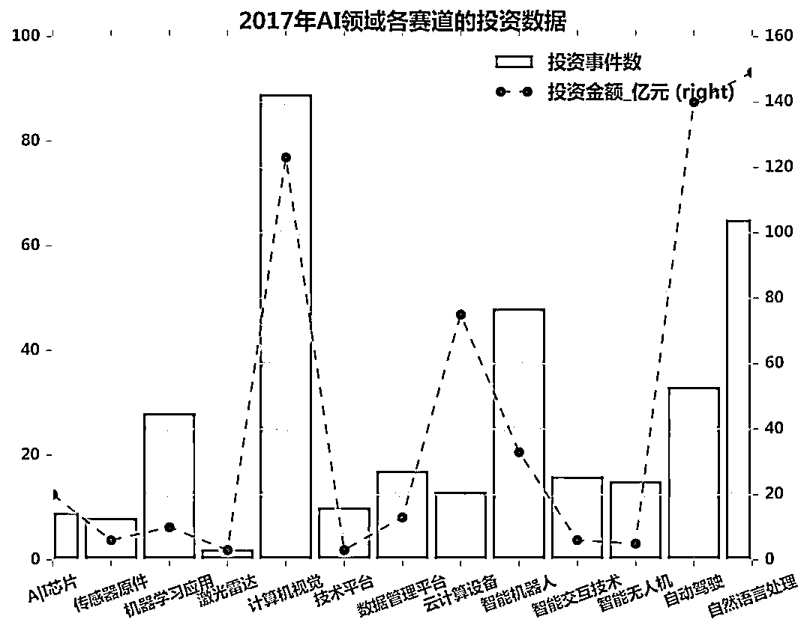

# 计算机视觉：进最快的赛道，挣最多的钱

> 原文：[`mp.weixin.qq.com/s?__biz=MzAxNTc0Mjg0Mg==&mid=2653289064&idx=1&sn=490af28e08e3e974cb5a7a66dd780118&chksm=802e387db759b16b821316ed62927b562d314148407a460e2982055eec0a1172a4f678244150&scene=27#wechat_redirect`](http://mp.weixin.qq.com/s?__biz=MzAxNTc0Mjg0Mg==&mid=2653289064&idx=1&sn=490af28e08e3e974cb5a7a66dd780118&chksm=802e387db759b16b821316ed62927b562d314148407a460e2982055eec0a1172a4f678244150&scene=27#wechat_redirect)

指纹解锁、刷脸识别、语音转换文字、机器人看病、Alphago······我们已经深刻的感受到，人工智能在改变我们的工作方式和认知。

通过 SAS 针对企业人工自能就绪调研的报告可以看到，大部分企业认为人工智能还处于初期阶段，“目前，我们正在部署的大量应用场景都包含 AI 板块”。 显而易见，我们必须学习新的技能来配合 AI 的发展，并且，未来也是属于那些意识到这一点，并开始及早发展这些技能的人。

**进入 AI 领域，方向选择很重要**

以 2017 年 AI 领域各赛道的投资数据来看，投资事件数最多的是计算机视觉方向，其次是自然语言处理、智能机器人及自动驾驶。 

能够获得如此多的投资，足以证明，计算机视觉是一个发展前景巨大的方向。

这么火的计算机视觉到底该怎样学习呢？ 

1、你可以先从看书学起。有很多关于计算机视觉的书籍，通过学习掌握计算机视觉的基本术语，了解计算机视觉的基本概念，同时也能够根据书中给到的代码及案例动手实操，一边看书一边实践；

2、深入实践。这需要你具有一定的计算机视觉知识。你可以选择在实验室或者公司动手操作实际项目，最好选择当前项目方向深耕下去。实践过程中你可以和导师、上级随时沟通。

3、系统专业的课程学习。这里说的课程并不是大学的专业课，而是将计算机视觉领域的重点研究问题、行业发展趋势及实际案例整理汇总，浓缩成精华，集中授课之后让你有一个质的飞跃。

这里我向你推荐小象学院的课程：

**《计算机视觉的深度学习实践》**

上海交大机器学习方向博士后叶梓老师 10 年+人工智能研发经验倾囊相授：

*   计算机视觉的领域的重点研究问题。由浅入深的讲解数字图像的存储、预处理、特征提取、以及在深度学习兴起之前计算机视觉领域所取得的成就；

*   专门介绍深度学习的基础理论知识，包括神经网络的基本原理，以及深度学习对于传统神经网络的关键改进；

*   重点介绍深度学者模型在计算机视觉领域的应用。具体设计在计算机领域如何引用卷积神经网络、区域神经网路、全卷积网络、循环神经网络、长短时记忆单元、生成对抗网络等解决图像应用的难点；

*   课程将用 Python 等语言及 Tensoeflow、Keras 深度学习框架等进行案例实践教学；

  

点击阅读原文，参团价更低！

**👇👇👇快上车！**