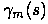
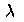
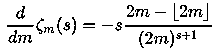
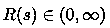
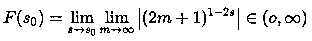

# 比阿蒂亚“证明”看起来靠谱许多的黎曼猜想证明 | 解读版

> 原文：[`mp.weixin.qq.com/s?__biz=MzAxNTc0Mjg0Mg==&mid=2653289057&idx=1&sn=fbc9be8b0aa7c2a3396457b49ad8e537&chksm=802e3874b759b162543da5fe56bdabe0ccb146f4f1ee427554f92af80f42ee65ee0552a5056b&scene=27#wechat_redirect`](http://mp.weixin.qq.com/s?__biz=MzAxNTc0Mjg0Mg==&mid=2653289057&idx=1&sn=fbc9be8b0aa7c2a3396457b49ad8e537&chksm=802e3874b759b162543da5fe56bdabe0ccb146f4f1ee427554f92af80f42ee65ee0552a5056b&scene=27#wechat_redirect)

**导语**

老实说，看了 Atiyah 爵士 PPT 的视频，感觉老爷子如果不是把 99%的惊天逆转细节都藏了起来而只把一些看起来很没逻辑的结论放出来，那就是老年开启胡扯模式来娱乐大众来了。
总而言之，有点失望。（仅表示个人观点，不喜勿喷）

转载自集智俱乐部

ID：swarma_org

今天在推上看了一篇 Bahattin Gunes 的论文《The Riemann Hypothesis and Its Proof》，感觉很有意思，所以就把他最主要最核心的证明思路整理了一下，感觉比 Atiyah 爵士的“证明”靠谱许多。

下面就是证明的主要流程：

 ****第一部分**** 

首先，我们还是从无穷级数开始，下面假定

这个无穷级数可以分解为两个子级数，即偶数部分与奇数部分：

类似的，我们可以构造交错级数：

因此，很显然，假定 是  的一个零点，那么它肯定同时也是、 和  的零点。

 ****第二部分**** 

另一方面，我们将函数做一定的改写，在  区域的定义式两侧加上一组相等的项：

等式左右加上的这一组，也是在的区域成立。

但，有趣的是，我们对积分的部分做一个分解后，会得到一个有趣的数列求和：

容易证明，上面这个级数在  的区域里都是收敛的（Elkies 提出并证明），从而我们顺利地将  函数的无穷级数求和形式的定义拓展到了包含临界带的范围中。

有趣的是，和求和无关的部分原本是来自  区域的积分项，积分范围是从 1 到无穷远，但在临界带  上它却是积分项在 0 到 1 上的积分，因此我们来看上述级数的有限和：

注意，**这个表达式现在是定义在临界带内的。**

因此，我们就完成了将  函数的级数表示从  的区域搬到  的临界带内的工作，此后所有的讨论都在临界带内完成。

在这个范围内，级数有限和的极限，就是原本的  函数：

同样的，我们现在可以在临界带内构造出和  这两个函数：

将它们的求和限制在有限合上，则有：

它们在  的极限当然是回到上面的无穷级数和的形式。

最后，终于轮到主角登场了——

由于，是  各级数项的交错和，然后考虑到 与  与单纯级数求和之间的差异项即积分项，所以我们有：

****

容易证明，在临界带内当  时后面的两个积分项会抵消为零。

 ****第三部分**** 

让我们再换一个  函数的表达（Saidak 与 Zvengrowski 于 2003 年的工作）：

这里  表示向下取整。容易证明，在临界带内，这个定义一样是成立的，且可以写成有限合形式，其结果与之前得到的结果表达不同但值相等：

这个表达比之前的级数和与积分的差的优势在于，**这里没有离散的级数和，**因此我们可以放心地对 m 进行求导：

从而，当  时，上述导函数的极限为 0。

同理，我们有：

而，对于临界带内的零点，很显然 的零点同时也是 、 和  的零点。

 ****小结**** 

至此，我们所要的工具终于齐全了：

下面，我们就可以开始证明黎曼猜想了：

 ****最终证明**** 

我们考虑这么一个函数：。由  函数的定义可知，其结果为：

显然，在临界带内，即便是在零点上，函数 R 也是也是 **有限且大于 0** 的：

这个结论很重要。

同时，由小结 1、2 我们可以知道：

由于第一个模部分在临界带内显然是有限且大于零的，所以关键就是后面双重求和部分要有限且大于零，将这部分记为函数 ，利用小结 3 就有：

其中、、、。

这个式子可以分解为三部分，第一部分  在临界带内当然是有限且不为零的。第三部分是最后那个巨大的分式，记为 ，由小结 4 可知其分子和分母在零点上同时为 0，因此可以使用洛必达法则：

利用小结 5，在零点上我们就有：

从而，我们最后就有：

我们将临界带内的非凡零点  写为：，并考虑到 m 是正实数，从而上述条件其实就等于要求：

由于  时 ，所以 ；而  时 ，所以 ；只有当  时 ，此时 。

因此，从函数本身的特性我们知道，临界带内的零点 s 必须有 ，即，黎曼猜想得证。

**整个证明过程的要点在于：**

1.  将级数表达推广到临界带内；

2.  使用级数表达与积分表达，得到各种等价但形式不同的极限式；

3.  分析各函数的各种表达在零点上的行为；

4.  巧妙利用零点上辅助函数的模必须有限且不为零这个特征。

可以说，乍看之下似乎很流畅，没有什么逻辑上过不去的地方。

如果真的就这么简单就能证明困扰人类一个半世纪的希尔伯特难题，那也真的是一件非常神奇的事情。

至少这个方法本身，看起来比 Atiyah 的 5 页论文正常与合理多了

> 本文经授权转载自作者简书：https://www.jianshu.com/p/e0c6a436f68f

**知识在于分享**

**在量化投资的道路上**

**你不是一个人在战斗**