# 【年度系列】监督学习标签在股市中的应用（代码+书籍）

> 原文：[`mp.weixin.qq.com/s?__biz=MzAxNTc0Mjg0Mg==&mid=2653289050&idx=1&sn=60043a5c95b877dd329a5fd150ddacc4&chksm=802e384fb759b1598e500087374772059aa21b31ae104b3dca04331cf4b63a233c5e04c1945a&scene=27#wechat_redirect`](http://mp.weixin.qq.com/s?__biz=MzAxNTc0Mjg0Mg==&mid=2653289050&idx=1&sn=60043a5c95b877dd329a5fd150ddacc4&chksm=802e384fb759b1598e500087374772059aa21b31ae104b3dca04331cf4b63a233c5e04c1945a&scene=27#wechat_redirect)


**往期系列**

**年度系列一：**[使用 Tensorflow 预测股票市场变动](https://mp.weixin.qq.com/s?__biz=MzAxNTc0Mjg0Mg==&mid=2653289014&idx=1&sn=3762d405e332c599a21b48a7dc4df587&chksm=802e3823b759b135928d55044c2729aea9690f86752b680eb973d1a376dc53cfa18287d0060b&token=1304016003&lang=zh_CN&scene=21#wechat_redirect)

**年度系列二：**[全球投行顶尖机器学习团队全面分析](https://mp.weixin.qq.com/s?__biz=MzAxNTc0Mjg0Mg==&mid=2653289018&idx=1&sn=8c411f676c2c0d92b0dd218f041bee4b&chksm=802e382fb759b139ffebf633ac14cdd0f21938e4613fe632d5d9231dab3d2aca95a11628378a&token=708329446&lang=zh_CN&scene=21#wechat_redirect)

**年度系列三：**[2018 年学习 Python 最好的 5 门课程](https://mp.weixin.qq.com/s?__biz=MzAxNTc0Mjg0Mg==&mid=2653289028&idx=1&sn=631cbc728b0f857713fc65841e48e5d1&chksm=802e3851b759b147dc92afded432db568d9d77a1b97ef22a1e1a376fa0bc39b55781c18b5f4f&token=1802794913&lang=zh_CN&scene=21#wechat_redirect)

由于低信噪比和非平稳的价格分布，预测未来股票价格走势是一件十分困难的事。现在流行的机器学习算法通常会给你带来不怎么满意的结果。

此篇推文中，我们主要考虑如何标记数据和应用监督学习。这里的大多数方法都是基于最近出版的一本书《Advances in Financial Machine Learning》，安利一下哦！

**（书籍在文末免费下载）**

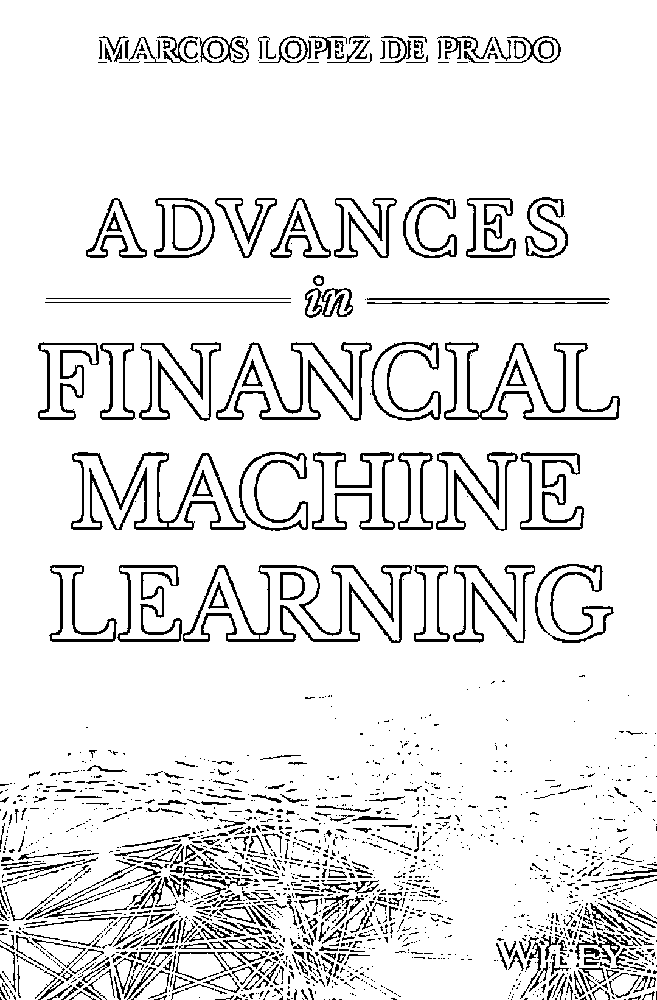

**分类的方法**

预测股票价格的方向是算法交易的信号。分类器预测未来价格的上升或下降。然后，将分类器的结果输出作为信号输入到交易算法中，例如，当预测为正(负)时买入(卖出)股票。要把这个操作当做分类，我们需要根据未来价格来获得标签。经常看到的一种方法就是简单地标注，下一个日期的价格方向。通过这种方法的标签可能由于低信噪比而被噪声污染。 

例如，即使下一个日期返回的分布有正的平均值，价格可能会因为噪声而下降。让我们从数学的角度来看：

Pn 和 P0 代表未来和当前的股票价格：

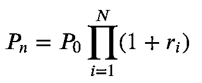

其中𝑟𝑖是每个日期的回报。

如何𝑟𝑖<<1，上式的关系近似：

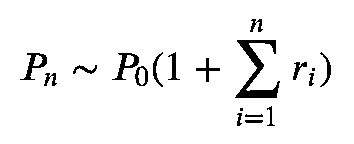

如果根据相同的正态分布对所有回报进行采样，即𝑟𝑖 ~ N(μ,σ)：

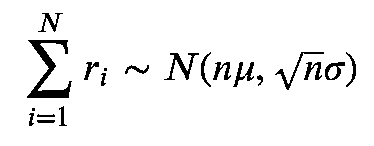

因此，平均值增长快于标准偏差。 这一结果意味着标签价格与未来进一步的走势为你提供更可靠的标签。 例如，考虑平均值为正的情况。 我们希望将正方向标记为一个标准偏差。 为了实现这一目标，我们需要采取这样的方式：

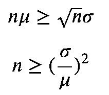

如果我们使用大于噪声比的平方的 n，价格方向将被正确标记为大约 84%。

**合成数据**

让我们在合成数据中来验证上面的论述：

```py
import numpy as np

mu = 0.1
sig = 1.
N = 400
n_samples = 1000
x = np.arange(N)
samples = []
for i in range(n_samples):
    rs = np.random.normal(mu, sig, N)
    rs = np.cumsum(rs)
    samples.append(rs)
samples = np.array(samples)
r_mu = np.mean(samples, axis=0)
r_sig = np.std(samples, axis=0)
```

我们考虑这个例子，均值是 0.1，标准差是 1.0。由于信噪比为 10，我们可以推断需要 100 步才能得到可靠的标签。

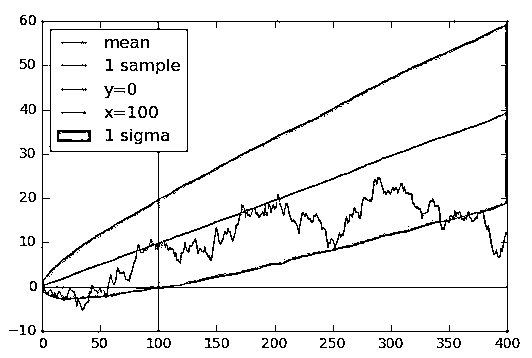

正如我们所预期的，在 100 步之后，一个标准差内的点位于正区域。在 100 个步骤之前，这些点很可能最终位于负区域。如果使用短期前向点标记数据点，则可能会出现错误的标签。 

**标签**

如果上述声明适用于实际股票价格数据，让我们用未来 10 年的价格来标注数据。这有意义吗？答案可能是否定的。实际股票价格与综合数据之间的主要差异之一是分布的平稳性。价格分布总是随着市场条件而变化，你使用的未来价格将在可靠性和一致性之间进行权衡。必须将此长度调整为算法的超参数。虽然我们在此不讨论如何正确验证模型性能并调整超参数，但是我们将介绍如何实现标记股票价格数据的策略。

例如，我们使用 MicroSoft 每日股票价格数据。

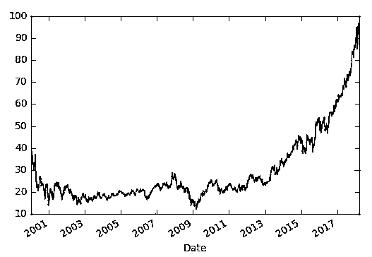

在《Advances in Financial Machine Learning》中，作者提出了 triple barrier method。 他给数据贴上了两个水平和一个垂直的标签。 水平标签定义了什么价格水平将被分为正或负，而垂直标签则决定了你在标签上看得更远的时间。 更准确地说，each data point is labeled by the first barrier hit by the future price. 

该方法基于《Advances in Financial Machine Learning》的第三章。为了简单起见，省略了一些算法。具体请查看完整代码**（代码文末下载）**

**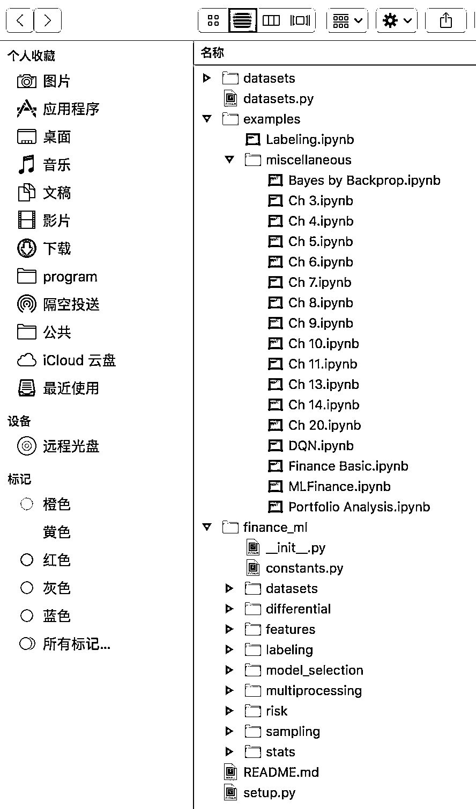**

垂直的标签：

```py
def get_t1(close, timestamps, num_days):
    t1 = close.index.searchsorted(timestamps + pd.Timedelta(days=num_days))
    t1 = t1[t1 < close.shape[0]]
    t1 = pd.Series(close.index[t1], index=timestamps[:t1.shape[0]])
    return t1

# We use all data points in this article
timestamps = close.index
num_days = 10
t1 = get_t1(close, timestamps, num_days)
print(t1.head())
Output:
```

```py
Date
2000-01-03   2000-01-13
2000-01-04   2000-01-14
2000-01-05   2000-01-18
2000-01-06   2000-01-18
2000-01-07   2000-01-18
Name: Date, dtype: datetime64[ns]
```

每个元素定义什么时间戳被定义为垂直 barrier。

要定义水平 barrie，我们需要两个参数。 其中一个是 trgt，它定义了 barrier 的宽度比例。 基本思想是我们需要根据市场条件改变 barrier 的宽度。 例如，如果我们面临波动的市场，我们需要使用宽幅。 你可以使用每日波动率来设置 trgt。 每日波动率通过指数移动平均线估算。

另一个参数是 sltp：止损和获利。 这些参数使您可以根据自己的喜好灵活定义 barrier 的宽度。 正（负）标签屏障由 sltp [0]（sltp [1]）乘以 trgt。

```py
def get_touch_idx(close, events, sltp, molecule=None):
    # Sample a subset with specific indices
    if molecule is not None:
        _events = events.loc[molecule]
    else:
        _events = events
    touch_idx = pd.DataFrame(index=_events.index)
    # Set Stop Loss and Take Profoit
    if sltp[0] > 0:
        sls = -sltp[0] * _events["trgt"]
    else:
        # Switch off stop loss
        sls = pd.Series(index=_events.index)
    if sltp[1] > 0:
        tps = sltp[1] * _events["trgt"]
    else:
        # Switch off profit taking
        tps = pd.Series(index=_events.index)
    # Replace undefined value with the last time index
    vertical_lines = _events["t1"].fillna(close.index[-1])
    for loc, t1 in vertical_lines.iteritems():
        df = close[loc:t1]
        # Change the direction depending on the side
        df = (df / close[loc] - 1) * _events.at[loc, 'side']
        touch_idx.at[loc, 'sl'] = df[df < sls[loc]].index.min()
        touch_idx.at[loc, 'tp'] = df[df > tps[loc]].index.min()
    touch_idx['t1'] = _events['t1'].copy(deep=True)
    return touch_idx
```

get_touch_idx 获取未来价格何时以及何种 barrier。

```py
import pandas as pd
from finance_ml.multiprocessing import mp_pandas_obj

def get_events(close, timestamps, sltp, trgt, min_ret=0,
               num_threads=1, t1=None, side=None): 
    # Get sampled target values
    trgt = trgt.loc[timestamps]
    trgt = trgt[trgt > min_ret]
    if len(trgt) == 0:
        return pd.DataFrame(columns=['t1', 'trgt', 'side'])
    # Get time boundary t1
    if t1 is None:
        t1 = pd.Series(pd.NaT, index=timestamps)
    # slpt has to be either of integer, list or tuple
    if isinstance(sltp, list) or isinstance(sltp, tuple):
        _sltp = sltp[:2]
    else:
        _sltp = [sltp, sltp]
    # Define the side
    if side is None:
        # Default is LONG
        _side = pd.Series(1, index=trgt.index)
    else:
        _side = side.loc[trgt.index]
    events = pd.concat({'t1': t1, 'trgt': trgt, 'side': _side}, axis=1)
    events = events.dropna(subset=['trgt'])
    time_idx = mp_pandas_obj(func=get_touch_idx,
                             pd_obj=('molecule', events.index),
                             num_threads=num_threads,
                             close=close, events=events, sltp=_sltp)
    # Skip when all of barrier are not touched
    time_idx = time_idx.dropna(how='all')
    events['type'] = time_idx.idxmin(axis=1)
    events['t1'] = time_idx.min(axis=1)
    if side is None:
        events = events.drop('side', axis=1)
    return events
from finance_ml.stats import get_daily_vol

vol = get_daily_vol(close)
print('volatility')
print(vol.head())

events = get_events(close, timestamps, [2, 2], vol, min_ret=0,
                    num_threads=16, t1=t1, side=None)
print('events')
print(events.head())
```

```py
volatility
Date
2000-01-04         NaN
2000-01-05    0.031374
2000-01-06    0.025522
2000-01-10    0.024588
2000-01-11    0.022054
Name: Close, dtype: float64

events
                   t1      trgt type
Date                                
2000-01-05 2000-01-12  0.031374   sl
2000-01-06 2000-01-18  0.025522   t1
2000-01-10 2000-01-12  0.024588   sl
2000-01-11 2000-01-18  0.022054   tp
2000-01-12 2000-01-14  0.020946   tp
```

get_events 在内部使用 get_torch_idx 并获取标签。

Output, events, contains the followings: - t1, when the barrier is touched - trgt, scale used to define horizontal barriers - type, which barrier is touched。

接下来，我们定义 get_sizes，它使用事件生成数字标签。 当标记点击中垂直 barrier 时，有两种可能的选择。One of them is assigning the sign of the return at the hitting point. The other way is using another label for hitting the vertical barrier.

在本文中，我们使用前一种方法获得二进制标签。

```py
def get_sizes(close, events, sign_label=True):  
    # Prices algined with events
    events = events.dropna(subset=['t1'])
    # All used indices
    time_idx = events.index.union(events['t1'].values).drop_duplicates()
    close = close.reindex(time_idx, method='bfill')
    # Create out object
    out = pd.DataFrame(index=events.index)
    out['ret'] = close.loc[events['t1'].values].values / close.loc[
        events.index].values - 1.
    if 'side' in events:
        out['ret'] *= events['side']
        out['side'] = events['side']
    out['size'] = np.sign(out['ret'])
    if sign_label:
        out['size'] = np.sign(out['ret'])
        out.loc[out['ret'] == 0, 'size'] = 1.
    else:
        # 0 when touching vertical line
        out['size'].loc[events['type'] == 't1'] = 0
    if 'side' in events:
        out.loc[out['ret'] <= 0, 'size'] = 0
    return out

labels = get_sizes(close, events, sign_label=True)
print(labels.head())
```

```py
ret  size
Date                      
2000-01-05 -0.070293  -1.0
2000-01-06  0.048273   1.0
2000-01-10 -0.057372  -1.0
2000-01-11  0.054311   1.0
2000-01-12  0.060864   1.0
```

**预测**

最后，我们来到预测阶段。 在这个阶段，我们只是通过分割数据集测试结果：训练和测试。We simply use trailing histories of volume and close for input features。

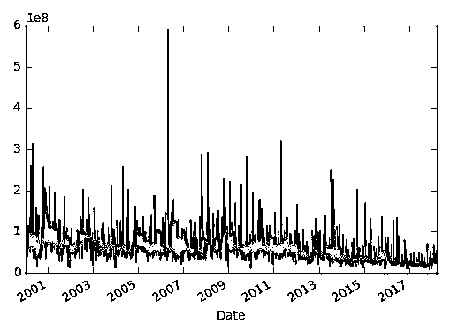

我们将数据分为 2000-01-01 至 2017-08-31 进行训练，2017-09-01 至 2018-03-31 进行测试。

```py
# Separate data time stamps
def get_partial_index(df, start=None, end=None):
    if start is not None:
        df = df.loc[df.index >= start]
    if end is not None:
        df = df.loc[df.index <= end]
    return df.index

train_end = '2017-08-31'
test_start = '2017-09-01'
train_idx = get_partial_index(df, end=train_end)
test_idx = get_partial_index(df, start=test_start)

def generate_features(close, volume, label, timestamps, timelag):
    index = close.index
    data = []
    for i in range(1, timelag):
        # Normalize
        data.append(close.shift(i).values / close.values)
        data.append(volume.shift(i).values / volume.values)

    features = pd.DataFrame(np.stack(data, axis=1), index=index)
    features = features.loc[timestamps].dropna()
    label = label.dropna()
    time_idx = features.index & label.index
    y = label.loc[time_idx].values
    label_map = {-1: 0, 1: 1}
    y = np.array([label_map[y_i] for y_i in y]).astype(int)
    X = features.loc[time_idx].values
    return X, y

timelag = 30
train_X, train_y = generate_features(close, volume, labels['size'], train_idx, timelag=timelag)
test_X, test_y = generate_features(close, volume, labels['size'], test_idx, timelag=timelag)
```

Note that close and volume features are normalized with the current value. Intuitively, the scales of close and volume themselves do not have any meanings. The value in comparison to the current close and value are rather essential information. This normalization allows you to build models irrelevant to the scales.

我们使用 PyTorch 和工具库 torch_utils 构建神经网络分类器**（代码文末下载）**

```py
import torch
import torch.nn as nn
import torch.nn.functional as F
import torch.utils.data as tdata
import torch.optim as optim
from sklearn.metrics import accuracy_score

from torch_utils.datasets import NumpyDataset
from torch_utils.training import train_step, test_step

input_dim = train_X.shape[1]
output_dim = 1

class Net(nn.Module):
    def __init__(self):
        super(Net, self).__init__()
        self.fc1 = nn.Linear(input_dim, 16)
        self.bn1 = nn.BatchNorm1d(16)
        self.fc2 = nn.Linear(16, 8)
        self.bn2 = nn.BatchNorm1d(8)
        self.fc3 = nn.Linear(8, output_dim)

    def forward(self, x):
        x = F.relu(self.bn1(self.fc1(x)))
        x = F.relu(self.bn2(self.fc2(x)))
        x = self.fc3(x)
        return x

    def predict(self, x, threshold=.5):
        x = self.forward(x)
        x = F.sigmoid(x)
        return x > threshold

batch_size = 32
train_loader = tdata.DataLoader(NumpyDataset(train_X, train_y[:, None].astype(float)),
                                             batch_size=batch_size, shuffle=True)
test_loader = tdata.DataLoader(NumpyDataset(test_X, test_y[:, None].astype(float)),
                                            batch_size=batch_size)

n_epochs = 1000
model = Net()
optimizer = optim.Adam(model.parameters(), lr=1e-3)
loss_func = F.binary_cross_entropy_with_logits
score_func = accuracy_score
for i in range(n_epochs):
    train_step(model, train_loader, optimizer,
               loss_func=loss_func, score_func=score_func,
               epoch=i, log_interval=0, silent=True)
    if i % 100 == 0:
        test_step(model, test_loader, loss_func=loss_func, score_func=score_func)

model.eval()
output = model.predict(torch.tensor(test_X).float())
accuracy = accuracy_score(test_y, output)
print(f'Test Accuracy: {accuracy:.4g}')

Test Accuracy: 0.5229
```

由此产生的测试精度为 0.5229，这并不比偶然。其中一个可能的原因是过度拟合。我们需要调整模型体系结构和训练模型的方法。我们也可以认为，分类对金融来说可能是困难的。即使模型能够学习分布，在嘈杂的情况下也很难预测正确的标签。

**回归方法**

正如我们前面看到的，分类是困难的。预测价格或回报本身可能更有意义。我们尝试基于与分类相同的输入特征来预测未来的收益。 

为了比较不同 num_day 参数的性能:1、2、3、4、5、10、20，我们使用自由尺度度量 np.mean（np.abs（y_pred-y））/ np.std（y），结果如下：

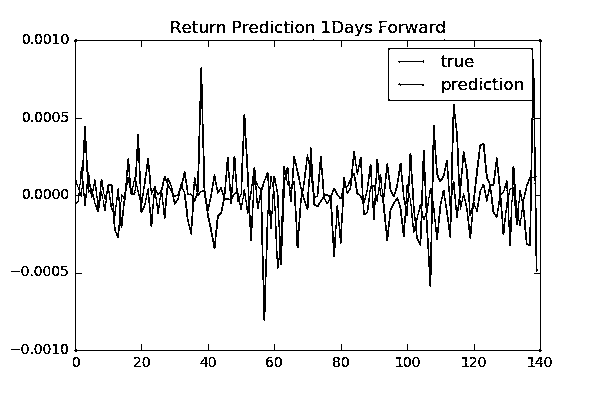

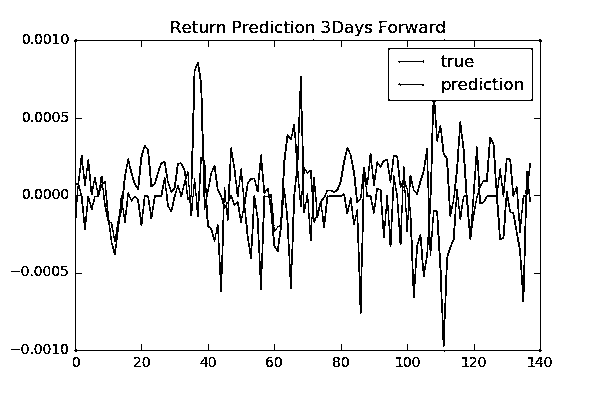

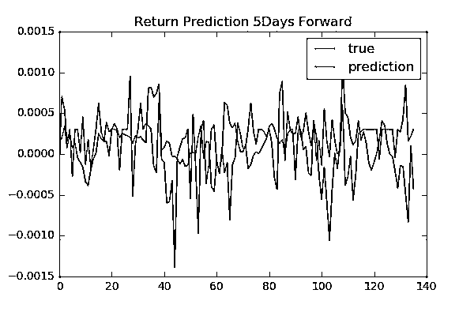


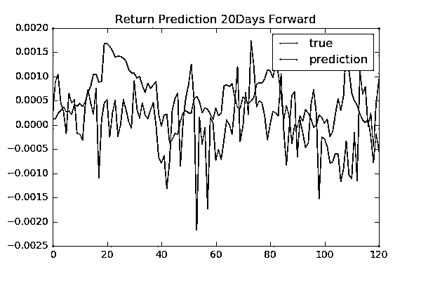


我们没有看到向前天数和表现之间存在任何具体关系。为了找到更可靠的结果，我们需要验证模型并调整超参数。

**总结**

我们在本文中看到的结果看起来很一般。主要考虑以下原因：

1、数据量少。

2、需要选择合适的模型。 

针对第二点，我们需要建立正确的方法来验证模型性能，我们可以考虑贝叶斯方法。由于金融数据的噪声本质，贝叶斯方法可帮助你避免过度拟合，并为你提供更合适的预测置信水平。后续我们会继续讨论这个问题。

Tomoaki

**下载书籍+代码**

在**后台**输入

**年度系列四**

**后台获取方式介绍**


**知识在于分享**

**在量化投资的道路上**

**你不是一个人在战斗**