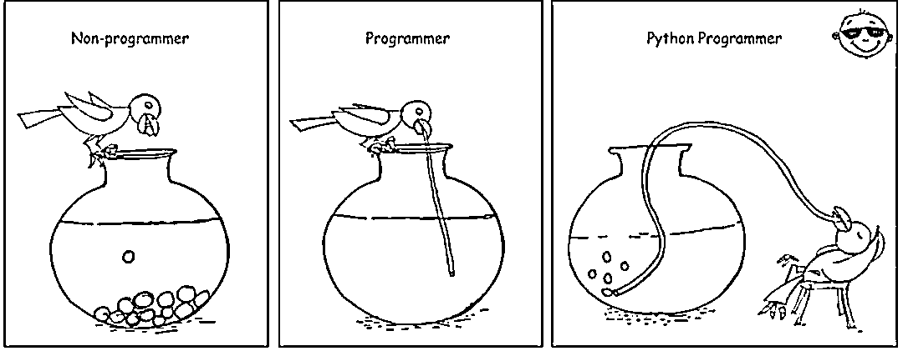
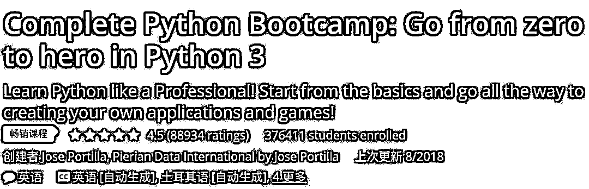
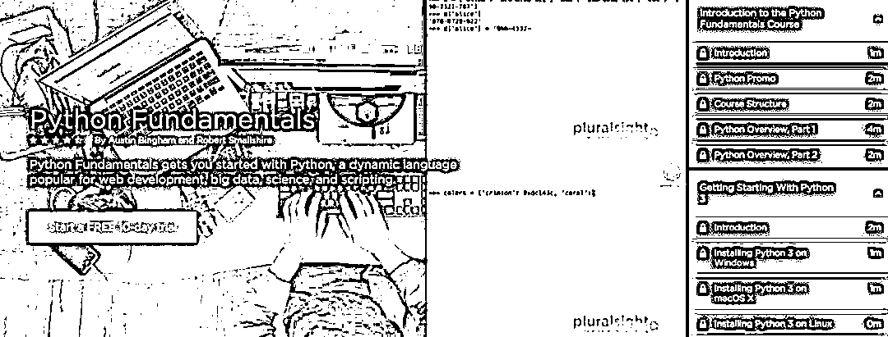
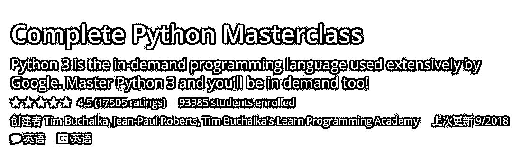
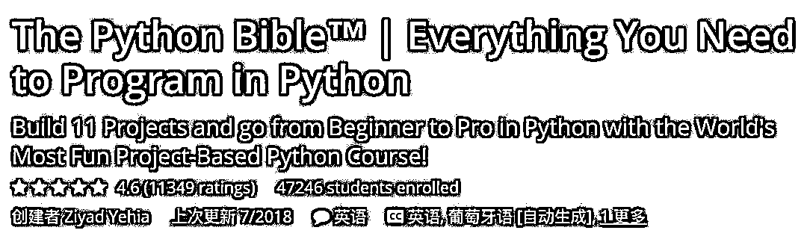
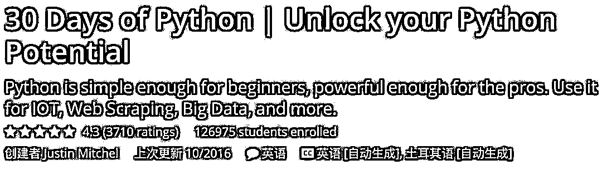

# 【年度系列】2018 年学习 Python 最好的 5 门课程

> 原文：[`mp.weixin.qq.com/s?__biz=MzAxNTc0Mjg0Mg==&mid=2653289028&idx=1&sn=631cbc728b0f857713fc65841e48e5d1&chksm=802e3851b759b147dc92afded432db568d9d77a1b97ef22a1e1a376fa0bc39b55781c18b5f4f&scene=27#wechat_redirect`](http://mp.weixin.qq.com/s?__biz=MzAxNTc0Mjg0Mg==&mid=2653289028&idx=1&sn=631cbc728b0f857713fc65841e48e5d1&chksm=802e3851b759b147dc92afded432db568d9d77a1b97ef22a1e1a376fa0bc39b55781c18b5f4f&scene=27#wechat_redirect)

**往期系列**

**年度系列一：**[使用 Tensorflow 预测股票市场变动](https://mp.weixin.qq.com/s?__biz=MzAxNTc0Mjg0Mg==&mid=2653289014&idx=1&sn=3762d405e332c599a21b48a7dc4df587&chksm=802e3823b759b135928d55044c2729aea9690f86752b680eb973d1a376dc53cfa18287d0060b&token=1304016003&lang=zh_CN&scene=21#wechat_redirect)

**年度系列二：**[全球投行顶尖机器学习团队全面分析](https://mp.weixin.qq.com/s?__biz=MzAxNTc0Mjg0Mg==&mid=2653289018&idx=1&sn=8c411f676c2c0d92b0dd218f041bee4b&chksm=802e382fb759b139ffebf633ac14cdd0f21938e4613fe632d5d9231dab3d2aca95a11628378a&token=708329446&lang=zh_CN&scene=21#wechat_redirect)

如果你刚刚开始学习编程，并打算在 2018 年学习 Python，那么，今天公众号将分享 2018 年学习 Python 一些最好的在线课程。

Python 是最流行的编程语言之一，它被广泛应用于 Web 开发、自动化、数据科学、机器学习等领域。

近年来，Python 已经成为数据科学和机器学习项目的默认语言，这也是许多有经验的程序员在 2018 年学习 Python 的另一个原因。

如果你正在考虑学习一门新的编程语言，那么 Python 也是一个不错的选择，特别是如果你正在寻找一条有利可图的数据科学和机器学习的职业道路，这其中有很多机会。 

特别是在像美国和英国这样的发达国家，Python 的崛起是一种现象，部分原因可以归因于学术界，在那里 Python 已经成为学习编程的首选语言，而不是 Java、C 和 C++。 

**Python 训练营：从 0 到 1 学 Python 3**

这是 Udemy 上最受欢迎的 Python 课程之一，有超过 25 万名学生注册了这门课程。这充分说明了课程的质量。对所有级别的程序员都适用。在本课程中，你将以一种实践方式来学习 Python 3。

这也是一门实践性很强的课程，老师会向你展示实时编码并解释其原理。

本课程还提供了测试、笔记和家庭作业，以及 3 个主要项目来创建一个 Python 项目组合！补充你的学习。

> 链接：
> 
> https://www.udemy.com/complete-python-bootcamp/?siteID=JVFxdTr9V80-2lDrXlc5GjdKvh.IGpDqTw&LSNPUBID=JVFxdTr9V80

总之，这是 2018 年学习 Python 最好的课程之一。

**Python 原理**

这是在 Pluralsight 上学习 Python 的另一个有趣的课程，如果你有一个 Pluarlsight 的会员资格，那就太棒了。和其他课程一样，这门课也从 0 开始学习。

别担心你的操作系统，这门课程在 Linux、Windows 和 Mac 上都可以安装 Python。

本课程涵盖了所有主要的 Python 主题，如。字符串、模块化、对象、集合、处理错误、迭代、类、文件和资源管理以及 Python 应用程序的部署。

简而言之，这是学习 Python 的最佳课程之一，但你需要一个会员。如果你还没有注册，那么你可以注册 10 天的免费试用，并且几乎可以免费使用这门课程。

> 链接：
> 
> https://www.pluralsight.com/courses/python-fundamentals?clickid=2JA2AnQnc1YxwxkUsUXeuWalUkg2cryMO1cqxE0&irgwc=1&mpid=1193463&utm_source=impactradius&utm_medium=digital_affiliate&utm_campaign=1193463&aid=7010a000001xAKZAA2

**Masterclass 平台的 Python 课程**

这是在 Udemy 上学习 Python 的另一门极好的课程。我是 Tim Buchalka 的超级粉丝，也参加过他的一些课程。

他的热情和经验在他的课程中表现得淋漓尽致，这就是为什么我们向你推荐这门 Python 课程，如果你是第一次学习 Python。在内容上，这与其他两门课程没有太大的区别，但风格才是最重要的。

Tim Buchalka 和@Jean-Paul 这两位导师在软件开发和教学方面的丰富经验，他们一起工作了 60 多年，一定会帮助你以正确的方式学习 Python。

本课程也涵盖了 Python 3.0，这是大多数程序员正在使用的。

> 链接：
> 
> https://www.udemy.com/python-the-complete-python-developer-course/?siteID=JVFxdTr9V80-Q6CQZSvGcBWsqj4xkBfkHw&LSNPUBID=JVFxdTr9V80

**The Python Bible**

这是在 Udemy 上学习 Python 的另一门很棒的课程。这是一个基于项目的课程，你将在 Python 课程中构建 11 个项目。 

如果你喜欢动手学习，而不是学习简单概念，那么这门课程是为你准备的。

这是一门全面、深入、精心准备的课程，教你用 Python 编程所需的所有知识。

作者 Ziyad 是计算机基础科学和基于项目的学习的获奖大学讲师，这在本课程中得到了很好的体现。简而言之，如果你喜欢基于项目的学习，而不是掌握概念的话，那么这是学习 Python 最好的课程之一。

> 链接：
> 
> https://www.udemy.com/the-python-bible/?siteID=JVFxdTr9V80-0meSkV9rAxFzYaHp6JviVg&LSNPUBID=JVFxdTr9V80

**30 天 Python，解锁你的 Python 潜力**

2016 年初，Python 超越 Java 成为世界上第一大初学者语言。为什么？这是因为它对于初学者来说足够简单，但是对于专业人士来说足够高级。

你不仅可以编写简单的脚本来自动化工作，还可以创建复杂的程序来处理交易。你甚至可以将 Python 用于物联网、Web 开发、大数据、数据科学、机器学习等等。

这是一门非常实用的课程，不仅适用于初学者，也适用于那些了解其他编程语言(如 Java、c++)并想学习 Python 的程序员。

在 30 天内，本课程将教你如何编写复杂的 Python 应用程序来从任何网站上获取数据，并为所有类型的自动化构建自己的 Python 应用程序。

> 链接：
> 
> https://www.udemy.com/30-days-of-python/?siteID=JVFxdTr9V80-32s6YVXARKGNjGR0rOx9zw&LSNPUBID=JVFxdTr9V80

这就是 2018 年学习 Python 编程的一些最好的课程。Python 是一种非常强大的语言。

**知识在于分享**

**在量化投资的道路上**

**你不是一个人在战斗**