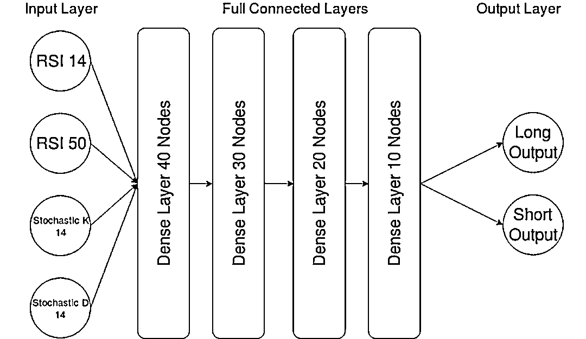
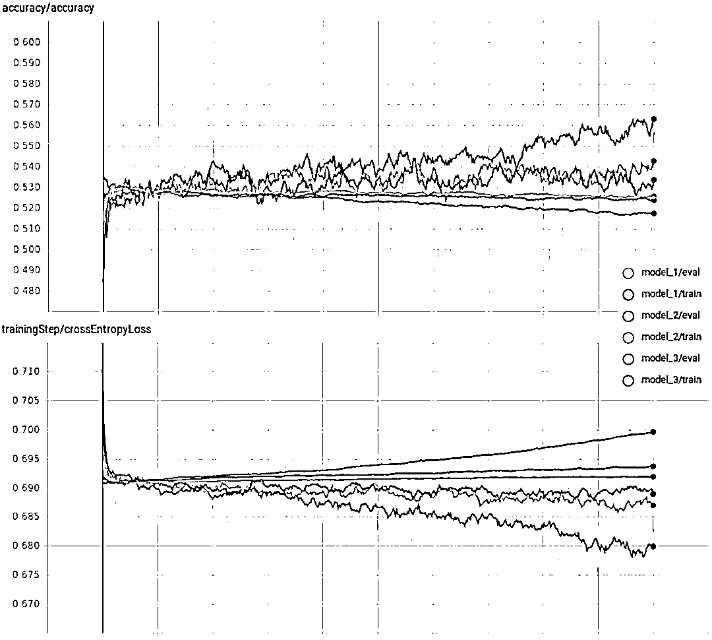

# 【年度系列】使用 Tensorflow 预测股票市场变动

> 原文：[`mp.weixin.qq.com/s?__biz=MzAxNTc0Mjg0Mg==&mid=2653289014&idx=1&sn=3762d405e332c599a21b48a7dc4df587&chksm=802e3823b759b135928d55044c2729aea9690f86752b680eb973d1a376dc53cfa18287d0060b&scene=27#wechat_redirect`](http://mp.weixin.qq.com/s?__biz=MzAxNTc0Mjg0Mg==&mid=2653289014&idx=1&sn=3762d405e332c599a21b48a7dc4df587&chksm=802e3823b759b135928d55044c2729aea9690f86752b680eb973d1a376dc53cfa18287d0060b&scene=27#wechat_redirect)

从今天起，每天好文不断，公众号整体内容提升

**用于分类的多层感知器**

是否有可能创建一个神经网络来预测一组交易指标的日常市场走势？

我们将使用 Tensorflow 创建和开发一个简单的模型框架，以及提出一些对初步结果改进的意见。

**ML 的任务和输入特征**

为了保持基本设计简单，它设置了二进制分类任务，预测第二天的收盘价是高于还是低于当前收盘价，对应于预测下一个时间段是做多还是做空。实际上，这可以让程序去自动分析，该程序在交易日开始时计算并执行一组头寸，以捕获当天的移动。

该模型目前使用 4 个输入特征（同样，为简单起见）：15 + 50 天 RSI 和 14 天随机 K 和 D。

之所以选择这些指标，是因为这些指标被归一化在 0 到 100 之间，这意味着资产的基础价格与模型无关，从而允许更大的泛化。

虽然可以根据任意数量的其他交易指标对模型进行训练，或者以其他方式对模型进行训练，但我们建议坚持使用那些经过规范化或可以修改为价格规范化或波动性规范化的模型。否则，单一模式不太可能适用于一系列股票。

**数据集生成**

```py
from datetime import datetime
import numpy as np
import talib
import alpaca_trade_api as tradeapi
import pandas
import time as time
import os

# Creates dataset folders in directory script is run from
try:
    os.stat("./train")
    os.stat("./eval")
except BaseException:
    os.mkdir("./train")
    os.mkdir("./eval")
```

数据集生成和神经网络脚本已分为两个不同的模块，以便更容易去修改代码，并且只在必要重新生成完整数据集，因为它需要很长时间去运行。

目前，生成器脚本设置为标准普尔 500 股票列表，从 2015 年开始每天下载 candle，并将它们处理为所需的交易指标，作为模型的输入特征。

然后将所有内容分成一组训练数据（2015 年 1 月 - 2017 年 6 月）和评估数据（2017 年 6 月 - 2018 年 6 月），并将其写为 CSV，运行脚本的目录中的“train”和“eval”文件夹。

然后，ML 脚本可以根据需要读取这些文件，以训练和评估模型，不需要重新下载和处理任何其他数据。

**模型训练**

**部分代码****（获取全部代码请查看文末）**

```py
# used to sample batches from your data for training
def createTrainingBatch(amount):

    randomBatchPos = np.random.randint(0, trainDataX.shape[0], amount)

    xOut = trainDataX[randomBatchPos]
    yOut = trainDataY[randomBatchPos]

    return xOut, yOut

tf.logging.set_verbosity(tf.logging.INFO)

# ML training and evaluation functions
def train():
    globalStepTensor = tf.Variable(0, trainable=False, name='global_step')

    sess = tf.InteractiveSession()

    # placeholder for the input features
    x = tf.placeholder(tf.float32, [None, 4])
    # placeholder for the one-hot labels
    y = tf.placeholder(tf.float32, [None, 2])
    # placeholder for node dropout rate
    internalDropout = tf.placeholder(tf.float32, None)

    net = x  # input layer is the trading indicators
```

在启动时，脚本将“train”和“eval”文件夹中的所有 CSV 文件读入数据数组，以便在整个训练过程中使用。有了如此小的数据集，RAM 的需求将低到不需要额外的复杂性。但是，对于一个更大的数据集来说，必须更新为一次只读取完整数据的样本，每几千个训练步骤就会存储在内存中的数据。然而，这将以更大的磁盘 IO 为代价，减慢训练速度。

神经网络本身也是非常小的，因为测试表明，当网络较大时，评估精度往往会迅速分化。



网络“长输出”和“短输出”被用作二元预测器，高置信度值用作未来一天的模型预测。

架构中的“密集”层意味着每个神经元都连接到下面层中所有神经元的输出。使用 tanh 作为激活函数，这是小型神经网络的常见的用法。

某些类型的数据和网络可以更好地与不同的激活函数一起工作，如 RELU 或 ELU 用于更深层次的网络。RELU 试图解决更深层次体系结构中消失的梯度问题，而 ELU 则是在此基础上的一种变体，使训练更加高效。

**TensorBoard**

除了在终端显示每 1000 个训练步骤的预测精度统计数据外，ML 脚本还被设置为记录摘要，以便与 TensorBoard 一起使用，这使得训练过程的图形化更加容易。

若要在保存的摘要中使用 TensorBoard，只需将 logdir 标志设置为为正在运行 ML 脚本的目录。然后打开所选的浏览器并在搜索栏中输入“localhost：6006”。 

**训练结果**



正如预期的那样，由于示例设计的简单性及其输入特征，结果并不引人注目。

我们可以看到明显的过度拟合，因为所有测试的评估数据集的损失/误差都会增加，尤其是在较大的网络上。 这意味着网络只是学习特定训练样本的模型，而不是更普遍的模型。 除此之外，训练准确度并不高，仅比完全随机的猜测高出几个百分点而已。

**修正及改善建议**

示例提供了一个很好的模型，可以帮助理解一切是如何运作的，但它更像是一个开始的框架，而不是用于预测的工作模型。因此，你可能想要提出一些改进建议，并可以测试一些想法。

**输入特征**

在现阶段，数据集只由 4 个特征生成，模型也只可查看一个时间点。这严重限制了它的作用，你能根据一天内的几个信号就产生交易？

首先，修改数据集生成脚本，以计算更多的交易指示信号并将它们保存到 CSV 中。TA-lib 可以帮到你。

我们建议使用标准化的指标，类似于 Stoch 和 RSI，因为这将资产的相对价格从等式中剔除，这样模型就可以应用于一系列股票中，而不需要为每种股票都选用不同的模型。

其次，您可以修改 ML 脚本，在每个时间步骤中读取最后 10 个数据周期作为输入，而不仅仅是一个。这允许它开始学习更复杂的收敛和散度模式。

**网络体系结构**

如前所述，由于示例任务缺乏数据和特性复杂性，网络非常小。为了适应新增指标所提供的额外数据，这一点将不得不改变。

最简单的方法是改变节点布局变量，增加额外的层或每层更多的神经元。你可能还希望试验不同类型的层，而不是完全连接的层。卷积层通常用于图像的模式识别任务，因此在金融图表数据上测试可能很有趣

**数据集的标签**

如果价格差异为>=0，则数据集标记为“long”，否则为“short”。但是，你可能希望将阈值更改为等于数据长度上的价格变动中值，以提供一组更平衡的训练数据。

你甚至可能希望在价格保持在有限范围内的日子里增加第三类“中性”。

除此之外，该脚本还可以改变价格上涨或下跌的预期时间。因此，它可以通过更长期的预测来测试。

Alpaca

**如何获取代码**

在**后台**输入

**MLP**

**后台获取方式介绍**


**知识在于分享**

**在量化投资的道路上**

**你不是一个人在战斗**