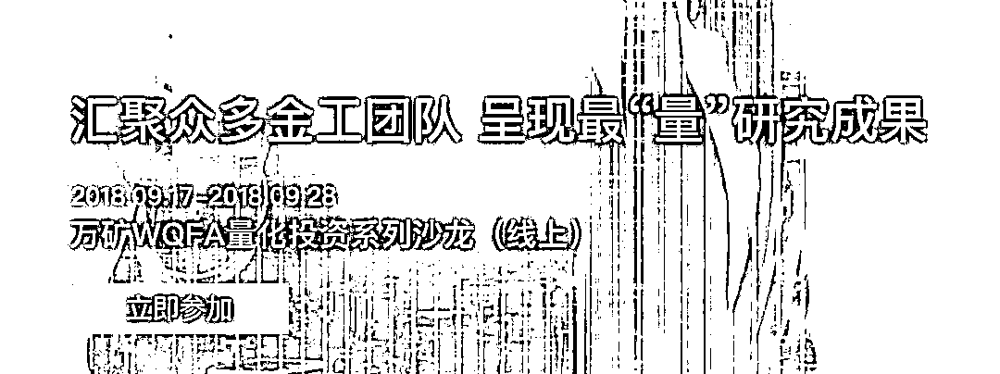
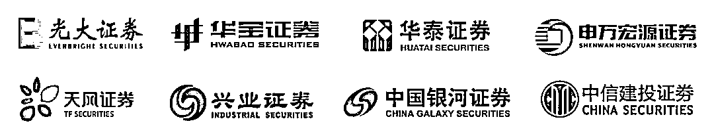
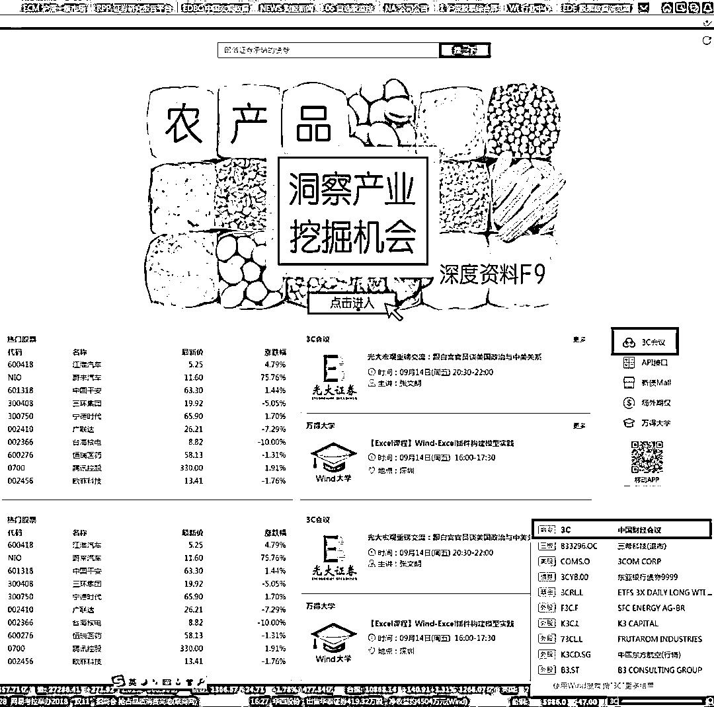
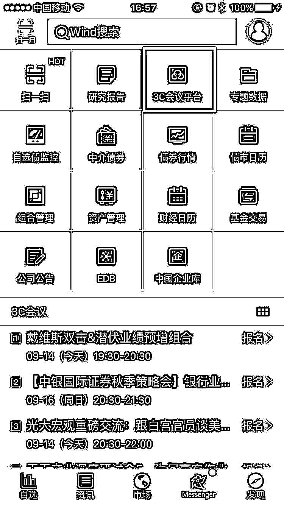

# 快看！众多大咖云集，分享量化投资新成果

> 原文：[`mp.weixin.qq.com/s?__biz=MzAxNTc0Mjg0Mg==&mid=2653289001&idx=1&sn=be83a6121d7e83778629453e568eef39&chksm=802e383cb759b12a14d3437c9cc445e4dd15a0721f403108e97cb7621cbd90ed2a6d325b8ec1&scene=27#wechat_redirect`](http://mp.weixin.qq.com/s?__biz=MzAxNTc0Mjg0Mg==&mid=2653289001&idx=1&sn=be83a6121d7e83778629453e568eef39&chksm=802e383cb759b12a14d3437c9cc445e4dd15a0721f403108e97cb7621cbd90ed2a6d325b8ec1&scene=27#wechat_redirect)

 **WQFA** 

[**WQFA**](https://mp.weixin.qq.com/s?__biz=MzAxNTc0Mjg0Mg==&mid=2653288787&idx=1&sn=05686ba485c0b87e27ec776a483930a1&chksm=802e3b46b759b25070ad841e8e36adbe3d0ded6df00ead3b8f20416a93dc7a939d52ccd3889d&token=1090753249&lang=zh_CN&scene=21#wechat_redirect)英文全称 WindQuant Quantitative Finance Analyst（**万矿量化金融分析师**）。由**Wind****旗下量化云平台万矿**联合**众多金融机构**以及**高校**，共同开展的一项专业量化人才培养计划。

**公众号作为此次活动自媒体支持方，为大家推荐 WQFA 最新动态：**

从 2018 年 9 月 17 日起，万矿将开启：

**WQFA 量化投资线上沙龙****系列**

万矿邀请了国内众多知名券商金融工程团队为大家带来行业最前沿的量化研究成果。WQFA 希望通过与金融机构的联合培养，让学员们对量化投资有一个更深层次的认知。

此次线上沙龙，涉及内容十分丰富：

**因子择时与选股**、**因子挖掘**、**风格轮动**、**行业配置**、**财务造假**、**FOF 组合构建**、**FOF 投资研究**、**大类资产配置**、**周期理论**、**量化基本面**等众多行业前沿研究。

以下是下周的沙龙主题内容，大家不要错过哦！

| **日期** | **券商** | **沙龙主题** |
| 9 月 17 日 | 中信建投金融工程团队 | 量化基本面与大类资产配置 |
| 9 月 18 日 | 兴业证券金融工程团队 | 量化视角下的大类资产配置 |
| 中信建投金融工程团队 | 量化视角看库存周期下大类板块的择时策略 |
| 9 月 19 日 | 天风证券金融工程团队 | 团队主要研究成果及多因子选股体系介绍 |
| 申万宏源金融工程团队 | 申风格轮动、行业配置与财务造假判别 |
| 9 月 20 日 | 光大证券金融工程团队 | RSRS 择时指标介绍 |
| 光大证券金融工程团队 | 新因子挖掘系列介绍 |

*内容不断更新，请随时关注公众号推文~

参与的券商金工团队有**（排名不分先后，不断更新~）**

**如何参加**

**所有 WQFA 学员**

**其他机构、个人等**

**都可以****在线免费收听**

**一、网页端&无 Wind 终端用户**

**方式 1：**请登陆 ***www.windquant.com***，进入**社区【推荐】**栏目进行查看，扫下方二维码可直接跳转：

**方式 2：**关注**万矿微信公众号**，每日会发布沙龙海报与收听链接。

**二、PC 端用户**

1、点击 Wind 金融终端首页右侧的**“3C 会议”**或在右下角**输入“3C”**，进入 3C 会议模块。

2、选中一场会议，点击**“立即报名”**。

3、会议开始后，进入会议详情页，点击**“进入直播”**，立即在线收听。您还可以在互动处留言，交流、提问。

**三、移动端用户**

没有 Wind 金融终端的客户，可以使用 Wind 金融终端 APP。

1、进入 APP 后，先点击右下角**“发现”**，再进入“3C 会议平台”。

2、报名及参会步骤，与 PC 端相同（注意：请确认 APP 已升级至最新版）

**知识在于分享**

**在量化投资的道路上**

**你不是一个人在战斗**