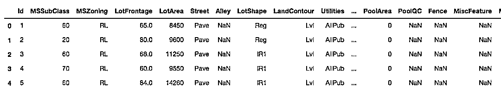
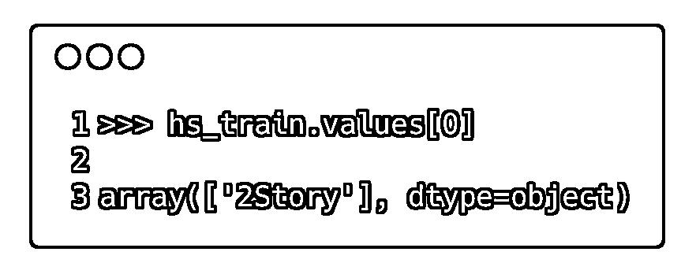
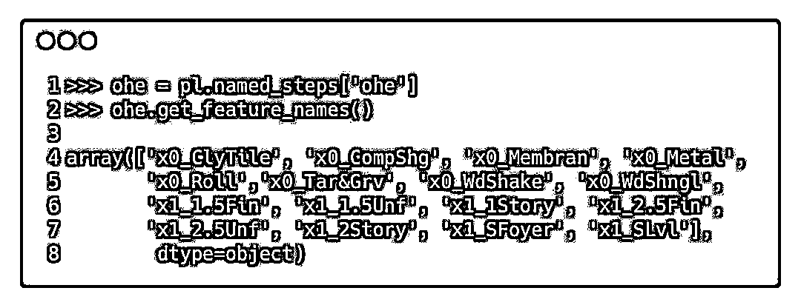
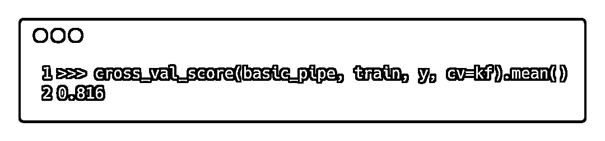

# 【前沿学习】Scikit-Learn 大变化：合并 Pandas

> 原文：[`mp.weixin.qq.com/s?__biz=MzAxNTc0Mjg0Mg==&mid=2653288996&idx=1&sn=c0ba9ef5698d41d92abe7ec7ed56172d&chksm=802e3831b759b127c7ba47581cb291b82f0fccd7036bdfb3111cfa9e7ba9148c0b78d0f4f23c&scene=27#wechat_redirect`](http://mp.weixin.qq.com/s?__biz=MzAxNTc0Mjg0Mg==&mid=2653288996&idx=1&sn=c0ba9ef5698d41d92abe7ec7ed56172d&chksm=802e3831b759b127c7ba47581cb291b82f0fccd7036bdfb3111cfa9e7ba9148c0b78d0f4f23c&scene=27#wechat_redirect)

作者 | Ted Petrou

译者 | 王天宇

转自 | AI 科技大本营

【导读】近日，Scikit-Learn 发布了 0.20 版本，这是近年来最大的一次更新。对许多数据科学家来说，一个典型的工作流会在使用 Scikit-Learn 进行机器学习之前，先通过 Pandas 对数据进行分析，而新的版本就将这一过程进行了简化，并且功能更加多样、稳定与标准。 

今天，我们将通过 Ted Petrou 的一篇技术文章，为大家介绍如何完成从 Pandas 到 Scikit-Learn 这一令人兴奋的工作流，并且作者基于 Kaggle 上入门级机器学习竞赛之一：Housing Prices: Advanced Regression Techniques 作为案例实践分析，让大家可以更好地理解与使用这一工具。

# 

****全文概括及目标****

1、通过本文，那些将 Scikit-Learn 作为机器学习库，但依赖 Pandas 进行数据探索和准备工作的用户一定可以收益良多。（假设你对 Scikit-Learn 和 Pandas 都有所了解）

2、我们会探索新的估计器 ColumnTransformer，它使得我们可以对数据的不同子集单独且并行地进行转换，然后再把结果串接在一起。

用列中的字符串数据来创建供 pandas 使用的数据框，这一过程应该更加标准化。

3、估计器 OneHotEncoder 在对列的字符串数据编码方面有所提升。

为了便于独热编码 (one-hot encoding)，我们使用新的估计器 SimpleImputer 来用常数填充缺失值。

4、我们会自定义一个估计器，该估计器将取代 Scikit-Learn 的内置工具，来执行对数据框的全部基本转换操作。

5、最后，我们会基于新的估计器 KBinsDiscretizer 对数值进行二进制转换 。

> 注：作者是在 0.20 版本还没有正式发布前完成的这个教程，以后这个教程很可能会在某些方面内容有所更新。

**前言**

Scikit-Learn 的机器学习模型要求输入必须是二维的数值数据结构。字符串数据是不被接受的。但始终没有提供一个处理字符串列的标准方法，而字符串数据在数据科学中是一种极为普遍的存在。这也致使相关教程都在探索用不同的方法来处理字符串数据列。

有些解决方案倾向于用 Pandas 的 get_dummies 函数；一些使用 Scikit-Learn 的独热编码方法 LabelBinarizer，但此方法是为类别数据（目标变量）设计的，而非面向输入数据；还有一些方案则创建了自定义的估计器；甚至还有整个的工具包，如 sklearn-pandas 就是为了解决这个问题创造出来的。对那些想要基于字符串列来建机器学习模型的人来说，标准化方面的欠缺给他们带来了糟糕的体验；在转换特定列而非整个数据集上的技术支持也比较薄弱。例如，将连续特征进行标准化处理十分普遍，而对类别特征来说却很少见。如今这方面会变得容易得多。

> sklearn-pandas：

> https://github.com/scikit-learn-contrib/sklearn-pandas

## 

******▌****升级至 0.20 版**

几天前，0.20 版的第一个候选版本发布了。你可以用 conda 安装它：

或者 pip 安装：

## 

******▌********ColumnTransformer & OneHotEncoder（**升级版）**简介**

随着版本更新至 0.20，从 Pandas 到 Scikit-Learn 的工作流应该越来越相似了。估计器 ColumnTransformer 会对 Pandas 数据框（或数组）中列的特定子集执行转换操作。

OneHotEncoder 并不是一个新的估计器，但它已更新至可以编码字符串数据列。此前，它只能对包含数值形式的类别数据进行编码。

接下来让我们看看，这些新特性将如何处理 Pandas 数据框中的字符串数据列。

# 

****************初体验****************

****************通过 Kaggle 房屋数据集小试牛刀****************

Housing Prices: Advanced Regression Techniques 是 Kaggle 的入门级机器学习竞赛之一。该竞赛目标是基于给定的 80 个特征，来预测房屋价格。特征列是由连续特征和类别特征混杂成的。你可以从网站直接下载数据或使用他们的命令行工具。

> 参考链接：
> 
> https://www.kaggle.com/c/house-prices-advanced-regression-techniques

> https://github.com/Kaggle/kaggle-api

## 

****************▌******************观察数据**

首先我们来看看数据框，并输出头几行数据。

## 

****************▌******************将目标变量从训练集中移除**

我们要移除的目标变量是 SalePrice，然后将其以数组的形式赋值给它本身。我们之后做机器学习时会用到它。

## 

****************▌******************单个字符串列的编码**

首先，我们对一个单独的字符串列 HouseStyle 进行编码，该列含有关于房屋外部情况的数据。让我们输出一下每个不同字符串的个数。

可见在这一列中，我们有 8 个不同的值。

## 

****************▌******************Scikit-Learn 必须基于 2D 数据**

大多数 Scikit-Learn 估计器都要求数据为严格的二维形式。如果我们选择上面提到的所有列作为 train['HouseStyle']，技术上来讲，一维数据形式的 Pandas Series 就随之产生了。我们可以通过将列表传入空白数据框，来强制 Pandas 创建一个单列数据框：

## 

****************▌******************转换器三部曲 —— 导入、实例化、调试**

Scikit-Learn 的 API 对于所有估计器都是一致的，即通过固定三个步骤的过程来训练数据。

1.  根据不同的模块，引入我们需要的估计器；

2.  对估计器进行实例化，改变其默认配置；

3.  基于数据对估计器进行调试。如果需要，将数据转换到新的地方。

下面我们引入 OneHotEncoder，并将其实例化，确保我们得到的返回数组中不存在缺失值，然后用 fit_transform 方法对我们的单列数据编码。

和我们预期的一样，它把所有不同的值都编码成为了二进制的列。

## 

****************▌******************有了 NumPy 数组，列名是什么呢？**

值得注意的一点是，我们输出的是 NunPy 数组而非 Pandas 数据框。起初 Scikit-Learn 并不是与 Pandas 可以直接整合的。所有的 Pandas 对象都被转化成了 NumPy 数组，NumPy 数组都是由转换操作生成的。

通过 get_feature_names 方法，我们仍可以从 OneHotEncoder 对象中获得列名。

## 

****************▌******************验证第一行数据**

验证估计器的运行是否正常是很有必要的。让我们看一下编码后的数据的第一行：

这里将数组中的第 6 个值编码成了 1。我们用布尔值作为索引调出特征名字。

现在，我们来验证初始数据框的列中第一个值是与之相同的。

## 

****************▌******************利用 inverse_transform 自动化该过程**

就像大多数转换器对象一样，方法 inverse_transform 方法可以帮你获取原始数据。这里我们把 row0 放进列表中，使其变成二维数组。

我们可以通过将整个数组进行反转，来验证所有的值。

## 

****************▌******************将转换器作用于测试集**

无论我们对测试集使用什么转换器，我们必须对测试集也使用。让我们来看看测试集，并获取同样的列，对其使用我们的转换器。

我们又获得了 8 个列。

**这个例子证明了我们的观点，但还有几个我们可能遇到的问题，现在让我们一一来看都有哪些。**

# 

****************难点****************

## 

****************▌******************1\. 测试集中不存在的类别**

如果我们现有一座房屋，其特征是测试集中不存在的，这种情况怎么办呢？比如现有一个特征 3Story。现在我们改变房屋特征的第一个值，然后看看会产生什么结果。

## 

根据默认设置，我们的编码器会生成一个错误。这是我们所期待的，因为我们要知晓是否有测试集中不存在的字符串。如果你也存在这个问题，那么你的探索可能需要更加深入了。现在我们通过将参数 handle_unknown 设置为 'ignore' 来忽略这一未知元素，并将这一行都编码为 0。

我们来验证一下第一行均为 0.

## 

****************▌******************2 . 测试集中的缺失值**

如果你的测试集中存在缺失值（NaN 或 None），只要将 handle_unknown 设置为 'ignore'，缺失值就可以被忽略。现在我们为测试集的前两个元素加入缺失值。

## 

****************▌******************3.训练集中的缺失值**

训练集中存在缺失值是更为严重的问题。到目前为止，估计器 OneHotEncoder 还无法很好地解决缺失值问题。

如果像测试集一样，也有一个方法可以忽略训练集中的缺失值就好了。目前这种方法并不存在，我们只能对缺失值进行填充。

现在，我们必须对这些缺失值加以填充。预处理模块中老的 Imputer 已经被弃用了。在同样的位置创建了一个新模块 impute，配合新的估计器 SimpleImputer 和新方案“常数”。若采用默认设置，这一方案会用字符串 'missing_value' 来填充缺失值。我们可以通过参数 fill_value 来设置这个值。

到了这里，我就可以像之前那样进行编码了。

要注意的一点是，现在我们有额外的一个列和特证名。

# 

****************技能升级****************

****************实践整个转换工作****************

## 

****************▌******************对测试集执行两次转换**

我们可以手动依次执行上述两个步骤，如下：

## 

****************▌******************Pipeline 的使用**

Scikit-Learn 提供了 Pipeline 估计器，它包括一系列转换操作，可以将它们一一执行。你可以把机器学习模型作为最终的估计器来运行。现在我们对缺失值进行简单的填充并编码。

每个步骤都是一个二元组，包括一个代表该步骤的字符串和实例化的估计器。上个步骤的输出是下个步骤的输入。

只要将测试集传入 transform 方法，它就可以基于 pipeline 的每一个步骤进行转换。

## 

****************▌******************多字符串列的转换**

对含有多个字符串的列进行转换并不是难题。选中你要处理的列，然后基于同一个 pipeline 再传入新的数据框。

## 

****************▌******************获取 pipeline 的片段**

我们可以通过从属性字典获取名字，来获取 pipeline 内每个单独的转换器。在这个例子中，我们获取了一个独热编码器，然后输出特征名字。

## 

****************▌******************使用新的 ColumnTransformer 选择列**

全新的 ColumnTransformer 允许我们为不同的列选择不同的转换器。类别数据列比连续数据列往往更需要进行单独转换。

ColumnTransformer 目前还处于试验阶段，也就说未来可能有所变化。

ColumnTransformer 包括一个三元组列表。元组的第一个值是特征名，第二个是实例化的估计器，第三个是一系列你想要执行转换操作的列。该元组的形式如下：

此处的 columns 不一定非要是列名，你也可以用列的整数索引值来代替，或者一个布尔数组，甚至可以用一个函数（该函数要将整个数据框作为参数，并返回所选的列）。

你也可以选择 NumPy 数组与 ColumnTransformer  配合使用，但本教程着重于和 Pandas 的整合，所以我们仍采用数据框进行讨论。

## 

****************▌******************将 Pipeline 传入 ColumnTransformer**

我们甚至可以将一个含有多个转换器的 pipeline 传入列的转换器，下面我们就要这么做，因为我们的字符串列需要多个转换器。

接下来，我们重复上面的缺失值填充步骤，并用 ColumnTransformer 进行编码。要注意的是 pipeline 和上面是相同的，只是每个变量名后加了个 cat。在下个部分中，我们会为数值列添加一个不同的 pipeline。

## 

****************▌******************将整个数据框传入 ColumnTransformer**

ColumnTransformer 实例选择了我们要使用的列，所以我们将整个数据框传入 fit_transform 方法。

现在我们可以通过同样的方式将测试集进行转换。

## 

****************▌******************获取特征名**

我们必须花时间要做的一个事情就是去获取特征的名字。所有转换器都存储在属性字典 named_transformers_ 中。接下来，我们可以通过名字以及三元组的第一个元素来选取特定的转换器。下面就是我们选择转换器的过程（此处只有一个转换器，即一个名为 'cat' 的 pipeline）。

接下来，我们从 pipeline 选取独热编码器对象，并获得特征名。

## 

****************▌******************数值列的转换**

数值列需要一组不同的转换器。数值列中的缺失值通常由中位值或平均值来填充，而非一个常数。而且我们常通过减去每列平均值或除以标准差的方式对其进行标准化，而不是对它们的值直接编码。这种方法有助于许多模型得到更好的效果，如岭回归模型。

## 

****************▌******************调用所有数值列**

我们可以选择所有的数值列，而非像上面那样手动选择一两个字符串列。我们通过根据 dtypes 属性直接搜寻每一列的数据类型来实现这一目的，然后检查每个 dtype 的 kind（类型）是否为 'O'。dtypes 属性会返回一系列 Numpy dtype 对象。其中每一个都包含 kind 属性，这些属性都由一个字符表示。我们可以基于此去搜寻数值或字符串列。Pandas 将所有的字符串列作为 object（对象）进行储存，等同于 'O' 的类型。关于 kind 这个属性的更多介绍可以参考 NumPy 文档。

> NumPy 文档：

> https://docs.scipy.org/doc/numpy/reference/generated/numpy.dtype.kind.html

得到了类别，然后用一个字符来表示这些数据类型。

现假设所有数值列都不是对象。我们也可以通过这种方式来获取特征列。

一旦我们获得了数值列的名字，我们就可以再次使用 ColumnTransformer 了。

## 

****************▌******************将特征列和数值列的转换器相结合**

基于 ColumnTransformer，我们可以分别对数据框的每个部分进行单独转换。在这个例子中我们会使用每个单独列。

接下来我们为特征列和数值列共同创建一个单独的 pipeline，然后用 ColumnTransformer 来对它们进行单独转换。这两个转换器是并行工作的，然后再把两个结果整合在一起。

# 

**进行机器学习**

这些工作的全部意义在于布置我们的数据，以便于我们接下来的机器学习环节。我们可以创建最终版 pipeline，并添加一个机器学习模型作为最后的估计器。pipeline 的第一步是我们上面提到的整个转换环节。我们将房屋的出售价格 SalePrice 设为 y。这里我们用 fit 方法来代替 fit_transform，因为最后一个环节是机器学习模型，不需要转换操作。

我们可以用 score 方法来评估模型，返回的值为 R-square（确定系数）：

# 

****************模型的表现：交叉验证****************

当然了，用训练集本身来验证模型是毫无意义的。让我们做一下 K 折交叉验证，来看看模型对于未见过的数据有什么表现。我们设置一个随机数，以确保在整个过程中都能按固定的随机序列对原数据进行划分。

# 

****************网格搜索的参数选择****************

Scikit-Learn 的网格搜索需要我们传入参数名字典，与可能的数值相映射。当我们使用 pipeline 时，必须在每一步的名字后加两个下划线，然后再接参数名。如果你的 pipeline 有多个层，我们必须再继续加两个下划线来再提升一个层，直到我们能获取需要优化其参数的估计器。

## 

****************▌******************在 Pandas 数据框中获得网格搜索的全部结果**

网格搜索的全部结果被存储在 cv_results_ 中。为了便于展示，这是一个可以转换为 Pandas 数据框的字典，而且它提供了更加便于手动扫描的结构。

# 

****************一个完整 WorkFlow 还需要解决的问题****************

## 

****************▌******************创建含有全部基础操作的自定义转换器**

上述讨论的工作流还存在一些限制。例如，在我们使用 fit 方法时，若 OneHotEncoder 可以提供忽略缺失值的选项就好了。比如，它可以将缺失值编码为一行 0。现在它强制我们用字符串来填充缺失值，并将这些字符串编码成一个单独的列。

## 

******************▌********************自定义估计器类**

Scikit_Learn 的文档提供了许多关于如何写估计器类方面的指导。base 模块中的 BaseEstimator 类为我们提供了 get_params 和 set_params 方法。做网格搜索时，set_params 方法是必需的。你可以自己写，或从 BaseEstimator 直接继承。

> Scikit_Learn 文档：
> 
> http://scikit-learn.org/stable/developers/contributing.html#rolling-your-own-estimator

BasicTransformer 类可以执行下面一系列操作：

*   用平均值或中位值对数值列的缺失值进行填充

*   将全部数值列做标准化处理

*   对字符串列采取独热编码

*   不对特征列的缺失值加以填充，而是将它们编码为 0

*   忽略测试集字符串列中不存在的值

*   允许我们为字符串列中一个值必须出现的次数设置阈值。该阈值以下的字符串都被编码为 0

*   大多数操作都是基本的转换，对许多数据集来说是必须执行的。

## 

****************▌******************BasicTransformer 的使用**

BasicTransformer 估计器的使用和其它的 scikit-learn 估计器一样。我们可以将其实例化，然后转换数据。

## 

****************▌******************在 pipeline 中使用自定义转换器**

我们可以将自定义的转换器设置为 pipeline 的一部分。

我们也可以用它做交叉验证，所得分数与之前的分数很相近。

我们可以把它用作网格搜索的一部分。这证明了去掉低频率字符串对该模型帮助不大，即使对其它模型有明显的提升。最佳分数有所提升，可能是因为使用了不同的编码方式。

## 

****************▌******************基于新的 KBinsDiscretizer 对数值列作二进制转换并编码**

存在多个列都含有关于年份的信息，所以比起把它们当作特征列，将这些列的值进行二进制转换更为合理。Scikit-Learn 开发了新的估计器 KBinsDiscretizer 来执行这一操作。它不仅将这些值转换为二进制码，还会对其进行编码。在此之前，你可以通过 Pandas 的 cut 和 qcut 函数手动完成这个过程。

让我们看看它是如何工作的，以 YearBuilt 列为例。

每个二进制结果包含的位数相等，我们将每一列相加来验证这一点。

## 

****************▌******************用 ColumnTransformer 分别处理所有年份列**

我们可以采用 ColumnTransformer 对列的其它子集进行单独处理。下面一段代码是我们之前转换操作的后续步骤。我们也可以去掉 Id 这一列，它的作用只是用来标记每一行。

接下来进行交叉验证，计算得分，然后我们发现这一系列操作并没有使结果提升。

改变每一列的二进制串数目也许会优化我们的结果。但无论如何，**KBinsDiscretizer** 还是使二进制化数值变量这一过程变得更加容易了。

# 

****************Scikit-Learn 0.20 更多的有点****************

关于新版本还有许多本文未提到的新特性。查看文档中的 What’s New 部分可以得到更多信息。

> What’s New：
> 
> http://scikit-learn.org/dev/whats_new.html#version-0-20-0

# 

****************总结****************

本文介绍了一种新型工作流，它有助于那些依赖于 Pandas 做数据分析与准备工作的 Scikit-Learn 用户。

这是一个更加流畅且多功能的过程，包括纳入 Pandas 数据框，并将其进行转换，以便于后续的机器学习，这一系列操作都由全新且优化的估计器 ColumnTransformer、SimpleImpute,、OneHotEncoder 和 KBinsDiscretizer 来完成。

**知识在于分享**

**在量化投资的道路上**

**你不是一个人在战斗**