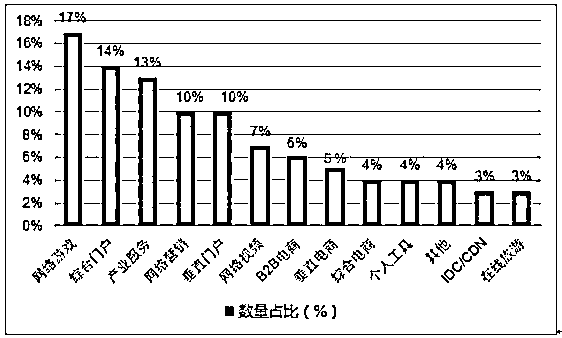
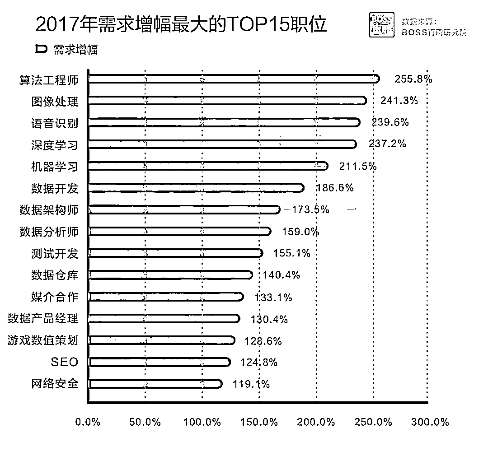
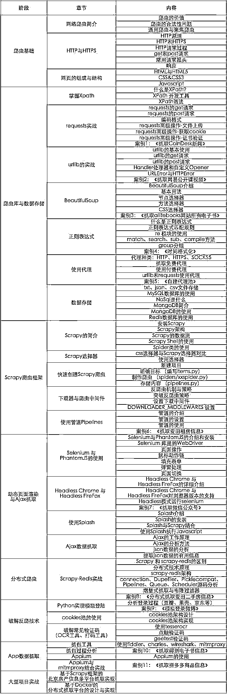

# Python 教父|廖雪峰老师官方爬虫教程，13 个案例带你全面入门！

> 原文：[`mp.weixin.qq.com/s?__biz=MzAxNTc0Mjg0Mg==&mid=2653288992&idx=1&sn=3b4068777df39f6038b3d45c861840e8&chksm=802e3835b759b123f8f7c362db8f628d3e60cfcf491e2f2b9758b602bdd4fc242e928ab95b55&scene=27#wechat_redirect`](http://mp.weixin.qq.com/s?__biz=MzAxNTc0Mjg0Mg==&mid=2653288992&idx=1&sn=3b4068777df39f6038b3d45c861840e8&chksm=802e3835b759b123f8f7c362db8f628d3e60cfcf491e2f2b9758b602bdd4fc242e928ab95b55&scene=27#wechat_redirect)

Python 简直就是万能的，你用 Python 都做过哪些事？

> 用网页看各大网站的 VIP 视频，用 python 下载？
> 
> 用 Python 玩跳一跳，跳到 50000 分？
> 
> 过年过节各大亲友群、红包群抢红包还用 Python？

**若问今年最火的一门编程语言是什么？答案一定是 Python。**

这把火已经烧到了程序员的圈子外，从小学生到职场老司机，都开始学习这一门新的语言，门槛低、零基础、操作骚...再也没有什么能阻挡 Python 晋升网红。

俗话说外行看热闹，内行看门道，我们已经知道了 python 的火热情况，但是学一门编程语言是需要花大量精力的，所以我们最关心的还是：

**“****对于我来说学习 python 有什么用****？”**

**1.趋势：互联网行业发展势头正猛**

我们可以根据下图“2017 中国互联网企业 100 强业务类型”看出，其中大数据、游戏、人工智能三大行业呈现高速增长趋势。

在 2017 年“中国互联网企业 100 强”的数据中显示，大数据、游戏以及人工智能等相关企业占比近**80%**，这都得益于 Python 语言的广泛应用，同时进一步掀起了 Python 语言的学习热潮。

**2017 中国互联网企业 100 强业务类型**

数据来源：公开资料、智研咨询整理

Python 被誉为最好的人工智能语言，人工智能的各种功能就是靠 Python 的程序编写来实现的。而且，Python 已经被纳入信息技术的高考，可见 python 已经受到了战略性的重视。

**2.收入：薪酬高**

互联网的高速发展势必会带来各大公司的人才缺口，掌握了 python 技术的程序猿也变得更加炙手可热，工资也是跟着水涨船高。

即使是掌握 Python 技术的大学应届毕业生，在找工作时通过一份源码的展示，也可以取得一份非常可观的薪水。

数据来源于招聘网站：Boss 直聘 职位需求报告

数据显示，在 2017 年雇主发布的职位说明中，Python 技能需求增速约 174%，居于首位。 

**3.学习：Python 简单易学**

很多编程语言的入门非常的困难，导致大家刚刚学习语法的时候，就已经丧失了一半的兴趣。

Python 是一种代表简单主义思想的语言，在设计的时候，就类比了英语的语法设计，所以更符合人类大脑对语言的理解，阅读一个良好的 Python 程序就感觉像是在读英语一样 Python 极其容易上手。

**“**那 Python 都有哪些用途呢？**”**

随着时间，我发现有 Python 主要有以下几大主要应用：

> *   **Web 应用开发：Python 经常被用于 Web 开发。**
>     
>     
> *   **网络爬虫：Python 有大量的 HTTP 请求处理库和 HTML 解析库，并且有成熟高效的爬虫框架 Scrapy 和分布式解决方案 scrapy-redis，在爬虫的应用方面非常广泛。**
>     
>     
> *   **科学计算：NumPy、SciPy、Pandas、Matplotlib 可以让 Python 程序员编写科学计算程序。**
>     
>     
> *   **桌面软件：PyQt、PySide、wxPython、PyGTK 是 Python 快速开发桌面应用程序的利器。**

所以介绍到这里，你应该知道 Python 有多强大了吧。那么，如果你能坚持的学好 Python，它必将会对你的职业生涯产生非常巨大的推动力。

鉴于此，**Python 教父-****廖雪峰** 老师团队官方出了一版爬虫课程，帮你成为 IT 江湖中的 Python 爬虫高手！另外文末可领取**廖雪峰老师的 Python 教程（******前 100 名****免费****赠送******）**。

**廖雪峰老师  -  加盟开课吧**

之前咱们在廖神博客看到的都是文字版的 Python 教程，这次不一样，**直接开课，有视频、有笔记、有案例实战！！！** 

话不多说看内容：

这个爬虫课程包含**13 个项目案例**实战，不仅教会你最专业的商业爬虫，还教会你怎么反爬虫，更会教会你怎么**破解反爬虫。**

所有的一切都只有一个目的：**让天下没有爬不到的数据！**

大家如果对这个爬虫课程感兴趣，可以加**廖雪峰老师助理微信**咨询，备注：**学习**。**前 100 人免费**赠送廖雪峰老师的 Python 教程。

你可以**长按识别**下面二维码

添加小助理，免费领取。

本公众号粉丝专享福利

**（立即扫码，免费领取）**

**知识在于分享**

**在量化投资的道路上**

**你不是一个人在战斗**