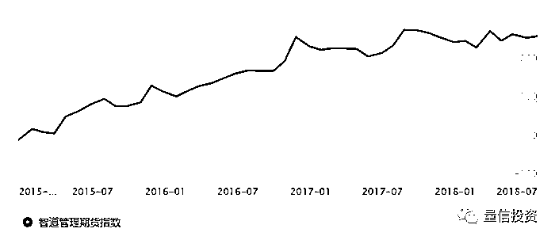
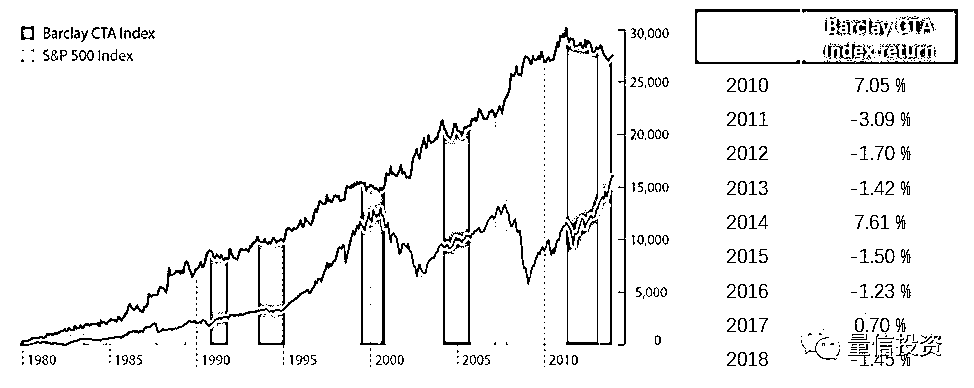
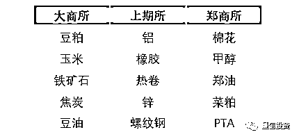
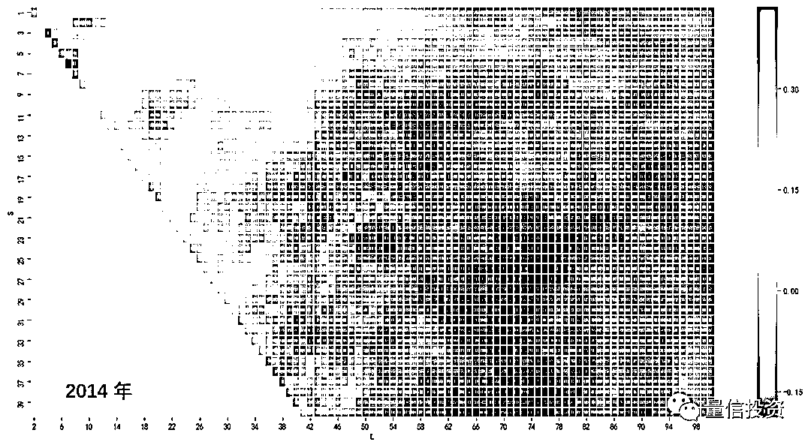
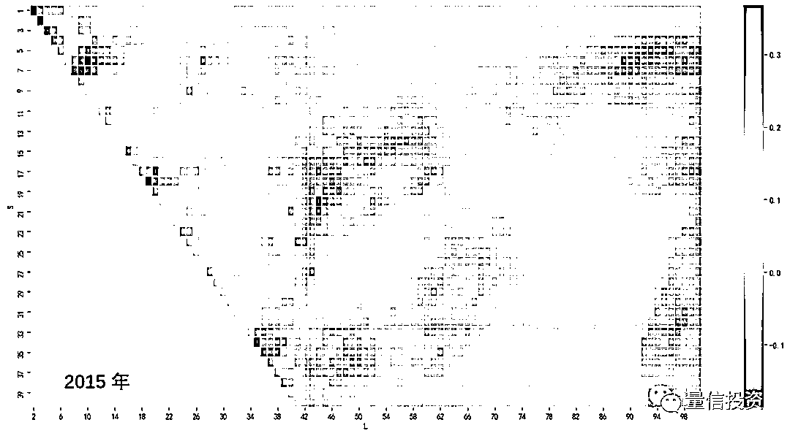
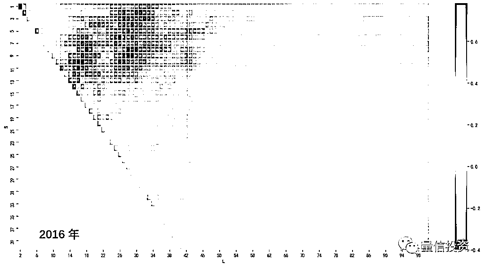
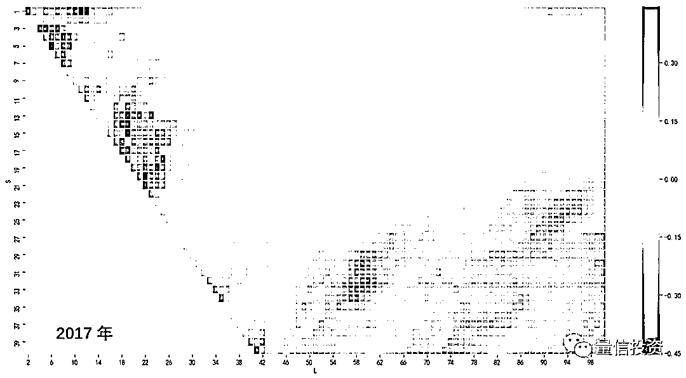
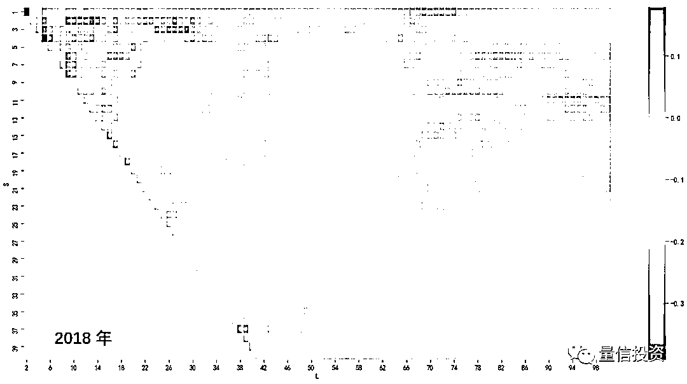

# 从 CTA 趋势策略的表现看量化投资面临的挑战

> 原文：[`mp.weixin.qq.com/s?__biz=MzAxNTc0Mjg0Mg==&mid=2653288989&idx=1&sn=c6b4a9ce226882413c93053c10ee4ed8&chksm=802e3808b759b11e0e664770eb3eedab5676b9b96b313b21285245adac7ed034a00ec4de15fc&scene=27#wechat_redirect`](http://mp.weixin.qq.com/s?__biz=MzAxNTc0Mjg0Mg==&mid=2653288989&idx=1&sn=c6b4a9ce226882413c93053c10ee4ed8&chksm=802e3808b759b11e0e664770eb3eedab5676b9b96b313b21285245adac7ed034a00ec4de15fc&scene=27#wechat_redirect)

****

****

摘

要

本文分析了 CTA 策略近年来的表现，并由此指出量化投资中面临的挑战。在经济存在下行风险的环境下，CTA 策略在未来或大有可为。

**1**

**引言** 

2018 年全球经济形势动荡、新兴市场尤甚，中国股市持续下跌探底。在这种背景下，CTA （管理期货）策略的配置价值凸显。在 CTA 策略中，绝大多数都是趋势追踪策略。在下文谈到 CTA 时特指趋势类策略。

其实在今年上半年，CTA 的表现也仅是中规中矩。但是进入 2018 Q3 以来，随着以 PTA 和黑色系为代表的商品期货走出了一波较为流畅的持续上涨行情，加之股市的进一步下跌，此消彼长，使得 CTA 策略脱颖而出。

虽然就 2018 年的前八个月来看，CTA 策略的表现可圈可点（特别是实现了对股票策略的完胜）；但是我们也看到，**和几年前（2014 到 2016）CTA 的风光无限相比，其今年的表现其实逊色许多**。此外，持续关注 CTA 策略的小伙伴一定知道，2017 年可谓是 CTA 策略的 nightmare。大部分商品在 2017 年宽幅震荡，但是 CTA 策略却没有什么作为。如此的表现也让人们对“趋势策略是做多波动率”这句话有了新的认识（**这句话本身是极不严谨的**，我们今后再聊。）

下图是智道管理期货指数（追踪国内 CTA 类私募的整体表现）自 2015 年 以来的表现。不难看出，CTA 策略在 2015 和 2016 年的表现非常优秀，但是到了 2017 年仅仅是在暑期行情中上涨了一波，其他时间都在持续阴跌；而从行业平均而言，CTA 在 2018 年获得的绝对收益也不算高（下图尚未包含今年 7 月中旬开启的一波上涨行情对 CTA 的贡献；在今年前半年，CTA 的表现是非常一般的）。**和几年前的大红大紫相比，CTA 在最近两年的表现只能算是差强人意。**

类似的现象也出现在海外 CTA 市场。下图展示了 Barclay CTA index 和标普 500 指数自 1980 年以来的走势。Barclay CTA index 是行业中较为认可的 CTA 表现指标，自 2010 年之后，海外的 CTA 平均表现也出现了震荡下行的格局，不如其在 2010 年之前的表现。

这样的现象促使我们思考：**CTA（趋势）策略在这两年怎么了？**

本文以一个简单的双均线趋势追踪策略为例，简要分析 CTA 趋势追踪策略最近几年在我国商品期货市场上的表现，并**探讨市场的变化对量化投资带来的一些挑战。**

**2**

**双均线趋势追踪策略** 

双均线是利用两个不同周期均线的关系确定开平仓信号、进行交易的策略。双均线系统由一个短周期趋势和一个长周期趋势构成。投资品的大趋势依然由长周期均线捕捉，而短周期均线起到的是择时的作用。计算长、短周期的时间窗口就是双均线策略的参数。

具体的双均线策略如下：

长、短均线的时间窗口分别为 L 和 S 个交易日。在没有头寸时，如果短均线在自下而上穿越长均线则做多；如果短均线自上而下穿越长均线则做空。当持有多头头寸时，如果短均线自上而下穿越长均线则平仓；当持有空头头寸时，如果短均线自下而上穿越长均线则平仓。为了简化讨论，不考虑止损线。

**本文实证的目标是在合理的范围内遍历 S 和 L 的取值，并观察以此构建的双均线趋势策略最近几年在我国商品期货市场的表现。**在实证中，S 的取值范围是 1 到 40，搜索步长为 1；L 的取值范围是 S + 1 到 100，搜索步长为 1。实证中使用以下来自国内三大商品交易所的 15 种商品作为投资标的，它们涵盖了有色、化工、农产品以及黑色系四大类别。

为了简化分析，在计算均线以及具体交易时，采用的都是上述商品的合成指数的收盘价。**如需实现更精细的实证，在回测交易时应该采用商品的主连数据而非合成指数，但是本文的简化并不定性改变趋势策略的表现。**为了惩罚高换手率策略（S 和 L 的取值比较小、或接近时），假设每次交易的成本是万分之五。最后，回测期为 2010 年 1 月 1 日到 2018 年 9 月 4 日。

**3**

**实证分析** 

对于每组给定的 S 和 L，依照上一节的说明构建双均线策略，就可以得到该策略在回测期内的表现，从而计算策略在每一年的收益率。由于我们想观察趋势策略每年的表现变化，因此对于每一个自然年，将不同 S 和 L 取值的策略收益率按照大小绘制成 heatmap 便可一目了然。

下面将逐年展示不同 S 和 L 取值下双均线策略收益率的 heatmap。考虑到我国商品期货市场早期可交易品种较少、且为了关注近几年的变化，下面的 heatmaps 从 2014 年开始。

下图是 2014 年不同参数 S 和 L 组合下双均线收益率的大小。图中纵坐标为 S 的取值、横坐标为 L 的取值，S 和 L 对应的小方块的热图颜色代表了收益率的大小 —— 深红代表高（正）收益、深蓝代表低（负）收益。**2014 可谓 CTA 趋势策略的大年**，图中除了一小部分参数组合外（当 S 和 L 都小于 10 时，很少有人会选择这样的参数构建双均线系统），绝大多数 S 和 L 组合构成的双均线策略都能获得非常可观的收益。

进入 2015 年，CTA 趋势策略风光不减。虽然收益率较 2014 有所下降，但绝大多数常见的 S 和 L 组合都可以获得正收益。蓝色部分集中在 S = L 的对角线附近 —— 即长均线周期 L 和短均线周期 S 取值接近 —— 从双均线策略的构建思路出发，很少有人会这么选。

再来看看 2016 年 —— 商品期货扬眉吐气的一年，以黑色系商品为代表，多数商品都迎来了大涨，这也孕育了一大波趋势行情。下图是不同 S 和 L 配对下，双均线策略在 2016 年的收益情况。很明显，蓝色的局部较前两年增多，**似乎在传递着某种隐忧 —— 是否趋势策略过热了？**比较 2014 与 2016 的热图，那些 2014 年获得最高收益的参数似乎在 2016 年不够理想。不过好的一方面是，获得正收益的策略的收益很高，相当一部分 S 和 L 组合的策略收益高达 40% 甚至是 60% 以上。

So far so good?

马上进入让 CTA 策略怀疑人生的 2017 年（下图）。趋势仿佛一下子消失了（至少在我们这个简单实证中）。这个大面积蓝色的热图似乎在诉说想要在 2017 年赚钱就应该和趋势对着干。抛开图中靠近 S = L 附近的那一小片红色区域对应的参数，**其他能在 2017 年勉强赚钱的参数中 S 的取值都非常小（≤ 10）。这意味着在 2017 年想要依靠趋势赚钱则需要更短的趋势。**

最后是 2018 年（截至 9 月 4 日）。2018 较 2017 年情况好转，热图中红蓝比例比较正常。但是**绝对收益并不高**，大部分 S 和 L 的组合虽然没有亏欠，但也没挣到什么钱。**这是否意味着越来越多的策略和资金以趋势追踪的形式涌入商品期货市场，导致市场在趋势方面的非有效性下降了呢？**值得持续关注。

**4**

**带给量化投资的挑战** 

上一节上回顾了双均线 CTA 趋势策略在过去五年的表现，下面探讨其表现的变化带给量化投资哪些挑战。

回首过去 5 年，双均线策略在 2017 年的表现对量化策略的构建提出了两个挑战：

**1\.** 如果策略是在 2017 年之前构建的并已经投放到实盘一段时间、且取得了不错的效果，那么这组参数在 2017 年大概率是要亏损的（个别组参数亏损的恐怕还不低），面对这样的表现，我们会问：**策略失效了吗？**

**2\.** 站在 2017 年年末这个时点构建双均线趋势策略并用历史数据回测，如果使用 2017 年作为测试集，而使用更早的数据作为训练集，那么大概率会遇到在训练集中有效的参数在样本外完全失效。这就会落入我在[《科学回测中的大学问》](https://mp.weixin.qq.com/s?__biz=MzIyMDEwNDk1Mg==&mid=2650877613&idx=1&sn=ee932ca4c69460d2f3e7e62e5bab5d3f&scene=21#wechat_redirect)一文中提出的**训练集和测试集之纠结。**

对中低频趋势类 CTA 策略而言，一年的亏损表现是非常正常的，我们应尽量客观的看待它。第一个挑战可以从以下几个方面鉴别亏损是源自策略失效还仅仅是暂时不佳表现：

**1\. 市场的行为是否发生了变化导致策略失效？**一个资产产生趋势的原因是投资者的 herding 行为，因此它是跨市场的行为。市场可以暂时没有趋势或宽幅震荡，这些会造成 CTA 策略的亏损，但是趋势在今后一定会再次出现的。因此，不太可能是因为市场行为的变化导致策略失效。

**2\. 策略的（亏损）表现是否在预期之内？**盈亏同源，任何一个策略都不是印钞机。通过历史回测对策略的表现分布有一个合理预期，以此判断策略最新的表现是否在预期之内。

**3\. 策略构建时是否存在不科学之处？**所有策略都或多或少存在过拟合。过拟合意味着错把历史数据中的噪声当作因果关系来建模，因此回测的表现往往是实盘表现的上限，这意味着实盘外的收益较回测会更低、最大回撤较回测会更大。如果某一年的表现完全不符合预期（且排除了市场问题），那么就要检查构建策略时是否有不科学之处 —— 比如是否单一品种或者单一行业的仓位过重？或者没有充分考虑不同品种之间的相关性，导致相关性过高？（**时序动量策略喜欢相关性低的投资品**，见[《动量策略的是与非》](https://mp.weixin.qq.com/s?__biz=MzIyMDEwNDk1Mg==&mid=2650877679&idx=1&sn=faf110628de6624b343dad980b2dbb81&scene=21#wechat_redirect)。）

第二个挑战是训练集和测试集的问题。一个经科学回测过的策略应该能够捕捉训练集和测试集数据表现出来的某种市场共性。然而，**独立交易数据的匮乏**为实现这个诉求造成了不小困难。交易数据匮乏是针对数据的可交易特征而言。历史数据虽然很长，但满足一个策略假设的样本却十分有限。

本文中双均线策略的结果表明，2017 年的市场中没有出现绝大多数 S 和 L 组合希望的交易特征，造成了它们的亏损。在这种情况下，如果在构建策略时硬把 2017 年当作测试集，一定会不自觉的把策略在测试集中的体现出来的新市场环境反馈到训练过程中，这等价于在整个历史数据中对策略的参数调优了。只要策略交易的市场特征有明确的业务支持而非数据挖掘的产物，那么针对它构建及优化策略参数时，是分别使用训练、测试集，还是使用所有数据来整体优化，并不重要。

再来看看最后一个挑战。下表展示了回测期内净值最高的五组 (S, L) 参数。顺便一提，第二组和第五组的参数很接近，S 和 L 的取值分别是 10 和 20 左右，我猜想市场上有激进的双均线交易者会采取这类的参数，不过这不是本文关注的重点。

我们关注的重点是，在这些回测期内净值最高的参数中，2016 年的收益率都非常高。换句话说，**一波大行情能够对回测带来很大的不平衡因素，如果以净值作为构建策略时评价参数的标准，则会错误放大这种影响。**因此在参数调优时，不应过度考虑策略的收益率大小，还应考察波动率、最大回撤、最长回撤时间、以及夏普率这些考虑了风险的指标。

**5**

**结语** 

**有挑战就有机遇。**

本文虽然客观的指出了趋势 CTA 策略的表现有所下滑，但是我们对它的未来绝不悲观。我只是想强调，市场在变化，策略的表现也有大小年之分。为此，一个科学的量化体系应该做到定期的检查策略，做到未雨绸缪、防患于未然。最理想的情况是策略不管在什么样的市场行情中都能够取得比较稳定的收益。这绝不容易，这需要我们不断学习、思考，调整策略以顺应市场的变化。

从目前的情况来看，在找到新的增长点之前，中国经济难有大的起色，根据货币宽松程度和财政实施力度，未来存在通胀和通缩两大潜在的经济风险，这对股权市场并非好的增长环境。但对于商品期货而言，因为可以同时做多和做空，不论是通胀压力还是通缩环境，CTA 策略都可以通过捕捉商品价格的趋势赚取收益，成为资本市场上博取风险收益的良好投资品种。在经济存在下行风险的环境下，CTA 策略大有可为。

## **公众号为所有读者带来双重福利 **

**知识在于分享**

**在量化投资的道路上**

**你不是一个人在战斗**