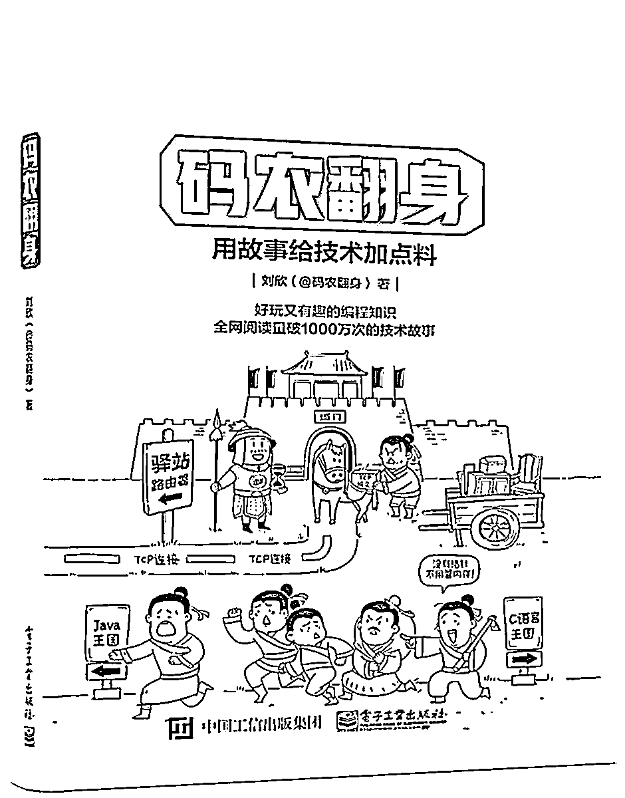

# 【重磅联名】公众号为所有读者带来双重福利 ！

> 原文：[`mp.weixin.qq.com/s?__biz=MzAxNTc0Mjg0Mg==&mid=2653288984&idx=1&sn=fed9eb8bd89145299600dcf43504297b&chksm=802e380db759b11bcf37db72c3ea17b8fa3b641e3a4bbbdb99632dfc2c539cc390cb2c845695&scene=27#wechat_redirect`](http://mp.weixin.qq.com/s?__biz=MzAxNTc0Mjg0Mg==&mid=2653288984&idx=1&sn=fed9eb8bd89145299600dcf43504297b&chksm=802e380db759b11bcf37db72c3ea17b8fa3b641e3a4bbbdb99632dfc2c539cc390cb2c845695&scene=27#wechat_redirect)

一本好书带给人的不止于知识收获，还会对你的成长有所帮助，与你的每次经历产生共鸣。

**每天读一点，坚持不懈，你就能成为专业高手**。

如果你能每两个月读一本好的编程书，大概一周 35 页，你很快就能对业内的知识有坚实的掌握，能很快让你从周围所有的人中脱颖而成。

所以搞量化的、搞程序的应该好读书，读好书！

经常阅读 IT 技术类图书的同学可能听说过博文视点，这是一家深耕 IT 技术图书的出版公司，隶属于电子工业出版社。成立 15 年来一直与计算机技术的蓬勃发展紧密联系。

出版过诸如：

> **《代码大全（第 2 版）》**
> 
> **《编程之美——微软技术面试心得》**
> 
> **《高性能 MySQL（第 3 版）》**
> 
> **《大型网站技术架构：核心原理与案例分析》**
> 
> **《Spring Cloud 微服务实战》**
> 
> **《TensorFlow：实战 Google 深度学习框架》**
> 
> **《码农翻身》等畅销技术图书**

今日博文视点迎来 15 周年庆，联合 **量化投资与机器学习公众号 **带给读者双重福利。

**福利一  ** 

**京东购书优惠**。博文视点全场图书每满 100 减 50，更有超值优惠券限量领取，用券后实现不到 4 折购书。**花 80 元买 200 元图书！**

**福利二**

**在文末留言**。说说哪一本图书曾经让你爱不释手，我们选取**点赞前 5**的读者赠送图书一本。（从以下书单任选**包邮**）

**先领优惠券**

**订单实付满 99 元再减 20 元**

**可与 100 减 50 活动叠加使用** 

**数量有限领完即止，仅限全场计算机图书可用**

（截至 9 月 14 日 24 点）

**博文视点图书满减专场**

 **扫码直达囤书现场**

下面给大家推荐一些好书

**码农翻身**

**刘欣（@码农翻身） 著**

用故事给技术加点料

好玩又有趣的编程知识，全网阅读量近 1000 万次的技术故事

**Python 编程之美：最佳实践指南**

**【美】Kenneth Reitz（肯尼思·赖茨）**

**Tanya Schlusser（坦尼娅·胥卢瑟） 著**

**夏永锋 廖邦杰 译**

被众多实践验证过的技巧、经验大全

Python 安装、配置和使用的最佳实践手册，事半功倍写出高质量的代码

**TensorFlow：实战 Google 深度学习框架（第 2 版）**

**郑泽宇，梁博文，顾思宇 著**

领域旗舰重磅升级 新老谷歌专家联袂

首度全面支持 1.4.x 代码 大量增补新版独有核心功能|专题

**21 个项目玩转深度学习——基于 TensorFlow 的实践详解**

**何之源 著**

零基础入门，有趣新颖，实用有效

学习 TensorFlow 不再枯燥，21 个项目让你快速上手！

**Python 与量化投资：从基础到实战**

**王小川 著**

量化投资名师王小川主编、提供 Python 零基础入门及量化策略建模参考及实现

提供大型回测平台、代码直接实盘、可在线交流

**强化学习精要：核心算法与 TensorFlow 实现**

**冯超 著**

从原理剖析到算法精髓，再到 TensorFlow 代码实现

为读者构建了一个完整的强化学习知识体系

**区块链核心算法解析**

**张竞宇 著**

**[美] Roger，Wattenhofer（罗格.瓦唐霍费尔） 著**

**陈晋川 等 译**

本书着眼于区块链的核心问题——拜占庭共识，针对不同的应用场景，介绍了适用的分布式共识算法

 书中包含了很多算法及证明，深入剖析了共识算法的核心思想。

**Python 带我起飞——入门、进阶、商业实战**

**李金洪 著**

一线工程师 14 年经验感悟。

“教学视频+ 图书+ QQ 群交流、答疑”三维学习方案，让 Python 学习更轻松

**量化投资技术分析实战——解码股票与期货交易模型**

**濮元恺 著**

以股票和期货为主战场，快速提升数量化投资能力

公开机构投资模型框架源码

**零起点 TensorFlow 与量化交易**

**何海群 著**

一本让你轻松了解神经网络与量化投资的实战教程

图书+开发平台+成套的教学案例，系统讲解，逐步深入

**截止 2018.09.16 18:00**

说说哪一本图书曾经让你爱不释手，我们选取**点赞前 5**的读者赠送图书一本。（从以上书单任选）。届时，工作人员会联系五位读者，**包邮**寄出此书。

**知识在于分享**

**在量化投资的道路上**

**你不是一个人在战斗**