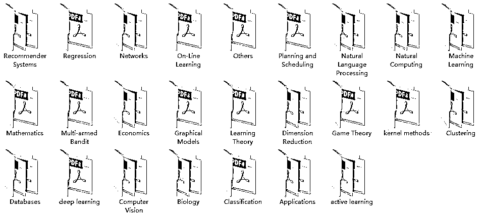

# 秋招要跪？不怕！领走这份机器学习求职攻略

> 原文：[`mp.weixin.qq.com/s?__biz=MzAxNTc0Mjg0Mg==&mid=2653288964&idx=1&sn=ba729716d6e7f6be676c960faf867271&chksm=802e3811b759b1072178dc121e40aee47e540d40b8a632ff8bb3fee242c496d2d2d924b687d9&scene=27#wechat_redirect`](http://mp.weixin.qq.com/s?__biz=MzAxNTc0Mjg0Mg==&mid=2653288964&idx=1&sn=ba729716d6e7f6be676c960faf867271&chksm=802e3811b759b1072178dc121e40aee47e540d40b8a632ff8bb3fee242c496d2d2d924b687d9&scene=27#wechat_redirect)

AI 人才严重缺乏，2018 年秋招提前批的“AI 人才争夺战”已经开启，许多有意跳槽的小伙伴也在跃跃欲试。但是，你真的准备好了吗？

为了拿到 Dream Offer，通过面试必然十分关键。如何才能在面试中脱颖而出呢？我们精心准备了一份“AI 面试指难”，希望为你的求职之路增添助力！

Ready? Go!

2018 年秋季招聘全球统一考试

AI  岗

> 注意事项：

> 1\. 本套试卷共 6 部分、18 道题。考试时间不限，其中 11 道必答题，7 道附加题。

> 2. 本考试为闭卷考试，无人监考，微信浮窗后查资料我们也不知道。

> 3. 考试合格者可获得沃夏白徳公司 sp offer。

> 4. 本次考试最终解释权归沃夏白徳公司所有。

姓名 ____    目标公司 ____  Dream 岗位 ____

密  封  线  内  不  得  答  题

·········密·········封·········线·········

* * *

**第一部分：AI 常识题**

**1. 以下和数据科学 / 人工智能有关的公司是**

A 网易

B BAT

C TMD

**答案**

**点击下方空白处获得答案**

答案：ABC 注意，选项 C 不是骂人的话

**2. 如果想找 AI 相关岗位，那么以下城市可以去哪里？**

A 北上广深

B 13 个新一线城市

C 回到位于马栏山的老家养猪

D 硅谷

**答案**

**点击下方空白处获得答案**

答案：ABCD
注意，AI 可用于猪脸识别

**第二部分：命运选择题**

**1. 简历上前一份工作表现很出色，为什么离职？**

A 工作没有什么挑战性，我的才华都被埋没了

B 一群神队友真的带不动

C 老板娘长的像前女友

D 电脑太烂了，芝麻多的数据都要跑半天

**答案**

**点击下方空白处获得答案**

答案：嗯，你开心就好

**2. 面试官问"你还有什么问题要问我们的吗？"以下什么行为是自绝于 Offer？**

A 刚刚的卷积和 FC 层问题我没回答出来，请问正确答案是什么？

B 怼他。让我手推 SVM 公式，你能写出来不？

C 请问岗位的发展路径是怎样的呢？方便告知下薪资范围么？

D 请问您对我今天的面试，有什么改进的建议么？

**答案**

**点击下方空白处获得答案**

答案：B

**第三部分：见多识广题**

**1. 以下截图来自于哪门课程？**

**答案**

**点击下方空白处获得答案**

答案：吴恩达 《深度学习》（Deep Learning Specialization）

**2. 以下截图来自于哪门课程？**

 

**答案**

**点击下方空白处获得答案**

答案：李飞飞 《深度学习计算机视觉》(CS231n: Convolutional Neural Networks for 

**3. 以下截图来自于哪门课程？**

**答案**

**点击下方空白处获得答案**

答案：《机器学习工程师》（Machine Learning Engineer）

**第四部分：爱恨情仇题**

**1.（填空题）战略为“ALL in AI”的公司是 ________；战略为“AI in ALL”的公司是 ________；战略为“AI First”的公司是 ________；**

**答案**

**点击下方空白处获得答案**

答案：百度，腾讯，Google

**2.（纠错题）PHP 是最好的语言。**

**答案**

**点击下方空白处获得答案**

****第五部分：真材实料题****

****1. 了解数据科学比赛吗？****

**A 非常考验体力和解决问题的能力，充分锻炼综合素质，是面试求职的有利加分项**

**B 参加过 Kaggle 竞赛，在老师的指导下和队友一起努力冲进 TOP1%，并认真研究了前几名的代码，知道了更优的解决方式**

**C 听说奖金很多**

**D 动不动就三个月比赛周期太累了，求大神求大腿求带飞**

****答案****

****点击下方空白处获得答案****

**答案：ABC** 

****2. 有个人的知识整理分享平台吗？****

**A 在社群中与大家交流，将心得收获定期发布在简书上**

**B 微信公众号时常更新，目前有几千粉丝，大家互动学习**

**C Github 了解一下，已经被 star 上千次了**

**D 自己搭了一个博客，这可是展示自己的好机会**

**E 我又不是专家，哪好意思显摆知识，有人骂我写的不好可咋办**

****答案****

****点击下方空白处获得答案****

**答案：ABCD** 

****第六部分：面试爆料题****

**1.一根木棒截成三段，能组成三角形的概率**

**2.找二叉树中任意两个节点的最近公共祖先**

**3.推导一下逻辑回归算法，如何得到 loss function**

**4.决策树是如何完成回归的**

**5.手写 svm 硬软间隔对偶的推导**

**6.分别介绍一下 bagging 和 boosting**

**7.过拟合和欠拟合发生的原因是什么，有哪些方法缓解过拟合**

**附加题答案可进群领取（底部二维码）**

* * *

**一套题目做下来，感觉如何？**

****秋招要跪？不怕！领走这份机器学习入职攻略****

**网易云课堂联手稀牛学院，为**秋招以及跳槽求职者**准备了一份 AI 岗位的求职秘籍。**

**从**招聘流****程**到**简历准备**，从**公司选择**到**岗位解读**，从**项目描述**到**竞赛经历**，一线资深面试官寒小阳老师将直播分享他的经验和建议，并与数百名求职者在线**直播**互动，带给你值得一听的求职解读！并且**附赠限时免费礼包**~包含免费体验课和资料包。**

****PART 1  免费直播****

****直播主题：****

****一直在入门？这里有机器学习的高效进阶之道！****

**< **9 月 12 日 周三 20:00**>**

****直****播大纲：****

**蓝图：机器学习王国的知识版图 **

**基石：必需掌握的数学基础知识 **

**框架：理解常见算法核心与细节 **

**迁移：重组你的算法模型与体系 **

**工程：学习数据分析工具与技能 **

**实战：参与项目比赛提升动手能力**

****直播讲师：****

****

**寒小阳**

**知名电商算法专家**

****PART 2  免费体验课****

****《机器学习工程师免费体验课》****

****课程大纲：****

**机器学习的就业前景**

**Python 实战学习**

**（附 15 天学习计划和趣味项目源码）**

**机器学习工程师的实际应用案例**

******PART 3 免费资料包****** 

****************

********如何获取？********

**扫码加入 QQ 群即可获取所有免费福利**

**包含面试爆料题答案**

****************

**群号：866057600**