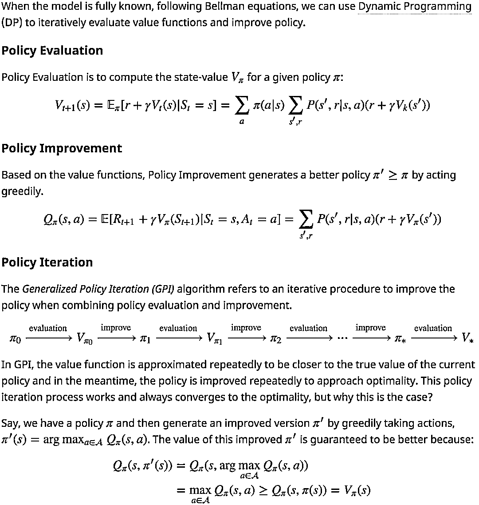
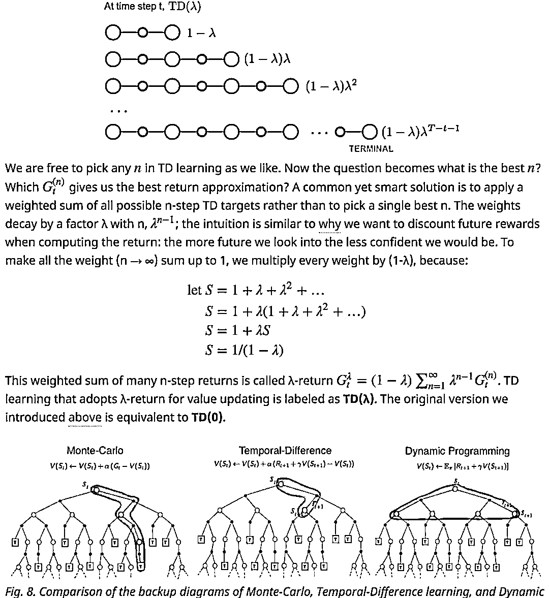
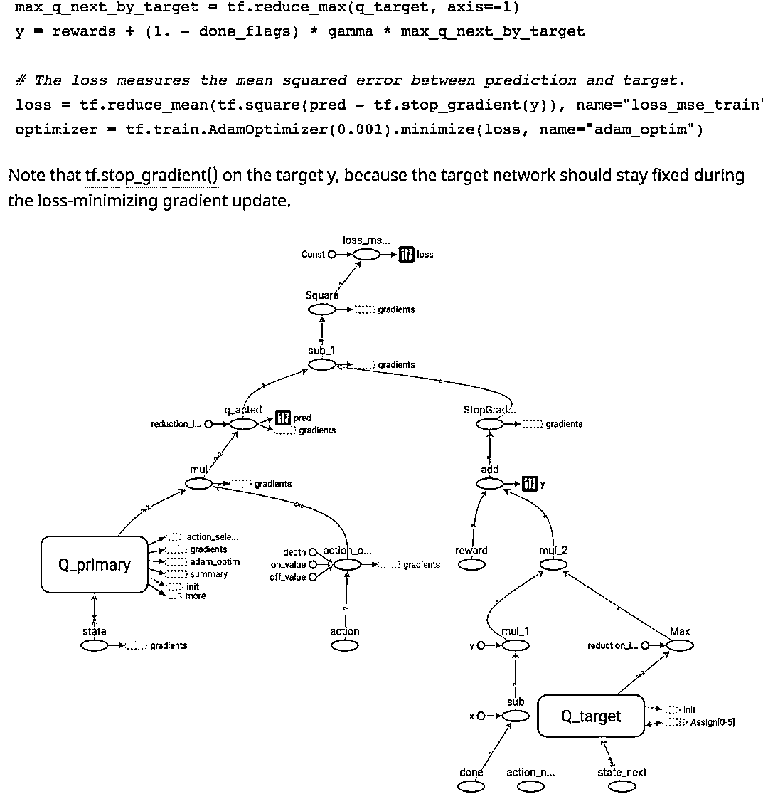
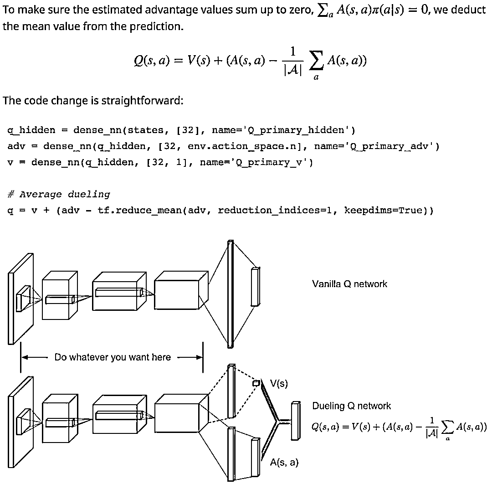
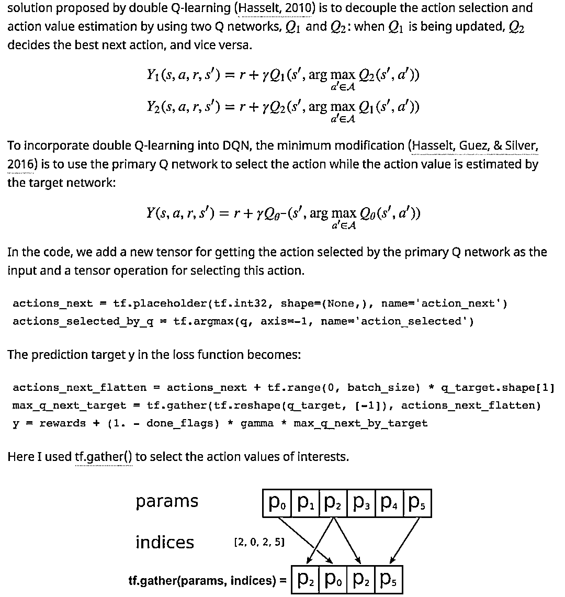
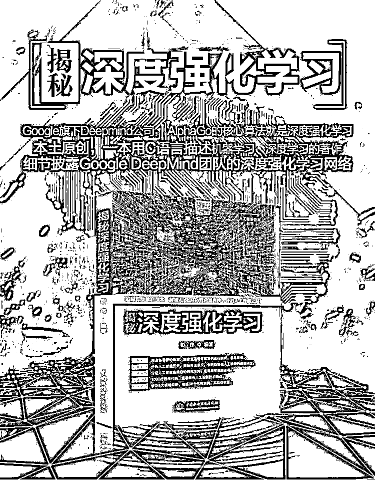

# 【干货】深度强化学习模型的研究与应用（第 20 期免费送书活动来啦）

> 原文：[`mp.weixin.qq.com/s?__biz=MzAxNTc0Mjg0Mg==&mid=2653288953&idx=1&sn=d88d48be85026a4836db023f369aa24e&chksm=802e3becb759b2fa4aaff5841097a3d7a21d3624640a62885b02c80ba0f7bc79ec9fc4c02cf1&scene=27#wechat_redirect`](http://mp.weixin.qq.com/s?__biz=MzAxNTc0Mjg0Mg==&mid=2653288953&idx=1&sn=d88d48be85026a4836db023f369aa24e&chksm=802e3becb759b2fa4aaff5841097a3d7a21d3624640a62885b02c80ba0f7bc79ec9fc4c02cf1&scene=27#wechat_redirect)

今天是教师节，首先，公众号给全天下的老师们说一声：**老师您辛苦啦！**

公众号很近没有开展送书活动啦。不过有个好消息，从今天开始，我们又开始啦。这次是第 20 期啦。快去文末查看吧，这本书听说最近卖的太火了

近期，Lilian Weng 写的两篇博客，专门介绍强化学习算法与应用，真的特别好，安利一波：

**一、A (Long) Peek into Reinforcement Learning**

部分课程内容

# **二、Implementing Deep Reinforcement Learning Models with Tensorflow + OpenAI Gym**

部分课程内容

**GitHub 地址：**

***https://github.com/lilianweng/deep-reinforcement-learning-gym***

**原文地址****：** ***https://lilianweng.github.io/lil-log/***

配合上面内容，本期送出的图书也与强化学习有关哦

**第 20 期赠书活动**

量化投资与机器学习公众号联合中国水利水电出版社送出**5 本**《**揭秘深度强化学习******》****

******听说此书在网上大卖哦！******

> 本书的目的就是要把这两种主要的算法（及设计技巧）讲解清楚，使算法研究人员能够熟练地掌握。本书共 10 章，首先以 AlphaGo 在围棋大战的伟大事迹开始，引起对人工智能发展和现状的介绍，进而介绍深度强化学习的基本知识。然后分别介绍了强化学习（重点介绍蒙特卡洛算法和时序差分算法）和深度学习的基础知识、功能神经网络层、卷积神经网络（CNN）、循环神经网络（RNN），以及深度强化学习的理论基础和当前主流的算法框架。最后介绍了深度强化学习在不同领域的几个应用实例。引例、基础知识和实例相结合，方便读者理解和学习。本书内容丰富，讲解全面、语言描述通俗易懂，是深度强化学习算法入门的优选。本书适合计算机专业本科相关学生、人工智能领域的研究人员以及所有对机器学习和人工智能算法感兴趣的人员。

**原价：89.80 元**

**截止 2018.09.13 18:00**

大家在本篇推文【写留言】处发表留言，**获得****点赞****数****前五****的读者，即可免费获赠此书**。届时，工作人员会联系五位读者，寄出此书。