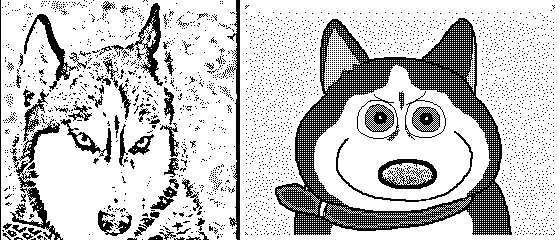
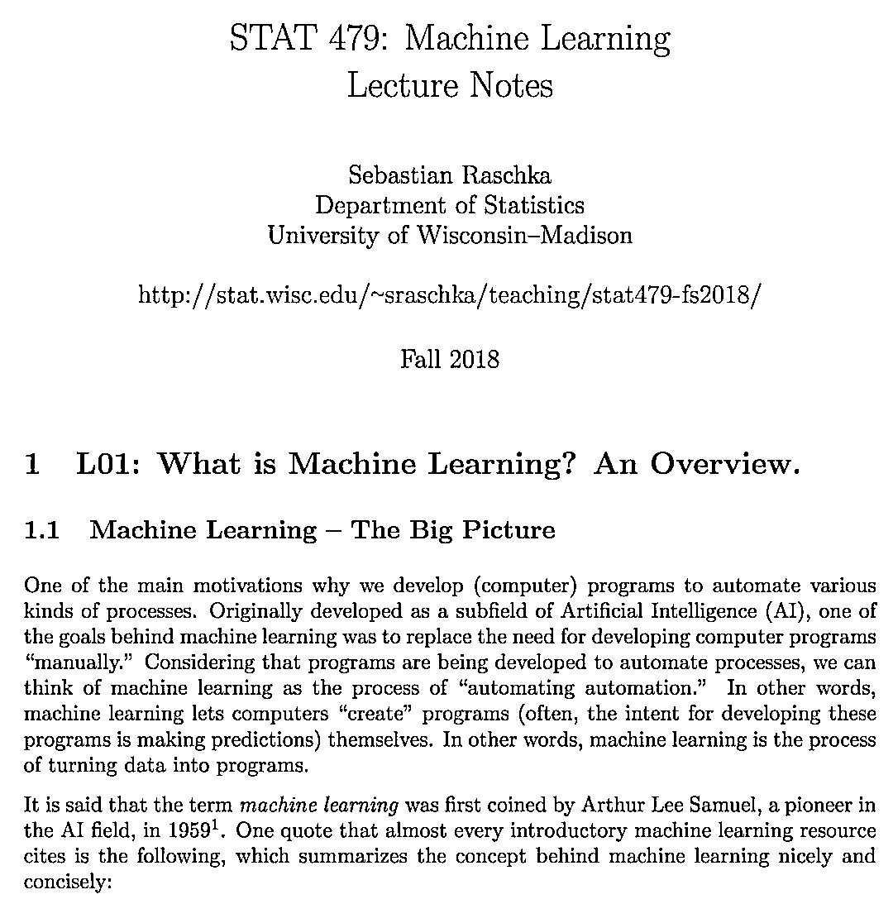
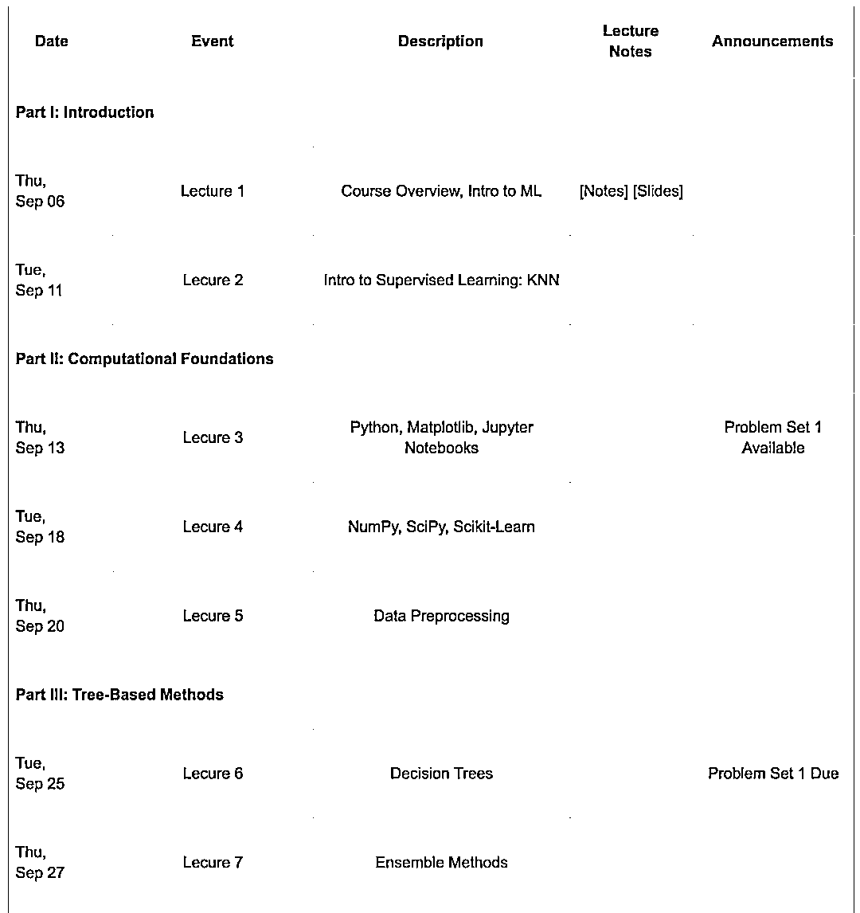
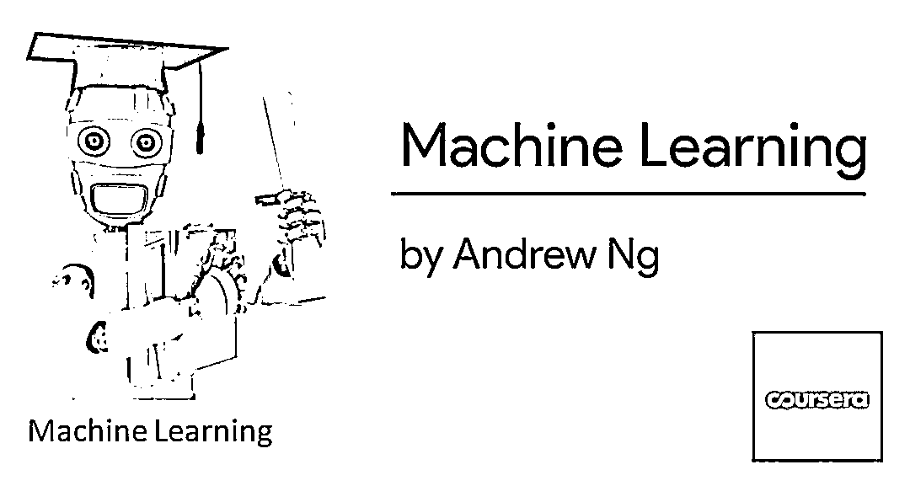
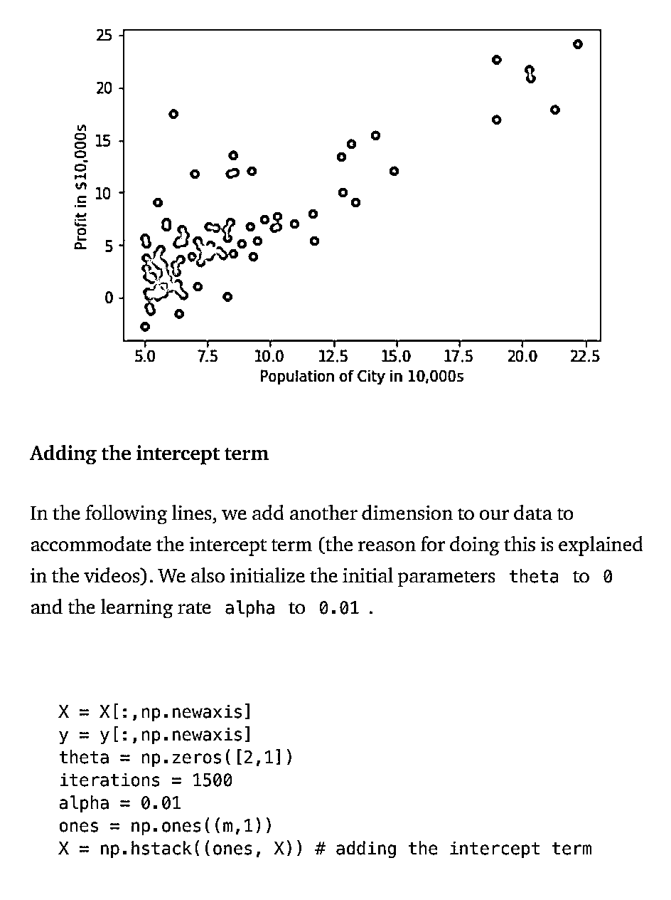

# Andrew Ng 机器学习课程的 Python 实现

> 原文：[`mp.weixin.qq.com/s?__biz=MzAxNTc0Mjg0Mg==&mid=2653288941&idx=1&sn=ce6e436d4721feea73e2006f927de3e3&chksm=802e3bf8b759b2ee93ee0730e29784455a821b5b79253ca60c9fb860b7ecd2226ab6d3c6cb03&scene=27#wechat_redirect`](http://mp.weixin.qq.com/s?__biz=MzAxNTc0Mjg0Mg==&mid=2653288941&idx=1&sn=ce6e436d4721feea73e2006f927de3e3&chksm=802e3bf8b759b2ee93ee0730e29784455a821b5b79253ca60c9fb860b7ecd2226ab6d3c6cb03&scene=27#wechat_redirect)

今天首先给大家分享一个很好的机器学习课程：

**威斯康星大学机器学习课程**

目前该课程推出了最新的一节课：

**部分课件内容**

**课程表**

课程学习地址：

***http://pages.stat.wisc.edu/~sraschka/teaching/stat479-fs2018/#schedule***

第二个给大家分享的是：

**Andrew Ng 机器学习课程的 Python 实现**

部分内容

内容链接：

***https://medium.com/analytics-vidhya/python-implementation-of-andrew-ngs-machine-learning-course-part-1-6b8dd1c73d80***

**知识在于分享**

**在量化投资的道路上**

**你不是一个人在战斗**