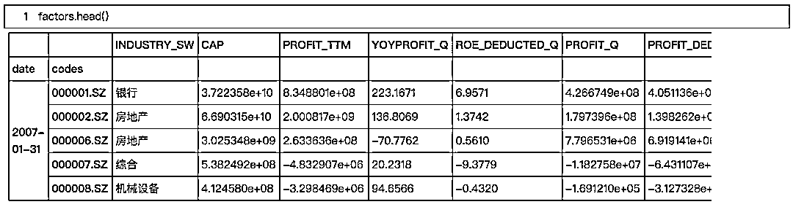

# 【价值投资逻辑】高质量、低估值选股模型（代码+报告）

> 原文：[`mp.weixin.qq.com/s?__biz=MzAxNTc0Mjg0Mg==&mid=2653288932&idx=1&sn=7060a99afa743b3802fb2cbf84268bf1&chksm=802e3bf1b759b2e72927931532a24f07b627a94a4665c01df05631b19ec4a0f1ab9ba0699927&scene=27#wechat_redirect`](http://mp.weixin.qq.com/s?__biz=MzAxNTc0Mjg0Mg==&mid=2653288932&idx=1&sn=7060a99afa743b3802fb2cbf84268bf1&chksm=802e3bf1b759b2e72927931532a24f07b627a94a4665c01df05631b19ec4a0f1ab9ba0699927&scene=27#wechat_redirect)

本文参考：东兴证券《价值投资的逻辑：高质量+低估值》

作者：WindQuant | 001

**点击图片了解详情**

内容直接开门见山

# **一、因子提取**

# **1、回测区间**：2007 年 1 月 30 日至 2018 年 6 月 29 日；

# **2、调仓日：**每月最后一个交易日为调仓日，以每月最后一个交易日的收盘价买入卖出；

# **3、股票池：**全部 A 股；剔除选股日的 ST/PT 股票；剔除上市不满一年的股票；剔除选股日由于停牌等原因而无法买入的股票；

# **4、因子选取如下所示：**

**部分代码展示，全部代码请见文末**

# **二、投资组合构建**

**选股逻辑**

> 1、扣除有 ST 标示、调仓日近一年内上市、单季度净利润为负、近 12 个月净利润为负、单季净利润同比增长率为负或则大于 1000%的股票；
> 
> 2、再取估值因子 EP_DEDUCTED_TTM 排在股票池前 30%的股票；
> 
> 3、单季度扣除非经常性损益 ROE 排在股票池前 30%的股票；
> 
> 4、单季净利润同比增长率排在股票池前 30%的股票。

# **三、投资组合表现分析**

## **3.1 选出的股票数量分析**

部分调仓日的股票代码如下所示：

**部分代码展示，全部代码请见文末**

在回测区间的各个调仓日选出的股票数在 18 只-86 只之间，2009 年 4 月-2009 年 7 月、2014 年 10 月-2015 年 2 月、2015 年 10 月-2016 年 3 月三个时间段的股票数较少，从 2017 年后半年至 2018 年前半年的一年时间里选出的股票数较多。

## **3.2 持仓股票市值分析**

该组合的市值与中证 500 指数较为接近。

## **3.3 收益率分析**

### **3.3.1 投资组合与沪深 300 指数、中证 500 指数、上证 50 指数、上证综指净值对比**

**部分代码展示，全部代码请见文末**

从投资组合与各大指数的净值时序图可以看出，投资组合的回测净值在整个回测周期内基本大于各大指数的回测净值，其中在 2011 年之前，投资组合与各大指数的净值相差不大，2011 年至 2014 年末，投资组合的净值基本上为各大指数净值的 2 倍，从 2014 年末以后，投资组合的净值与各大指数的净值的差距逐渐拉大，投资组合要远高于各大指数。

**3.3.2 投资组合与沪深 300 指数、中证 500 指数、上证 50 指数、上证综指收益率对比**

通过对比投资组合与沪深 300 指数、中证 500 指数、上证 50 指数、上证综指的年华收益率、收益波动率、夏普比率、最大回撤等指标，来考察投资组合的收益和风险情况。

**部分代码展示，全部代码请见文末**

从投资组合与各大指数的收益情况来看，投资组合的年化收益远高于各大指数的年化收益，达 27.0，夏普比率也最高，达 0.85,但收益波动率与最大回撤最不理想，说明投资组合在高风险下能带来高收益，但面临的投资风险也较大。

**代码+报告**

扫下方二维码进行获取

**知识在于分享**

**在量化投资的道路上**

**你不是一个人在战斗**