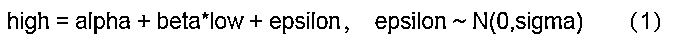

# 基于阻力支撑相对强度（RSRS）的市场择时

> 原文：[`mp.weixin.qq.com/s?__biz=MzAxNTc0Mjg0Mg==&mid=2653288908&idx=1&sn=6bbc5fb274ddae110be413226943c2e1&chksm=802e3bd9b759b2cfc32cc76b755ff5a1c522a482f3c1cfc5b61c604a0733f88bb5b684feace2&scene=27#wechat_redirect`](http://mp.weixin.qq.com/s?__biz=MzAxNTc0Mjg0Mg==&mid=2653288908&idx=1&sn=6bbc5fb274ddae110be413226943c2e1&chksm=802e3bd9b759b2cfc32cc76b755ff5a1c522a482f3c1cfc5b61c604a0733f88bb5b684feace2&scene=27#wechat_redirect)


作者：量化小白 H

本文是对光大证券研究报告《基于阻力支撑相对强度（RSRS）的市场择时》前四种择时方法的复现。


报告认为，常用的均线系统和 MACD 等指标滞后性较高，阻力支撑指标 RSRS 领先性较好，可以以此为依据构造择时策略，具体原理见报告。

（获取研报和代码**查看文末**）

文章仅出于个人对于报告的理解，不一定正确，有问题请指出。回测结果除方法一以外，均与报告差异较大，**如果有大佬作出了跟研报差不多的结果，求指导**。

语言：python3.6

数据来源：**tushare（免费）**

回测区间：两个时间段，第一个与研报一致，2005 年 3 月-2017 年 3 月，通过对比来看复制是否准确，第二个为 2005 年初到当前，看策略现在的表现如何。 

文章结构如下：

1.  各种阻力支撑指标的构造及分析

2.  斜率策略回测

3.  标准分策略回测

4.  修正标准分策略回测

5.  右偏标准分策略回测

6.  回测结果汇总

**1\. 阻力支撑指标**

研报一共构造了 4 种阻力支撑指标，指标背后的逻辑不过多分析，见研报，仅给出原理和代码实现。

**当日斜率指标**




**当日标准分** 


**修正标准分**


**右偏标准分**


为了后续策略回测方便，我们构造函数**getdata**从**tushare**中取出原始价格序列，并一次性计算出所有需要用的指标，其中 N 为回归用的天数，M 为计算标准分所用的时间长度，**与研报一致，对于前三种策略，N=18,M=600,对于第四种策略，N=16,M=300**。

```py
 1def getdata(dateStart,dateEnd,N,M):
 2    HS300 = ts.get_k_data('000300', index=True,start = '{}'.format(dateStart),end = '{}'.format(dateEnd))
 3    HS300=HS300[['date','high','low','open','close']]
 4
 5    # 斜率
 6    HS300['beta'] = 0
 7    HS300['R2'] = 0
 8    for i in range(1,len(HS300)-1):
 9
10        df_ne=HS300.loc[ i- N+1:i ,:]
11        model = sml.ols(formula='high~low',data = df_ne)
12        result=model.fit()
13
14        HS300.loc[i+1,'beta'] = result.params[1]
15        HS300.loc[i+1,'R2'] = result.rsquared
16    # 日收益率 
17    HS300['ret'] = HS300.close.pct_change(1)
18
19    # 标准分
20    HS300['beta_norm'] = (HS300['beta'] - HS300.beta.rolling(M).mean().shift(1))/HS300.beta.rolling(M).std().shift(1)
21    for i in range(M):
22        HS300.loc[i,'beta_norm'] = (HS300.loc[i,'beta'] - HS300.loc[:i-1,'beta'].mean())/HS300.loc[:i-1,'beta'].std() 
23    HS300.loc[2,'beta_norm'] = 0
24    HS300['RSRS_R2'] = HS300.beta_norm*HS300.R2
25    HS300 = HS300.fillna(0)
26
27    # 右偏标准分
28    HS300['beta_right'] = HS300.RSRS_R2*HS300.beta
29    return(HS300) 
```

斜率指标分布如下


与研报的对比：


斜率指标看起来是基本一致的，但其余指标统计量差异较大，见代码。

斜率 250 天的滚动均值


报告结果


整体趋势是一致的，只有前期不足 250 的部分，可能这部分的处理方法与报告有差异，所以结果有差异。

**2\. 斜率策略回测**

策略逻辑：**斜率指标超出阈值 S1 = 1 时买入，斜率指标超出阈值 S2 = 0.8 时卖出**。

```py
 1def RSRS1(HS300,S1 = 1.0,S2 = 0.8):
 2    data  = HS300.copy()
 3    data['flag'] = 0 # 买卖标记
 4    data['position'] = 0 # 持仓标记
 5    position = 0 # 是否持仓，持仓：1，不持仓：0
 6    for i in range(1,data.shape[0]-1):
 7
 8        # 开仓
 9        if data.loc[i,'beta']>S1 and position ==0:
10            data.loc[i,'flag'] = 1
11            data.loc[i+1,'position'] = 1
12            position = 1
13        # 平仓
14        elif data.loc[i,'beta']<S2 and position ==1: 
15            data.loc[i,'flag'] = -1
16            data.loc[i+1,'position'] = 0     
17            position = 0
18
19        # 保持
20        else:
21            data.loc[i+1,'position'] = data.loc[i,'position']     
22
23    data['nav'] = (1+data.close.pct_change(1).fillna(0)*data.position).cumprod() 
24
25    return(data) 
```


策略净值为 10.59，交易次数 45 次，报告结果为 10.57，41 次，基本相近，并且相比于沪深 300 指数（黄色），有明显超额收益，且回撤较小。

但之后的策略都与报告结果差异较大，可能是指标计算上有一定差异。（之后部分策略回测结果中交易次数含 0.5 次，是因为买卖合计一次，最后一次开仓后未平仓。）

**3\. 标准分策略回测**

之后三部分只给出逻辑和代码，回测结果汇总在最后。

策略逻辑：**标准分大于 S=0.7 买入，小于-0.7 卖出。**

```py
 1def RSRS2(HS300,S = 0.7):
 3    data = HS300.copy()
 4    data['flag'] = 0 # 买卖标记
 5    data['position'] = 0 # 持仓标记
 6    position = 0 # 是否持仓，持仓：1，不持仓：0
 7    for i in range(1,data.shape[0]-1):
 8
 9        # 开仓
10        if data.loc[i,'beta_norm']>S and position ==0:
11            data.loc[i,'flag'] = 1
12            data.loc[i+1,'position'] = 1
13            position = 1
14        # 平仓
15        elif data.loc[i,'beta_norm']<-S and position ==1: 
16            data.loc[i,'flag'] = -1
17            data.loc[i+1,'position'] = 0     
18            position = 0
19
20        # 保持
21        else:
22            data.loc[i+1,'position'] = data.loc[i,'position']     
23
24    data['nav'] = (1+data.close.pct_change(1).fillna(0)*data.position).cumprod() 
25
26    return(data) 
```

**4\. 修正标准分策略回测**

策略逻辑同 3。

```py
 1def RSRS3(HS300,S = 0.7):
 2    data = HS300.copy()
 3    data['flag'] = 0 # 买卖标记
 4    data['position'] = 0 # 持仓标记
 5    position = 0 # 是否持仓，持仓：1，不持仓：0
 6    for i in range(1,data.shape[0]-1):
 7
 8        # 开仓
 9        if data.loc[i,'RSRS_R2']>S and position ==0:
10            data.loc[i,'flag'] = 1
11            data.loc[i+1,'position'] = 1
12            position = 1
13        # 平仓
14        elif data.loc[i,'RSRS_R2']<-S and position ==1: 
15            data.loc[i,'flag'] = -1
16            data.loc[i+1,'position'] = 0     
17            position = 0
18
19        # 保持
20        else:
21            data.loc[i+1,'position'] = data.loc[i,'position']     
22
23    data['nav'] = (1+data.close.pct_change(1).fillna(0)*data.position).cumprod() 
24
25    return(data) 
```

**5\. 右偏标准分策略回测**

策略逻辑同 3。

```py
 1def RSRS4(HS300,S = 0.7):
 2    data = HS300.copy()
 3    data['flag'] = 0 # 买卖标记
 4    data['position'] = 0 # 持仓标记
 5    position = 0 # 是否持仓，持仓：1，不持仓：0
 6    for i in range(1,data.shape[0]-1):
 7
 8        # 开仓
 9        if data.loc[i,'beta_right']>S and position ==0:
10            data.loc[i,'flag'] = 1
11            data.loc[i+1,'position'] = 1
12            position = 1
13        # 平仓
14        elif data.loc[i,'beta_right']<-S and position ==1: 
15            data.loc[i,'flag'] = -1
16            data.loc[i+1,'position'] = 0     
17            position = 0
18
19        # 保持
20        else:
21            data.loc[i+1,'position'] = data.loc[i,'position']     
22
23    data['nav'] = (1+data.close.pct_change(1).fillna(0)*data.position).cumprod() 
24
25    return(data) 
```

**6\. 回测结果汇总**

回测区间：同研报


与研报结果相对比，斜率指标回测结果基本相同，其余均差异较大。此外，右偏标准分策略表现最好与研报一致，但标准分策略表现较差与报告结果不符。

回测区间：2005 年 3 月-当前


从净值曲线来看，右偏标准分策略依然表现最好，btw，2018 年后所有策略都在出现明显回撤后保持空仓，所以，入市需谨慎呐。

**参考资料**

1\. 20170501-光大证券-光大证券技术择时系列报告之一：基于阻力支撑相对强度（RSRS）的市场择时

获取研报和代码

在**后台**输入

**RSRS**

**后台获取方式介绍**


**知识在于分享**

**在量化投资的道路上**

**你不是一个人在战斗**