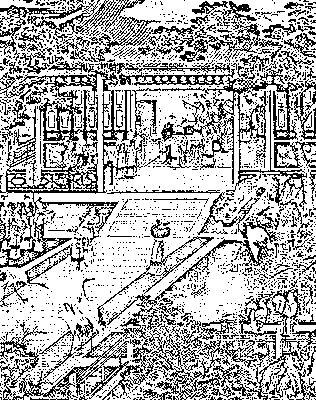
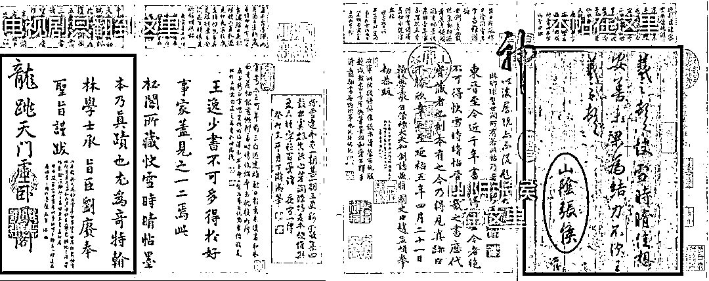
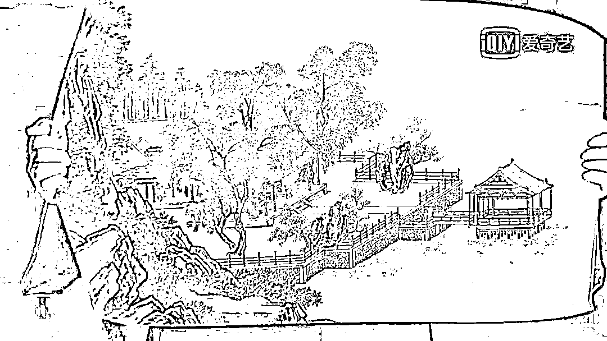

# 写写字，喝喝茶，打打德州！

> 原文：[`mp.weixin.qq.com/s?__biz=MzAxNTc0Mjg0Mg==&mid=2653288905&idx=1&sn=9a6be005876220746e68a0ae1e4b935e&chksm=802e3bdcb759b2ca4bf8d798443d804974cd69e282d4bddc404a33ebbf1d8a5631adf13eab5b&scene=27#wechat_redirect`](http://mp.weixin.qq.com/s?__biz=MzAxNTc0Mjg0Mg==&mid=2653288905&idx=1&sn=9a6be005876220746e68a0ae1e4b935e&chksm=802e3bdcb759b2ca4bf8d798443d804974cd69e282d4bddc404a33ebbf1d8a5631adf13eab5b&scene=27#wechat_redirect)

文章来自：书法网

**策略写不尽，代码撸不完**

**闲暇有时间**

**写写字，喝喝茶，打打德州**

**公众号是一群有情怀的人**

《延禧攻略》已经开播很久了，但是热度不减，《延禧攻略》这么火主要还是因为不一样，女主不走先清纯再黑化的老套路，从第一集就战斗力爆表，怼天怼地谁挡杀谁，专注发盒饭 100 年。

男主放着威武霸气人设不要，偏偏要走毒舌路线。

“历史是个任人打扮的小姑娘”，这句话用在古装剧上很合适。

一千个读者心中有一千个哈姆雷特，编剧们可比读者厉害多了，把诸位历史人物，颠来倒去地“打扮”，让我们这些吃瓜群众离正史越来越远。

意识到这个问题的严重性，今天决定带大家认识一下男主角乾隆帝真实的面貌。

乾隆像

**乾隆的文艺怪癖**

乾隆喜欢搞文艺，什么书法、画画、写诗、鉴赏古玩，乾隆都挺热衷。大清宫中珍藏的各种珍贵字画，都是乾隆的最爱。

乾隆由此养成了一个文艺怪癖：每当欣赏到高潮时，都忍不住要在这些书画作品上留下自己的“痕迹”。

要说呢，自己收藏了些个宝贝，什么宋徽宗的字、元代的《富春山居图》，在上面题个字，盖个私章，虽然有点破坏文物的艺术价值，但别人也管不着，反正是整个天下都是皇帝自己的，对吧？

于是乾隆就理直气壮地这么干，而且还干得很出格，题一两个字无伤大雅，他偏偏就在一幅字画上洋洋洒洒搞一首诗，或者干脆写出一篇小议论文来。

同样的，盖章也要盖出水平。

一般人顶多找个不起眼的小角落盖个图章，乾隆才不是盖一个，他是盖一排。

乾隆的印章，那可不是一般的多，据不完全统计，他一共有一千多枚印章。盖得性起时，挡都挡不住。

被疯狂盖章的王献之书法《中秋帖》▲

就这样，在乾隆的自嗨下，故宫里几乎所有的书法作品都没能逃过乾隆的“鉴赏”。

而且字画越是珍贵，就逃离不了乾隆的“魔爪”。不信你上百度搜几个图看看，一个个都被他弄得像狗皮膏药似的。

要路 sir 说，他这种鉴赏风格，堪称古玩圈中的一股泥石流，网上有说法，说他是“弹幕狂魔”。

**难逃一劫的字画古玩**

如果你去故宫，会发现一个叫“三希堂”的屋子。据说，当时，这里珍藏着乾隆最喜欢的三个书法作品，因此叫“三希”。

这三个作品分别是王羲之的《快雪时晴帖》、王献之的《中秋帖》和王珣的《伯远帖》。

王羲之 《快雪时晴帖》

在乾隆看来，其中水平最高的是“书圣”王羲之的《快雪时晴帖》，他自然要大大地表示一下崇敬之心。

怎么表达的呢？

每年冬天大雪纷纷的时候，乾隆总要把《快雪时晴帖》拿出来，左看看、右看看，爱不释手。看得高兴了，照例在上面盖个章、写个诗。

到了后来，乾隆甚至连古代的瓷器都不放过。

宋代流传下来的五大名窑瓷器，全国所剩不多，珍贵得很，乾隆自然很喜欢，吩咐下去，“给朕刻几个字上去”。

当然，乾隆可没有觉得自己做错了什么，区区字画古玩，朕的私人物件，盖几个章、写两个字算什么，反正天下都是自己的。

看到这里，你是不是认识到一个任性又傲娇的乾隆。

以下是《延禧攻略》剧 50 多集里一共出现了 6 幅（组）书画，有明显 bug 的占了一多半，一起来看看。

**第一集丨宫训图**

第一集选秀结束后，为了让后宫之争稍微收敛些，各宫重要的妃嫔都收到了乾隆送的宫训图和牌匾，其中富察小天使的是《太姒诲子图》。

而送给高贵妃的是《西陵教蚕图》

其实到这里为止是挑不出任何毛病的，可紧接着的画面就出现了 bug ，当时乾隆让画院的画师们把历朝历代 12 位贤良后妃的故事画成画，分别赐给十二宫嫔妃，让她们逢年过节的时候挂在宫里 ，是为十二宫训图。按照记载娴妃所在的承乾宫，收到的应该是《徐妃直谏图》。

可她手里这幅，却是清代宫廷画家冷枚的一幅人物册页。

《延禧攻略》剧照

冷枚 人物册页，2015 年関西美術競賣株式会社秋拍拍品

换个角度看，即使多数人不认识冷枚这幅画，但也不难看出这个 bug，因为十二宫训图里现今只保存下了《许后奉案图》，只要看画的人不是钟粹宫的纯妃，那必然是剧组自行找的一幅画来替代的。

《许后奉案图》讲汉宣帝许皇后新年亲自为太后奉案上食的故事

**第 16 集丨快雪时晴帖**

高贵妃屡屡受挫，为了讨好乾隆，献上了书圣王羲之的《快雪时晴帖》，哄的乾隆眉开眼笑，当即打开品评了一番，这一品评不要紧，又出 bug 了。

《延禧攻略》剧照

其实《快雪时晴帖》本帖只有 28 个字，尺寸也很小，但每个经历过收藏的人都要接上一段题跋，随着时间的积累，就变得非常长长长长长长。然鹅在这个镜头里，乾隆其实根本都还没翻到正主那一页。

却还一本正经说什么“山阴张侯”四个字风格不一样，emmmm……场面一度很尴尬。

**第 20、27 集丨四景山水图**

乾隆的生日前夕，容音皇后临摹了两幅画作为乾隆的生日礼物，有一幅就是傅恒送的《四景山水图》。

富察皇后临摹的《四景山水图》夏卷

《四景山水图》分为四段，是南宋画家刘松年创作的一组绢本设色画，现收藏于北京故宫博物院。分别绘有当时杭州春、夏、秋、冬四时景象，画面以人物活动为中心，结合界画技法，精心勾描庭院台榭，4 段均无款印。无论画还是画家名气都不算大，在剧中的戏份却不少。

由左至右依次为春卷、夏卷、秋卷、冬卷

前有富察皇后临摹了夏卷送给乾隆，后有纯妃借走春卷临摹，恰巧被娴妃无意看到这才猜出纯妃芳心早已暗许傅恒，也算是纯妃后面黑化的一段隐藏剧情了。

**第 20 集丨洛神图**

除了《四景山水图》，皇后临摹的另一幅画就是《洛神图》了。

富察皇后临摹的《洛神图》

好像跟我们平时看到的洛神不太一样？不一样就对了，因为这幅画叫《洛神图》而不是《洛神赋图》，《洛神赋图》大家都知道，是东晋顾恺之根据曹植《洛神赋》所作，说到关于洛神的画，绝大多数人第一反应就是它。

东晋 顾恺之《洛神赋图》局部

相比之下宋代这幅甚至连作者都无法考察的《洛神图》就小众多了，即使是专门学美术史的也不一定知道有这么一幅画。

宋 佚名《洛神图》局部

**第 36 集丨平复帖**

纯妃本就才情出众，黑化之后，赏月、下棋，费尽心机的勾引乾隆，这不乾隆一开心，就痛快的把《平复帖》赏她了。

《平复帖》是是晋代文学家、书法家陆机创作的草隶书法作品，至今已经有 1700 多年历史，是我国现存最早的书法真迹，所以也被称为“万帖之祖”。但是这么一件宝贝说赏就赏，可见纯妃在那段时间是多么得宠。

晋 陆机《平复帖》

事实是这段剧情也是纯属虚构，《平复帖》一直都在太后也就是鼎鼎有名的甄嬛手里，直到她去世后，才被赏给了嘉嫔（专门给高贵妃出馊主意的猪队友）的儿子成亲王永瑆，而非乾隆，所以乾隆压根没经手何谈转赠。

**第 44、48 集丨鹊华秋色图**

乾隆冤枉了魏姐，俩人闹别扭，魏姐自然也不是那么好哄的，乾隆于是暗搓搓地送上《鹊华秋色图》赔礼道歉。

《鹊华秋色图》是赵孟頫的代表作

元 赵孟頫《鹊华秋色图》

这也是乾隆爱到心尖尖的一幅画，令妃也惹不住吐槽他，高兴了敲一个章、不高兴了也敲一个章，跟天桥下的狗皮膏药一样，揭都揭不开。

看到这里，小编猜想，剧组大约是想借“盖章狂魔”这个梗努力表达自己很专业，但很抱歉，作为一个艺术小编的职业道德让我不得不再次指出一个明显的 bug。

“八旬天恩”、“古稀天子”、“太上皇帝”，三个明晃晃的印章盖在上面，想装作看不见都不行，这可都是乾隆七老八十刻的印章，出现在这里真的很穿越呀。

放大看一下原图上这三枚印章

看完是不是觉得学艺术还是挺有用的，好多梗第一时间就能 get 到，虽然小问题不少，但可见剧组还是用了点心思的，只是漏掉了很多细节。《延禧攻略》还在热播，大家可以跟小编一起一边吃瓜，一边找 bug 增广知识面，也是相当有意思的。

**知识在于分享**

**在量化投资的道路上**

**你不是一个人在战斗**