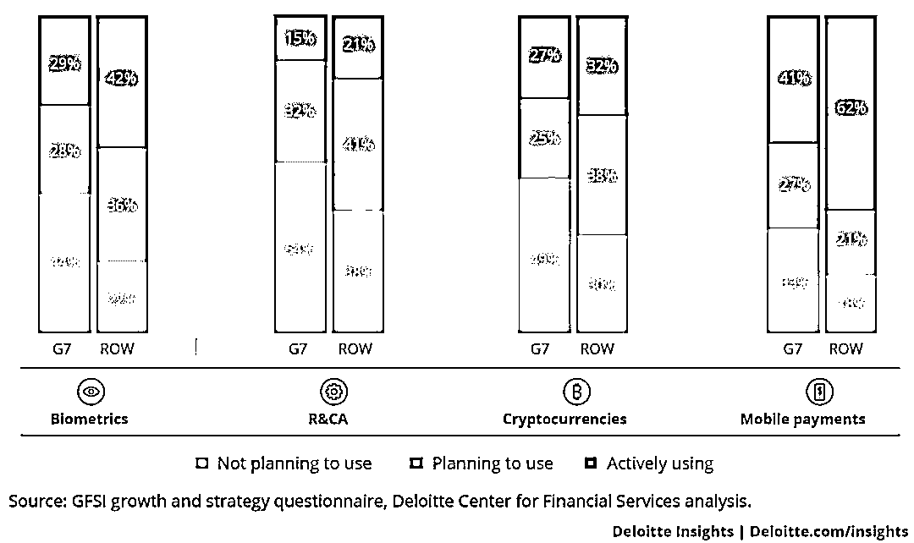
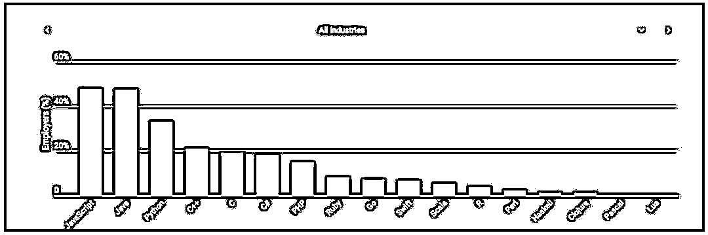

# 【前沿】为什么 Python 是金融产品开发的最佳选择？

> 原文：[`mp.weixin.qq.com/s?__biz=MzAxNTc0Mjg0Mg==&mid=2653288899&idx=1&sn=211e611530914909cc366a2169b08b22&chksm=802e3bd6b759b2c0a30798b5431b1efded698179ef989dfffed56ce78744ff20fdf52d80596c&scene=27#wechat_redirect`](http://mp.weixin.qq.com/s?__biz=MzAxNTc0Mjg0Mg==&mid=2653288899&idx=1&sn=211e611530914909cc366a2169b08b22&chksm=802e3bd6b759b2c0a30798b5431b1efded698179ef989dfffed56ce78744ff20fdf52d80596c&scene=27#wechat_redirect)

How do you  nd your way and stay a oat in  ntech? This new technology took the world by storm, but it’s complexity is still hard to compete with. First of all, there are state-level regulations, integrations with di erent services and institutions, bank API connections, etc. to deal with. The second step is to conquer the hearts and the trust of the end users—running  nance, mortgages, investments and so forth isn’t a child’s play. And to be able to do it, you need the highest level of security, functionality, and correspondence with requirements.

All this basically means that you need something really unique—a one of a kind technology that o ers a trustworthy solution. Obviously, the more unique your software is, the higher it’s valued. And without properly working and solid software, any  nancial venture will die down and lose worth. No matter the background, everyone wants their money to be safe. Which is why people are looking for a  nancial technology that will last, and I’d like to tell you about how we achieved all this by using the Python/Django technological stack while developing  ntech products. I hope it’ll be especially useful for you now that Python has become the world’s most popular coding language.

**Standing Out In The Age Of Millennial Finance**

The modern world of  nance houses two worlds that still coexist. For once, there are millennials who swipe themselves through life while mastering contactless payments, using on-line banking and all kinds of digital  nancing services. Their new world is buildt on new technology that despises old-school bureaucracy.

The other world belongs to the good old traditional  nance. Sadly, this is an extremely old and rusty machine that can’t be stopped on a whim. Even if it accepts the new technology and its e ect on  nance, it still doesn’t see it as neither as a threat, nor as a worthy competitor.

Such an imperturbable policy is only to  nd in the most developed countries of the G7—where all the old money is located, as well as the most people that are ready to operate highly technological startups. But sadly, changing their hard-shelled  nancial system is going to be a hell of a challenge.

In their statistics for 2017 Deloitte shows, for example, G7’s habits when it comes to  nancial technology, as opposed to the rest of the world. Deloitte researchers note:

> Surprisingly, with regard to mobile payments, 40 percent of executives from the United States expect little to no impact to their industry. With the caveat that the sample
> size is relatively small, 7 out of the 17 US banks (41 percent) saw little to no impact from mobile wallets and other payment technologies, vs. 14 out of 36
> (37 percent) of the nonbanks.

Developing countries present an entirely di erent picture. Lacking a hardened, tradition ruled  nancial sector, they allow more space for ntech to grow and develop. Which, in turn, gives people more opportunities and ways to easily work with developed countries and get paid more securely. To be honest, this is what I love most about  ntech —it removes  nancial borders!

The G7 may remain skeptical about  ntech, but technology keeps changing  nance. The thing is—everything in this world changes fast, and so does technology. It’s  exible, it is able to adapt to the new users’ needs—it’s exactly what millennials want. Their new habits, high digital sensitivity, digital presence—all this is part of the millennial way of life that doesn’t leave them any time to waste and requires them to be productive 24/7\. Which is why they value  nancial freedom anywhere anytime.

To con rm my thoughts, here’s a blog by the Wall Street Journal, that deals with mobile payments and  nancial literacy. Apparently, the ease of payments attracts people that are comfortable with technology and have a busy lifestyle. Mobile payment users are mostly highly educated and employed full-time, predominantly male and very active nancially. Compared to non-users, they are more likely to have bank accounts, retirement accounts and/or own homes, as well as make use of auto loans and mortgages.

What conclusion can we make? WSJ stats show that users of mobile payments earn more than non-users, they are more  nancially active and  nancially literate, i.e. they use a wider variety of  nancial products. At the same time, they’re more careless about their expenses and more likely to go into debt. Sometimes, they can even take money from their retirement accounts. Which calls for a whole new  ntech wave of simple tools that will help millennials get their money in order. Despite high incomes and education levels, millennials who use mobile payments are reported to have a greater risk of  nancial distress and mismanagement.

Finance is an industry that has to be especially sensitive towards new customer demands. But in the era of digital disruption, even more so. There’s always a danger that customers will stop using your service when it becomes more common and necessary. How do you prevent that? And can you create a product now that will stand the test of time and later serve millennials when they grow up and start earning really big money? I mean, like the generation at which the current  nancial system is aimed. Branches like mortgages, investments, and wealth management should be especially cautious.

This is the time when I’m going back to what I said earlier. To survive, to get a strong following and clients who rely on it, your technology has to be unique, sturdy, safe and custom tailored to your customers’ needs. At this point, it won’t be possible to avoid integration with traditional nancial and state institutions. Which is why you have to make sure the cooperation runs  awlessly, and you seem a reliable business partner in the eyes of the latter, and they use your technology, and not someone else’s. Or worse, create a technology of their own!

A great example of a unique technology that totally paid o  is our client MoneyPark—formerly a startup, and now Switzerland’s largest technology-based mortgage intermediary. Thanks to their convincing technological solution and business approach, the company became part of Helvetia Insurance.

**Python: The Finance & Fintech Secret Weapon**

So, what do we need? A technology sturdy enough to withstand the stress of worldwide  nancial perturbations, but still  exible enough to adapt to the challenges of the new world and the customers’ growing needs. As for us, we chose to work with Django framework within Python—it proved to be a great choice, and we’re still discovering all the possibilities this combo gives us. We’re not trying to sell you Python as the solution to all of your problems, but we certainly know what kind of advantages Python has for  nance.

**1\. Faster way to market with Python/Django stack.** It’s quite simple: with the Python/Django stack, you can build an MVP quite fast, which increases your chances to  nd your product/market  t.

The only way  ntech will be able to compete and/or collaborate with traditional banking and  nance is adapting to changes and customer’s demands, o ering additional services and improvements according to customer’s wishes. Your technology must be  exible and o er solid ground for numerous additional services.

The Python/Django framework combo takes into account the needs of an MVP and allows to save some time developing it. They basically work like a Lego—you don’t need to develop small things like autorisation or user management tools from scratch. You just take whatever you need from the Python libraries (Nimpy, Scipy, Scikit- learn, Statsmodels, Pandas, Matplotlib, Seaborn, etc.) and build an MVP.

Another big advantage that Django gives you at the MVP stage is a simple admin panel or CRM—it’s built-in; you just have to set it up for your product. Of course, at the MVP stage, the product isn’t complete, but you can test and easily  nish it, as it’s very  exible.

After the MVP is done, this tech stack allows to adapt parts of code. This means that after you validate the MVP, you can either easily change some code lines or even write new ones, if this is required for the product to function  awlessly.

Millennials are used to living in a fast-paced world and the need to be productive 24/7\. What they expect from everyone else and from services they use is maximum transparency and only high-quality service. This is why customer development is so important—a whole generation depends on it. Consequently, the sooner you get your product to market, the quicker you collect feedback and improve your product. Python programming in  nance allows you to do this with your hands behind your back.

**2\. Mathematical and economical use of Python.** Obviously,  ntech can’t exist without mathematicians and economists who calculate their algorithms and formulas using Python. Languages like R and Matlab are less common among economists, and Python became the most useful programming language for  nance, as well as the programming “lingua franca” of data science. Economists use it to make their calculations, so obviously it’s easier to integrate them with a Python based product. However, sometimes even pieces of code that are written in the same language are hard to integrate, which is why the presence and communication with your tech partner is crucial.

**3\. Simpler syntax—easier collaboration**. Simplicity is genius. Due to its simplicity and easy-to-understand syntax, Python is very legible and everyone can learn it. Which is why, becoming the “lingua franca”, in my opinion, was just a matter of time. Python creator Guido van Rossum con rms my thoughts describing it as a “high-level programming language, and its core design philosophy is all about code readability and a syntax which allows programmers to express concepts in a few lines of code.”

So, the good thing about is that Python is easily understandable not only for technical specialists, but for clients as well. People involved in the development process from both sides have di erent levels of technical understanding. With Python, engineers can explain the code much easier, and clients can better understand how the development is progressing. See, it’s a win-win.

As The Economist says about Python:

> The language’s two main advantages are its simplicity and  exibility. Its straightforward syntax and use of indented spaces make it easy to learn, read and share. Its avid practitioners, known as Pythonistas, have uploaded 145,000 custom-built software packages to an online repository. These cover everything from game development to astronomy, and can be installed and inserted into a Python program in a matter of seconds.

Which brings us to the next point.

**4\. Python’s open libraries include tools for API integration**. Thanks to Python’s open libraries, you don’t have to build your tools from scratch and develop the product and analyze large amounts of data in the shortest amounts of time. If you’re in the MVP stage, this can save you a lot of time and money.

As I mentioned before,  ntech products require a lot of integrations with third parties. Python libraries make integrating your product with other systems through di erent API a lot easier. In  nance, API can help you collect and analyze the required data about users, real estate, and organizations. For instance, in the UK, you can get people’s credit history by API, which is required to proceed further  nancial operations. By using API in the online mortgage industry, you check real estate data and verify someone’s identity. On top of it, you can get the data or  lter it in one click without having to develop new tools for that by using and combining di erent libraries/packages.

Django Stars, for instance, use the Django Rest Framework to build APIs or to integrate with external ones, as well as Celery to queue or distribute tasks.

**5\. Python popularity grows.** According to the HackerRank 2018 Developer Skills Report, Python is the second language coders are going to learn next and is among TOP-3 languages in  nancial services and other progressive industries. Which is great, because Python will continue developing, giving access to more and more specialists, which, in turn, guarantees enough people to develop and maintain our products in the future.

Python wins the heart of developers across all ages, according to our Love- Hate index. Python is also the most popular language that developers want to learn overall, and a signi cant share already knows it.—HackerRank

Python has more uses than you may think: from traditional ones like web development to cutting edge, like AI. It’s incredibly  exible and versatile it has over 125,000 third-party Python libraries that let you build your product like a Lego. It’s the go-to language for data analysis, which makes it attractive for non-technical  elds like business, and the best programming language for  nancial analysis.

Again, I’m not trying to say that Python is the only way to go. I’m only describing my own experience, quite successful ones, I might add. I saw Python do wonder when applied within the Django Framework.

And this is what you need to make in it  ntech—an extraordinary tool that will make your product trustworthy, fully secure and functional. Adhering to state regulations, dealing with integration with services, institutions, and bank API connections—all this requires attention to detail and longevity of software to support the new generations of millennials who are taking over the future. Get to the top, be among the ones who change the  nancial market, better yet, who change the world. Be unique, e cient, user-oriented, and open for the future. This is what Python is all about. 

原文：

https://hackernoon.com/why-python-is-the-best-choice-for-fintech-products-64a2eae7b8be

**知识在于分享**

**在量化投资的道路上**

**你不是一个人在战斗**