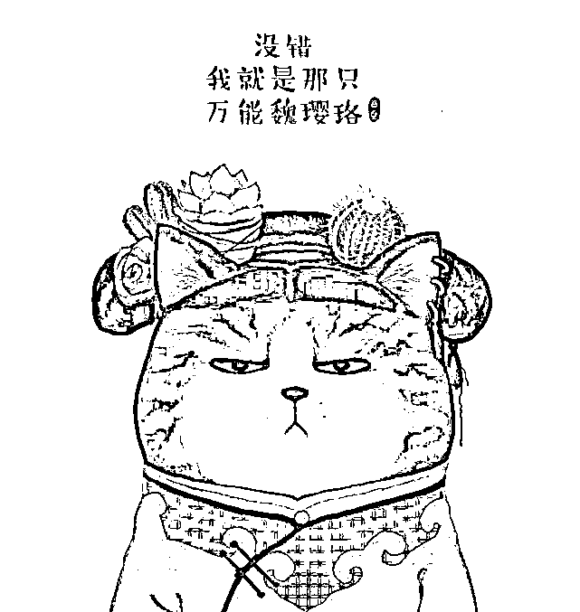

# 【宽客必看】延禧攻略之对冲策略宫斗记

> 原文：[`mp.weixin.qq.com/s?__biz=MzAxNTc0Mjg0Mg==&mid=2653288882&idx=1&sn=7d13b69ac13bb7234d5529318c4f878b&chksm=802e3ba7b759b2b1075f0656dca4aacb2a8fecf90a63bdcda69fbe68b5c62a939d8c4b399526&scene=27#wechat_redirect`](http://mp.weixin.qq.com/s?__biz=MzAxNTc0Mjg0Mg==&mid=2653288882&idx=1&sn=7d13b69ac13bb7234d5529318c4f878b&chksm=802e3ba7b759b2b1075f0656dca4aacb2a8fecf90a63bdcda69fbe68b5c62a939d8c4b399526&scene=27#wechat_redirect)

文章来源：FunofHedgeFunds

作者：周同学

“来人哪！给朕配置一个后宫！”

【风险提示】本文有剧透，阅读需谨慎！

最近《延禧攻略》可谓强力霸屏了，大家对剧中各个鲜活的角色也都非常熟悉了。

我们必须严肃认真地蹭一把热度了！要不然怎么显示出嫔妾是一个与时俱进的对冲迷呢！ 

如果我们把对冲 FOF 比喻成大猪蹄子·弘历同学的后宫，那么里面的各个对冲策略对应到剧中的各个人物，都有哪些让我们眼前一亮印象深刻的人设呢？下面我们就一一分析一下，看哪个对冲嫔妃最美！

**富察皇后--股票阿尔法多因子策略**

温柔端庄的富察皇后可以说是后宫的中流砥柱了！她最早进入宝亲王府潜邸，就好似股票阿尔法多因子策略是最早存在于中国对冲市场的策略呢。富察皇后仁慈宽厚三观正，就像多因子模型通常有基本面投资逻辑做支撑，并且策略容量较大。

然鹅富察皇后的命门是丧子之痛，侵蚀着皇后娘娘的身心健康，就如同 2016-2017 年股指期货贴水长期侵蚀着股票阿尔法多因子策略的超额收益。当然，富察皇后一直是乾隆皇帝心中的白月光，乃我们对冲 FOF 后宫的核心配置。（如懿乱入：本宫不服，我才是 Mrs. right!）

**纯妃--股票高频统计套利策略**

纯妃娘娘与富察皇后自小是闺中密友，与她一起嫁入潜邸，在后宫也得到富察皇后的强力支持，就好像股票高频统计套利策略的构建也离不开一部分基本面因子的支撑。然鹅在纯妃娘娘生下六阿哥之后，争宠之心日盛，并在关键时刻变成皇后娘娘强有力的竞争对手，就如同股票高频统计套利策略在深度贴水的市场环境中脱颖而出疯狂碾压阿尔法多因子策略，吸引了皇上（资金方爸爸们）的热烈追捧，成为了新一代的宠妃。

**高贵妃--宏观对冲策略**

前廷根基深厚的高贵妃有一个重臣阿玛，就好像宏观对冲策略通常有现货贸易数据作支撑。该策略善于捕捉宏观经济周期中的产业结构矛盾或者基本面偏差，像高贵妃一样长袖善舞在多资产品种之间进行对冲交易。比如在去杠杆周期中实业很困难的时候，宏观对冲策略却能够捕捉到对冲投资机会，就像高贵妃总能找到对手的破绽从中渔利，而且不乏收益回报相当丰厚的时候。然鹅由于宏观对冲往往需要在股票市场有一定配置，因此在面临系统性风险的时候也很难独善其身。

**娴妃--股票价值投资策略**

娴妃娘娘的剧本可谓低开高走了。她也是最早嫁入潜邸的妃嫔之一，在前半段剧情她非常隐忍低调，从一个与世无争的小白兔逐渐展露出执掌后宫的核心竞争力，最后在太后的极力支持下荣登皇后宝座。

同样地，股票纯多策略也是中国资本市场上存在最早的投资策略之一，她经历过市场早期的无序炒作阶段，彼时很多投资者从根本上怀疑价值投资长期持有的信仰，因此价值投资策略一直隐忍低调地坚守着。后来该类策略逐渐得到社保基金（太后万亿万亿万万亿！）的坚定支持，并为引导股市的有序健康发展贡献了力量。尤其在 2016 年之后随着 A 股投资机构化和外资的进入，价值投资越来越受到认可。当然该策略容量也配得上皇后的职级。

**愉贵人--商品期货 CTA 策略**

愉贵人就是起手听牌的那位，一出场就好孕来自带龙种，就好像商品期货 CTA 策略早期在中国市场交易的时候也是赚得很爽的，而且自带杠杆！然鹅！哪有只赚不赔的好事！愉贵人在怀孕过程中受到高贵妃各种迫害，五阿哥永琪还差一点被活埋，可以说是非常惊心动魄了！这不由得让我想起 CTA 策略交易者们经历的那一年黑色双十一...后来愉贵人忍辱负重做了一段时间卧底，堪比 CTA 策略从 2017 年下半年蛰伏到 2018 年中，终于苦尽甘来，还顺带升为愉妃，成为后宫核心配置之一。

**舒贵人--期权卖空波动率策略**

舒贵人可不是一个省油的灯！她在选秀的时候就通过一耳三钳的小心机通过了皇上的白名单准入，入宫后先后傍上高贵妃和继皇后左右逢源，就好像期权卖空波动率策略也曾经赚钱赚到忘乎所以。然鹅风险总在得意忘形间来临，一旦市场波动率突然拉大，市场总会用一波猝不及防的回撤教舒贵人重新做人。

**明玉--商品高频套利策略**

明玉小可爱可以说是天真善良地经历了曲折的人生。她一直忠心耿耿心怀纯善，只希望待在主子身边单纯地生活，就好像商品高频套利策略从不恶意做多也不恶意做空，总是多空配对进行高频交易获取微薄的盈利。明玉经历了纯妃娘娘扎针的折磨，带着八根银针生活了好久。这不就是交易所嬷嬷提高期货交易佣金一样嘛！为此明玉一度不得不把平仓这件事推到明天再说，改用当日锁仓的策略。（交易所爸爸们如果看到了这里请一笑而过就好，毕竟嫔妾是为了剧情的需要啊）。希望明玉能够一直得到属于她的小确幸！

**魏璎珞--全天候风险平价策略**

主角光环的魏姑娘可以说是技能满格了：绣花功底扎实，一入宫就成为绣坊业务骨干负责凤袍龙服的大 project。还熟知药理：识别出枇杷新叶有毒，成功救下愉贵人母子。还会变魔术巧妙地从舒贵人袖中拿回太后的寿礼舍利子。就连被打入辛者库后负责刷马桶，也能刷得与众不同。

这就像全天候策略里面各种大类资产都有配置，而且会根据不同经济周期（复苏、过热、滞涨、衰退）调整配置方案。可谓十项全能！（延伸阅读：[【多元资产配置与家族资产管理的不解之缘】 --从瑞-达里奥运用全天候风险平价策略管理自己的家族信托谈起](http://mp.weixin.qq.com/s?__biz=MzU1Mjc3NDIzNw==&mid=2247483766&idx=1&sn=dfe41262e1c8eff2b5ee916433106de7&chksm=fbfdbe44cc8a37529f076cbc2062a0e1056db022b323d7e70bb6ccfb687db22099410399f825&scene=21#wechat_redirect)）

而且魏姑娘还十分擅长借力，先后借助绣坊张嬷嬷和傅恒少爷查明姐姐之死的真相，更领先富兰克林发现雷电的威力并借助导电材料完成了对怡太妃的复仇任务。这与我们全天候风险平价策略异曲同工：

全天候风险平价策略会根据各个大类资产类别的不同风险特征，借助杠杆的力量将他们的风险度调节到一个量级上，再根据市场环境和宏观经济周期对每个标的进行风险预算分配，一路开挂穿越牛熊！并且容量（职级）也非常大（高），最终魏姑娘（令妃娘娘）生下嘉庆皇帝永琰成为下一届太后老佛爷！

**尔晴--稀巴烂策略**

不！朕的后宫永远也不会配置稀巴烂策略！

不知道以上这花团锦簇的后宫配置皇上还满意不？

当然，作为历史业绩曲线区间超长的乾隆爷，这些难道满足了吗？后宫配置当然是要不断充实更新迭代才行嘛，所以作为负责任的导演，我们当然要不断地为后宫选秀啦！

这就像对冲 FOF 需要持续保持对新策略和新资产的关注，选择合适的时机纳入我们的对冲 FOF 后宫！

祝福各位点赞的小主们净值不掉线，夏普两位数！

**知识在于分享**

**在量化投资的道路上**

**你不是一个人在战斗**