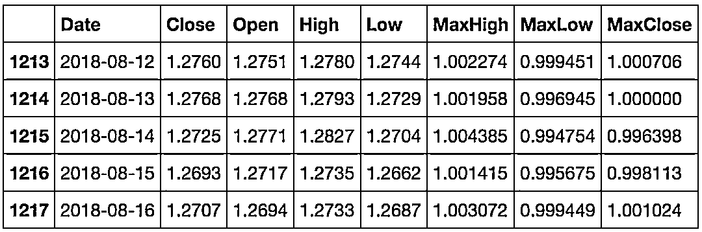
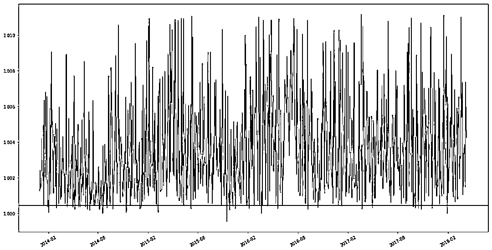
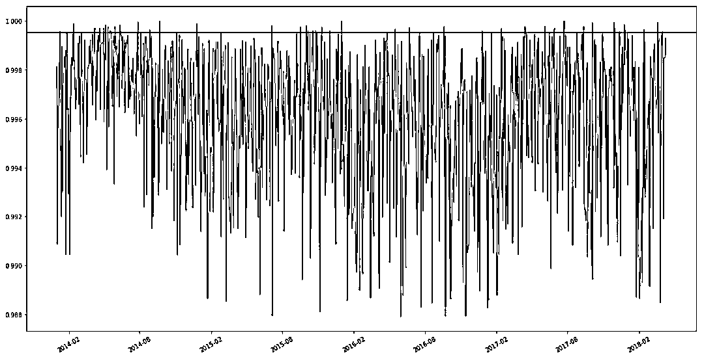
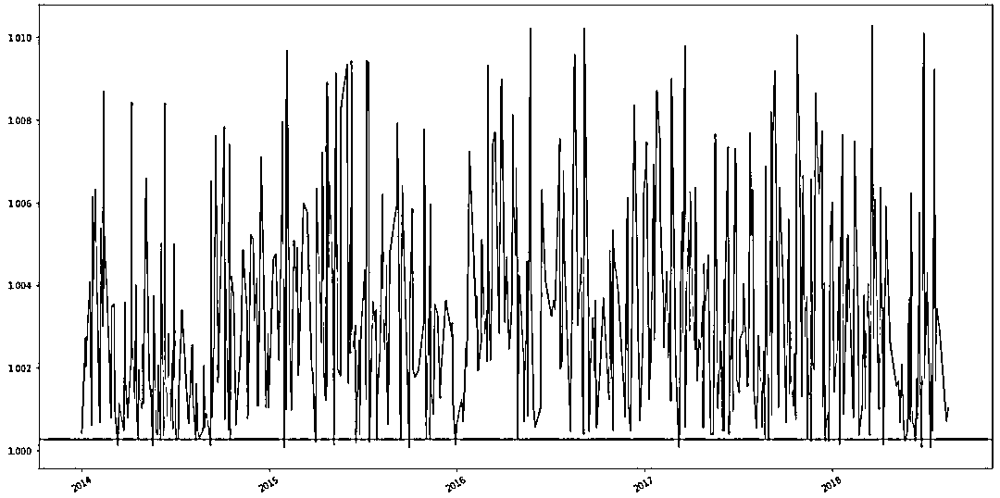
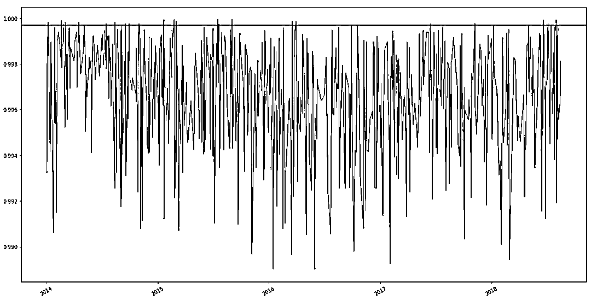

# 我就不用 AI、ML 模型预测股价，来点不一样的！

> 原文：[`mp.weixin.qq.com/s?__biz=MzAxNTc0Mjg0Mg==&mid=2653288818&idx=1&sn=a0bf4e14c44f040814fef37c5f078bdb&chksm=802e3b67b759b271f21dfee3d5f94c3473b7fdaa1c1142ab5ce14680c70885bc26d336c2abc2&scene=27#wechat_redirect`](http://mp.weixin.qq.com/s?__biz=MzAxNTc0Mjg0Mg==&mid=2653288818&idx=1&sn=a0bf4e14c44f040814fef37c5f078bdb&chksm=802e3b67b759b271f21dfee3d5f94c3473b7fdaa1c1142ab5ce14680c70885bc26d336c2abc2&scene=27#wechat_redirect)


直接上代码

```py
import pandas as pd
import numpy as np
import matplotlib.pyplot as plt
import datetime
from scipy import stats
pd.options.mode.chained_assignment = None  # default='warn'
```

```py
def load_db(file):
    fix_price = lambda x: float(str(x).replace(',',''))
    df = pd.read_csv(file)
    # clean data
    if 'Price' in df.columns:
        df.rename(columns={"Price":"Close"}, inplace=True)
    cols = []
    if 'Change %' in df.columns:
        cols.append('Change %')
    if 'Vol.' in df.columns:
        cols.append('Vol.')
    df.drop(cols, axis=1, inplace=True)
    try:
        df['Date'] = pd.to_datetime(df['Date'], format="%b %d, %Y")
    except:
        df['Date'] = pd.to_datetime(df['Date'])
    df['Open'] = df['Open'].apply(fix_price)
    df['High'] = df['High'].apply(fix_price)
    df['Low'] = df['Low'].apply(fix_price)
    df['Close'] = df['Close'].apply(fix_price)
    # This is the tricky part!!!
    # Calculate how far did price go from Open for each day!
    df['MaxHigh'] = df['High']/df['Open']
    df['MaxLow'] = df['Low']/df['Open']
    df['MaxClose'] = df['Close']/df['Open']
    # I will use prices beginning 2014
    return df[df['Date']>='2014-01-01']
```

你是否注意到 MaxHigh，MaxLow 和 MaxClose 列？ 他们是关键！ 我们将使用这些列计算概率。

```py
sym = "GBP_USD"
period = "1d"
file = "./{} {}.csv".format(period, sym)
db = load_db(file).reset_index(drop=True)
db.tail()
```



```py
def show_min_max(df):
    # find max and min values for High
    max_high = (df['MaxHigh'].max()-1)*100
    min_high = (df['MaxHigh'].min()-1)*100

    # find max and min values for Low
    max_low = (df['MaxLow'].max()-1)*100
    min_low = (df['MaxLow'].min()-1)*100

    # find max and min values for Close
    max_close = (df['MaxClose'].max()-1)*100
    min_close = (df['MaxClose'].min()-1)*100

    print("OpenToHigh\nMax: {:.2f}%\nMin: {:.2f}%\n".format(max_high, min_high))
    print("OpenToLow\nMax: {:.2f}%\nMin: {:.2f}%\n".format(max_low, min_low))
    print("OpenToClose\nMax: {:.2f}%\nMin: {:.2f}%\n".format(max_close, min_close))
```

```py
show_min_max(db)
```

```py
OpenToHigh
Max: 3.08%
Min: -0.05%

OpenToLow
Max: 0.00%
Min: -11.07%

OpenToClose
Max: 3.06%
Min: -8.02%
```

现在让我们编写一个函数来计算范围：

```py
def prob(df, col, p):
    # I'm using percentile here
    lp = np.percentile(df[col].dropna(), p)
    fig, ax = plt.subplots(figsize=(20,10))
    plt.plot_date(df['Date'], df[col], ls='-', fmt='')
    ax.xaxis.set_tick_params(rotation=30, labelsize=10)
    ax.axhline(lp, color='r')
    return lp
```

在这种特殊情况下，我们希望赢得 95％的交易。

定义我们感兴趣的概率。我选择了 95％，但你可以改变它。 概率越小，利润越大！ 此外，将计算从开始到过去 100 天的概率。

```py
prb = 95
col = 'MaxHigh' # Let's find prb% of High (100-prb)
days = 100 # This is the testing size. So we will test last 100 days and exclude them from the calculation.
p = prob(df[:-days], col, 100-prb)
```

```py
# get the current bar's open price
open_price = df['Open'].iloc[-1]
prediction = open_price * p
ticks = abs(open_price-(p*open_price))
monthly = 22 * ticks # 22 trading days in a month
mp = int(monthly / 0.0001)
print("Open Price: {:.5f}\nPrediction: {:.5f}\nProbability: {}%\nTicks: {:.5f}\nMonthly Ticks: {:.5f} ({} pips)".format(open_price, prediction, prb, ticks, monthly, mp))
```

```py
Open Price: 1.26940
Prediction: 1.26998
Probability: 95%
Ticks: 0.00058
Monthly Ticks: 0.01279 (127 pips)
```



如果你在交易开始时每天建立一个长期交易，目标价格为 5-6 点，你将赢得 95％的交易。 95％的价格将超过红线！

让我们用样本外数据进行回测！

```py
# Create a prediction column for each day and multiply it with the value we have got from out model.
d = df[-days:] # get unseen data from our dataset
# p: value we have got from out model
d['HighPredicts'] = d['Open'] * p
total = len(d)
# if the High price of the day cross over our prediction, we will win!!!
won = len(d[d['High']>d['HighPredicts']])
hit_rate = won*100/total
print("Hit rate {:.2f}% of {} trades!".format(hit_rate, total))
```

```py
Hit rate 96.00% of 100 trades!
```

NB！ 它的胜率超过 95％！

请注意，当你提高赢率时，你的利润会下降。

现在让我们尝试用相同的方法在空头头寸上。 让我们使用相同的函数预测当天的低点，但这次使用不同的计算方法！

```py
col = 'MaxLow' 
p = prob(df[:-days], col, prb)
# get the current bar's open price
open_price = df['Open'].iloc[-1]
prediction = open_price * p
ticks = abs(open_price-(p*open_price))
monthly = 22 * ticks
mp = int(monthly / 0.0001)
print("Open Price: {:.5f}\nPrediction: {:.5f}\nProbability: {}%\nTicks: {:.5f}\nMonthly Ticks: {:.5f} ({} pips)".format(open_price, prediction, prb, ticks, monthly, mp))
```

```py
Open Price: 1.26940
Prediction: 1.26880
Probability: 95%
Ticks: 0.00060
Monthly Ticks: 0.01316 (131 pips)
```



图表显示 95％的价格将低于红线。 利润为每天 60 ticks（6 pips）。

样本外：

```py
d = df[-days:]
d['LowPredicts'] = d['Open'] * p
total = len(d)
# if Low of the day cross under our prediction, we will win!!!
won = len(d[d['Low']<d['LowPredicts']])
hit_rate = won*100/total
print("Hit rate {:.2f}% of {} trades!".format(hit_rate, total))
```

```py
Hit rate 92.00% of 100 trades!
```

现在我们确定了 95％的高低范围。 最后让我们计算收盘价范围而不是高/低价，看看是否存在差异！

```py
col = 'MaxClose' # Let's find 75% of Low but this time we will just use prb instead of 100-prb
max_close = prob(df[df['MaxClose']>1], col, 100-prb) # only for green bars
min_close = prob(df[df['MaxClose']<1], col, prb) # only for red bars
# get the current bar's open price
open_price = df['Open'].iloc[-1]
prediction_max = open_price * max_close
prediction_min = open_price * min_close
print("Open Price: {:.5f}\nPrediction: {:.5f} - {:.5f}\nProbability: {}%".format(open_price, prediction_min, prediction_max, prb))                                             
print("Low ticks: {:.5f}".format(open_price-prediction_min))
print("High ticks: {:.5f}".format(prediction_max-open_price))
```

```py
Open Price: 1.26940
Prediction: 1.26901 - 1.26973
Probability: 95%
Low ticks: 0.00039
High ticks: 0.00033
```





这很有趣！ 因为当我们预测 95％的最高价和最低价时，所获得的价格超过了这个价格。 那么为什么在这种情况下我们必须预测收盘价呢？

进行回测，看看我们是否能获得相同的概率！

```py
# Create a prediction column for each day
d = df[-days:]
d['CloseLowPredicts'] = d['Open'] * min_close
d['CloseHighPredicts'] = d['Open'] * max_close
total = len(d)

# We are predicting a level we can make money. In this article, we are not trying to predict actual closing price
# That's why we are going to try to take profit!

# if Low of the day cross under our prediction, we will win!!!
low_won = len(d[d['Low']<d['CloseLowPredicts']])

# if High of the day cross over our prediction, we will win!!!
high_won = len(d[d['High']>d['CloseHighPredicts']])
low_hit_rate = low_won*100/total
high_hit_rate = high_won*100/total
print("Hit rate {:.2f}% for Low - {:.2f}% for High".format(low_hit_rate, high_hit_rate))
```

```py
Hit rate 94.00% for Low - 98.00% for High
```

几乎相同。

添加两个异动平均线：

```py
def prob_ma(df, col, p, is_low=False):
    # I'm using percentile here
    df['MA1'] = df['Close'].rolling(5).mean()
    df['MA2'] = df['Close'].rolling(220).mean()
    if is_low:
        cond = df['MA2']>df['MA1']
    else:
        cond = df['MA1']>df['MA2']
    lp = np.percentile(df[col][cond].dropna(), p)
    return lp, len(df[col][cond].dropna())
```

```py
col = 'MaxHigh' # Let's find 75% of High (100-prb)
days = 100 # This is the testing size. So we will test last 100 days and exclude them from the calculation.
p, trades = prob_ma(df[:-days], col, 100-prb)
# get the current bar's open price
open_price = df['Open'].iloc[-1]
prediction = open_price * p
ticks = abs(open_price-(p*open_price))
monthly = 22 * ticks # 22 trading days in a month
mp = int(monthly / 0.0001)
print("Trades: {}/{}\nOpen Price: {:.5f}\nPrediction: {:.5f}\nProbability: {}%\nTicks: {:.5f}\nMonthly Ticks: {:.5f} ({} pips)".format(trades, len(df[:-days]), open_price, prediction, prb, ticks, monthly, mp))
```

```py
Trades: 286/1025
Open Price: 1.26940
Prediction: 1.27023
Probability: 95%
Ticks: 0.00083
Monthly Ticks: 0.01833 (183 pips)
```

**总结**

看起来不是预测收盘价，我们应该更好地预测最高/低价。 因为它们以更高的命中率提供更多的 ticks！

我们大多数时候都使用过“预测”这个词。 但这不是预测。 这只是使用统计学中的统计方法和计算概率。

作者：Atilla Yurtseven

来源：https://www.tradingview.com/u/Dumani/

**知识在于分享**

**在量化投资的道路上**

**你不是一个人在战斗**