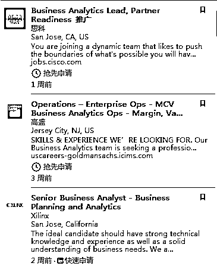
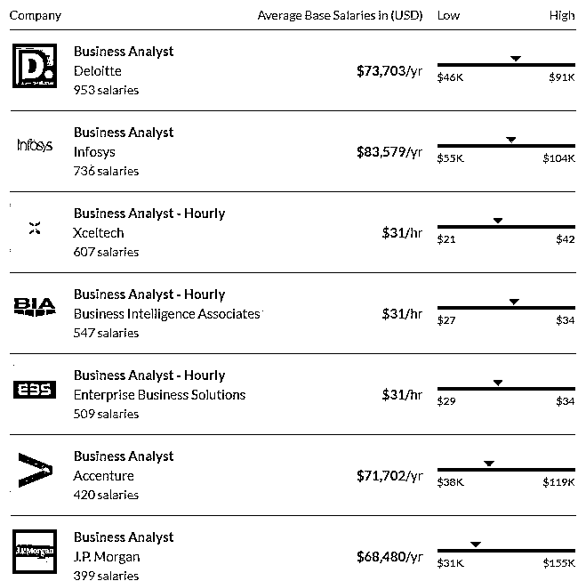
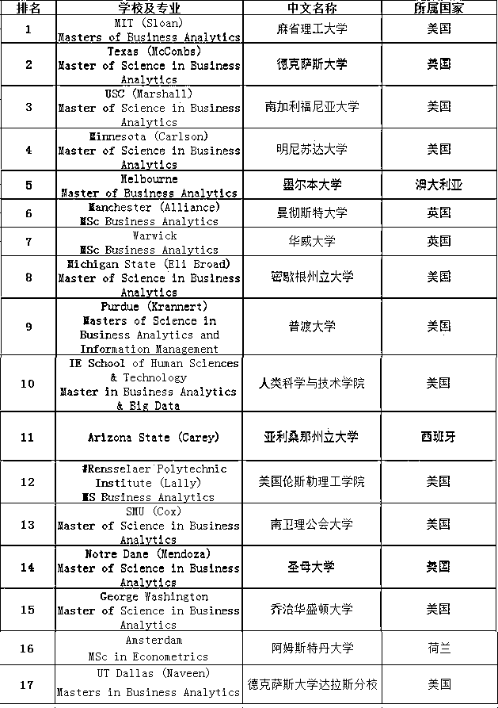
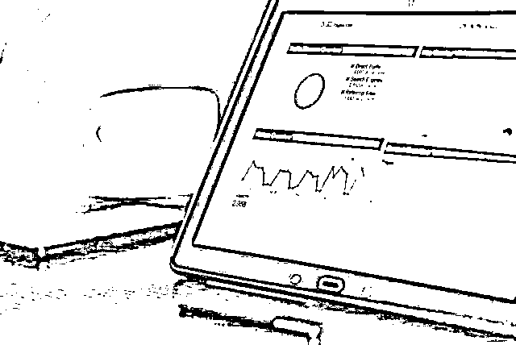
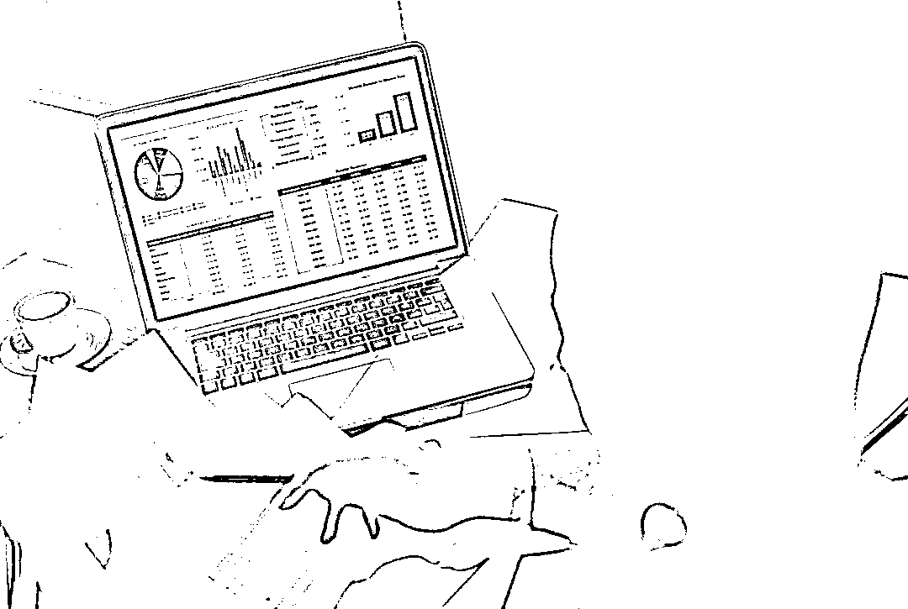

# 【深度】高盛、BAT、麦肯锡高薪抢着要的专业人才了解一下?

> 原文：[`mp.weixin.qq.com/s?__biz=MzAxNTc0Mjg0Mg==&mid=2653288793&idx=1&sn=b72e468ac3ddc4b2c691d4880d8ece35&chksm=802e3b4cb759b25a43200143033d9d376de827557b35d87b501bfe09e4b8738a2a2814c0b848&scene=27#wechat_redirect`](http://mp.weixin.qq.com/s?__biz=MzAxNTc0Mjg0Mg==&mid=2653288793&idx=1&sn=b72e468ac3ddc4b2c691d4880d8ece35&chksm=802e3b4cb759b25a43200143033d9d376de827557b35d87b501bfe09e4b8738a2a2814c0b848&scene=27#wechat_redirect)

本文来源：UniCareer

麦肯锡全球研究所最新报告

**18 年仅美国商业分析师**

**人才缺口高达 14 万-18 万！**

**预计 20 年美国数据专业人员**

**数量将从 36.4 万增加到 272 万！**

据说此专业

只有跨国公司、高成长性的企业才急需

小公司根本雇不起

*信息来源于领英

今天就给小伙伴们分析一下

BA 专业为啥成了香饽饽？

01

BA 专业为何这么火？

这个专业之所以火，是因为近几年大数据的热潮。**BA 作为理工科和商科交叉专业****，是集统计学、计算机、商业管理**为一体的新兴综合学科。

**BA 专业的核心是数据挖掘和数据分析****，与现在的互联网及大数据相联**，主要是利用高深的技术、模型和算法进行数据挖掘和商业分析，服务于 IT、互联网、游戏、通信、金融、医药、咨询、零售等各个行业。

1

高薪资

根据 Glassdoor 数据，Businees Analyst 在美国的平均年薪超过了 7 万刀。其中 experience 的程度也会影响薪资。

*数据来源于 glasssdoor

2

就业去向广

**企事业单位、集团公司、IT、金融、证券、咨询策划等**涵盖经济分析、市场调研、情报研究、数据采集集合及相关领域的行业。

而较常见的雇主有：

*   **政府、外资投行、商业银行、投资公司**如葛兰素史克(中国)投资有限公司等

*   **电脑公司**如 IBM、惠普等

*   **科技行业**如苹果、三星等

*   **互联网**网站如 Google、yahoo、百度等

*   专业的第三方**数据分析公司**

*   **大型连锁商贸机构**如 Wal-Mart、家乐福等

02

哪些院校的 BA 专业好？

1

2018QS 世界大学学科排名商业分析专业排名

**TOP1：麻省理工学院**

由 MIT Sloan 商学院和 MIT Operations Research Center（ORC)合办，2016 年开设的项目。

**TOP2：德克萨斯大学奥斯汀分校**

建议学生有进行过微积分、概率、统计学基础课程的学习，**建议自学 Python**，有一定的相关工作经验。

****TOP3：**南加州大学**

申请者最好有一定的工作经验，但不强制要求，如果没有的话，可能会是申请者的一个短处。南加州大学因为地处洛杉矶，**地理位置非常优越，再加上综排专排都非常不错，吸引了大批中国学生申请，竞争很激烈。**

****TOP4：**明尼苏达大学**

明尼苏达大学要求申请者本科毕业，拥有相关专业背景，有较好的数学和编程基础，**掌握商学基础知识。如有工作经验则更欢迎**。

******TOP5：**墨尔本大学****

要求学生具有相关本科专业背景非 985、211 背景申请人建议均分在 75 以上，**可能会被要求提供 GMAT 成绩，有成绩会优先考虑。**

*排名来源于网络

03

21 世纪“最性感”的工作

Business Analyst 被誉为 21 世纪 The Sexiest 工作。在不同的行业或许有不同的名称：**市场调查员、数据分析师、咨询师、统计分析师、数据挖掘师等。**

1

投行的金融或者技术部门

比如 Goldman Sachs、Barclays、JP Morgan 等：

投行的数据分析师通常会**处理金融交易数据，包括外汇、股票、大宗贸易数据，你需要和贸易方、销售、风控师、运营和银行打交道。**

它的**好处是很容易转到利润导向的前台部门，**身边的同事通常也很聪明。它的缺点是压力很大，你需要长时间的工作。比如很多投行的数据分析师需要很频繁的开国际会议以顺应时差。

2

保险公司的数据科学部

比如 AIG、METLIFE、CIGNA 等：

通常这个岗位的工作是**利用机械学习的技术以及统计模型简历估值模型。**

它的好处是，保险公司**普遍福利好，工作和生活能够比较好的平衡**，不太需要过强的软实力。而弊病就是工作可能比较封闭，需要长时间的坐办公室。

3

四大的咨询部

四大的咨询是需要和客户沟通的，**你需要去用数据来帮他们解决具体的问题。**

如果你在四大工作的话，你会得到**很好的项目管理锻炼，显著提升你的多任务推动能力以及快速累积不同行业的相关知识。**比如一年里三个月学到健康行业，另外三个月学科技行业等。薪水一般也在行业平均水准以上。但是它的项目和客户是不定期的，所以时间将会非常的紧凑。

4

基金公司的金融数据分析岗

通常需要做很多的量化工作：

数据分析在它们中的工作**包括会计、客户管理、风控、业务方面的数据，**它取决于你的具体业务，同时还包括数据研究，以及提供解决方案等。

在这里从事数据分析的好处是，他有**更加灵活的时间，同时一般情况下都是大牛，福利也特别棒。**但是，如果你想进去的话，你必须要有足够的投资管理知识和过硬的技术。

5

技术公司的数据分析岗位

比如 Google 的数据分析和金融公司相比，就会更加注重于**用户的行为数据分析，包括聚类、分类分析，去解析用户的行为习惯。**

它的好处是**工作会很灵活，公司时刻都能接触到最新的技术，不过会希望你有很好的技术，灵活运用各类数据库**，同时对分析能力要求很高，希望你能够独当一面，提供技术解决方案。薪水一般也很有吸引力。

04

如何准备 BA 的面试？

Uni 明星学员在历经 5 个月的网申失利、面试失败后，拿到了美国金融服务公司 Westlake Business Analyst 全职 Offer，她分享了自己面试这个 BA 职位的全流程：

面试一共有两轮，**第一轮主要对我进行基本的考察，第二轮则是含有大量题目的 Test**。接下来我会详细介绍整个流程：

1

第一轮面试

*   面试官先向我介绍了公司、Team 的基本情况

*   询问我针对以上**介绍是否有想问的问题**

*   进行自我介绍（简历，实习，Project）

*   考察我**对编程语言的熟悉程度**

*   提问**统计学的知识**对我有哪些帮助

*   提问我在工作中遇到困难的话，应该怎么办

*   提问如果我**给上级发了邮件却 40 个小时没有得到回复**，怎么办

*   提问我要如何预测明天的天气

那么，我是如何应对这些问题的呢？

**1\.  面试官先介绍公司情况，再让我对其介绍进行提问，主要考察我：**

*   是否对公司**真的感兴趣，做了足够多的调查**

*   是否有能力在繁杂的信息中挑选出**有效的信息**

*   是否可以与团队成员进行**良好的互动**

**2. 我对编程语言有多熟练，主要有两点回答的角度：**

*   我使用了多久该语言

*   使用该语言做过哪些 Project

**3\. 如果 leader 40 小时没有回复，我该怎么办？**

我的回答是，我会先通过社交平台与我的 leader 产生联系。比如在 Facebook、LinkedIn 上发站内信，积极取得联络。如果还是没有得到回复，我会根据两种情况进行操作：

*   如果是急切且只有我的 leader 能解决的问题：**我会直接去办公室面对面交流**

*   如果是不急切且别人也可以解决的问题：我会**找其他可以处理这件事情的人员**

**建议：**

针对面试中面试官的提醒，这类问题主要考察的就是一个人处理问题的能力和解决时的执行能力。作为新人如果有任何问题，都可以征求前辈的意见，如果遇到紧急情况完全可以去办公室直接找到负责人。**初入职场也要表现的自信，果断**。

**4\. 如何预测明天的天气？**

**结合线性回归课程。**先阐释天气是用温度来表示的，一天的温度和哪些因素有关呢，比如湿度还有前一天的温度。运用相关方法，求得温度和前一天的温度，湿度的关系从而成功的预测出天气。

2

第二轮面试

我的第二轮面试也是 Skype 面试。**我将操作界面分享给面试官查看，以便他们对我的整个解题过程进行清晰的了解**。其实，在准备面试的过程中我还是比较紧张的，因为这样的 test 方式，**可以让面试官一眼看出我是否对 Excel、SQL 熟练的掌握。**

另外，我在解题中还需要口头对做题思路进行讲解，这会或多或少的分散我的注意力。不过因为 UniCareer 的导师在平时的日常生活里也会与我进行大量的交流。他为我指出了很多准备此类 test 的方法，所以我虽然紧张，但是依然能够发挥出自己的真实水平。

而且**边说边做题的方式，反而帮助我更为清晰的理顺了做题思路**。原本只有一个大方向的解决方案，说着说着就越来越明确。面试官也可以随时对我进行提问和指示，所以我认为这次的面试表现是比较理想的。

3

如何准备 Business Analyst 的面试？

*   系统性的梳理行业知识，整理面试题库，反复了解面经。**可以寻找有经验的前辈帮助你进行模拟面试和传授 Networking 技巧。**

*   在平时的准备中，要勤加练习，可以自己给自己出题目 

*   通过给同学或朋友讲解题目，**锻炼自己边说边做的能力**

*   不要局限于 YouTube 视频，**SQL 和 Excel 都要注重实际操作**

**知识在于分享**

**在量化投资的道路上**

**你不是一个人在战斗**