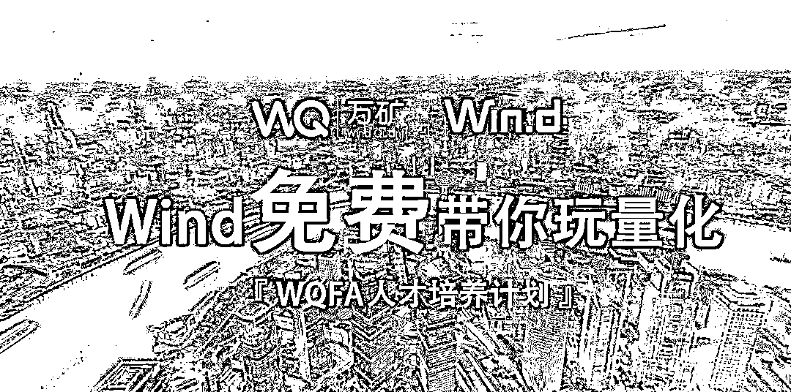
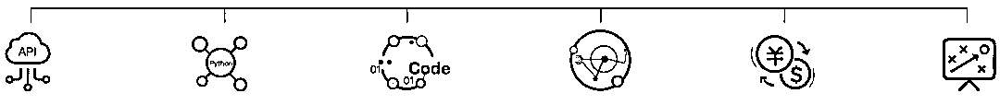
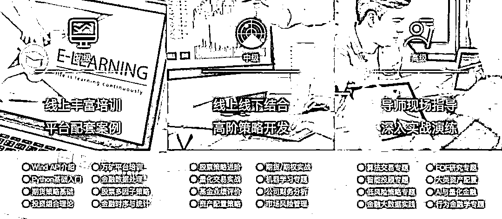
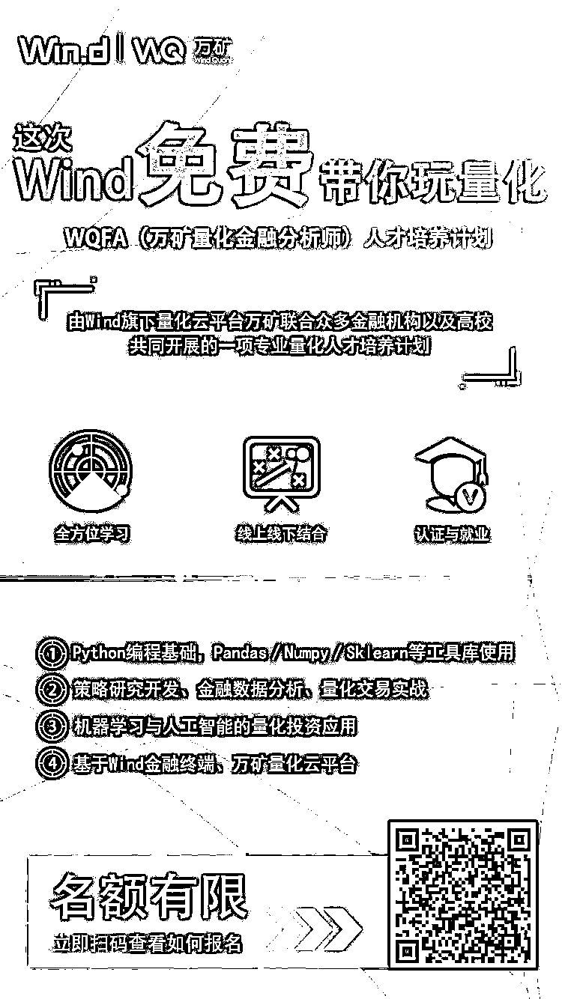

# 良心啊！！！这次，Wind 免费带你玩量化

> 原文：[`mp.weixin.qq.com/s?__biz=MzAxNTc0Mjg0Mg==&mid=2653288787&idx=1&sn=05686ba485c0b87e27ec776a483930a1&chksm=802e3b46b759b25070ad841e8e36adbe3d0ded6df00ead3b8f20416a93dc7a939d52ccd3889d&scene=27#wechat_redirect`](http://mp.weixin.qq.com/s?__biz=MzAxNTc0Mjg0Mg==&mid=2653288787&idx=1&sn=05686ba485c0b87e27ec776a483930a1&chksm=802e3b46b759b25070ad841e8e36adbe3d0ded6df00ead3b8f20416a93dc7a939d52ccd3889d&scene=27#wechat_redirect)

**公众号作为此次活动自媒体支持方，为大家推荐 WQFA：**

**WQFA **英文全称 WindQuant Quantitative Finance Analyst（**万矿量化金融分析师**）。由**Wind****旗下量化云平台万矿**联合**众多金融机构**以及**高校**，共同开展的一项专业量化人才培养计划。

面对国内金融机构对量化人才日益增长的需求，和众多对量化感兴趣的跨专业人士，**如何选择专业的学习平台？****如何系统的学习量化投资？如何将课本知识转化为实际应用？**鉴于此，万矿推出**WQFA 人才培养计划****，旨在为国内金融行业培养一批高端量化人才！****（如何免费参加 WQFA 计划？****文末查看！****）**

WQFA 课程体系与培养方案

基于 Wind 金融终端与万矿量化云平台，从**金融数据获取****、Python 编程、量化策略开发、量化交易实战、投资市场前沿、数理统计分析**等方面搭建**全方位学习矩阵**。

通过**在线课程学习**与**线下导师教学**，让学员全面系统地掌握量化策略的开发与实战。从入门到精通，课程分为**初、中、高三个阶段**，学员需通过进阶考试才能进入后面阶段的学习与培训。WQFA 的课程大纲：

WQFA 中级、高级课程导师均来自国内顶尖的**金融机构**和**知名高校**。具体名单将在中级课程上线时公布。

参加培养计划的学员通过阶段考核后可获得**高含金量结业证书。**同时，有机会**推荐各大金融机构实习与就业，**优先**参与万矿举办的量化投资论坛与沙龙**等。

WQFA 适合人群

*   公募、券商、基金、私募、银行、期货、交易所等相关领域的职场人士，希望进一步提升自己的能力。

*   在校学生、量化爱好者等，希望系统性了解量化投资策略开发与实战应用。

如何参加 WQFA 计划

**扫码下方海报二维**码或查看**阅读原文**，查看如何获取报名邀请码。

注：如有疑问请进万矿 QQ 群：465776969

**点击阅读原文，****获取报名邀请码**